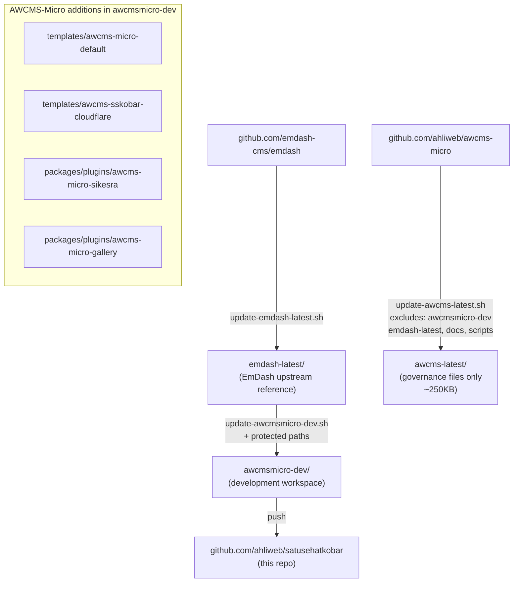
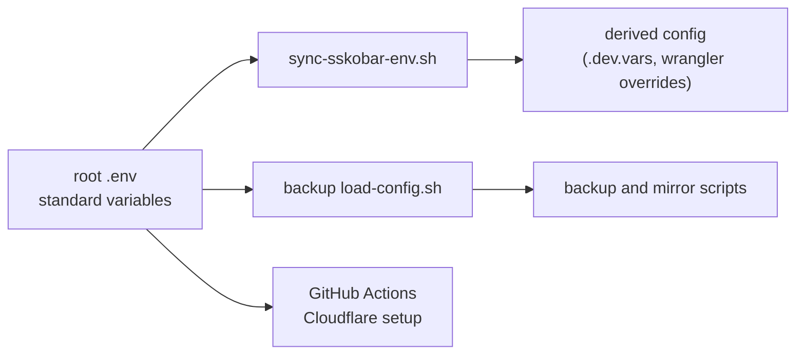

# AWCMS-Micro Parent Repository

This repository is the parent maintenance workspace for keeping AWCMS-Micro aligned with the latest EmDash source.

## Purpose

Analyze `https://github.com/emdash-cms/emdash`, then update `https://github.com/ahliweb/awcms-micro` so it stays fully synchronized with EmDash.

`awcms-micro` is an independent repository. It must not act as a host for other repositories in the product or runtime sense. It should serve as an example implementation that adopts EmDash 100% and includes only example plugins and example templates that follow the AWCMS-Micro standard, without modifying EmDash core.

AWCMS-Micro-specific product development in this maintenance workspace is limited to plugin and template boundaries. Root scripts and root documentation may change to support that workflow, but new product behavior should not be introduced through EmDash core forks or new shared core layers.

## Architecture Overview

## Root Structure

| Folder | Purpose |
| --- | --- |
| `emdash-latest/` | Latest synchronized snapshot of upstream EmDash |
| `awcms-latest/` | Lightweight reference snapshot of upstream `ahliweb/awcms-micro` (governance files and unique configs only, ~250KB; large subdirs excluded) |
| `awcmsmicro-dev/` | Clone of `emdash-latest/` used as the active AWCMS-Micro development workspace |
| `docs/` | Root-level technical documentation for structure, sync workflow, and implementation rules |
| `scripts/` | Maintenance scripts for refreshing upstream snapshots and rebuilding `awcmsmicro-dev/` |

Hidden root files such as `.gitignore` and local-only `.env` support the parent workspace and are not part of the product structure.

## Versioning Model

This workspace uses three separate versioning and changelog surfaces:

- root maintenance changes for the parent repository live in `VERSION`, `CHANGELOG.md`, and root `.awcms-changesets/`
- workspace package releases for published EmDash packages like `awcmsmicro-dev/packages/admin/` are driven by `awcmsmicro-dev/.changeset/`
- downstream AWCMS-Micro release-note inputs for `@awcms-micro/*` live in `awcmsmicro-dev/.awcms-changesets/`
- plugin packages under `awcmsmicro-dev/packages/plugins/` keep their own `package.json` version and `CHANGELOG.md`
- template packages under `awcmsmicro-dev/templates/` keep their own `package.json` version and `CHANGELOG.md`

`CHANGELOG.md` also carries a workspace snapshot of the current EmDash upstream SHA plus the version and latest changelog entry for every plugin and template in `awcmsmicro-dev/`.

Keep these flows separate so root maintenance releases do not mix with package releases, while the snapshot stays current.

## Licensing

- The root maintenance workspace is MIT licensed. See `LICENSE`.
- AWCMS-Micro example plugins and templates use the AW Non-Commercial License 1.0 from `https://github.com/ahliweb/aw-non-commercial-license`.
- `docs/awcms-micro-licensing.md` explains how the root MIT license and package-level non-commercial license fit together.

## Environment Configuration

The root `.env` is the canonical operator-managed configuration source for this workspace.

- keep standard variable names in `.env`
- use the canonical `awcms-sskkobar` naming family for workspace-owned remote resource values, including the template identifier, Worker name, R2 buckets, backup bucket, and D1 database name
- keep real secrets only in local `.env`, encrypted backup config, or platform secret stores
- regenerate derived local runtime values and related config files with `bash scripts/sync-sskobar-env.sh`
- let `scripts/backup/load-config.sh` read the canonical `.env` directly for backup and mirror operations

## Repository Rules

- Keep `emdash-latest/` as the clean upstream EmDash reference tree.
- Keep `awcms-latest/` as a lightweight upstream governance reference (root-level files and unique configs only; `awcmsmicro-dev/`, `emdash-latest/`, `docs/`, `scripts/` are intentionally excluded to prevent redundant duplication).
- Rebuild `awcmsmicro-dev/` from `emdash-latest/` before AWCMS-Micro-specific implementation work.
- Do not treat this repository as a runtime host for nested products.
- Keep root documentation synchronized with the actual workflow and folder layout.
- Work step by step using small, atomic changes.
- When a task is too large, split it into smaller follow-up tasks or GitHub issues.

## Official Language

English (US) is the official repository language for root documentation, root scripts, repository instructions, and AWCMS-Micro-specific repository governance text.

Exception:

- `emdash-latest/` must remain as an upstream-faithful EmDash snapshot and should preserve upstream wording as-is, including non-US spelling when present.
- `awcms-latest/` preserves upstream AWCMS-Micro wording as-is.
- `awcmsmicro-dev/` may mirror upstream wording when it is rebuilt from `emdash-latest/` as part of synchronization work.

## Core Documentation

- `docs/README.md`
- `docs/repository-structure.md`
- `docs/synchronization-workflow.md`
- `docs/implementation-instructions.md`
- `docs/awcms-micro-implementation-boundaries.md`
- `docs/repository-assessment.md`
- `docs/decision-records.md`
- `docs/operator-workflow.md`
- `docs/environment-configuration.md`
- `docs/awcms-micro-prd.md`
- `docs/awcms-micro-versioning.md`
- `docs/awcms-micro-root-versioning.md`
- `docs/awcms-micro-versioning-rollout-summary.md`
- `docs/awcms-micro-licensing.md`
- `docs/awcms-micro-d1-mirror-sync.md`
- `docs/upstream-sync/README.md`
- `docs/upstream-sync/UPSTREAM_SYNC_STATUS.md`
- `docs/upstream-sync/ISSUE_CLASSIFICATION_DOWNSTREAM_VS_UPSTREAM.md`
- `docs/upstream-sync/UPSTREAM_PR_PLAN_ADMIN_SIDEBAR_ORDERING.md`
- `docs/deployment/cloudflare.md`
- `docs/security/security-baseline.md`

## Product Specification (Satu Sehat Kobar)

The Satu Sehat Kobar product is specified in `docs/prd/` (25 documents, Bahasa Indonesia). That package describes the product built **on top of** this AWCMS-Micro workspace as Native EmDash plugins and the `awcms-sskobar-cloudflare` template — it does not change the maintenance rules above.

- `docs/prd/20.Master Document Index and Implementation Guide.docx.md` — entry point and reading order for the whole PRD package.
- `docs/prd/24.TECHNICAL_IMPLEMENTATION_REFERENCES.md` — the bridge between the PRD and this workspace: plugin format (Native), package naming (`awcms-micro-<key>` / `@awcms-micro/plugin-<key>`), persistence model (default: direct D1 via `ctx.db`; `ctx.kv` for cache), Cloudflare bindings, and the mapping from each PRD document to its implementation surface in `awcmsmicro-dev/`.

Plugin data persists directly in Cloudflare D1 via `ctx.db` (Kysely), with each plugin owning its idempotent schema migrations (decision DEC-019 in `docs/prd/12`). Read `docs/prd/24` before turning any PRD requirement into plugin, schema, or migration code.

### Implementation via AI-ready issues

Work is tracked as self-contained GitHub issues sized for a junior AI model with a limited token budget. Each `ai-ready` issue embeds a Context Capsule and cites only 1–2 doc sections.

- `docs/prd/25.AI_READY_ISSUE_PLAYBOOK_AND_INDEX.md` — issue-authoring standard + the full backlog coverage index (item → issue).
- Pinned issue **#11 `[CAPSULE]`** — shared invariants every issue references.
- Issue templates: `.github/ISSUE_TEMPLATE/feature-ai-ready.md`, `ui-ux-ai-ready.md`. Milestones `Sprint 0`–`Sprint 6`.
- Per-part execution skills (`.opencode/skills/`): `sskobar-plugin-execution`, `-data-d1`, `-api-rbac`, `-ui-admin`, `-approval-workflow`, `-documents-pdf`, `-evidence-journal`, `-dashboard-spm`, `-master-data`, `-integration-backend`.
- The full MVP backlog is already filed as issues **#11–#118** (capsule, UI/UX foundation, 14 epics incl. Master Data Foundation and Backend & Integration Foundation, 63 backlog items + 14 master-data + 9 backend/integration items). Execution order + MVP guardrails: doc 25 §7. External integrations (TTE/SRIKANDI/SIMPEG/SIPD/WA/email) stay Phase 2 — MVP builds only the integration foundation/extension points.

## Maintenance Scripts

| Command | Purpose |
| --- | --- |
| `bash scripts/update-emdash-latest.sh` | Refresh `emdash-latest/` from upstream EmDash |
| `bash scripts/update-awcms-latest.sh` | Refresh `awcms-latest/` from upstream `ahliweb/awcms-micro` |
| `bash scripts/update-awcmsmicro-dev.sh` | Rebuild `awcmsmicro-dev/` from `emdash-latest/` |
| `bash scripts/sync-and-validate-awcmsmicro-dev.sh` | Combined: update both refs, rebuild, sync env, validate |
| `bash scripts/validate-awcmsmicro-boundaries.sh` | Verify protected paths list consistency |
| `bash scripts/validate-awcmsmicro-dev.sh` | Run install, typecheck, lint, test, build |
| `bash scripts/validate-sskobar-config.sh` | Validate canonical config for this workspace |
| `bash scripts/sync-sskobar-env.sh` | Propagate root `.env` to derived config locations |
| `node scripts/awcms-version.mjs status` | Show root versioning status |
| `node scripts/awcms-version.mjs version` | Bump root version |
| `pnpm --dir awcmsmicro-dev d1:mirror:status` | Check D1 mirror sync state |
| `pnpm --dir awcmsmicro-dev test:e2e` | Run E2E tests |

## Backup & Recovery

| Command | Purpose |
| --- | --- |
| `bash scripts/backup/backup-db.sh` | Backup D1/R2/SQLite/Postgres database to R2 |
| `bash scripts/backup/encrypt-config.sh` | Encrypt backup config |
| `bash scripts/backup/decrypt-config.sh` | Decrypt backup config |
| `bash scripts/backup/encrypt-all-env.sh` | Encrypt all `.env` files |
| `bash scripts/backup/backup-dotfiles.sh` | Backup dotfiles |
| `bash scripts/backup/restore-dotfiles.sh` | Restore dotfiles |
| `bash scripts/backup/recovery-checklist.sh` | Disaster recovery guide |

Backup scripts load encrypted configuration first and then safely overlay local `.env` files when present, which lets operator-only values such as `GITLAB_PAT` stay outside committed config.

See [scripts/backup/README.md](scripts/backup/README.md) for full documentation.

## AWCMS-Micro Example Additions

- Example template: `awcmsmicro-dev/templates/awcms-micro-default/`
- Example Cloudflare template: `awcmsmicro-dev/templates/awcms-sskobar-cloudflare/`
- Example plugin: `awcmsmicro-dev/packages/plugins/awcms-micro-sikesra/`
- Example gallery plugin: `awcmsmicro-dev/packages/plugins/awcms-micro-gallery/`
- Reserved Cloudflare demo boundary: `awcmsmicro-dev/demos/awcms-micro-cloudflare/`
- Reserved docs boundary: `awcmsmicro-dev/docs/awcms-micro/`
- Reserved gallery docs boundary: `awcmsmicro-dev/docs/gallery/`
- Reserved E2E boundary: `awcmsmicro-dev/e2e/awcms-micro/`
- Reserved AWCMS changesets boundary: `awcmsmicro-dev/.awcms-changesets/`
- Preserved workspace package-release boundary: `awcmsmicro-dev/.changeset/`
- Preserved workflow boundary: `awcmsmicro-dev/.github/workflows/`
- Preserved workflow scripts boundary: `awcmsmicro-dev/.github/scripts/`
- Preserved Dependabot config: `awcmsmicro-dev/.github/dependabot.yml`
- Approved implementation boundaries: `docs/awcms-micro-implementation-boundaries.md`
- Protected implementation boundary list: `scripts/awcmsmicro-dev-protected-paths.txt`
- Upstream sync tracking: `docs/upstream-sync/`
- Deployment guidance: `docs/deployment/`
- Security and compliance baselines: `docs/security/`

## Standard Workflow

1. Backup the production D1 database (`bash scripts/backup/backup-db.sh`).
2. Refresh `emdash-latest/` from upstream EmDash (`bash scripts/update-emdash-latest.sh`).
3. Refresh `awcms-latest/` from upstream AWCMS-Micro (`bash scripts/update-awcms-latest.sh`).
4. Rebuild `awcmsmicro-dev/` from `emdash-latest/` (`bash scripts/update-awcmsmicro-dev.sh`).
5. Sync env-derived config (`bash scripts/sync-sskobar-env.sh`) and validate (`bash scripts/validate-sskobar-config.sh`).
6. Validate `awcmsmicro-dev/` with `bash scripts/validate-awcmsmicro-dev.sh`.
7. Implement AWCMS-Micro-specific product work only in approved plugin and template boundaries inside `awcmsmicro-dev/`.
8. Prepare `.awcms-changesets/` entries when AWCMS plugins or templates need downstream version bumps.
9. Update root documentation when structure or process changes.

Or run all steps at once with `bash scripts/sync-and-validate-awcmsmicro-dev.sh`.

During rebuilds, `bash scripts/update-awcmsmicro-dev.sh` preserves only the explicitly approved AWCMS-Micro paths listed in `scripts/awcmsmicro-dev-protected-paths.txt` and governed by `docs/awcms-micro-implementation-boundaries.md`.

## Contribution Policy

- CLA enforcement is not active in this workspace.
- Contributions are governed by repository review, issue tracking, and the standard approval flow used by maintainers.
