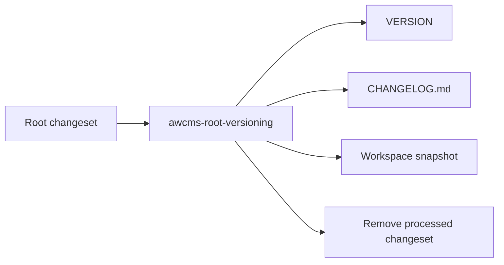

# Root AWCMS Changesets

This directory stores root-level AWCMS-Micro maintenance changesets for the parent repository.

Use this boundary for root scripts, root docs, and maintenance-workspace changes that should be versioned separately from `awcmsmicro-dev/.awcms-changesets/`.

## File Format

Each changeset is a Markdown file with frontmatter and a required body.

Example:

```md
---
bump: patch
---

Updates root documentation for the maintenance workspace.
```

## Supported Bumps

- `patch`
- `minor`
- `major`

## Processing Rule

The root versioning script reads pending files, bumps the root `VERSION`, prepends `CHANGELOG.md`, and removes processed changeset files.


