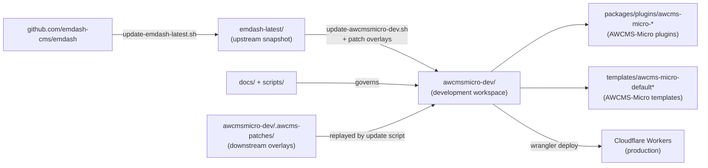
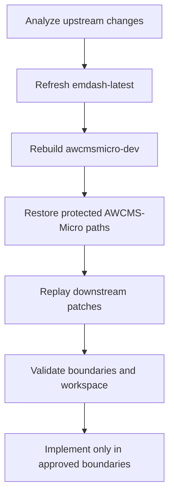

# AWCMS-Micro Parent Repository

This repository is the parent maintenance workspace for keeping AWCMS-Micro aligned with the latest EmDash source.

## Purpose

Analyze `https://github.com/emdash-cms/emdash`, then update `https://github.com/ahliweb/awcms-micro` so it stays fully synchronized with EmDash.

`awcms-micro` is an independent repository. It must not act as a host for other repositories in the product or runtime sense. It should serve as an implementation workspace that adopts EmDash 100% and includes only AWCMS-Micro plugins and templates that follow the AWCMS-Micro standard, without modifying EmDash core.

AWCMS-Micro-specific product development in this maintenance workspace is limited to plugin and template boundaries. Root scripts and root documentation may change to support that workflow, but new product behavior should not be introduced through EmDash core forks or new shared core layers.

## Versioning Model

This workspace uses three separate versioning and changelog surfaces:

- root maintenance changes for the parent repository live in `VERSION`, `CHANGELOG.md`, and root `.awcms-changesets/`
- workspace package releases for published EmDash packages like `awcmsmicro-dev/packages/admin/` are driven by `awcmsmicro-dev/.changeset/`
- downstream AWCMS-Micro release-note inputs for `@awcms-micro/*` live in `awcmsmicro-dev/.awcms-changesets/`
- plugin packages under `awcmsmicro-dev/packages/plugins/` keep their own `package.json` version and `CHANGELOG.md`
- template packages under `awcmsmicro-dev/templates/` keep their own `package.json` version and `CHANGELOG.md`

`CHANGELOG.md` also carries a workspace snapshot of the current EmDash upstream SHA plus the version and latest changelog entry for every plugin and template in `awcmsmicro-dev/`.

Keep these flows separate so root maintenance releases do not mix with package releases, while the snapshot stays current.

## Licensing

- The root maintenance workspace is MIT licensed. See `LICENSE`.
- AWCMS-Micro plugins and templates use the AW Non-Commercial License 1.0 from `https://github.com/ahliweb/aw-non-commercial-license` unless a package-level license says otherwise.
- `docs/awcms-micro-licensing.md` explains how the root MIT license and package-level non-commercial license fit together.

## Root Structure

- `emdash-latest/`: latest synchronized snapshot of upstream EmDash (current: `0.19.0` @ `34dd430b`, 2026-06-13)
- `awcmsmicro-dev/`: clone of `emdash-latest/` used as the active AWCMS-Micro development workspace
- `docs/`: root-level technical documentation for structure, sync workflow, and implementation rules
- `scripts/`: maintenance scripts for refreshing `emdash-latest/` and rebuilding `awcmsmicro-dev/`



Hidden root files such as `.gitignore` and local-only `.env` support the parent workspace and are not part of the product structure.
Fresh-clone sync bootstrapping may also store template name and built-in plugin choices in `awcmsmicro-dev/.env` so local operator decisions stay outside git, and rebuilds preserve both `awcmsmicro-dev/.env` and `awcmsmicro-dev/.env.age` when present.
See `docs/operator-workflow.md` for the `continuation` and `fresh-clone` update modes and the fresh-clone prompt details.

## Repository Rules

- Keep `emdash-latest/` as the clean upstream reference tree.
- Rebuild `awcmsmicro-dev/` from `emdash-latest/` before AWCMS-Micro-specific implementation work.
- Do not treat this repository as a runtime host for nested products.
- Keep root documentation synchronized with the actual workflow and folder layout.
- For every root-level documentation, script, governance, synchronization, or protected admin branding change, add a root `.awcms-changesets/*.md` entry and run `bash scripts/awcms-root-versioning.sh version` so `VERSION`, `CHANGELOG.md`, and the workspace snapshot update automatically.
- Work step by step using small, atomic changes.
- When a task is too large, split it into smaller follow-up tasks or GitHub issues.
- If a downstream source tweak must survive sync but does not belong in a plugin or template boundary, encode it as a patch under `awcmsmicro-dev/.awcms-patches/` so the rebuild script can reapply it automatically.
- Every plugin that owns Cloudflare D1 tables or EmDash storage collections must use a dedicated `{prefix}_` for all table and collection names. The prefix must be unique per plugin and registered in `docs/awcms-micro-implementation-boundaries.md`. See the **D1 Table and Storage Collection Prefix Standard** section there for the active prefix registry and rules.

## GitHub Issue Execution System

GitHub issues in this repository are implementation contracts, not only reminders.

The current standard is documented in:

```txt
docs/awcms-micro-github-issue-system.md
```

Diagram requirements are documented in:

```txt
docs/awcms-micro-mermaid-diagram-standard.md
```

The standard applies to all AWCMS-Micro project work, including plugins, templates, database/D1, UI/UX, frontend, backend, API, integrations, security, deployment, tests, and documentation.

Sequenced issue title pattern:

```txt
[PRODUCT][SEQ-XX][TYPE][PRIORITY] Title
```

Examples:

```txt
[SIKESRA][SEQ-01A][BUG][P0] Fix admin dashboard Open module links to stay inside plugin admin routes
[TEMPLATE-DEFAULT][SEQ-03][UX][P1] Standardize public homepage section layout
[PLUGIN-GALLERY][SEQ-02][API][P1] Add typed gallery media API contract
[CLOUDFLARE][SEQ-02][DEPLOYMENT][P0] Validate D1 and R2 bindings for production deployment
[SECURITY][SEQ-01][P0] Add upload validation baseline for all media-enabled plugins
[DOCS][SEQ-01][DOCS][P1] Add Mermaid diagram standards for PRD, database, UI/UX, integration, and deployment issues
```

Rules:

- `SEQ` defines implementation order, not creation order.
- `P0/P1/P2/P3` defines priority and risk.
- Suffixes such as `SEQ-01A` or `SEQ-07A` insert urgent or dependency issues without renumbering the whole backlog.
- Later workflow issues must not start before their earlier foundation, guardrail, integration, and data-boundary issues are ready.
- Mermaid diagrams are required when an issue changes architecture, database, UI/UX flow, frontend-backend integration, security flow, deployment topology, migration, or data preservation.
- When issue order changes, update the root docs and any affected project docs listed in `docs/awcms-micro-github-issue-system.md`.

## SIKESRA Plugin Governance

The SIKESRA plugin is an AWCMS-Micro downstream plugin under:

```txt
awcmsmicro-dev/packages/plugins/awcms-micro-sikesra/
```

SIKESRA development is tracked through GitHub issues #119 through #143. These issues define the current implementation backlog for plugin identity, admin route safety, UI/UX standards, D1 table isolation, repository layer, frontend-backend-D1 integration, field standards, RBAC/ABAC, EmDash user references, document metadata, import/export, audit, data preservation, custom attributes, and CRUD governance.

Current ordered SIKESRA execution begins with:

```txt
#140 plugin identity
#141 admin dashboard route bug fix
#142 admin UI/UX design system
#119 sikesra_ naming policy
#121 prefix validation test
#136 EmDash update/rebuild compatibility
#137 data preservation guardrails
#120 D1 migration framework
#122 D1 repository layer
#143 typed frontend-backend-D1 integration contract
```

SIKESRA must follow these rules:

- keep all SIKESRA-owned logic inside the plugin, templates, docs, scripts, tests, and approved downstream boundaries;
- do not modify EmDash core for SIKESRA-specific behavior;
- use dedicated D1 tables and plugin collections with the `sikesra_` prefix (the registered prefix for this plugin per `docs/awcms-micro-implementation-boundaries.md`);
- treat dedicated D1 tables as the production source of truth once the D1 migration issues are implemented;
- use EmDash users as shared identity references, while storing SIKESRA roles, scopes, and ABAC policies in `sikesra_` tables;
- connect admin UI, API routes, service layer, repository layer, serializers, and D1 tables through typed contracts;
- keep public output aggregate-only and public-safe;
- preserve SIKESRA data across EmDash updates, dependency reinstalls, workspace rebuilds, local template rebuilds, and Cloudflare rebuilds;
- use the SIKESRA governance workflow for any high-impact data lifecycle action.

See `docs/awcms-micro-github-issue-system.md`, `docs/awcms-micro-mermaid-diagram-standard.md`, `docs/awcms-micro-sikesra-plugin-governance.md`, and `awcmsmicro-dev/packages/plugins/awcms-micro-sikesra/docs/IMPLEMENTATION_GOVERNANCE.md` before changing the SIKESRA plugin.

## Official Language

English (US) is the official repository language for root documentation, root scripts, repository instructions, and AWCMS-Micro-specific repository governance text.

Exception:

- `emdash-latest/` must remain as an upstream-faithful EmDash snapshot and should preserve upstream wording as-is, including non-US spelling when present.
- `awcmsmicro-dev/` may mirror upstream wording when it is rebuilt from `emdash-latest/` as part of synchronization work.

## Translation Standard

AWCMS-Micro plugins and templates must use Lingui-compatible gettext PO catalogs for user-facing translation work.

Standard catalog locations:

```txt
awcmsmicro-dev/packages/plugins/<plugin-id>/src/locales/en/messages.po
awcmsmicro-dev/packages/plugins/<plugin-id>/src/locales/id/messages.po
awcmsmicro-dev/templates/<template-id>/src/locales/en/messages.po
awcmsmicro-dev/templates/<template-id>/src/locales/id/messages.po
```

English (`en`) is the source locale. Active plugins and templates must include complete, reviewed Indonesian (`id`) translations for user-facing labels, navigation, settings, validation text, accessibility text, and public template copy.

Do not add new plugin or template translations only as inline manifest `i18n.messages` maps or code-level copy objects unless they are temporary compatibility adapters during migration. Keep placeholders such as `{error}` and XML-style tags such as `<0>` and `</0>` unchanged in `msgstr` values.

The authoritative standard lives in `awcmsmicro-dev/docs/awcms-micro/i18n-po-translation-standard.md`.

## Core Documentation

- `docs/README.md`
- `docs/repository-structure.md`
- `docs/synchronization-workflow.md`
- `docs/implementation-instructions.md`
- `docs/awcms-micro-implementation-boundaries.md`
- `docs/awcms-micro-github-issue-system.md`
- `docs/awcms-micro-mermaid-diagram-standard.md`
- `docs/awcms-micro-documentation-workflow.md`
- `docs/awcms-micro-sikesra-plugin-governance.md`
- `docs/awcms-micro-mobile-services-plugin-standard.md`
- `docs/awcms-admin-branding.md`
- `docs/awcmsmicro-dev-protected-paths.md`
- `docs/repository-assessment.md`
- `docs/decision-records.md`
- `docs/operator-workflow.md`
- `docs/awcms-micro-prd.md`
- `docs/awcms-micro-versioning.md`
- `docs/awcms-micro-root-versioning.md`
- `docs/awcms-micro-versioning-rollout-summary.md`
- `docs/awcms-micro-licensing.md`
- `docs/awcms-micro-d1-mirror-sync.md`
- `docs/upstream-sync/README.md`
- `docs/upstream-sync/ISSUE_CLASSIFICATION_DOWNSTREAM_VS_UPSTREAM.md`
- `docs/upstream-sync/UPSTREAM_PR_PLAN_ADMIN_SIDEBAR_ORDERING.md`
- `docs/deployment/cloudflare.md`
- `docs/backup/gitlab-mirror-setup.md`
- `docs/security/security-baseline.md`
- `docs/security/backup-restore.md`

## Maintenance Scripts

- `bash scripts/update-emdash-latest.sh`
- `bash scripts/update-awcmsmicro-dev.sh`
- `bash scripts/sync-preflight-checklist.sh --mode <continuation|fresh-clone>`
- `bash scripts/check-runtime-prereqs.sh`
- `bash scripts/validate-awcmsmicro-boundaries.sh`
- `bash scripts/validate-awcmsmicro-dev.sh`
- `bash scripts/sync-and-validate-awcmsmicro-dev.sh`
- `node awcmsmicro-dev/.github/scripts/awcms-version.mjs status`
- `node awcmsmicro-dev/.github/scripts/awcms-version.mjs version`
- `bash scripts/awcms-root-versioning.sh status`
- `bash scripts/awcms-root-versioning.sh version`
- `node scripts/awcms-version.mjs status`
- `node scripts/awcms-version.mjs version`
- `pnpm --dir awcmsmicro-dev d1:mirror:status`
- `pnpm --dir awcmsmicro-dev test:e2e`

## Backup & Recovery

- `bash scripts/backup/encrypt-config.sh` - Encrypt backup config
- `bash scripts/backup/decrypt-config.sh` - Decrypt backup config
- `bash scripts/backup/load-config.sh` - Load encrypted backup config and safe local `.env` overlays
- `bash scripts/backup/encrypt-all-env.sh` - Encrypt all .env files
- `bash scripts/backup/encrypt-env.sh` - Encrypt .env files
- `bash scripts/backup/decrypt-env.sh` - Decrypt .env files
- `bash scripts/backup/backup-db.sh` - Backup database to R2
- `bash scripts/backup/backup-dotfiles.sh` - Backup dotfiles
- `bash scripts/backup/restore-dotfiles.sh` - Restore dotfiles
- `bash scripts/backup/recovery-checklist.sh` - Disaster recovery guide

Backup scripts load encrypted configuration first and then safely overlay local `.env` files when present, which lets operator-only values such as `GITLAB_PAT` stay outside committed config.

See [scripts/backup/README.md](scripts/backup/README.md) for full documentation.

The D1 mirror workflow for DBeaver is documented separately in `docs/awcms-micro-d1-mirror-sync.md`.

## Contribution Policy

- CLA enforcement is not active in this workspace.
- Contributions are governed by repository review, issue tracking, and the standard approval flow used by maintainers.

## AWCMS-Micro Additions

- Default template: `awcmsmicro-dev/templates/awcms-micro-default/`
- Cloudflare template: `awcmsmicro-dev/templates/awcms-micro-default-cloudflare/`
- Both default templates' public pages follow the ahliweb.com (ahliwebcom) section architecture while staying CMS-sourced (shared `src/styles/public.css`, `src/components/public/`, an admin-editable `services` collection with `/services` routes, and client-side Mermaid for CMS content). See each template's `docs/PUBLIC_ARCHITECTURE.md`.
- Author archive pages (`/authors`, `/authors/[slug]`) available in both default templates using `getEntriesByByline()` (EmDash 0.19.0), bilingual EN/ID, SEO meta, sitemap-integrated.
- Content references schema (`_emdash_relations` + `_emdash_content_references`, EmDash 0.18.0+) documented in `awcmsmicro-dev/docs/awcms-micro/content-references.md` with planned AWCMS-Micro relation types.
- SIKESRA plugin: `awcmsmicro-dev/packages/plugins/awcms-micro-sikesra/`
- Docs plugin: `awcmsmicro-dev/packages/plugins/awcms-micro-docs/`
- Gallery plugin: `awcmsmicro-dev/packages/plugins/awcms-micro-gallery/`
- Website social plugin: `awcmsmicro-dev/packages/plugins/awcms-micro-website-social/`
- Email Mailketing plugin: `awcmsmicro-dev/packages/plugins/awcms-micro-email-mailketing/`
- Reserved Cloudflare demo boundary: `awcmsmicro-dev/demos/awcms-micro-cloudflare/`
- Reserved docs boundary: `awcmsmicro-dev/docs/awcms-micro/`
- Reserved E2E boundary: `awcmsmicro-dev/e2e/awcms-micro/`
- Reserved AWCMS changesets boundary: `awcmsmicro-dev/.awcms-changesets/`
- Preserved workspace package-release boundary: `awcmsmicro-dev/.changeset/`
- Preserved workflow boundary: `awcmsmicro-dev/.github/workflows/`
- Preserved workflow scripts boundary: `awcmsmicro-dev/.github/scripts/`
- Preserved Dependabot config: `awcmsmicro-dev/.github/dependabot.yml`
- Preserved dev-workspace agent guidance: `awcmsmicro-dev/AGENTS.md`
- Downstream patch overlay: `awcmsmicro-dev/.awcms-patches/`
- Approved implementation boundaries: `docs/awcms-micro-implementation-boundaries.md`
- Protected implementation boundary list: `scripts/awcmsmicro-dev-protected-paths.txt`
- Upstream sync tracking: `docs/upstream-sync/`
- Deployment guidance: `docs/deployment/`
- Security and compliance baselines: `docs/security/`

## Standard Workflow

1. Refresh `emdash-latest/` from upstream EmDash.
2. Rebuild `awcmsmicro-dev/` from `emdash-latest/` and let the rebuild script reapply any downstream patch overlays from `awcmsmicro-dev/.awcms-patches/`.
3. Validate `awcmsmicro-dev/` with `bash scripts/validate-awcmsmicro-dev.sh`.
4. Implement AWCMS-Micro-specific product work only in approved plugin and template boundaries inside `awcmsmicro-dev/`.



1. Prepare `.awcms-changesets/` entries when AWCMS plugins or templates need downstream version bumps.
1. Update root documentation when structure or process changes.

During rebuilds, `bash scripts/update-awcmsmicro-dev.sh` preserves only the explicitly approved AWCMS-Micro paths listed in `scripts/awcmsmicro-dev-protected-paths.txt` and governed by `docs/awcms-micro-implementation-boundaries.md`, including `awcmsmicro-dev/.changeset/` for workspace package-release metadata.
