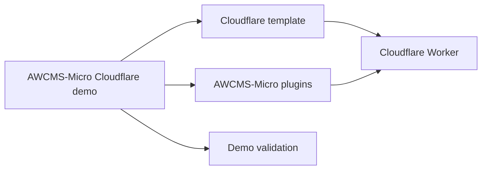

# AWCMS-Micro Cloudflare Demo Boundary

This directory is the sync-safe AWCMS-Micro implementation boundary for Cloudflare demo work when that surface is needed.

## Purpose

Use this boundary only for AWCMS-Micro-owned Cloudflare demo work that should remain separate from upstream EmDash demos.

Do not place upstream EmDash overrides here.

