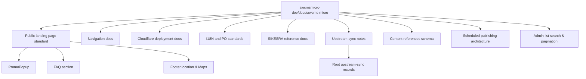

# AWCMS-Micro Docs Boundary

This directory is the sync-safe AWCMS-Micro documentation boundary inside `awcmsmicro-dev`.

Use it only for AWCMS-Micro-owned documentation.

## Documents

- `product-docs-map.md`: map of the main AWCMS-Micro product-facing docs in this boundary
- `cloudflare-deployment.md`: deployment, validation, smoke test, and rollback guidance for `templates/awcms-micro-default-cloudflare/`
- `public-landing-page-standard.md`: standard components and patterns for public landing pages, derived from `sample-awcmsastro-ahlikoding-com` and `gubuk-kuliner` reference repos
- `navigation-standard.md`: layered public and plugin navigation standard for AWCMS-Micro templates and the SIKESRA plugin
- `navigation-release-notes.md`: concise release notes for the navigation standard and validation paths
- `admin-navigation.md`: plugin-owned admin navigation compatibility guidance
- `upstream-sync.md`: SIKESRA-specific checks for EmDash update and rebuild workflows
- `divergence-log.md`: downstream divergence notes that must survive future sync work
- `plugin-i18n.md`: label resolution and plugin i18n behavior
- `i18n-po-translation-standard.md`: Lingui-compatible gettext PO catalog standard for AWCMS-Micro plugins and templates
- `sikesra-reference-prd.md`: SIKESRA reference PRD and backlog map for the AWCMS-Micro example standard
- `sikesra-reference-standard.md`: SIKESRA-grade reference scope, implementation order, and guardrails for the SIKESRA plugin and templates
- `scheduled-publishing.md`: scheduled publishing architecture with Cron Trigger, `publishDueContent` sweep, D1 coalescing, and Node.js scheduler state machine (EmDash 0.19.0)
- `content-references.md`: content-to-content relations schema (`_emdash_relations` + `_emdash_content_references`), AWCMS-Micro planned relation types, and implementation checklist (EmDash 0.18.0+)
- `admin-list-search-pagination.md`: client-side search and cursor-based "Load More" pagination patterns for plugin admin list pages, with Mermaid diagrams and per-plugin inventory
