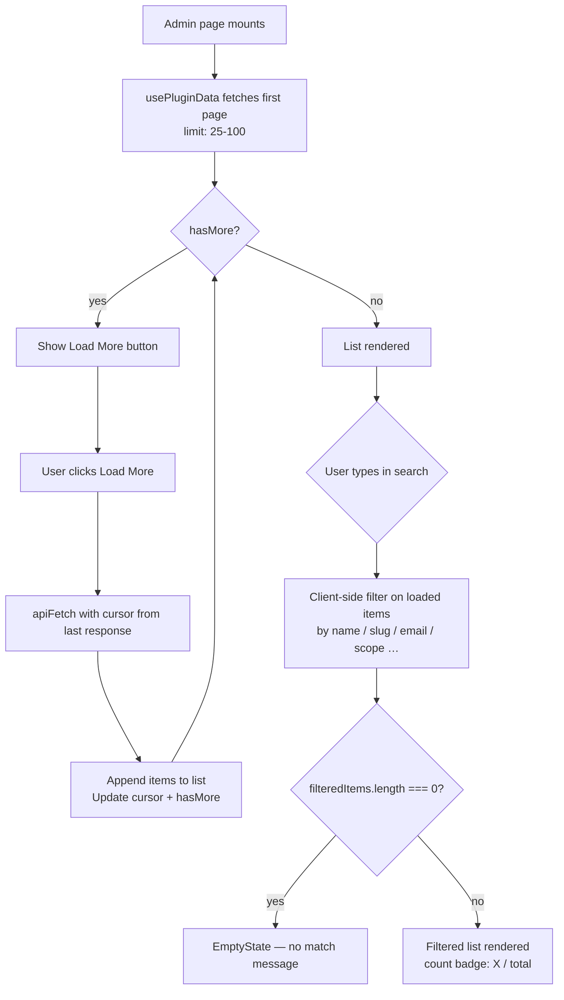
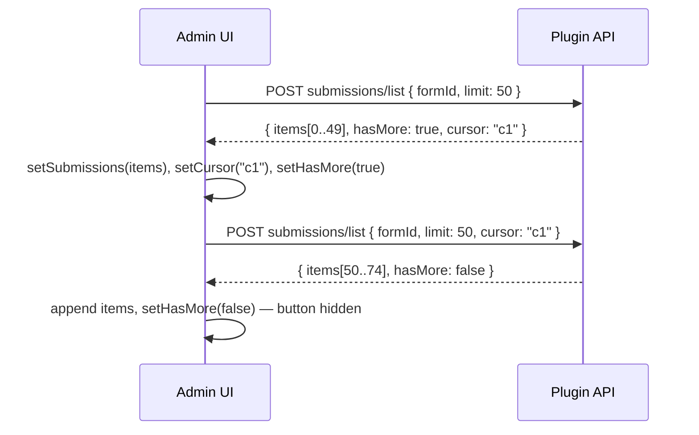

# Admin List Search & Pagination Patterns

AWCMS-Micro plugin admin pages that render lists use two complementary patterns to keep pages responsive even when datasets grow large: **client-side search** on the currently loaded items, and **cursor-based "Load More"** for fetching additional items from the server.

## Patterns at a Glance



## Client-Side Search

Search is applied only to the items already loaded in memory — it does not trigger a new network request.  The filter state is a plain `React.useState("")` string; the derived filtered list is computed inline (not in a `useMemo`) since the item counts are bounded by the initial fetch limit.

```tsx
const [searchQuery, setSearchQuery] = React.useState("");
const lower = searchQuery.toLowerCase();
const filteredItems = searchQuery
    ? items.filter(item =>
            item.name.toLowerCase().includes(lower) ||
            item.slug.toLowerCase().includes(lower))
    : items;
```

**UI conventions:**

- `<Input type="search">` — provides native browser clear button and search semantics.
- Show a live count badge (`X / total`) only when a query is active.
- When the filtered list is empty, render `<EmptyState>` with a localized no-match title (e.g. `copy.noPermissionsMatch`), not the "no data yet" empty state.
- The search input is placed inside the list card, above the results, so the form/action card (if present) stays separate.

## Cursor-Based Pagination (Load More)

Used when the underlying API supports cursor pagination (`{ items, hasMore, cursor? }`).  The initial fetch loads a fixed limit (e.g. 50 submissions); the cursor from the response is stored in state.  When the user clicks "Load More", the next page is fetched and appended.



The "Load More" button is shown only when `hasMore && !loadingMore`.  A spinner or disabled state covers the in-flight request.  Search always applies to the full accumulated list.

## Plugin Inventory

| Plugin | Page | Pattern |
|---|---|---|
| `@emdash-cms/plugin-forms` | FormsListPage | Client search (name, slug) |
| `@emdash-cms/plugin-forms` | SubmissionsPage | Load More (cursor, limit 50) + client search on loaded items |
| `@awcms-micro/plugin-email-mailketing` | AccessUsersPage | Client search (name, email) |
| `@awcms-micro/plugin-email-mailketing` | AccessRolesPage | Client search (label, slug) |
| `@awcms-micro/plugin-sikesra` | AuditPage | Client search (kind, scope, summary) |
| `@awcms-micro/plugin-sikesra` | PermissionsPage | Client search (slug, label, scope) |
| `@awcms-micro/plugin-sikesra` | RolesPage | Client search (slug, label) |

## Localization

Every search placeholder, aria-label, and no-match message is localized.  For AWCMS-Micro plugins this means entries in `messages.ts` (both `en` and `id` objects) **and** in the corresponding `src/locales/{en,id}/messages.po` files.  Follow `i18n-po-translation-standard.md` for the PO format rules.
