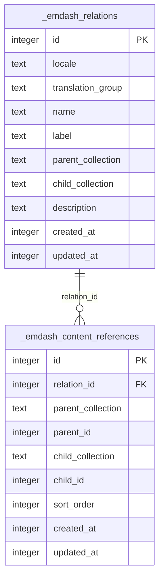

# Content References Architecture

EmDash 0.18.0 / 0.19.0 ships **migration 043** which adds two system tables enabling typed,
directed content-to-content relationships.  AWCMS-Micro templates can use this foundation to
display related content — "Related Services" on a post, "Case Studies" on a service page — without
any schema duplication or custom join logic.

## Schema



### `_emdash_relations` — relation-type registry

Each row defines **one kind of relationship** between two collections for a specific locale.
The `translation_group` field lets a single relation type span multiple locales (same as the
standard row-per-locale content model).

| Column | Purpose |
|---|---|
| `parent_collection` | The "source" collection (e.g. `posts`) |
| `child_collection` | The "target" collection (e.g. `services`) |
| `name` | Machine-readable identifier (e.g. `posts_to_services`) |
| `label` | Admin-visible display label |
| `locale` | Row locale (`en`, `id`) |
| `translation_group` | Links locale variants of the same relation type |

### `_emdash_content_references` — directed edges

Each row is one **parent → child edge**:

| Column | Purpose |
|---|---|
| `relation_id` | References `_emdash_relations.id` |
| `parent_collection` / `parent_id` | Source content entry |
| `child_collection` / `child_id` | Target content entry |
| `sort_order` | Display order within the parent's reference list |

## Data Flow

```mermaid
flowchart LR
    subgraph Admin["EmDash Admin"]
        RA["Define relation type\n(e.g. posts → services)"]
        Edge["Create edge\n(post #42 → service #7)"]
    end
    subgraph DB["D1 Database"]
        RT["_emdash_relations"]
        CR["_emdash_content_references"]
    end
    subgraph Public["Public Template"]
        QR["Query: getContentReferences()\nor direct D1 join"]
        UI["Render "Related Services"\nblock in post detail"]
    end

    RA --> RT
    Edge --> CR
    CR -->|"relation_id"| RT
    QR --> CR
    QR --> RT
    UI --> QR
```

## Migration

Migration 043 ships with EmDash 0.18.0 and **runs automatically on first boot** — no manual
action required.  Both `CREATE TABLE` and `CREATE INDEX` statements are wrapped in
`.ifNotExists()` so re-runs are safe.

## AWCMS-Micro Planned Relations

The following relation types are planned for seed data.  Each requires one
`_emdash_relations` row per locale (`en` + `id`) sharing a `translation_group`.

| Relation Name | Parent Collection | Child Collection | Use Case |
|---|---|---|---|
| `posts_to_services` | `posts` | `services` | "Related Services" on a blog post |
| `services_to_posts` | `services` | `posts` | "Case Studies / Blog Posts" on a service page |
| `portfolio_to_services` | `portfolio` | `services` | "Built With" on a portfolio item |
| `services_to_portfolio` | `services` | `portfolio` | "See Our Work" on a service page |

## Implementation Checklist

- [x] Migration 043 auto-applies on 0.18.0+ boot (`_emdash_relations` + `_emdash_content_references`)
- [ ] Seed `_emdash_relations` rows for the four planned relation types (EN + ID locales)
- [ ] Display "Related Services" sidebar block in `posts/[slug].astro`
- [ ] Display "Case Studies" block in `services/[slug].astro`
- [ ] Display "Built With" block in `portfolio/[slug].astro`
- [ ] Add relation seed script to `scripts/seed-relations.ts`

## References

- EmDash PR #1367
- Migration file: `packages/core/src/database/migrations/043_content_references.ts`
- Types: `RelationTable`, `ContentReferenceTable` in `packages/core/src/database/types.ts`
- GitHub issue: [#202](https://github.com/ahliweb/awcms-micro/issues/202)
