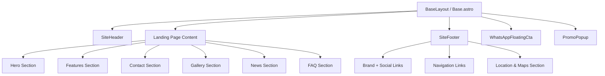
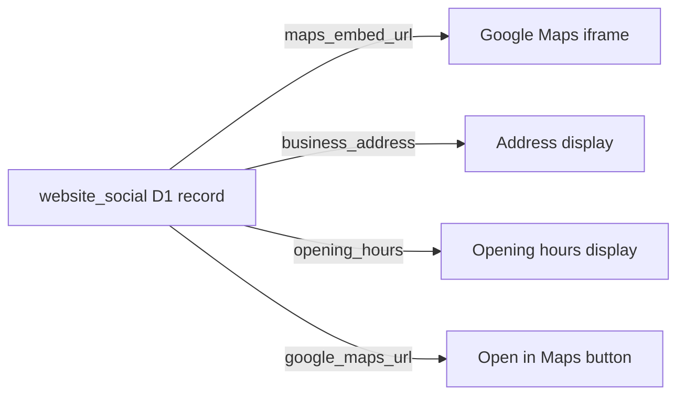
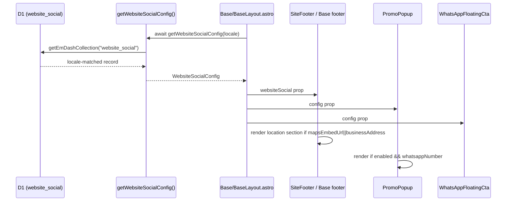

# AWCMS-Micro Public Landing Page Standard

## Purpose

This document defines the standard components, sections, and configuration patterns for building public landing pages in AWCMS-Micro templates. It is derived from two reference repositories:

- `ahliweb/sample-awcmsastro-ahlikoding-com` — bilingual professional service landing page (Astro + EmDash SSR)
- `ahliweb/gubuk-kuliner` — Indonesian food business single-page site (Astro + Tailwind v4, static reference)

Both references were analyzed to identify reusable patterns and implement them as first-class features in `awcms-micro-default` and `awcms-micro-default-cloudflare` templates.

---

## Template Architecture

Both AWCMS-Micro templates share the same component model:



The cloudflare template uses a single `Base.astro` layout; the default template uses `BaseLayout.astro` + `SiteHeader.astro` + `SiteFooter.astro`.

---

## Implemented Sections

### 1. Promo Popup

**Source:** `sample-awcmsastro-ahlikoding-com` reference standard.

**Component:** `src/components/PromoPopup.astro`

**Features:**
- Sticky bottom-left trigger button with gradient accent
- Fullscreen overlay popup with pricing, feature checklist, and WhatsApp CTA
- Auto-shows after 2000ms on first visit
- Dismissed state persisted in `sessionStorage` (`awcms-promo-dismissed`)
- Keyboard accessible: Escape key, ×, and backdrop click to close
- Conditionally renders only when `websiteSocial.enabled && websiteSocial.whatsappNumber`

**Configuration:** Driven by the `website_social` D1 collection. Uses `WebsiteSocialConfig` for WhatsApp number and `createWhatsAppUrl` for the CTA URL. Promo copy comes from `messages.ts`.

**Copy keys** (in `messages.ts`):
```
promoTriggerLabel, promoLimitedOffer, promoTitle, promoText,
promoPrice, promoDiscount, promoCta, promoCloseLabel, promoWaMessage,
promoFeature1..4
```

**Future:** Issue [#183](https://github.com/ahliweb/awcms-micro/issues/183) tracks migrating promo content to a `website_promo` D1 collection so operators can manage promo text from the admin panel.

---

### 2. FAQ Accordion

**Source:** Both reference repos use `<details>/<summary>` FAQ patterns.

**Location:** `src/pages/index.astro` (landing page)

**Pattern:**
```astro
<section class="landing-split landing-split--faq reveal">
  <div>
    <p class="landing-eyebrow">{copy.landingFaqEyebrow}</p>
    <h2>{copy.landingFaqHeading}</h2>
  </div>
  <div class="landing-faq-list">
    {copy.landingFaqItems.map(([question, answer]) => (
      <details class="landing-faq-item">
        <summary><span>{question}</span><svg class="landing-faq-chevron" .../>
        </summary>
        <div class="landing-faq-content"><p>{answer}</p></div>
      </details>
    ))}
  </div>
</section>
```

**Copy keys:**
```
landingFaqEyebrow, landingFaqHeading, landingFaqItems (array of [question, answer] tuples)
```

**Behavior:** Chevron rotates 180° on open via CSS `details[open] .landing-faq-chevron`. No JavaScript required.

---

### 3. Footer Location & Google Maps

**Source:** `gubuk-kuliner` footer pattern — grid with Google Maps iframe, address, opening hours, and directions link.

**Location:** `SiteFooter.astro` (default template) / `Base.astro` footer section (cloudflare template)

**Conditional rendering:** Only renders when `websiteSocial.mapsEmbedUrl || websiteSocial.businessAddress` is set.



**Fields to add to the `website_social` collection record:**

| Field name | Type | Example |
|---|---|---|
| `maps_embed_url` | text | `https://www.google.com/maps/embed?pb=...` |
| `business_address` | text | `Jl. Ahmad Wongso, Kelurahan Madurejo` |
| `opening_hours` | text | `08.00 – 21.00 WIB` |
| `google_maps_url` | text | `https://maps.app.goo.gl/...` |

**Copy keys:**
```
footerLocationHeading, footerLocationAddress, footerLocationHours,
footerLocationOpenMaps, footerLocationMapTitle
```

---

### 4. Floating WhatsApp CTA

**Component:** `src/components/WhatsAppFloatingCta.astro`

**Source:** Pre-existing AWCMS-Micro pattern, aligned with both reference repos.

**Config:** `website_social` D1 collection. Renders as a fixed bottom-right button.

---

### 5. Gallery Section

**Plugin:** `awcms-micro-gallery`

The gallery page at `/gallery` is managed by the `awcms-micro-gallery` plugin. Galleries can be linked from the landing page and footer.

---

## Recently Completed Sections

All patterns from the reference repos have now been fully implemented:

| Section | Source | GitHub Issue |
| --- | --- | --- |
| CMS-managed promo popup (D1-driven via `website_social`) | sample-awcmsastro | [#183](https://github.com/ahliweb/awcms-micro/issues/183) |
| JSON-LD business schema (ProfessionalService / Restaurant) | both refs | [#184](https://github.com/ahliweb/awcms-micro/issues/184) |
| Open-hours badge in sticky header | gubuk-kuliner | [#184](https://github.com/ahliweb/awcms-micro/issues/184) |
| Order steps section (4-step how-to-order) | gubuk-kuliner | [#184](https://github.com/ahliweb/awcms-micro/issues/184) |

---

## Data Flow: `website_social` Config



---

## Copy / i18n Pattern

All section copy lives in `src/locales/messages.ts` as locale-keyed string constants. Both templates use the same key structure.

The `getPublicCopy(locale)` utility reads the correct locale object and returns it as a typed `copy` constant used throughout all components and pages.

**Pattern for FAQ items and similar arrays:**
```typescript
// messages.ts
landingFaqItems: [
    ["Question text", "Answer text"],
    // ...
] as unknown as [string, string][],
```

This uses `as const` at the parent object level; individual tuple arrays are accessible as `[string, string][]` for `.map(([question, answer]) => ...)` destructuring in Astro.

---

## Reference Implementation Comparison

| Feature | sample-awcmsastro | gubuk-kuliner | AWCMS-Micro Status |
|---|---|---|---|
| Hero with CTA | ✅ Two-column with image | ✅ Blob-image + badges | ✅ Two-column split hero |
| Floating WA CTA | ✅ | ✅ | ✅ |
| Promo popup | ✅ Sticky trigger + overlay | ❌ | ✅ (messages.ts-driven) |
| FAQ accordion | ✅ | ✅ | ✅ |
| Footer location + Maps | ✅ | ✅ Google Maps embed | ✅ (website_social fields) |
| Gallery | ✅ Slider | ✅ Grid | ✅ (awcms-micro-gallery plugin) |
| JSON-LD schema | ✅ ProfessionalService | ✅ Restaurant | ✅ (website_social.schemaType) |
| Open-hours header badge | ❌ | ✅ Pulsing dot + time | ✅ (website_social.openingHours) |
| Order steps section | ❌ | ✅ 4-step flow | ✅ (messages.ts + index.astro) |
| Bilingual support | ✅ EN/ID routes | ❌ Indonesian only | ✅ EN/ID via i18n config |
| Testimonials | ✅ | ❌ | 🔲 Planned |
| CMS-managed promo | 🔲 — | — | ✅ D1-driven via website_social (#183) |

---

## Admin Management

Public landing page features are managed through the EmDash admin panel under:

- **website_social collection** — WhatsApp config, location fields (maps_embed_url, business_address, opening_hours, google_maps_url), business schema fields (schema_type, business_name, business_description, business_phone, price_range), promo fields (promo_enabled, promo_title, promo_text, promo_price, promo_discount, promo_cta_message, promo_feature_1-4)
- **Pages collection** — About, Privacy, Terms, and custom public pages
- **Gallery plugin** — Photo and video galleries linked from the landing page
- **Settings > Site** — Site title, tagline, logo, favicon, SEO defaults

To access: `/_emdash/admin/content/website_social`

---

## Ownership

This document lives in `awcmsmicro-dev/docs/awcms-micro/` and is sync-safe. It should be updated whenever a new landing page section is added to either template.
