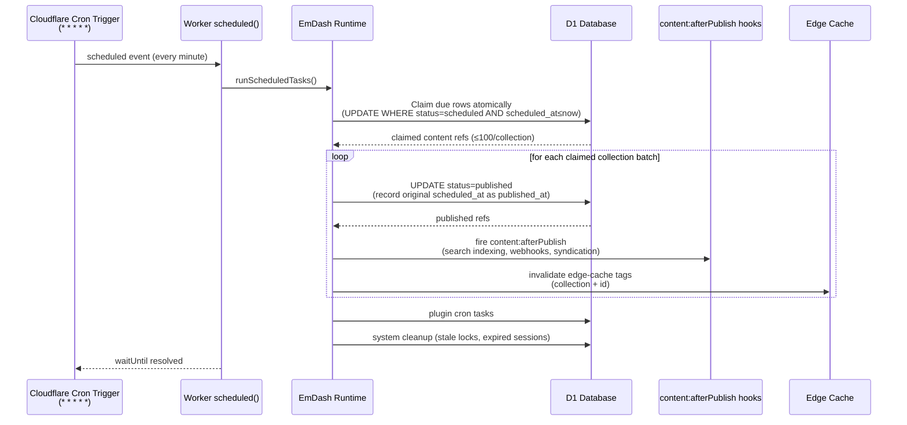
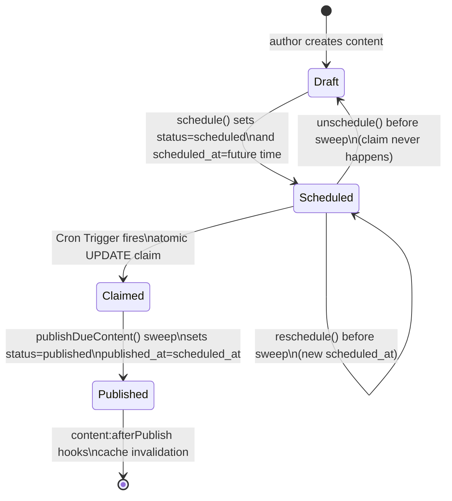
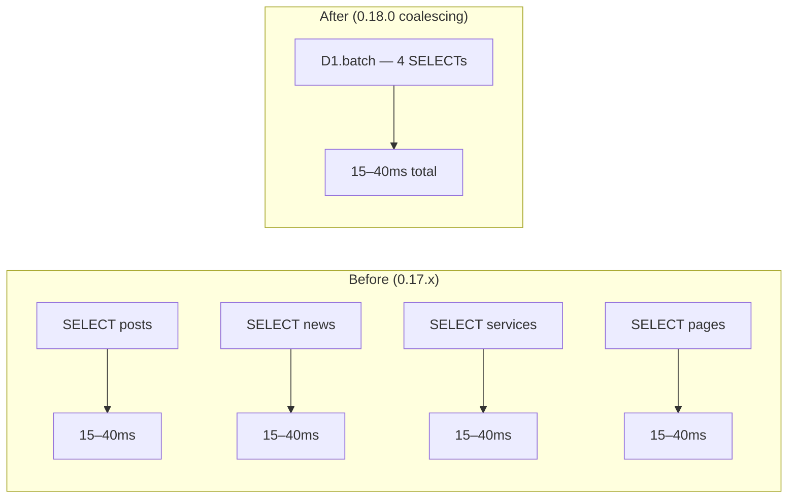
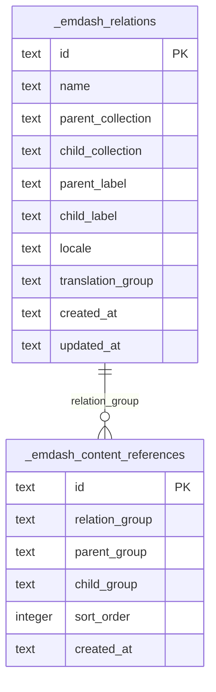
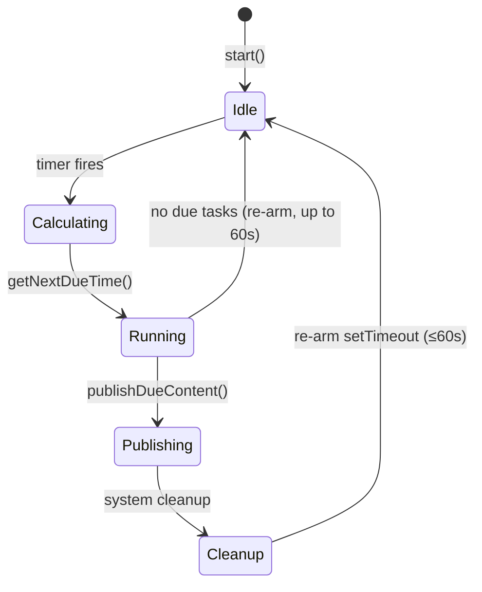

# Scheduled Publishing Architecture

EmDash 0.19.0 delivers a production-ready scheduled publishing pipeline powered by a real heartbeat (`publishDueContent` sweep) instead of request side effects. This document explains the architecture and how AWCMS-Micro's Cloudflare template integrates with it.

> **Note:** The `@emdash-cms/cloudflare/worker` export and the `wrangler.jsonc` cron trigger were scaffolded in the 0.18.0 sync cycle. The actual bug fix — where content stayed `scheduled` forever and `published_at` was never set — shipped in 0.19.0.

## How It Works

Content marked `scheduled` with a future `scheduled_at` timestamp is auto-published when the deadline passes. On Cloudflare Workers, a **Cron Trigger** fires the sweep every minute; on Node.js, a `setTimeout`-based scheduler polls every 1–60 seconds.



### Key safety properties (0.19.0)

- **Atomic claim**: each row is `UPDATE`-claimed before being promoted; overlapping sweeps cannot double-publish the same entry
- **Unschedule-safe**: an entry unscheduled or rescheduled just before its time is never published
- **Batch capped at 100**: large content backlogs drain over successive ticks; no single Worker invocation exhausts CPU/subrequest budget
- **Incremental cache purge**: edge-cache tags are purged after each collection batch, not only at the end; a Worker killed mid-sweep still purges what it managed to publish
- **`published_at` fidelity**: the sweep records the *scheduled* time as `published_at` on first publication rather than the (later) sweep execution time

## Worker Entry Point

The Cloudflare template `src/worker.ts` re-exports the complete worker from `@emdash-cms/cloudflare/worker`:

```typescript
// Cloudflare Worker entry for AWCMS-Micro.
// Delegates to @emdash-cms/cloudflare/worker which bundles:
//   - the Astro SSR handler (default export)
//   - a scheduled() handler that drives cron-based scheduled publishing
//     and fires content:afterPublish hooks (edge-cache invalidation etc.)
//   - PluginBridge Durable Object for EmDash sandbox
//
// Requires a Cron Trigger in wrangler.jsonc:
//   "triggers": { "crons": ["* * * * *"] }
export { default, PluginBridge } from "@emdash-cms/cloudflare/worker";
```

This single re-export provides:
- `default` — the Astro SSR handler for HTTP requests
- `scheduled()` — the cron handler that drives publishing, plugin cron, and system cleanup
- `PluginBridge` — the Durable Object re-exported so the sandbox binding resolves

For hand-assembled Workers, use `createScheduledHandler()`:

```typescript
import { createScheduledHandler } from "@emdash-cms/cloudflare/worker";
export const scheduled = createScheduledHandler();
```

## Wrangler Configuration

`wrangler.jsonc` must include a Cron Trigger so Cloudflare fires the `scheduled()` handler:

```jsonc
"triggers": {
    "crons": ["* * * * *"]
}
```

Without this trigger, scheduled content never auto-publishes on Cloudflare Workers.

## Scheduling Lifecycle



## D1 Batch Coalescing (0.18.0)

The Cloudflare package ships an opt-in coalescing D1 driver. SELECT queries issued in the same event-loop turn are batched into one `D1.batch()` call, replacing N sequential round trips with one:



## Content References Schema (Migration 043)

Migration 043 (applied in production from the 0.18.0 sync cycle; formally confirmed in 0.19.0 release) adds the foundation for typed content-to-content relationships:



Both tables are locale-aware and use `translation_group` ULIDs to link content across locales without SQL foreign keys, following the same pattern as taxonomy edges.

No field type, API, or admin UI is available yet — this is schema groundwork only. Implementation is tracked in issue #202.

## Node.js Dev Environment

In the Node template, `NodeCronScheduler` polls every 1–60 seconds using `setTimeout`. The 60-second cap matches Cloudflare Cron Trigger cadence so scheduled-publish latency is consistent between local dev and production:



## Deployment Checklist

Before deploying, confirm:

- [ ] `src/worker.ts` re-exports `@emdash-cms/cloudflare/worker`
- [ ] `wrangler.jsonc` has `"triggers": { "crons": ["* * * * *"] }`
- [ ] D1 database binding is `DB` (the runtime reads `env.DB`)

After deploying:

- [ ] Schedule a test post 2–3 minutes in the future
- [ ] Confirm it transitions to `published` within ~1 minute of its scheduled time
- [ ] Confirm `published_at` equals the scheduled time (not the sweep time)
- [ ] Check Worker logs for `[scheduled] Published N scheduled item(s)`

See issue #205 for the post-deploy verification task.

## References

- EmDash PR #1312 — scheduling heartbeat driver (0.19.0)
- EmDash commit `c39789c` — `feat(core): drive scheduled publishing from a real heartbeat`
- EmDash commit `850c1b7` — `feat(core): generate responsive srcsets for media (Image + EmDashImage)`
- `packages/cloudflare/src/worker.ts` — `createScheduledHandler()` implementation
- `packages/core/src/scheduled-publish.ts` — `publishDueContent()` sweep
- `packages/core/src/plugins/scheduler/node.ts` — `NodeCronScheduler`
- GitHub issue [#201](https://github.com/ahliweb/awcms-micro/issues/201) — adopt new worker.ts pattern (closed)
- GitHub issue [#202](https://github.com/ahliweb/awcms-micro/issues/202) — content references planning
- GitHub issue [#205](https://github.com/ahliweb/awcms-micro/issues/205) — scheduled publishing post-deploy verification
