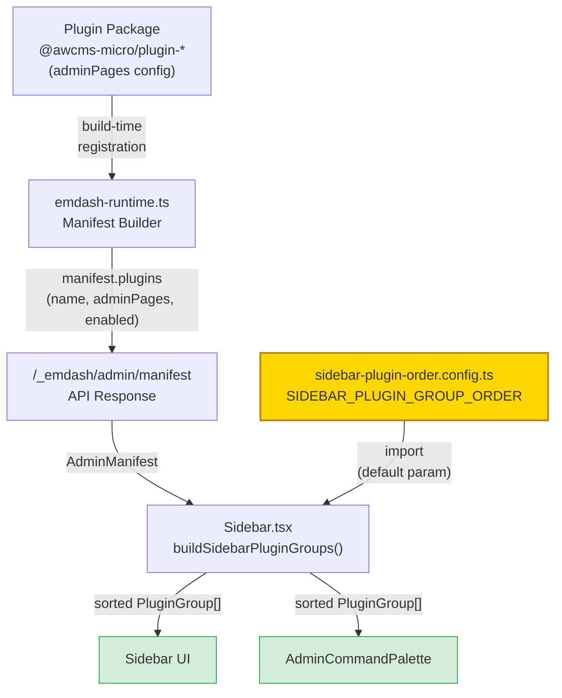
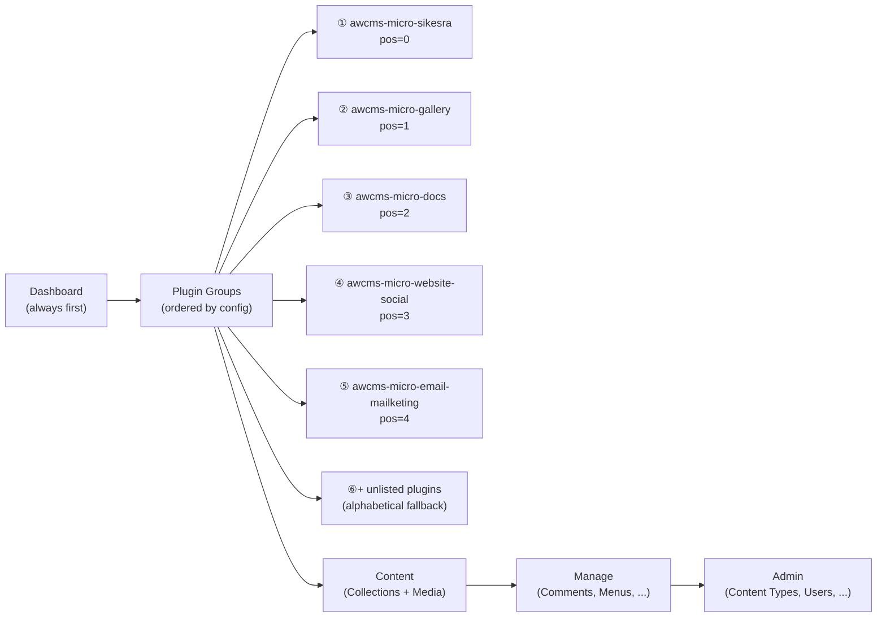

# Admin Sidebar Plugin Group Order

AWCMS-Micro menggunakan konfigurasi terpusat untuk menentukan urutan grup plugin pada sidebar admin
dan command palette. Urutan ini deterministik — tidak berubah meskipun nama plugin diubah.

## File Konfigurasi

`packages/admin/src/config/sidebar-plugin-order.config.ts`

File ini adalah **protected path** yang bertahan saat `awcmsmicro-dev` direbuild dari upstream.
Tambahkan plugin ID baru di sini ketika plugin baru didaftarkan ke template.

```typescript
export const SIDEBAR_PLUGIN_GROUP_ORDER: readonly string[] = [
	"awcms-micro-sikesra",          // Governance plugin — always first
	"awcms-micro-gallery",          // Gallery
	"awcms-micro-docs",             // Docs
	"awcms-micro-website-social",   // Website Social
	"awcms-micro-email-mailketing", // Email / Mailketing
] as const;
```

## Algoritma Pengurutan

Plugin yang terdaftar di `SIDEBAR_PLUGIN_GROUP_ORDER` ditampilkan sesuai indeks array (0 = paling atas).
Plugin yang **tidak** terdaftar ditambahkan setelah semua plugin terdaftar, diurutkan alfabetis berdasarkan label.

```
posisi_efektif =
  jika pluginId ada di order → indexOf(pluginId)
  jika tidak ada             → order.length   (append ke belakang)

urutan akhir:
  1. Bandingkan posisi_efektif
  2. Jika sama → localeCompare(label) → localeCompare(id)
```

## Alur Konfigurasi saat Deploy



## Urutan Grup Sidebar



## Menambahkan Plugin Baru

1. Buat plugin baru di `packages/plugins/awcms-micro-<nama-plugin>/`
2. Daftarkan plugin ke manifest template
3. Tambahkan plugin ID ke `SIDEBAR_PLUGIN_GROUP_ORDER` pada posisi yang diinginkan:

```typescript
export const SIDEBAR_PLUGIN_GROUP_ORDER: readonly string[] = [
	"awcms-micro-sikesra",
	"awcms-micro-gallery",
	"awcms-micro-docs",
	"awcms-micro-website-social",
	"awcms-micro-email-mailketing",
	"awcms-micro-nama-plugin-baru", // ← tambahkan di sini
] as const;
```

Jika plugin baru tidak ditambahkan ke config, plugin tersebut tetap muncul di sidebar namun
diurutkan alfabetis setelah semua plugin yang terdaftar.

## Backward Compatibility

Fungsi `buildSidebarPluginGroups()` menerima parameter ketiga optional `groupOrder`:

```typescript
buildSidebarPluginGroups(manifest, pluginAdmins)
// → menggunakan SIDEBAR_PLUGIN_GROUP_ORDER sebagai default

buildSidebarPluginGroups(manifest, pluginAdmins, customOrder)
// → menggunakan customOrder (berguna untuk testing)
```

Perubahan ini backward-compatible — pemanggil existing tidak perlu dimodifikasi.
