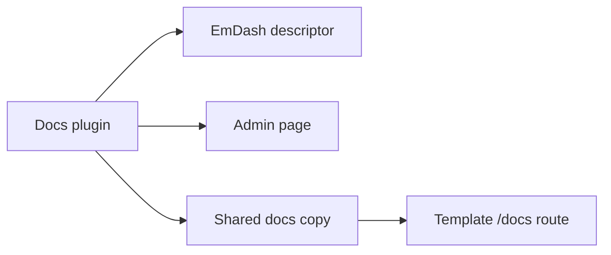

# AWCMS-Micro Docs Plugin

This package provides the example documentation plugin for AWCMS-Micro.

It exposes:

- a native EmDash plugin descriptor
- an admin page at `/_emdash/admin/plugins/awcms-micro-docs/`
- shared docs copy for the public `/docs` route

The package is intentionally small and stays inside the approved AWCMS-Micro plugin boundary.

