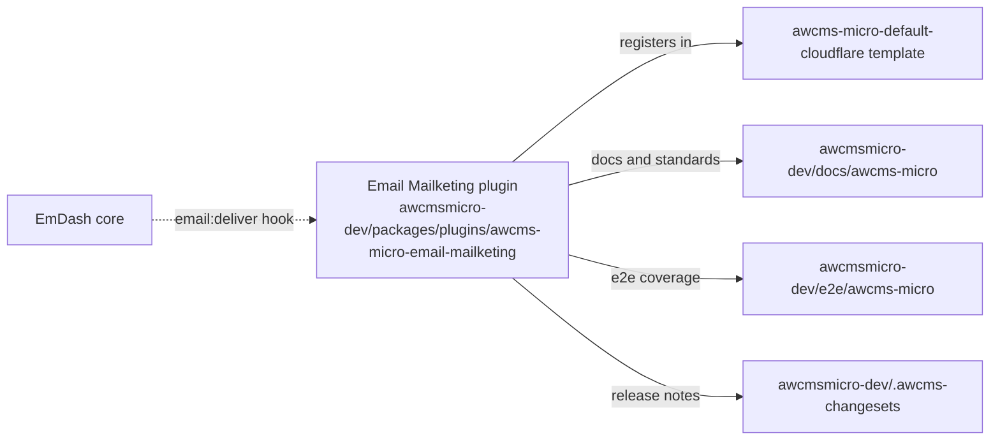
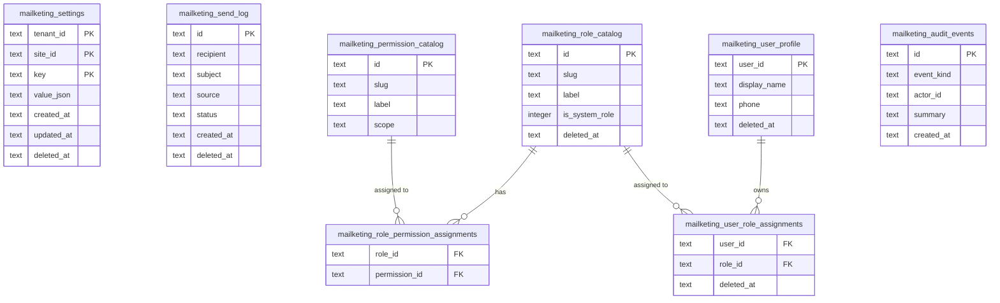
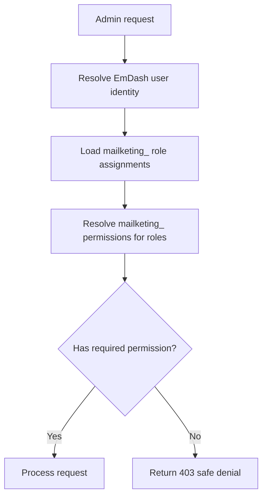

# Email Mailketing Plugin Implementation Governance

This document is the plugin-local implementation guide for the AWCMS-Micro Email Mailketing plugin.

It reflects the GitHub issue tracking standard in `docs/awcms-micro-github-issue-system.md` and the approved downstream boundaries in `docs/awcms-micro-implementation-boundaries.md`.

## 1. Identity

```txt
Package:     @awcms-micro/plugin-email-mailketing
Plugin ID:   awcms-email-mailketing
Name:        AWCMS-Micro Email Mailketing Plugin
Primary export: awcmsEmailMailketingPlugin
```

Rules:

- Keep the plugin slug stable as `awcms-email-mailketing`.
- All new code must use `awcmsEmailMailketingPlugin` as the primary export.
- Do not introduce new naming that conflicts with the stable plugin ID.

## 2. GitHub Issue System

Email Mailketing issues are execution contracts.

Issue title pattern:

```txt
[EMAIL-MAILKETING][SEQ-XX][TYPE][PRIORITY] Title
```

Rules:

- `SEQ` controls execution order; do not start a later issue before its dependencies are satisfied.
- `P0/P1/P2/P3` controls risk and urgency (`P0` = foundation, security, data safety).
- Suffixes such as `SEQ-01A` insert urgent dependency work without renumbering the backlog.
- Before executing an issue, read the issue body and related issues.
- When issue order changes, update `docs/awcms-micro-github-issue-system.md` and this document.

## 3. Boundary



Allowed plugin boundary:

```txt
awcmsmicro-dev/packages/plugins/awcms-micro-email-mailketing/
```

Allowed integration boundaries:

```txt
awcmsmicro-dev/templates/awcms-micro-default/
awcmsmicro-dev/templates/awcms-micro-default-cloudflare/
awcmsmicro-dev/docs/awcms-micro/
awcmsmicro-dev/e2e/awcms-micro/
awcmsmicro-dev/.awcms-changesets/
```

Do not move Email Mailketing logic into EmDash core packages.

## 4. Capabilities

Declared in `src/index.ts`:

| Capability | Purpose |
|---|---|
| `email:provide` | Registers as an EmDash `email:deliver` provider |
| `network:request` | Outbound HTTP to `api.mailketing.co.id` only |
| `users:read` | Reads EmDash users for access management |

Rules:

- Do not request capabilities beyond this list without a new governance decision and issue.
- The `network:request` capability scope is strictly limited to `mailketing.co.id`. Do not widen the allowed-host list without a security review.
- Never add `admin:core` or `schema:manage` capabilities; this plugin must not modify EmDash core schema.

## 5. Storage Isolation

All plugin-owned data uses the `mailketing_` prefix. No data is stored in generic EmDash core tables.



Rules:

- All table names must use the `mailketing_` prefix.
- All EmDash plugin storage collection names must use the `mailketing_` prefix (`src/db/schema.ts`).
- Do not share tables or collection names with other plugins.
- Do not store plugin state in `_emdash_*` system tables.

## 6. EmDash User Reference Policy

- Use EmDash users as shared identity references. The `user_id` columns in plugin tables are foreign references to EmDash's user store.
- Do not duplicate, reset, or delete EmDash core user accounts from this plugin.
- Do not replicate the EmDash users table; resolve user details by calling EmDash user APIs at query time.
- Plugin-scoped roles, permissions, and role-user assignments live in `mailketing_` tables only.

## 7. Admin Route Policy

```mermaid
flowchart LR
  Admin[Admin UI] --> Overview[/overview — stats dashboard]
  Admin --> SendLog[/send-log — send log CRUD]
  Admin --> Settings[/settings — API token and config]
  Admin --> Users[/access/users — role assignments]
  Admin --> Roles[/access/roles — role management]
  Admin --> Perms[/access/permissions — permission catalog]
  Admin --> Audit[/audit — audit event log]
```

Rules:

- All admin pages must be grouped under the plugin's own collapsible sidebar group, positioned directly below the Dashboard.
- Admin routes must check plugin-scoped RBAC before returning any mutable data.
- Settings routes must check that the caller has `mailketing.settings.manage` permission before exposing or saving API tokens.
- The audit log route must be read-only. No delete or mutation operations on audit events are permitted.
- Do not expose a public-facing API route. All plugin routes are admin-only.

## 8. RBAC and Permission Rules



Rules:

- System roles (`mailketing_admin`, `mailketing_viewer`) are seeded on plugin init and must not be deleted.
- Custom roles may be created by admins with `mailketing.roles.manage`.
- Never hard-code role slugs in authorization checks; check permission slugs only.
- All role and permission mutations must emit an audit event.

## 9. Data Preservation

This plugin's data must survive:

- EmDash updates (`scripts/update-emdash-latest.sh` + `scripts/update-awcmsmicro-dev.sh`)
- `pnpm install` / dependency reinstalls
- Workspace rebuilds that restore from `scripts/awcmsmicro-dev-protected-paths.txt`
- Cloudflare Pages/Workers rebuilds and redeployments

The plugin boundary `awcmsmicro-dev/packages/plugins/awcms-micro-email-mailketing/` is listed in `scripts/awcmsmicro-dev-protected-paths.txt` and will be backed up before any rebuild.

D1 data in production Cloudflare is preserved by Cloudflare's own D1 durability guarantees and is not affected by workspace rebuilds.

## 10. Versioning

- This plugin follows the `@awcms-micro/*` versioning flow via `awcmsmicro-dev/.awcms-changesets/`.
- See `docs/awcms-micro-versioning.md` for workflow details.
- Current version: `0.2.0` (see `package.json`).

## 11. Required Reading Before Changes

Before changing this plugin, read:

- `README.md` (plugin root)
- `docs/IMPLEMENTATION_GOVERNANCE.md` (this document)
- `docs/TECHNICAL_PRD.md`
- `docs/SECURITY.md`
- Root `docs/awcms-micro-implementation-boundaries.md`
- Root `docs/awcms-micro-github-issue-system.md`
