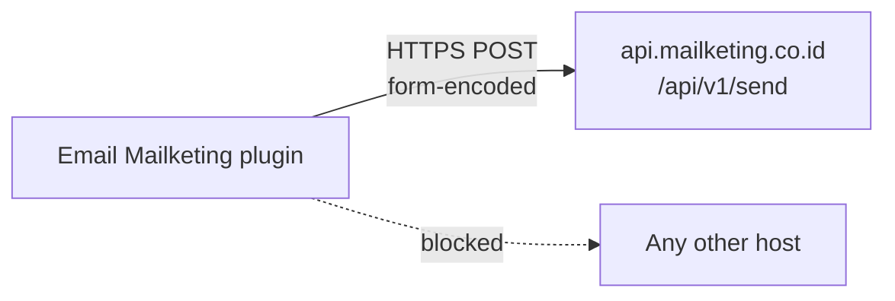
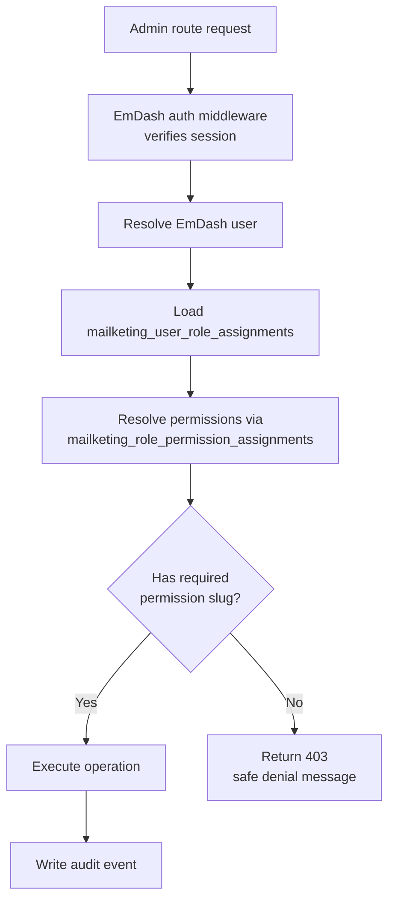
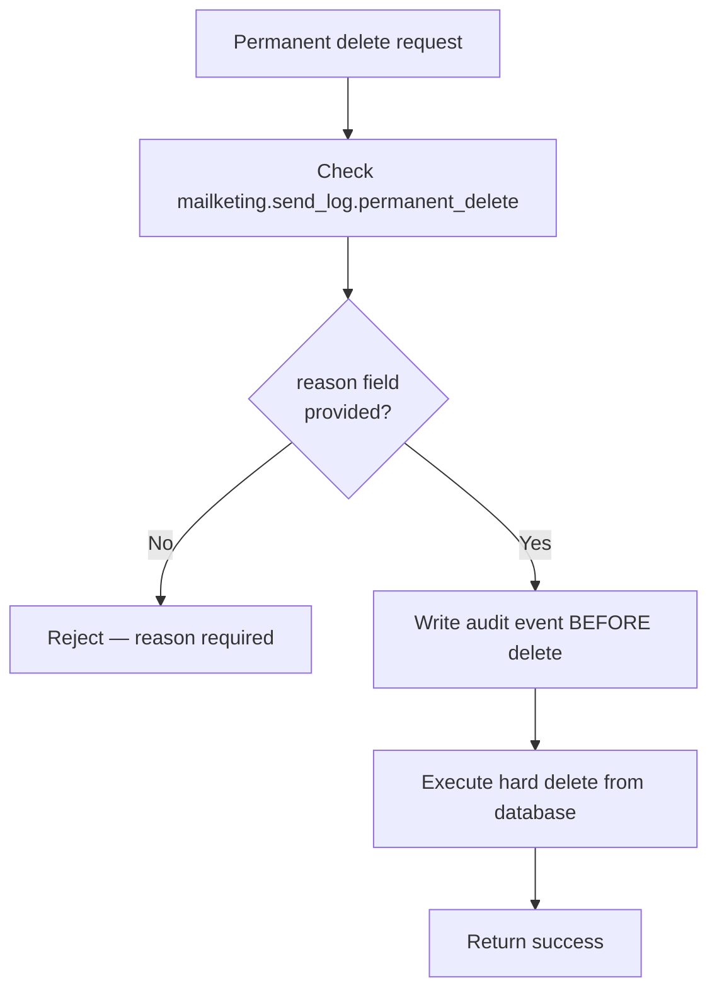

# Email Mailketing Plugin Security Notes

This document describes the security constraints for `@awcms-micro/plugin-email-mailketing`.

## 1. API Token Storage

- The Mailketing API token is stored as a string value in `mailketing_settings` under the key `apiToken`, scoped to `(tenant_id, site_id)`.
- The token is **never** committed to source code, hardcoded in configuration files, or exposed in public responses.
- The settings admin page must mask the token value on read (display as `••••` after save).
- Only users with `mailketing.settings.manage` permission may read or update the token.

```mermaid
flowchart TD
  Token[API token] -->|stored in| Settings[(mailketing_settings\ntenant_id + site_id + key)]
  Settings -->|read by| Hook[email:deliver hook\nruntime only]
  Settings -->|masked on| AdminPage[/settings admin page]
  AdminPage -->|requires| Perm[mailketing.settings.manage]
```

## 2. Outbound HTTP Scope

- The `network:request` capability is declared for outbound requests to `mailketing.co.id` only.
- The `MailketingClient` sends to `https://api.mailketing.co.id/api/v1/send`.
- The API token is transmitted as a form field in a `POST` body over HTTPS. It is not sent as a header to prevent accidental logging.
- No other outbound hosts are permitted. Do not widen the allowed-host list without a governance decision.



## 3. Audit Log Policy

- All mutable admin actions must write an immutable audit event to `mailketing_audit_events`.
- Audit events cannot be deleted, soft-deleted, or modified once written.
- The `/audit` admin page is read-only.
- Audit events capture: `event_kind`, `actor_id`, `actor_email`, `target_type`, `target_id`, `summary`, `detail` (JSON snapshot), `ip_address`, `user_agent`.
- Sensitive values such as API tokens must **not** appear in the `detail` field of any audit event.

```mermaid
flowchart LR
  Action[Admin action] --> Write[insertAuditEvent]
  Write --> AuditTable[(mailketing_audit_events\nimmutable)]
  AuditTable --> ReadOnly[/audit — read-only]
  AuditTable -.->|blocked| Delete[Any delete operation]
```

## 4. RBAC / ABAC Decision Flow

All state-changing plugin routes must check plugin-scoped permissions before executing.



Rules:

- Authorization checks permission slugs (e.g., `mailketing.settings.manage`), not role slugs.
- System roles (`mailketing_admin`, `mailketing_viewer`) are seeded on plugin init and must not be deleted or modified.
- Never bypass the permission check for any mutable route, even for superadmin users.
- Superadmin access to the EmDash admin panel does not automatically grant `mailketing_admin` role unless explicitly assigned.

## 5. Soft Delete Policy

- Soft deletes set `deleted_at` on the target row and write an audit event.
- Soft-deleted rows are excluded from default list queries but remain in the database.
- Soft-deleted send log entries may be restored by a user with `mailketing.send_log.restore`.
- Soft-deleted roles may be restored; roles with `is_system_role = 1` cannot be soft-deleted at all.

## 6. Permanent Delete Workflow

Permanent deletion is a destructive, irreversible operation.



Rules:

- A non-empty `reason` string is required for every permanent delete operation.
- The audit event must be written **before** the delete is executed. If the audit write fails, the delete must not proceed.
- Only users with `mailketing.send_log.permanent_delete` permission may execute permanent deletes.
- There is no undo for a permanent delete.

## 7. Public/Admin Boundary

- This plugin exposes no public-facing API routes.
- Admin pages and API routes must not be accessible without an authenticated EmDash session.
- Send log data, RBAC state, audit events, and settings must never be exposed to unauthenticated or unauthorized callers.
- Overview stats on the admin dashboard are admin-only and must not be rendered in public Astro templates.

## 8. Secret Hygiene

- Never commit `apiToken` values, test credentials, or Mailketing account tokens to source control.
- Cloudflare secrets for the API token must be injected at deploy time via Cloudflare Workers secrets, not stored in `wrangler.jsonc`.
- Local `.env` files containing test tokens must be excluded from git via `.gitignore`.
- The plugin's `emdash-plugin.jsonc` must not contain any secret values.

## 9. Dependency and Supply Chain

- The plugin has no third-party runtime dependencies beyond EmDash and the Node/Cloudflare platform globals.
- Outbound HTTP is implemented with the platform `fetch` global, not a third-party HTTP library.
- Keep dependencies minimal to reduce attack surface.
