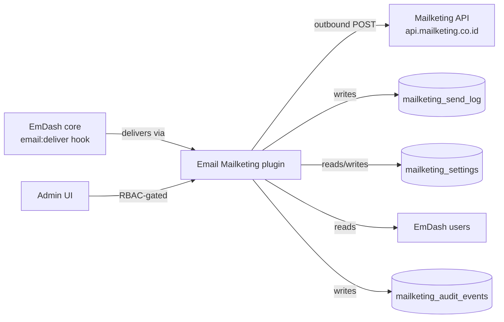
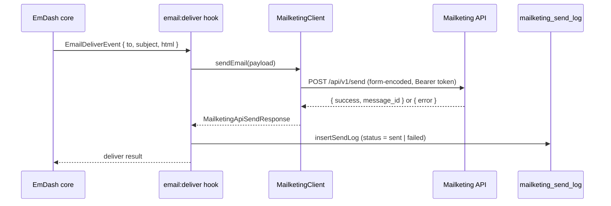
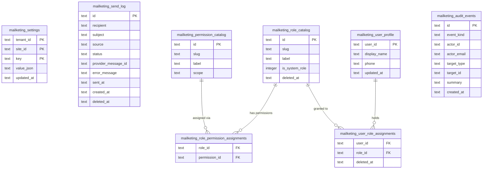
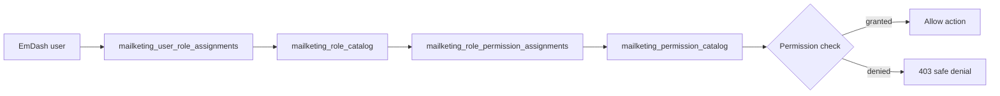
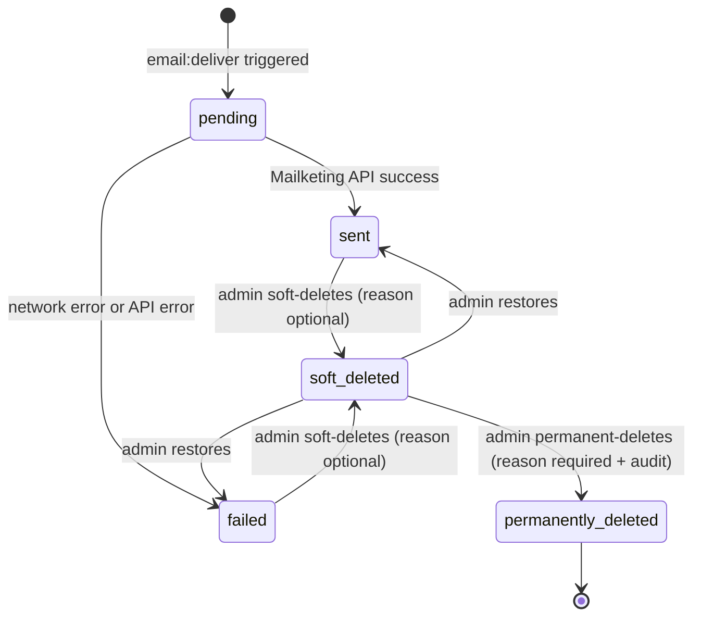

# Email Mailketing Plugin Technical PRD

## 1. Overview

This document describes the technical implementation requirements for `@awcms-micro/plugin-email-mailketing`.

The plugin registers as an EmDash `email:deliver` provider backed by the [Mailketing.co.id](https://mailketing.co.id) API. It owns a full send-log, plugin-scoped RBAC, user profile management, and an immutable audit trail. All behavior lives within the plugin boundary; no EmDash core is modified.

### Product Shape

```txt
Package:     @awcms-micro/plugin-email-mailketing
Plugin ID:   awcms-email-mailketing
Version:     0.2.0 (see package.json)
Locales:     en (source), id (full translation required)
Format:      native EmDash plugin descriptor
```



## 2. Capabilities

| Capability | Role |
|---|---|
| `email:provide` | Registers the plugin as the active `email:deliver` provider |
| `network:request` | Outbound HTTP to `api.mailketing.co.id` only |
| `users:read` | Reads EmDash users for role assignment and profile management |

The `email:deliver` hook receives an `EmailDeliverEvent` from EmDash and translates it into a Mailketing API send request. If `logOutbound` is enabled in settings, every attempt is written to `mailketing_send_log`.

## 3. Settings Schema

Stored in `mailketing_settings` keyed by `(tenant_id, site_id, key)`.

| Key | Type | Description |
|---|---|---|
| `apiToken` | `string` | Mailketing API bearer token (write-protected in admin) |
| `fromEmail` | `string` | Verified sender email address |
| `fromName` | `string` | Display name shown in the From field |
| `enabled` | `boolean` | Whether the provider is active and will deliver email |
| `logOutbound` | `boolean` | Whether to write each send attempt to `mailketing_send_log` |

Rules:

- `apiToken` is stored as a plain string in `mailketing_settings`. It is never embedded in source code or committed to git.
- The settings admin page must mask the `apiToken` on read (display as `••••` after save).
- The settings API route must require `mailketing.settings.manage` permission.

## 4. Email Delivery Contract



Rules:

- The send request payload uses `application/x-www-form-urlencoded` as required by the Mailketing API.
- `api_token` is sent as a form field, not as an HTTP Authorization header.
- A failed send (network error, non-2xx, or `success: false` in response body) logs status `failed` with the `errorMessage` field populated.
- A successful send logs status `sent` with `providerMessageId` from the API response.
- Send log entries are written only when `logOutbound` setting is `true`.

## 5. D1 Storage Model

All tables use the `mailketing_` prefix and are created by plugin migrations (`migrations/0001–0004`).



## 6. RBAC Model



System roles (seeded on plugin init, not deletable):

| Role slug | Default permissions |
|---|---|
| `mailketing_admin` | All `mailketing.*` permissions |
| `mailketing_viewer` | `mailketing.send_log.read`, `mailketing.audit.read` |

Plugin-defined permission slugs:

| Permission slug | Scope |
|---|---|
| `mailketing.settings.manage` | Read and write provider settings |
| `mailketing.send_log.read` | View send log entries |
| `mailketing.send_log.delete` | Soft-delete send log entries |
| `mailketing.send_log.restore` | Restore soft-deleted entries |
| `mailketing.send_log.permanent_delete` | Permanently delete (requires reason + audit) |
| `mailketing.roles.manage` | Create, edit, and delete custom roles |
| `mailketing.users.manage` | Assign and revoke roles for EmDash users |
| `mailketing.audit.read` | View the audit log |

## 7. Admin Pages

```mermaid
flowchart LR
  Sidebar[Admin Sidebar\nEmail Mailketing group] --> OV[/overview]
  Sidebar --> SL[/send-log]
  Sidebar --> ST[/settings]
  Sidebar --> US[/access/users]
  Sidebar --> RO[/access/roles]
  Sidebar --> PE[/access/permissions]
  Sidebar --> AU[/audit]
```

| Path | Description | Required permission |
|---|---|---|
| `/overview` | Stats dashboard (total sent, failed, last 24h, provider status) | `mailketing.send_log.read` |
| `/send-log` | Send log list with filters, soft delete, restore, permanent delete | `mailketing.send_log.read` |
| `/settings` | API token, sender config, enable/disable, logging toggle | `mailketing.settings.manage` |
| `/access/users` | Assign/revoke plugin roles to EmDash users | `mailketing.users.manage` |
| `/access/roles` | Create/edit/delete custom plugin-scoped roles | `mailketing.roles.manage` |
| `/access/permissions` | View plugin-defined permissions (read-only) | `mailketing.roles.manage` |
| `/audit` | Immutable audit event log | `mailketing.audit.read` |

Rules:

- The plugin's sidebar group must appear directly below the Dashboard, before default EmDash menus.
- All admin pages are RBAC-gated. Unauthenticated or unauthorized requests return 403.
- The permissions page is read-only. Permissions are defined in plugin source, not created at runtime.

## 8. Audit Event Model

Audit events are written to `mailketing_audit_events` and are immutable.

```mermaid
flowchart LR
  Action[Any mutable admin action] --> Audit[insertAuditEvent]
  Audit --> AuditTable[(mailketing_audit_events)]
  AuditTable --> AuditPage[/audit — read-only view]
```

Events to audit:

- `settings.updated`
- `send_log.soft_deleted`
- `send_log.restored`
- `send_log.permanent_deleted`
- `role.created`, `role.updated`, `role.deleted`
- `user_role.assigned`, `user_role.revoked`

Fields captured per event:

- `event_kind` — stable `snake_case` identifier
- `actor_id` + `actor_email` — EmDash user performing the action
- `target_type` + `target_id` — subject of the action
- `summary` — human-readable one-line description
- `detail` — JSON snapshot of the change
- `ip_address` + `user_agent` — from request headers

## 9. Public/Admin Boundary

This plugin exposes **no public-facing routes**. All plugin routes are admin-only.

Rules:

- Never expose send log data, settings, or user profile data to unauthenticated requests.
- Never expose raw API tokens or provider credentials in any response.
- Overview stats shown in the admin dashboard (`/overview`) must not be accessible from public Astro pages.

## 10. Send Log Lifecycle



Rules:

- Permanent delete requires an explicit `reason` string and writes an audit event before executing the delete.
- Soft-deleted entries remain in the database and are excluded from default list queries unless `includeDeleted: true`.
- Status values are stable: `pending | sent | failed | cancelled`.

## 11. Localization

- Plugin must provide complete translations in English (`en`) and Indonesian (`id`).
- Catalog locations:
  - `src/locales/en/messages.po`
  - `src/locales/id/messages.po`
- All admin UI labels, navigation items, toast messages, and error text must go through Lingui.
- Follow `awcmsmicro-dev/docs/awcms-micro/i18n-po-translation-standard.md`.
