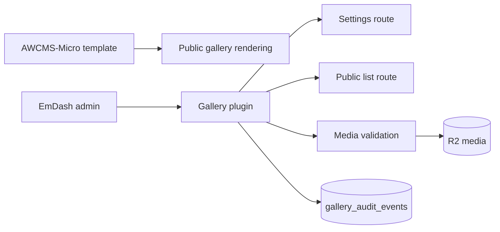

# AWCMS-Micro Gallery Plugin

This plugin adds AWCMS-Micro gallery management helpers while leaving EmDash core untouched.

## Purpose

- Public rendering lives in the AWCMS-Micro Astro templates.
- The `galleries` collection is seeded through the template seed file.
- The plugin provides settings, public list, media validation, and audit-ready hooks under `/_emdash/api/plugins/awcms-micro-gallery/*`.
- Audit events are stored in the plugin-owned `gallery_audit_events` collection.
- Cloudflare R2 remains the canonical media store. Cloudflare Images and Stream are optional flags, not hardcoded secrets.



## Routes

- `GET /_emdash/api/plugins/awcms-micro-gallery/settings`
- `POST /_emdash/api/plugins/awcms-micro-gallery/settings`
- `GET /_emdash/api/plugins/awcms-micro-gallery/public/list`
- `POST /_emdash/api/plugins/awcms-micro-gallery/media/validate`

## Admin Surface

The admin page is rendered through EmDash Block Kit at the plugin's `Gallery` admin page.

## Plugin I18N

User-facing admin labels, validation messages, and gallery route messages use Lingui-compatible PO catalogs at:

```txt
src/locales/en/messages.po
src/locales/id/messages.po
```

`src/locales/messages.ts` is the temporary compiled PO adapter consumed by the runtime until the plugin publish workflow generates it automatically. Keep the adapter synchronized with both PO catalogs when changing gallery copy.

## Technical PRD

For the implementation-level PRD, see `docs/TECHNICAL_PRD.md`.

## Naming Guidance

- package name: `@awcms-micro/plugin-gallery`
- recommended local repository or folder example: `awcms-micro-plugin-gallery`
- when used in this workspace, the approved downstream boundary is `packages/plugins/awcms-micro-gallery/`

## Boundary Rule

- keep gallery management behavior plugin-owned
- keep public gallery rendering template-owned
- do not move gallery behavior into EmDash core locations

## License

This package is licensed under the AW Non-Commercial License 1.0. See `LICENSE.md`.
