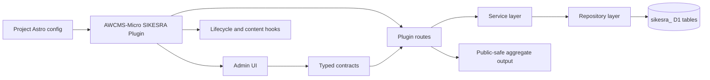
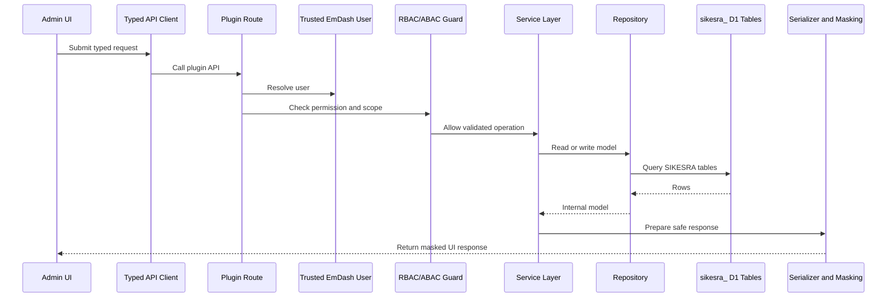

# AWCMS-Micro SIKESRA Plugin

This package is the AWCMS-Micro SIKESRA plugin for EmDash-compatible projects.

SIKESRA is a downstream AWCMS-Micro plugin for social, welfare, religious, institutional, document, verification, audit, import/export, RBAC/ABAC, typed frontend-backend-D1 integration, and public-safe aggregate workflows. It must remain isolated from EmDash core.

## Current Implementation Status

This package currently contains the SIKESRA plugin boundary, admin UI, routes, hooks, storage declarations, fixtures, and reference workflows. The production-grade implementation backlog is tracked through GitHub issues #119 through #143.

The plugin now uses the dedicated SIKESRA identity. New code should use `awcmsMicroSikesraPlugin`. The old `awcmsMicroExamplePlugin` export remains only as a temporary deprecated compatibility alias.



## GitHub Issue System

SIKESRA issues are execution contracts.

The issue standard is documented in:

```txt
docs/awcms-micro-github-issue-system.md
```

Diagram requirements are documented in:

```txt
docs/awcms-micro-mermaid-diagram-standard.md
awcmsmicro-dev/packages/plugins/awcms-micro-sikesra/docs/MERMAID_DIAGRAMS.md
```

Sequenced issue title pattern:

```txt
[SIKESRA][SEQ-XX][TYPE][PRIORITY] Title
```

Rules:

- `SEQ` controls execution order.
- `P0/P1/P2/P3` controls risk and urgency.
- Suffixes such as `SEQ-01A` or `SEQ-07A` insert urgent or dependency work without renumbering the whole backlog.
- Do not start later workflow issues before earlier identity, route, UI/UX, naming, guardrail, migration, repository, integration-contract, field-standard, RBAC/ABAC, and audit foundations are ready.
- Update SIKESRA Mermaid diagrams when an issue changes architecture, database/D1, UI/UX flow, frontend-backend integration, RBAC/ABAC, security, deployment, migration, or data preservation.

## Purpose

- keep SIKESRA-specific governance, registry, verification, access, audit, import/export, document, and ABAC behavior inside an isolated plugin boundary;
- provide an EmDash-compatible SIKESRA plugin without forking or modifying EmDash core;
- use dedicated SIKESRA data boundaries with `sikesra_` table and collection prefixes;
- support future production D1 tables and Cloudflare R2-compatible document metadata;
- integrate admin UI, API routes, service layer, repository layer, serializers, and D1 tables through typed contracts;
- preserve SIKESRA data across EmDash updates, dependency reinstalls, workspace rebuilds, local template rebuilds, and Cloudflare rebuilds.

## Source of Truth

Before changing this plugin, read:

```txt
README.md
AGENTS.md
docs/awcms-micro-github-issue-system.md
docs/awcms-micro-mermaid-diagram-standard.md
docs/awcms-micro-sikesra-plugin-governance.md
awcmsmicro-dev/packages/plugins/awcms-micro-sikesra/docs/IMPLEMENTATION_GOVERNANCE.md
awcmsmicro-dev/packages/plugins/awcms-micro-sikesra/docs/TECHNICAL_PRD.md
awcmsmicro-dev/packages/plugins/awcms-micro-sikesra/docs/MERMAID_DIAGRAMS.md
awcmsmicro-dev/packages/plugins/awcms-micro-sikesra/docs/UI_UX_DESIGN_STANDARD.md
```

Current ordered backlog:

| Order | Issue | Purpose                                                                |
| ----: | ----: | ---------------------------------------------------------------------- |
|     1 |  #140 | Final plugin identity and export name                                  |
|     2 |  #141 | Admin dashboard route bug fix                                          |
|     3 |  #142 | End-to-end admin UI/UX design system                                   |
|     4 |  #119 | Dedicated `sikesra_` D1 table and collection naming policy             |
|     5 |  #121 | D1 table prefix validation test                                        |
|     6 |  #136 | EmDash update/rebuild compatibility guardrails                         |
|     7 |  #137 | Data preservation guardrails                                           |
|     8 |  #120 | SIKESRA D1 migration framework                                         |
|     9 |  #122 | D1 repository layer                                                    |
|    10 |  #143 | Typed frontend-backend-D1 integration contract                         |
|    11 |  #123 | Core D1 tables for settings, data types, and regions                   |
|    12 |  #135 | Standard personal and non-personal fields                              |
|    13 |  #124 | Migration from KV/plugin storage to D1                                 |
|    14 |  #125 | Registry D1 tables for all 8 data modules                              |
|    15 |  #132 | SIKESRA RBAC/ABAC with EmDash user assignment                          |
|    16 |  #133 | Canonical D1 audit table and redaction policy                          |
|    17 |  #126 | Registry list/save route refactor to D1                                |
|    18 |  #127 | D1-backed 20-digit SIKESRA ID sequence service                         |
|    19 |  #128 | Verification D1 tables and routes                                      |
|    20 |  #129 | Document D1 tables and secure R2 metadata workflow                     |
|    21 |  #130 | D1-backed staged CSV/XLSX import workflow                              |
|    22 |  #131 | Duplicate detection and duplicate decisions                            |
|    23 |  #134 | D1 export job and controlled report/export workflow                    |
|    24 |  #138 | Dynamic custom attributes by data type, subtype, entity, or SIKESRA ID |
|    25 |  #139 | Full CRUD and highest-admin governance                                 |

## What It Provides Now

- plugin descriptor factory and plugin identity/versioning;
- EmDash registry manifest scaffolding in `emdash-plugin.jsonc`;
- capabilities, allowed hosts, storage declarations, and KV/plugin-storage compatibility conventions;
- plugin-owned storage names prefixed with `sikesra_`;
- audit events stored in the physical D1 table `sikesra_audit_events` where available;
- protected routes plus a public-safe status route;
- lifecycle hooks: install, activate, deactivate, uninstall;
- content hooks: before/after save, before/after delete, after publish, after unpublish;
- media hooks: before upload and after upload;
- cron hook scheduling and state recording;
- page metadata contribution;
- admin pages, dashboard widgets, settings schema, and field widget contribution;
- SIKESRA-grade reference admin screens for registry, verification, documents, import, reports, access, ABAC, and audit;
- admin UI styling using Kumo semantic tokens for readable light/dark mode;
- Portable Text block contribution;
- audit logging and content snapshot examples;
- access-rights catalog with role matrix and effective access preview;
- ABAC policy management with attribute catalogs, policy simulation, and protected demo route;
- SIKESRA-inspired registry fixtures for reference data modeling and public-safe aggregate examples;
- sandbox-compatible server-side entry in `src/sandbox.ts`.

## Core Governance Rules

### Plugin boundary

Keep plugin-owned behavior in this package. Do not move SIKESRA behavior into EmDash core packages.

### D1 table and collection prefix

All SIKESRA-owned D1 tables and plugin storage collections must use the `sikesra_` prefix.

Examples:

```txt
sikesra_registry_entities
sikesra_person_profiles
sikesra_supporting_documents
sikesra_verification_events
sikesra_audit_events
sikesra_user_role_assignments
sikesra_abac_policy_rules
sikesra_custom_attribute_definitions
sikesra_delete_requests
```

### Production data source

Dedicated D1 tables are the target production source of truth once the D1 migration issues are implemented. Plugin storage/KV may be used only as the current compatibility layer, migration source, or temporary fallback.

### Typed integration contract

Issue #143 defines the target integration flow:



### EmDash user identity

SIKESRA must reference trusted EmDash users. It must not create a duplicate user system and must not delete or mutate EmDash core user records.

SIKESRA-specific data belongs in SIKESRA tables:

```txt
sikesra_role_catalog
sikesra_permission_catalog
sikesra_user_role_assignments
sikesra_user_scope_assignments
sikesra_abac_policy_rules
```

### Field standards

All personal modules must distinguish KTP address and domicile address:

```txt
alamat_ktp_*
alamat_domisili_*
alamat_domisili_sama_dengan_ktp
```

KTP address and domicile address are sensitive personal data. Public routes must not expose them.

### Public aggregate

Public routes may expose only public-safe aggregate data. Personal, sensitive personal, restricted, raw document, and internal storage data must never be returned from public APIs.

### Lifecycle governance

Soft delete is the default. High-impact lifecycle actions must follow the governance workflow defined in issue #139.

### Update/rebuild safety

SIKESRA files, data, D1 tables, R2 metadata, EmDash user references, assignments, ABAC policies, audit events, import staging, custom attributes, and lifecycle governance data must survive EmDash update/rebuild workflows.

## Native And Sandbox Boundaries

- `src/index.ts`: trusted/native plugin entry used when the plugin needs React admin pages, widgets, and field widgets.
- `src/sandbox.ts`: server-side hooks and routes in the standard sandbox-compatible format.
- `src/admin.tsx`: native-only admin UI features.
- `src/runtime.ts`: storage, routes, hooks, manifest, and route wiring.
- `src/navigation.ts`: navigation model and EmDash adaptation.
- `src/permissions.ts`: permission constants and catalog surface.
- `src/contracts/`: target shared frontend-backend API contracts from #143.
- `src/admin/api/`: target typed admin API client from #143.
- `src/services/`: target service layer from #143.
- `src/serializers/`: target serializer and masking layer from #143.
- `src/db/`: target D1 repository layer from #122.

This separation keeps the server-side behavior portable while making native-only surfaces explicit.

## Safe Enablement

This plugin is intentionally not registered globally in EmDash core. Enable it from project-level configuration through the normal `plugins: []` configuration path.

Local template example after issue #140:

```ts
import { awcmsMicroSikesraPlugin } from "@awcms-micro/plugin-sikesra";

plugins: [awcmsMicroSikesraPlugin({ tenantId: "t-local-dev" })];
```

During the transition, the old `awcmsMicroExamplePlugin` alias may still exist but should not be used in new code.

## Standalone Usage

1. Copy this folder into its own repository or into a local packages directory in your project.
2. Run `pnpm install` in the plugin repository, or from the workspace root if you placed it inside a pnpm workspace.
3. Run `pnpm build` to produce the `dist/` output.
4. Review `emdash-plugin.jsonc` and ensure production SIKESRA metadata is set before publishing.
5. If you want repository or security metadata in the published manifest, add your own `repo` and `security` fields to `emdash-plugin.jsonc` before publishing.
6. Set `repository` and `homepage` metadata in `package.json` to match the real source location before publishing, including monorepo subdirectory metadata when applicable.
7. Reference the plugin from your EmDash project as a local package or publish it to your own registry.

For an end-to-end standalone site integration example, see `docs/STANDALONE_CONSUMPTION.md`.
For a technical implementation PRD, see `docs/TECHNICAL_PRD.md`.
For SIKESRA implementation diagrams, see `docs/MERMAID_DIAGRAMS.md`.
For release-oriented checks, see `docs/INTERNAL_PUBLISH_CHECKLIST.md`.
For the SIKESRA reference data model and fixtures, see `docs/SIKESRA_REFERENCE_DATA_MODEL.md`.
For the current PO-backed admin, navigation, runtime metadata, and temporary adapter coverage, see `docs/I18N_MIGRATION.md`.

## Demonstrated Routes And Hooks

- Public route: `public/status`
- Registry routes: `registry/list`, `registry/save`, `registry/sikesra-id/correct`, `registry/archive/list`, `registry/soft-delete`, `registry/restore`
- Documents routes: `documents/list`, `documents/save`, `documents/access`
- Import routes: `import/create`, `import/promote`
- Duplicate-review routes: `duplicates/decide`
- Export routes: `exports/create`, `exports/list`
- Custom attribute routes: `custom-attributes/definitions/list`, `custom-attributes/definitions/save`, `custom-attributes/values/list`, `custom-attributes/values/save`
- Verification routes: `verification/list`, `verification/advance`, `verification/reject`
- Settings routes: `settings/get`, `settings/save`, `regions/get`, `regions/save`, `local-regions/get`, `local-regions/save`, `data-types/get`, `data-types/save`
- Audit routes: `audit/list`
- CRUD governance routes: `crud/permanent-delete/request`, `crud/permanent-delete/requests/list`, `crud/permanent-delete/approve`, `crud/permanent-delete/execute`
- Access-rights routes: `access/permissions/list`, `access/permissions/save`, `access/roles/list`, `access/roles/save`, `access/users/list`, `access/users/save`, `access/scopes/list`, `access/scopes/save`, `access/matrix/get`, `access/matrix/save`, `access/preview`, `access/health`
- ABAC routes: `abac/attributes/list`, `abac/attributes/save`, `abac/subjects/list`, `abac/subjects/save`, `abac/resources/list`, `abac/resources/save`, `abac/policies/list`, `abac/policies/save`, `abac/preview`, `abac/enforce-demo`, `abac/health`
- Dashboard routes: `overview/summary`; compatibility alias: `dashboard/summary`
- Hooks: lifecycle, content, media, cron, and `page:metadata`

## Access and ABAC Boundaries

The current access-rights and ABAC surfaces are plugin-owned. They must be integrated with trusted EmDash user identity according to issue #132 before being considered production-grade.

Rules:

- do not replace EmDash core authorization globally;
- enforce SIKESRA RBAC/ABAC inside SIKESRA routes;
- store SIKESRA role/scope/ABAC data in `sikesra_` tables;
- audit sensitive decisions;
- explicit deny wins.

## Testing

From this package directory:

```bash
pnpm typecheck
pnpm test
pnpm build
```

After issues #136, #137, and #143 are implemented, also run the SIKESRA guardrail and integration-contract scripts documented in `docs/IMPLEMENTATION_GOVERNANCE.md`.

## License

This package is licensed under the AW Non-Commercial License 1.0. See `LICENSE.md`.
