# SIKESRA Mermaid Diagram Recommendations

This document defines the recommended Mermaid diagrams for implementing the AWCMS-Micro SIKESRA plugin.

It follows the repository-wide standard in:

```txt
docs/awcms-micro-mermaid-diagram-standard.md
```

## 1. Plugin Boundary and EmDash Compatibility

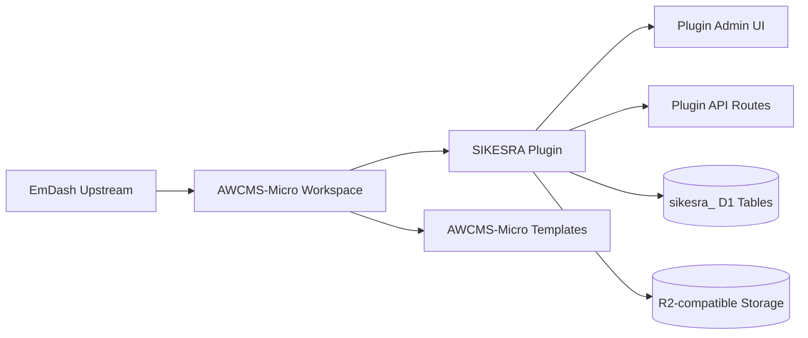

Purpose:

- show that SIKESRA remains downstream;
- show that custom logic belongs in plugin/template boundaries;
- prevent EmDash core modification for SIKESRA-specific behavior.

## 2. Admin UI to Backend to D1 Flow

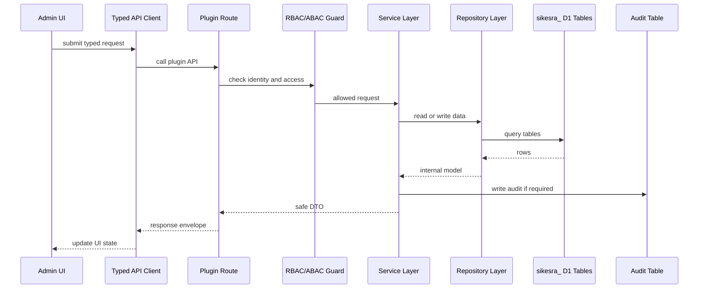

Purpose:

- support issue #143;
- prevent raw D1 rows from being returned directly to UI;
- keep authorization and serialization clear.

## 3. Logical SIKESRA D1 ERD

```mermaid
erDiagram
  sikesra_registry_entities ||--o{ sikesra_person_profiles : links
  sikesra_field_standards ||--o{ sikesra_registry_entities : classifies
  sikesra_registry_entities ||--o{ sikesra_rumah_ibadah_details : details
  sikesra_registry_entities ||--o{ sikesra_lembaga_keagamaan_details : details
  sikesra_registry_entities ||--o{ sikesra_pendidikan_keagamaan_details : details
  sikesra_registry_entities ||--o{ sikesra_lks_details : details
  sikesra_registry_entities ||--o{ sikesra_guru_agama_details : details
  sikesra_registry_entities ||--o{ sikesra_anak_yatim_details : details
  sikesra_registry_entities ||--o{ sikesra_disabilitas_details : details
  sikesra_registry_entities ||--o{ sikesra_lansia_terlantar_details : details
  sikesra_registry_entities ||--o{ sikesra_supporting_documents : has
  sikesra_file_objects ||--o{ sikesra_supporting_documents : stores
  sikesra_registry_entities ||--|| sikesra_verification_stage_state : state
  sikesra_registry_entities ||--o{ sikesra_verification_events : verifies
  sikesra_import_mapping_templates ||--o{ sikesra_import_batches : maps
  sikesra_import_batches ||--o{ sikesra_import_staging_rows : stages
  sikesra_duplicate_candidates ||--o{ sikesra_duplicate_decisions : decides
  sikesra_export_jobs ||--o{ sikesra_audit_events : audits
  sikesra_custom_attribute_definitions ||--o{ sikesra_custom_attribute_values : defines
  sikesra_custom_attribute_definitions ||--o{ sikesra_custom_attribute_change_events : changes
  sikesra_registry_entities ||--o{ sikesra_custom_attribute_values : extends
  sikesra_delete_requests ||--o{ sikesra_delete_snapshots : snapshots
  sikesra_delete_requests ||--o{ sikesra_delete_approvals : approves
  sikesra_delete_requests ||--o{ sikesra_delete_events : records
  sikesra_registry_entities ||--o{ sikesra_audit_events : audits

  sikesra_permission_catalog ||--o{ sikesra_role_permission_assignments : grants
  sikesra_role_catalog ||--o{ sikesra_role_permission_assignments : has
  sikesra_role_catalog ||--o{ sikesra_user_role_assignments : assigned
  sikesra_user_role_assignments }o--|| emdash_users : references
  sikesra_abac_policy_rules ||--o{ sikesra_audit_events : evaluated
```

Purpose:

- guide issues #120, #122, #123, #125, #132, #133, and #138;
- show SIKESRA-owned tables versus EmDash user references.

## 4. Registry Create/Edit Wizard Flow

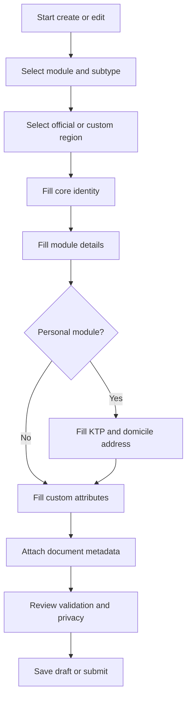

Purpose:

- guide UI/UX issue #142;
- ensure field standard #135 is visible in the form flow.

## 5. Verification State Flow

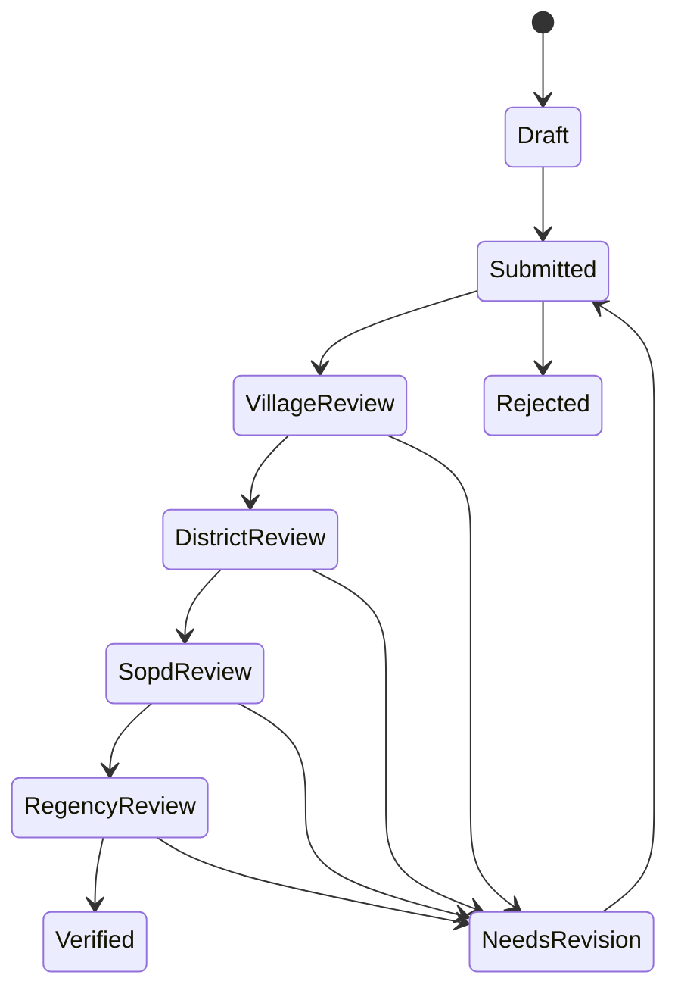

Purpose:

- guide issue #128;
- show how verification stages should be represented in UI and D1.

## 6. RBAC and ABAC Decision Flow

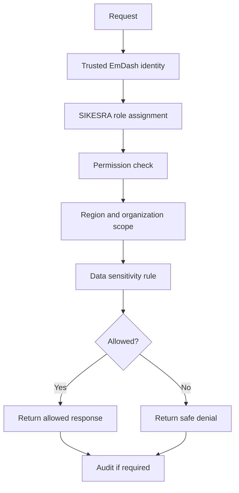

Purpose:

- guide issue #132;
- keep user assignment tied to EmDash identity;
- support audit/redaction issue #133.

## 7. Import Staging Workflow

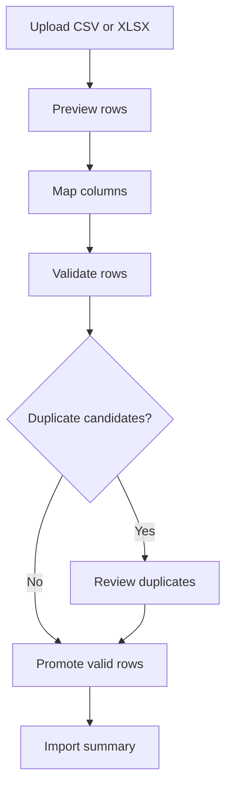

Purpose:

- guide issue #130;
- prevent direct import into registry without staging.

## 8. Export and Report Safety Workflow

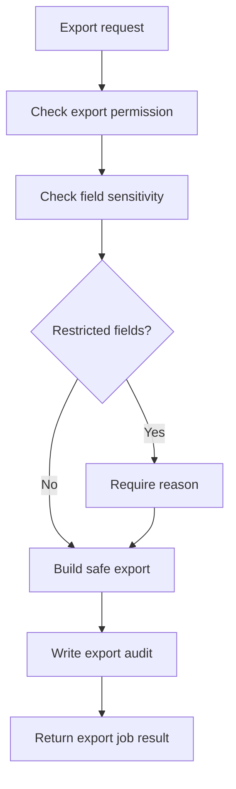

Purpose:

- guide issue #134;
- ensure sensitive field handling is explicit.

## 9. Custom Attribute Extension Flow

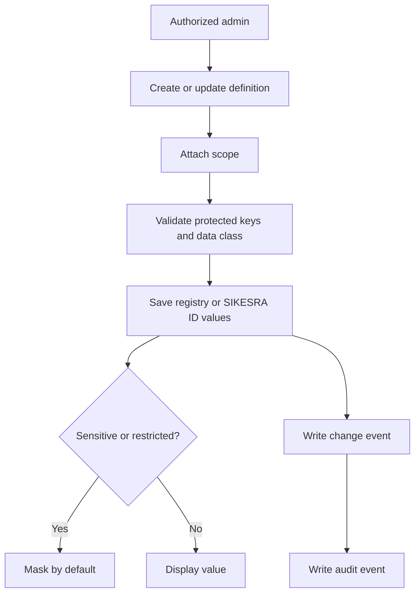

Purpose:

- guide issue #138;
- keep fixed field standards canonical while dynamic values stay in `sikesra_custom_attribute_*` tables;
- show where masking and audit are applied.

## 10. Permanent Delete Governance Flow

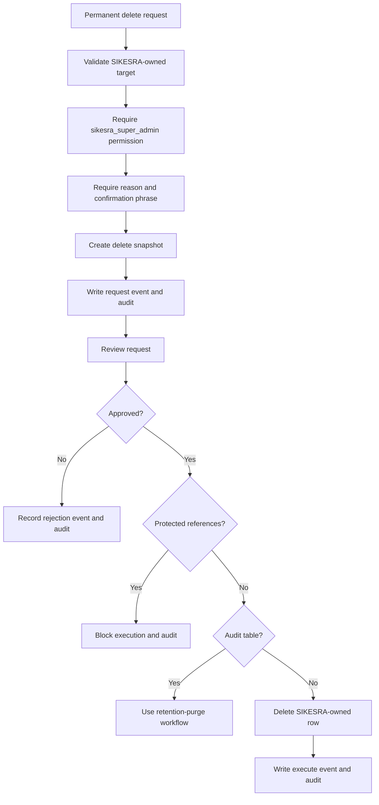

Purpose:

- guide issue #139;
- show permanent delete as request-first, snapshot-first, approval-gated, and reference-checked;
- keep EmDash core users outside SIKESRA destructive operations.

## 11. Data Preservation After Rebuild

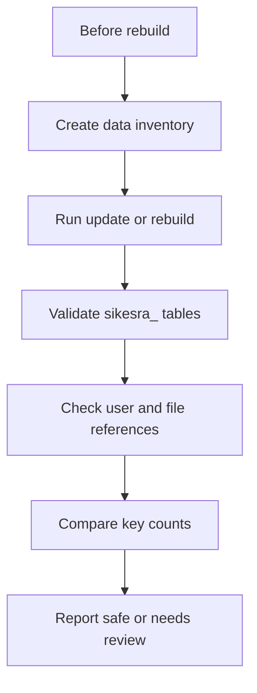

Purpose:

- guide issue #137;
- keep data safety visible during EmDash update and rebuild.

## 12. Cloudflare D1/R2 Topology

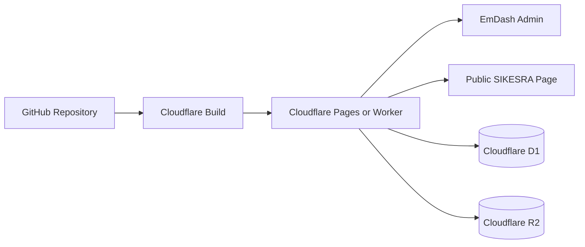

Purpose:

- guide Cloudflare template validation;
- show how admin, public, D1, and R2 connect.

## 13. Maintenance Rule

When a SIKESRA issue changes architecture, database, UI/UX, integration, security, deployment, migration, or data preservation behavior, update the relevant diagram in this document or explain why no diagram update is required.
