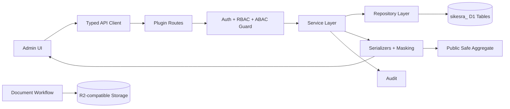
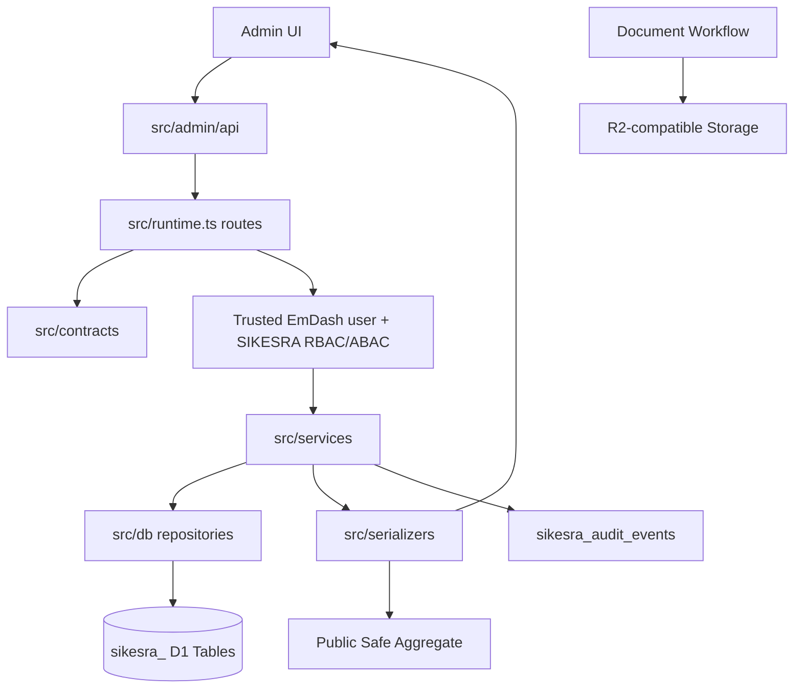

# AWCMS-Micro SIKESRA Technical PRD

## 1. Overview

This document describes the technical implementation requirements for `@awcms-micro/plugin-sikesra`.

The plugin is an EmDash-compatible AWCMS-Micro downstream plugin for SIKESRA workflows. It must remain plugin-owned and must not move responsibilities into EmDash core.

SIKESRA covers social, welfare, religious, institutional, document, verification, audit, import/export, RBAC/ABAC, typed frontend-backend-D1 integration, custom attribute, and public-safe aggregate workflows.

For diagram standards, read:

```txt
docs/awcms-micro-mermaid-diagram-standard.md
awcmsmicro-dev/packages/plugins/awcms-micro-sikesra/docs/MERMAID_DIAGRAMS.md
```

### Product Shape

- package: `@awcms-micro/plugin-sikesra`
- plugin id: `awcms-micro-sikesra`
- target name: `AWCMS-Micro SIKESRA Plugin`
- target factory export: `awcmsMicroSikesraPlugin`
- temporary deprecated alias: `awcmsMicroExamplePlugin`
- package version: current package version in `package.json`
- localization: `en` default, `id` supported
- UI system: Kumo components for admin surfaces
- upstream compatibility: EmDash-compatible plugin boundary; no EmDash core fork



## 2. GitHub Issue System

This repository uses sequenced GitHub issues as implementation contracts.

Issue title pattern:

```txt
[PRODUCT][SEQ-XX][TYPE][PRIORITY] Title
```

For the repository issue standard, see:

```txt
docs/awcms-micro-github-issue-system.md
```

Issue #144 adds repository-wide Mermaid diagram standards. SIKESRA-specific implementation diagrams are maintained in `docs/MERMAID_DIAGRAMS.md` inside this plugin package.

## 3. Issue Backlog Alignment

This PRD is aligned with GitHub issues #119 through #144.

| Order | Issue | Requirement Area                               |
| ----: | ----: | ---------------------------------------------- |
|     1 |  #140 | final plugin identity                          |
|     2 |  #141 | admin dashboard route bug fix                  |
|     3 |  #142 | admin UI/UX design system                      |
|     4 |  #119 | `sikesra_` naming policy                       |
|     5 |  #121 | table-prefix validation                        |
|     6 |  #136 | EmDash update/rebuild compatibility            |
|     7 |  #137 | data preservation                              |
|     8 |  #120 | D1 migration framework                         |
|     9 |  #122 | D1 repository layer                            |
|    10 |  #143 | typed frontend-backend-D1 integration contract |
|    11 |  #123 | settings, regions, data types                  |
|    12 |  #135 | personal and non-personal field standards      |
|    13 |  #124 | KV/plugin-storage to D1 migration              |
|    14 |  #125 | registry tables for 8 modules                  |
|    15 |  #132 | EmDash user-linked SIKESRA RBAC/ABAC           |
|    16 |  #133 | audit redaction                                |
|    17 |  #126 | registry routes to D1                          |
|    18 |  #127 | 20-digit ID sequence                           |
|    19 |  #128 | verification workflow                          |
|    20 |  #129 | documents and R2 metadata                      |
|    21 |  #130 | staged import                                  |
|    22 |  #131 | duplicate detection                            |
|    23 |  #134 | export workflow                                |
|    24 |  #138 | dynamic custom attributes                      |
|    25 |  #139 | CRUD and highest-admin governance              |
|    26 |  #144 | Mermaid diagram standards                      |

Do not implement later workflow issues before the earlier identity, route, UI/UX, naming, guardrail, migration, repository, typed integration, field-standard, RBAC/ABAC, audit, and diagram foundations are ready.

## 4. Functional Requirements

### Core Features

- expose a native plugin entry and a resolved plugin entry;
- fix admin dashboard route safety so admin actions stay inside the plugin admin route;
- provide grouped admin navigation placed above default EmDash menus where supported;
- provide consistent admin UI/UX standards for all SIKESRA pages;
- provide admin pages, widgets, and field widgets;
- manage 8 core SIKESRA data modules;
- support standard personal and non-personal fields;
- support separate KTP and domicile address fields for personal modules;
- support dynamic custom attributes by data type, subtype, entity, and 20-digit SIKESRA ID;
- provide registry CRUD and workflow status management;
- provide 20-digit SIKESRA ID generation;
- provide level-based verification;
- provide document metadata and controlled access workflow;
- provide staged CSV/XLSX import;
- provide controlled export and reporting;
- provide duplicate detection;
- provide access-rights management and ABAC management;
- reference EmDash users for SIKESRA role/scope assignments;
- provide audit management and redaction;
- provide a public-safe aggregate route;
- support install, activate, deactivate, and uninstall lifecycle hooks;
- record SIKESRA-owned data in SIKESRA-owned namespaces/tables;
- integrate admin UI, API routes, services, repositories, serializers, and D1 through typed contracts;
- maintain Mermaid diagrams for architecture, database, UI/UX, integration, RBAC/ABAC, import/export, data preservation, and deployment.

### Non-Functional Requirements

- all user-facing strings must be localized;
- admin layout must remain RTL-safe;
- sensitive decisions must be auditable;
- validation must be deterministic;
- changes must remain additive unless a breaking package bump is intentional;
- D1 migrations must be data-preserving by default;
- plugin behavior must survive EmDash update/rebuild workflows;
- API response envelopes must be consistent;
- UI state must handle loading, empty, validation error, permission denied, ABAC denied, server error, and stale data.

### Security Requirements

- no EmDash core auth fork;
- no duplicate SIKESRA-only user system;
- no secret values in tracked source or docs;
- no unchecked public route exposure beyond explicit public-safe aggregate endpoints;
- no public leakage of personal, sensitive personal, restricted, address, document, or internal storage data;
- no high-risk migration without explicit approval, backup, and recovery notes;
- no high-impact lifecycle action outside the highest-admin governance workflow;
- no raw D1 row returned directly to admin or public UI.

## 5. Core Data Modules

The plugin must support these modules:

```txt
rumah_ibadah
lembaga_keagamaan
pendidikan_keagamaan
lks
guru_agama
anak_yatim
disabilitas
lansia_terlantar
```

Each module must define:

```txt
entity_type
subtype_code
required fields
optional fields
field classifications
validation rules
list columns
detail sections
import mapping
export policy
public aggregate policy
```

## 6. Field Classification

Every field must be classified as one of:

```txt
non_personal
personal
sensitive_personal
restricted
```

Field metadata must include:

```txt
key
label
module
fieldGroup
dataClass
required
dataType
storageTable
importable
exportable
publicSafe
maskByDefault
validationRules
```

### Personal Address Standard

Personal modules must distinguish KTP address and domicile address.

Required KTP address fields:

```txt
alamat_ktp_province_code
alamat_ktp_regency_code
alamat_ktp_district_code
alamat_ktp_village_code
alamat_ktp_detail
alamat_ktp_rt
alamat_ktp_rw
alamat_ktp_postal_code
```

Required domicile address fields:

```txt
alamat_domisili_sama_dengan_ktp
alamat_domisili_province_code
alamat_domisili_regency_code
alamat_domisili_district_code
alamat_domisili_village_code
alamat_domisili_detail
alamat_domisili_rt
alamat_domisili_rw
alamat_domisili_postal_code
```

KTP address and domicile address are sensitive personal data.

## 7. Architecture

### Implementation Files

- `src/index.ts`: plugin descriptor and resolved plugin entry
- `src/admin.tsx`: native admin surface
- `src/runtime.ts`: storage, routes, hooks, and manifest definitions
- `src/navigation.ts`: navigation models and adapters
- `src/permissions.ts`: permission helpers and catalog
- `src/audit.ts`: audit recording helpers
- `src/sandbox.ts`: sandbox-compatible server-side entry
- `src/contracts/`: target typed request/response contracts from issue #143
- `src/admin/api/`: target typed admin API client from issue #143
- `src/services/`: target service layer from issue #143
- `src/serializers/`: target serializer and masking layer from issue #143
- `src/db/`: target D1 repository layer after issue #122
- `migrations/`: target SIKESRA D1 migration folder after issue #120
- `docs/MERMAID_DIAGRAMS.md`: required diagram reference for SIKESRA implementation work
- `docs/UI_UX_DESIGN_STANDARD.md`: admin UI/UX standard from issue #142

### Target Data Flow



## 8. Frontend-Backend-D1 Integration Contract

Issue #143 defines the required integration contract.

Target flow:

```txt
Admin UI → typed API client → plugin route → trusted EmDash user → SIKESRA RBAC/ABAC guard → service layer → repository layer → sikesra_ D1 tables → serializer/masking → Admin UI
```

Contract requirements:

- frontend and backend share typed request/response definitions where practical;
- admin API client centralizes plugin API calls;
- route handlers validate typed payloads;
- services implement business workflow;
- repositories perform D1 access;
- serializers return safe view models;
- public serializers are separate from admin serializers;
- API response envelopes are consistent;
- list endpoints share pagination, filtering, and sorting conventions;
- form validation uses field standards and custom attribute definitions.

## 9. Database and Storage

### SIKESRA D1 Table and Collection Naming Rule

All SIKESRA-owned D1 tables and plugin storage collections MUST use the `sikesra_` prefix.

Required examples include:

```txt
sikesra_registry_entities
sikesra_supporting_documents
sikesra_verification_events
sikesra_audit_events
sikesra_import_batches
sikesra_export_jobs
```

Do not create SIKESRA production tables without the `sikesra_` prefix. Do not store canonical SIKESRA business data in generic EmDash tables, generic plugin tables, or shared plugin collections unless it is only for compatibility, migration, or temporary fallback. The canonical production source of truth for SIKESRA must be dedicated D1 tables with the `sikesra_` prefix.

### Current Compatibility Layer

The plugin currently uses plugin-owned storage collections and selected D1 support for audit compatibility. Existing collection names must remain prefixed with `sikesra_`.

### Target Production Source of Truth

Dedicated D1 tables with `sikesra_` prefix are the target production source of truth.

Required table categories:

```txt
settings and catalogs
regions and custom regions
data types and subtypes
field standards
registry entities
person profiles
module detail tables
20-digit ID sequences and history
documents and file metadata
verification state and events
import batches and staging rows
duplicate candidates and decisions
export jobs
audit events
RBAC and ABAC configuration
custom attributes and values
lifecycle governance records
```

Minimum business table fields:

```txt
tenant_id
site_id
created_at
updated_at
deleted_at
created_by
updated_by
```

### Database Diagrams

The logical D1 ERD and related workflow diagrams are maintained in:

```txt
awcmsmicro-dev/packages/plugins/awcms-micro-sikesra/docs/MERMAID_DIAGRAMS.md
```

The SIKESRA D1 migration runner notes are maintained in:

```txt
awcmsmicro-dev/packages/plugins/awcms-micro-sikesra/docs/MIGRATIONS.md
```

D1/database implementation issues should update that file when relationships, table ownership, repository flows, or data preservation behavior changes.

### Storage Rules

- use `sikesra_` prefix for every SIKESRA-owned D1 table and plugin collection;
- do not write SIKESRA canonical business data to EmDash core tables;
- do not depend on generic plugin storage as production source of truth once D1 migration is implemented;
- keep D1 migrations idempotent and data-preserving;
- use R2-compatible storage organization for documents.

Document storage organization:

```txt
tenants/{tenant_id}/sites/{site_id}/modules/sikesra/{classification}/{year}/{month}/{safe_filename}
```

## 10. RBAC and ABAC

SIKESRA must use EmDash users as the trusted identity source.

Rules:

- do not create duplicate SIKESRA users;
- do not mutate or delete EmDash core user records;
- store SIKESRA role/scope assignments in `sikesra_` tables;
- use trusted EmDash auth/session context passed through private plugin route context for production identity;
- client-provided SIKESRA user headers may not be trusted in production and may not override trusted route context identity in development tests.

Route enforcement must include:

```txt
trusted EmDash user identity
SIKESRA role assignment
SIKESRA permission
ABAC region scope
ABAC organization/module scope
data sensitivity/masking rule
audit logging
```

## 11. Custom Attributes

Custom attributes extend fixed field standards without replacing them.

Required tables:

```txt
sikesra_custom_attribute_definitions
sikesra_custom_attribute_values
sikesra_custom_attribute_change_events
```

Supported scopes:

```txt
global
entity_type
subtype
registry_entity
sikesra_id_20
region_scope
organization_scope
program_scope
```

Custom attributes must not override protected system fields.

## 12. CRUD and Lifecycle Governance

Every feature group must define:

```txt
create
read_list
read_detail
update
soft_delete
restore
archive
permanent_delete
```

Soft delete is default.

High-impact lifecycle actions require:

```txt
sikesra_super_admin
reason
confirmation
snapshot
audit
integrity check
```

Lifecycle governance must never affect EmDash core users.

## 13. Public Aggregate

Public aggregate must be public-safe.

Never expose publicly:

```txt
NIK/KIA
nomor_kk
phone/email
KTP address
domicile address
exact residential coordinates
health/disability details
welfare vulnerability notes
raw document metadata
internal storage details
restricted custom attributes
```

Small-cell suppression must be applied to vulnerable groups.

## 14. Update and Rebuild Safety

The plugin must remain safe across:

```txt
EmDash upstream update
dependency reinstall
workspace rebuild
local template rebuild
Cloudflare template rebuild
D1 migration rerun
template regeneration
```

Guardrail scripts planned by issues #136 and #137:

```txt
awcms:sikesra:check-boundary
awcms:sikesra:check-d1-prefix
awcms:sikesra:check-routes
awcms:sikesra:check-admin-pages
awcms:sikesra:check-data-boundary
awcms:sikesra:check-user-references
awcms:sikesra:check-file-links
awcms:sikesra:backup-inventory
awcms:sikesra:validate-data-after-rebuild
```

## 15. User Flow

### Operator Flow

1. install or enable the package through normal EmDash plugin configuration;
2. assign SIKESRA roles/scopes to EmDash users;
3. configure regions, data types, field standards, and custom attributes;
4. create registry records for the 8 SIKESRA modules;
5. upload or link supporting documents;
6. run staged imports where needed;
7. verify records by level and scope;
8. review duplicate candidates;
9. run reports and controlled exports;
10. review audit logs and public aggregate output.

### Reviewer Flow

1. inspect plugin boundaries and manifests;
2. confirm D1 table names use `sikesra_` prefix;
3. confirm no EmDash core modification is required;
4. confirm public routes expose only aggregate-safe data;
5. confirm trusted EmDash user identity integration;
6. confirm typed UI-backend-D1 contracts;
7. confirm audit, masking, data preservation, and rebuild guardrails;
8. confirm Mermaid diagrams are updated when architecture, database, UI/UX, integration, security, deployment, migration, or data preservation behavior changes.

## 16. Testing Constraints

Tests must cover:

- plugin descriptor and identity;
- admin route safety;
- UI/UX component state where practical;
- typed API envelope shape;
- `sikesra_` prefix validation;
- route registration;
- admin page registration;
- RBAC and ABAC decision behavior;
- public aggregate safety;
- field standard validation;
- custom attribute validation;
- import staging;
- export policy;
- CRUD soft delete/restore/permanent delete denial;
- data preservation after rebuild where fixtures are available.

## 17. Acceptance Criteria

The plugin is production-ready only when:

- plugin identity is finalized;
- admin dashboard routes stay inside plugin admin routes;
- UI/UX standards are implemented consistently;
- typed frontend-backend-D1 contract exists;
- all canonical tables use `sikesra_` prefix;
- D1 migrations and repository layer exist;
- all 8 modules support create, list, detail, update, verification, and reporting;
- EmDash users can receive SIKESRA roles and scopes;
- public aggregate remains privacy-safe;
- import/export/document workflows are controlled and audited;
- custom attributes are supported safely;
- CRUD and lifecycle governance is implemented;
- data preservation and rebuild guardrails pass;
- SIKESRA Mermaid diagrams are maintained for PRD, database, UI/UX, integration, RBAC/ABAC, import/export, data preservation, and deployment flows;
- no SIKESRA-specific EmDash core modification is required.

## 18. Out Of Scope

- replacing EmDash core auth;
- deleting EmDash users from the SIKESRA plugin;
- adding product-wide shared logic outside plugin boundaries;
- exposing detailed personal SIKESRA data publicly;
- storing secrets in tracked files;
- unreviewed AI-based enforcement or automation.
