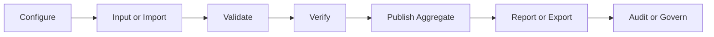

# SIKESRA Admin UI/UX Design Standard

This document is the implementation standard for GitHub issue #142.

It defines the shared admin UI/UX model for the AWCMS-Micro SIKESRA plugin. It does not move behavior into EmDash core and does not replace the data, migration, repository, RBAC/ABAC, audit, or workflow issues that follow it.

## 1. Scope

This standard applies to SIKESRA admin surfaces under:

```txt
/_emdash/admin/plugins/awcms-micro-sikesra/...
```

Implementation belongs in:

```txt
awcmsmicro-dev/packages/plugins/awcms-micro-sikesra/
```

Supporting template references may live in approved AWCMS-Micro template boundaries.

## 2. Operator Journey

All SIKESRA pages must support one mental model:

```txt
Configure -> Input or Import -> Validate -> Verify -> Publish Aggregate -> Report or Export -> Audit or Govern
```



## 3. Route Safety

All admin links, module cards, shortcuts, and action buttons must stay inside the plugin admin base route.

Allowed admin route prefix:

```txt
/_emdash/admin/plugins/awcms-micro-sikesra/
```

Rules:

- never use root-relative public paths for admin actions;
- normalize plugin-local paths before rendering links;
- keep public links visually distinct from admin actions;
- add tests when a link generator or dashboard shortcut is changed.

## 4. Page Anatomy

Every SIKESRA admin page should use this structure:

```txt
Page header
Purpose description
Primary action area
Filters or search
Status summary
Main content table, card, or form
Context panel or detail drawer
Audit or status footer
Empty, loading, and error states
```

Small pages may omit sections only when the page has no corresponding workflow need.

The canonical page contract registry is `SIKESRA_PAGE_PATTERN_CONTRACTS` in `src/admin/ui-standards.ts`. Every required admin page must have a contract with title, purpose, permission, page anatomy, empty state, and any workflow/privacy/reason requirements.

## 5. Standard Page Patterns

### Overview

The overview dashboard should be organized as:

```txt
System readiness banner
Operational KPIs
Workflow shortcuts
Eight module cards
Public aggregate preview
Recent audit or lifecycle activity
```

### Registry

Registry pages should provide:

- module selector for the 8 SIKESRA data modules;
- filters for region, type, status, sensitivity, verification stage, missing documents, and custom attributes;
- status badges and masked sensitive columns;
- detail drawer or context panel;
- create/edit wizard entry points;
- entity audit trail access.

### Create/Edit Wizard

The registry wizard should follow this order:

```txt
Select module and subtype
Select region
Fill identity
Fill personal or institution details
Fill KTP and domicile address when applicable
Fill module-specific fields
Fill dynamic custom attributes
Attach document metadata
Review validation and privacy classification
Save draft or submit to verification
```

The canonical implementation model is `SIKESRA_REGISTRY_WIZARD_STEPS` in `src/admin/ui-standards.ts`. UI pages must use or mirror that model so route permissions, privacy checks, document upload checks, and final review/audit messaging stay consistent.

### Verification

Verification UI should use queue-based workflows with level, region, module, document completeness, and pending-age filters.

Reject and revision actions must require a reason and must show audit impact.

### Documents

Document UI should show completeness, linked entity, classification, validation status, restricted access, controlled preview or download, and audit history for sensitive access.

### Import

Import UI must be staged:

```txt
Upload -> Preview -> Map columns -> Validate -> Duplicate review -> Promote valid rows -> Summary
```

Promotion must be blocked while validation errors remain.

The canonical implementation model is `SIKESRA_IMPORT_WORKFLOW_STEPS`. Duplicate review requires a reason and audit-visible decision before promotion.

### RBAC and ABAC

Access UI should separate users, roles, permissions, scopes, role matrix, ABAC policies, access preview, and ABAC preview.

EmDash users are selected as references. SIKESRA must not create a duplicate user system.

The canonical assignment model is `SIKESRA_ACCESS_ASSIGNMENT_STEPS`: select EmDash user, assign SIKESRA role, assign region scope, assign organization scope, and preview effective access.

### Audit

Audit UI should default to redacted metadata, support safe filters, and expose sensitive details only through permission-aware reveal workflows.

### Custom Attributes

Custom attribute UI should act like a controlled form builder. Protected keys must be blocked, masking must be explicit, and impact must be shown before edit or deactivation.

The canonical form-builder model is `SIKESRA_CUSTOM_ATTRIBUTE_BUILDER_SECTIONS`: scope, field, privacy, preview, and save with audit.

### CRUD Governance

Archive, restore, permanent delete, restricted export, and sensitive reveal workflows must require high-friction confirmation when required by the related governance issue.

The canonical highest-risk review model is `SIKESRA_GOVERNANCE_REVIEW_STEPS`: create request, review snapshot, approve or reject, and execute final action.

Permission-aware CRUD action state is centralized in:

```txt
src/admin/ui-standards.ts
```

The standard action model covers:

```txt
create
edit
soft_delete
restore
archive
permanent_delete
```

UI rules:

- create and edit are visible when their permissions are granted;
- soft delete and archive require reason-aware destructive treatment;
- restore is visible only for archived records;
- permanent delete is hidden by default and visible only in the highest-admin governance workflow;
- ABAC denial must keep the action visible only when useful for context, disabled with a safe reason;
- every destructive or sensitive action must have an audit-visible outcome.

## 6. Privacy and Safety Controls

Sensitive and restricted information must be visible as a state without exposing the underlying value.

Required UI states:

```txt
Masked
Sensitive
Restricted
Public Safe
Suppressed
Needs Review
Permission Denied
ABAC Denied
Audit Required
```

Reveal controls must be permission-aware and audit-ready.

Public aggregate UI must explain suppressed values and small-cell protection.

## 7. Status Badge Vocabulary

Use stable badge labels across pages:

```txt
Draft
Needs Review
Pending Desa
Pending Kecamatan
Pending SOPD
Pending Kabupaten
Verified
Rejected
Needs Revision
Archived
Suppressed
Public Safe
Sensitive
Restricted
Orphaned User
```

Do not rely on color alone. Pair color with text or icon labels.

## 8. Accessibility

SIKESRA admin UI must provide:

- keyboard navigation for tables, forms, menus, dialogs, drawers, and steppers;
- visible focus states;
- labels for all inputs;
- ARIA labels for icon-only actions;
- field-level error text connected to inputs;
- light and dark mode readability;
- status text in addition to color.

The machine-readable checklist is `SIKESRA_ACCESSIBILITY_CHECKLIST` and should be used by tests and future page implementations.

## 9. Component Standard

Reusable UI should converge on these components as implementation progresses:

```txt
SikesraPageHeader
SikesraStatusBanner
SikesraMetricCard
SikesraModuleCard
SikesraFilterBar
SikesraDataTable
SikesraDetailDrawer
SikesraStepper
SikesraFieldGroup
SikesraSensitiveField
SikesraMaskedValue
SikesraRevealButton
SikesraStatusBadge
SikesraScopeBadge
SikesraAuditTimeline
SikesraEmptyState
SikesraErrorState
SikesraConfirmDialog
SikesraReasonInput
SikesraAccessPreviewPanel
SikesraAbacDecisionPanel
```

Component extraction should happen only when it reduces duplication or gives tests a stable target.

## 10. Validation Expectations

When changing SIKESRA admin UI, run the closest relevant checks:

```bash
pnpm --dir awcmsmicro-dev/packages/plugins/awcms-micro-sikesra test
pnpm --dir awcmsmicro-dev/packages/plugins/awcms-micro-sikesra typecheck
pnpm --dir awcmsmicro-dev/packages/plugins/awcms-micro-sikesra build
```

Add tests for route safety, module cards, masked value defaults, permission-aware reveal controls, empty states, import blocking, verification rejection reasons, user references, protected custom attribute keys, and permission-aware archive or restore controls as those surfaces are implemented.

## 11. Final Rule

UI/UX implementation must remain plugin-owned. Do not modify EmDash core for SIKESRA-specific layout, workflow, masking, RBAC/ABAC, or governance behavior.
