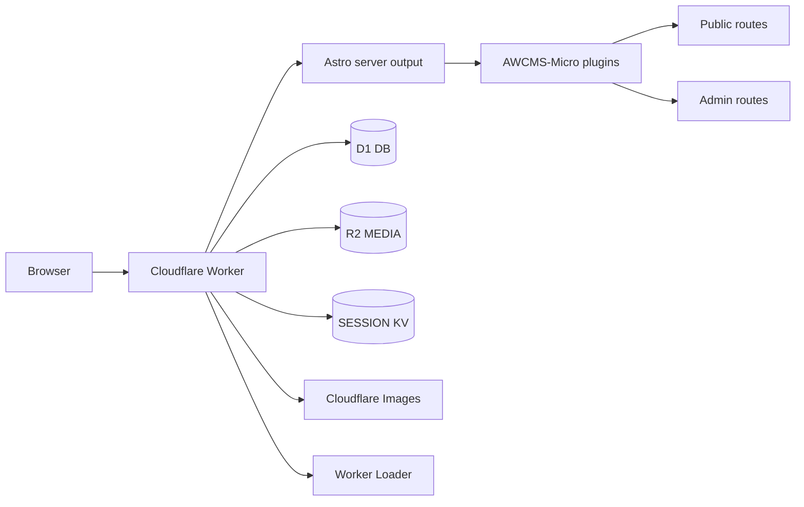
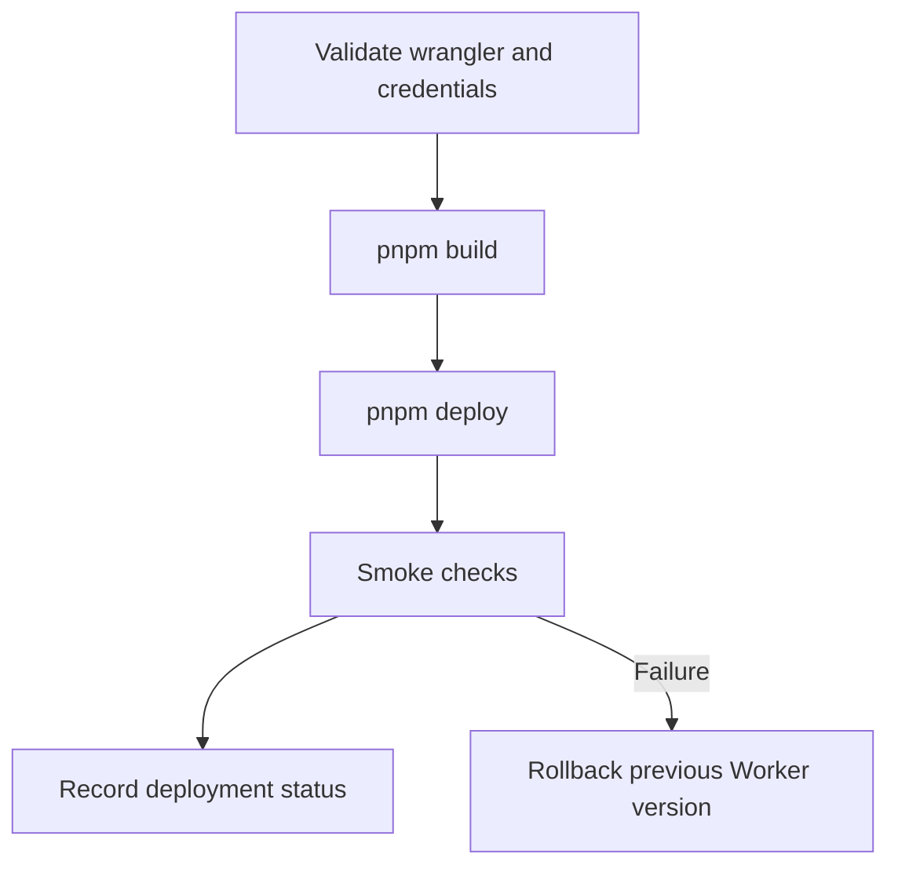

# AWCMS-Micro Default Cloudflare Template

This template is a deployable AWCMS-Micro example site for Cloudflare.

It keeps EmDash core untouched and lives only inside `awcmsmicro-dev/templates/awcms-micro-default-cloudflare/`.

## Purpose

- provide a Cloudflare-first AWCMS-Micro reference template
- demonstrate how AWCMS-Micro plugins can be registered in a deployable Cloudflare EmDash site
- keep deployment, validation, and rollback guidance template-owned rather than core-owned

## What It Includes

- public homepage with an ahliweb.com-aligned section architecture (hero, profile, services, portfolio, media, news, FAQ, contact)
- admin-editable `services` collection with public `/services` index and `/services/[slug]` detail routes (CMS-sourced, Mermaid-in-content)
- shared public design system in `src/styles/public.css` and reusable components under `src/components/public/`
- public posts and news routes
- public page route for site pages such as `/about`
- public aggregate reference route
- public `/docs` route backed by the docs plugin shared content
- protected EmDash admin access at `/_emdash/admin` with unauthenticated redirects to `/_emdash/admin/login`
- Cloudflare Worker configuration with D1, R2, observability, and Worker Loader prepared
- native registration of `@awcms-micro/plugin-docs`, `@awcms-micro/plugin-sikesra`, `@awcms-micro/plugin-gallery`, and `@awcms-micro/plugin-website-social`
- Plugin admin UI surfaces should use theme-aware semantic tokens; avoid hardcoded white/black card colors in plugin components.



## Cloudflare Placeholders

This template is prepared for these logical values:

- base domain: `awcms-micro.ahlikoding.com`
- storage domain: `awcms-micro-s3.ahlikoding.com`
- D1 database name: `awcms-micro-d1-20260530`
- R2 media bucket binding: `MEDIA`
- Worker Loader binding: `LOADER`

No secrets are committed.

## Boundary Rule

- keep Cloudflare deployment shape template-owned
- keep plugin behavior plugin-owned and registered through standard EmDash configuration
- do not move Cloudflare-specific AWCMS-Micro behavior into EmDash core locations

## Template I18N

Template-owned public strings use Lingui-compatible PO catalog files at:

```txt
src/locales/en/messages.po
src/locales/id/messages.po
```

`src/locales/messages.ts` is the temporary compiled PO adapter for this Cloudflare template. `src/utils/public-copy.ts` only selects the locale-specific compiled catalog. Keep the adapter synchronized with the PO catalogs until a template-local compiler or official EmDash template i18n API is available.

Public template strings render outside the EmDash admin shell, so they must not require EmDash core changes or admin-only locale compilation.

## Local Development

1. Run `pnpm install` from `awcmsmicro-dev` if the workspace is not already installed.
2. From this template directory, run `pnpm typecheck`.
3. Run `pnpm dev`.
4. Open `http://localhost:4321/` for the public site.
5. Open `http://localhost:4321/_emdash/admin` for the admin UI.

If you need local variable overrides, copy `.dev.vars.example` to `.dev.vars` and edit the copy only.

## Validation

From this template directory:

1. `pnpm install`
2. `pnpm typecheck`
3. `pnpm build`
4. `pnpm test`

`pnpm validate:cloudflare-env` validates the committed `wrangler.jsonc` domain, D1, R2, KV, Images, Worker Loader, and public URL configuration without requiring Cloudflare credentials. For deployment readiness in a shell or CI job that has credentials available, run `bash ./scripts/validate-cloudflare-env.sh --require-credentials`.

## Migration And D1 Preparation

Use `wrangler d1 create awcms-micro-d1-20260530` only when recreating the current production-shaped example database. For a new environment, use a unique database name and update `wrangler.jsonc` before deployment.

Then confirm `wrangler.jsonc` points at the intended D1 database id and session namespace id before real deployment.

Do not commit Cloudflare tokens, secret values, or private credentials.

## Deploy

1. Confirm `wrangler.jsonc` still points to `awcms-micro.ahlikoding.com` and `awcms-micro-d1-20260530`.
2. Confirm the committed D1 `database_id` and `SESSION` namespace id still match the intended deployment target.
3. Confirm the `MEDIA` bucket exists.
4. Run `bash ./scripts/validate-cloudflare-env.sh --require-credentials` from a credentialed shell or CI job.
5. Run `pnpm build`.
6. Run `pnpm deploy`.



## Rollback

1. Re-deploy the previously known-good Worker build.
2. If a route or custom domain change caused the incident, restore the previous route config in `wrangler.jsonc` and redeploy.
3. If the problem is template content or seed data, revert the template commit and redeploy.
4. If the problem is database-related, restore the last known-good D1 backup or rerun migrations against a replacement D1 database after review.

## Smoke Checks

- `GET /` returns the public homepage.
- `GET /posts` returns the posts index.
- `GET /news` returns the news index.
- `GET /aggregate` returns the public-safe summary page.
- `GET /about` returns the published page route.
- `GET /_emdash/admin` redirects unauthenticated visitors to `/_emdash/admin/login`.
- `GET /_emdash/api/plugins/awcms-micro-sikesra/public/status` returns the public-safe plugin response.

## Notes

- The SIKESRA plugin is currently registered through `plugins: [awcmsMicroSikesraPlugin()]`.
- The Worker Loader binding is already prepared even though this template does not yet register sandboxed plugins.
- This template is intentionally separate from upstream EmDash templates and does not overwrite them.

For the implementation-level PRD, see `docs/TECHNICAL_PRD.md`.

## Naming Guidance

- package name: `@awcms-micro/template-default-cloudflare`
- recommended local folder example: `templates/awcms-micro-default-cloudflare/`
- related plugin packages: `@awcms-micro/plugin-docs`, `@awcms-micro/plugin-sikesra`, `@awcms-micro/plugin-gallery`, `@awcms-micro/plugin-website-social`

## License

This template is licensed under the AW Non-Commercial License 1.0. See `LICENSE.md`.
