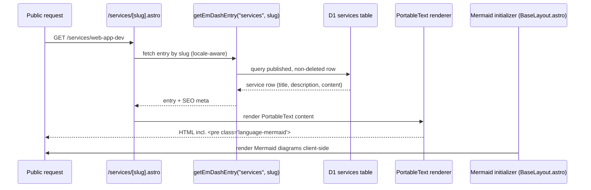

# Public Page Architecture

This template's public pages follow the [ahliweb.com](https://github.com/ahliweb/ahliwebcom) (ahliwebcom) public architecture — a section-based, component-driven layout — while keeping every section **CMS-sourced** and the EmDash admin integration intact.

The design goal: editors manage all content from the EmDash admin (D1-backed collections), and the public site renders it with a polished, consistent, accessible design system.

## Content sources

```mermaid
flowchart TD
  Admin[EmDash Admin] -->|edits| D1[(SQLite (dev) / D1 (prod))]
  D1 --> Posts[posts]
  D1 --> News[news]
  D1 --> Pages[pages]
  D1 --> Galleries[galleries]
  D1 --> Services[services]
  D1 --> WS[website_social config]

  subgraph Public[Public template]
    Base[BaseLayout.astro\nheader, footer, theme, promo, WhatsApp, Mermaid init]
    Home[index.astro\nhero + profile + services + portfolio + media + news + FAQ + contact]
    Svc[/services index + /services/slug/]
    Slug[slug.astro\npages collection]
  end

  Services --> Home
  Services --> Svc
  Galleries --> Home
  Posts --> Home
  News --> Home
  Pages --> Slug
  WS --> Base
  WS --> Home
  PO[EN/ID messages.po\nUI labels] --> Base
  PO --> Home
  Base --> Home
  Base --> Svc
  Base --> Slug
  Services --> Sitemap[/sitemap.xml auto-injected/]
```

## Design system

- `src/styles/public.css` defines the section + card utilities (`.section-shell`, `.section-heading`, `.service-card`, `.benefit-item`, `.testimonial-card`, `.faq-item`, `.profile-card`, hero motif), themed to the existing EmDash CSS tokens so light/dark theming is inherited from `BaseLayout.astro`.
- `src/components/public/` holds the reusable presentation components: `HeroGraphic`, `SectionHeading`, `ServiceCard`, `TestimonialCard`, `FaqItem`. They are pure-CSS, no React, and use RTL-safe logical properties.
- `BaseLayout.astro` keeps the existing `.reveal*`, `.card`, and `.btn*` utilities; `public.css` does not duplicate them.

## Services collection

The `services` collection is an admin-editable EmDash collection (fields: `title`, `description`, `icon`, `order`, `content`). It supports `seo`, so its entries flow into the auto-injected `/sitemap.xml`.



## Mermaid in CMS content

EmDash renders a PortableText `code` block (`language: "mermaid"`) as `<pre class="language-mermaid"><code class="language-mermaid">…`. The client-side initializer in `BaseLayout.astro` detects these and renders them with Mermaid 11, themed for light/dark. Service content seeded from ahliwebcom keeps its workflow/architecture diagrams.

## Localization

- UI/chrome labels live in `src/locales/{en,id}/messages.po` (mirrored by the `messages.ts` copy adapter consumed via `getPublicCopy`).
- Editorial content (services, pages, posts, news, galleries) is localized as EmDash row-per-locale content (`translationOf` + `locale`), edited in the admin.

## Sitemap & SEO

`/sitemap.xml`, `/sitemap-[collection].xml`, and `/robots.txt` are auto-injected by EmDash core. Collections that declare `seo` support (including `services`) are included automatically. Per-page SEO uses `getSeoMeta` + `createPublicPageContext`.

## Roadmap

The public-page alignment is phased. Phase 1 (this template state) delivers the design system, the `services` collection, the services pages, the homepage services section, and the Mermaid initializer. Later phases (tracked as GitHub issues) add portfolio and testimonials collections, info/legal CMS pages, and a human-readable sitemap page.
