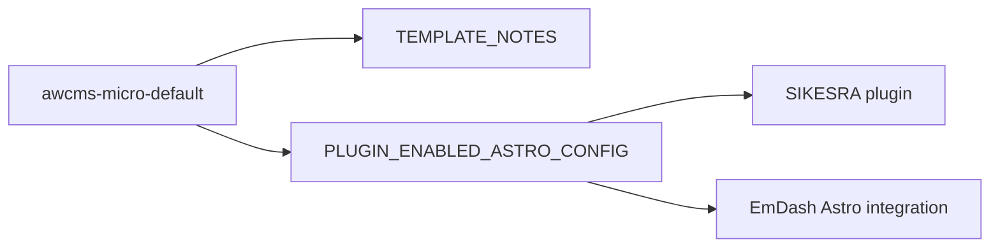

# Template Docs

This folder collects the AWCMS-Micro-specific guidance for `awcms-micro-default`.

## Documents

- `TEMPLATE_NOTES.md`: scope, intent, and adoption boundaries for the template
- `PLUGIN_ENABLED_ASTRO_CONFIG.md`: ready-to-copy `astro.config.mjs` shape with `@awcms-micro/plugin-sikesra` enabled

## Related Workspace Docs

- `../../../packages/plugins/awcms-micro-sikesra/docs/STANDALONE_CONSUMPTION.md`: end-to-end plugin consumption flow for standalone EmDash sites

Use the checked-in template files as the neutral default, then use these documents when you want to attach the SIKESRA plugin or clarify standalone adoption details.
