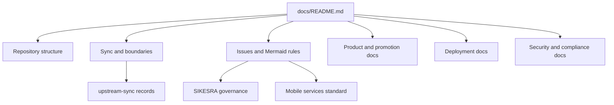

# Documentation Index

This folder contains the root-level technical documentation for the AWCMS-Micro parent repository.



## Documents

- `repository-structure.md`: root folder contract, responsibilities, and boundaries
- `synchronization-workflow.md`: operational workflow for updating `emdash-latest/` and rebuilding `awcmsmicro-dev/`
- `implementation-instructions.md`: implementation mandate, constraints, and task-splitting guidance
- `awcms-micro-implementation-boundaries.md`: approved AWCMS-Micro implementation boundaries and preservation rules
- `awcms-micro-github-issue-system.md`: repository issue-management standard, including `SEQ`, priority, dependency, Mermaid diagram, and agent execution rules
- `awcms-micro-mermaid-diagram-standard.md`: repository-wide Mermaid diagram standard for PRDs, database/D1, UI/UX, integration, security, deployment, and governance docs
- `awcms-micro-documentation-workflow.md`: required workflow for deciding whether to update or create docs, when to add Mermaid diagrams, and when to update README indexes or `AGENTS.md`
- `awcms-micro-sikesra-plugin-governance.md`: SIKESRA plugin governance, issue backlog mapping, D1 boundary, EmDash user reference rule, field standards, public aggregate rule, RBAC/ABAC, CRUD, and update/rebuild safety
- `awcms-micro-mobile-services-plugin-standard.md`: official standard for a future mobile services plugin that manages Android, iOS, Flutter, native mobile, API, auth, versioning, notifications, offline sync, deployment, monitoring, and governance workflows
- `awcms-admin-branding.md`: admin branding persistence model and downstream patch overlay for sidebar footer versioning
- `repository-assessment.md`: current repository assessment and prioritized development/documentation recommendations
- `decision-records.md`: lightweight index of major AWCMS-Micro repository decisions
- `awcms-micro-product-readme-draft.md`: sync-safe draft README for the future independent `awcms-micro` repository
- `awcms-micro-product-readme-final.md`: final product-facing README source for the independent `awcms-micro` repository
- `awcms-micro-prd.md`: detailed PRD for the future independent `awcms-micro` repository, including architecture, schema, and Mermaid diagrams
- `awcms-micro-repository-promotion-checklist.md`: repository promotion steps and verification checklist for the independent `awcms-micro` repository
- `awcms-micro-release-readiness-checklist.md`: release-readiness checks for promoting `awcmsmicro-dev/` into an independent repository state
- `awcms-micro-root-versioning.md`: root-level AWCMS maintenance versioning and changelog flow, including the workspace snapshot for every plugin and template in `awcmsmicro-dev/`
- `awcms-micro-versioning.md`: AWCMS-Micro-only downstream versioning and changelog flow for `@awcms-micro/*`, plus the workspace package-release boundary that keeps `awcmsmicro-dev/.changeset/` separate
- `awcms-micro-versioning-rollout-summary.md`: concise summary of the AWCMS versioning automation rollout and local proof runs
- `awcms-micro-licensing.md`: root MIT license plus package-level AW Non-Commercial License guidance
- `awcms-micro-d1-mirror-sync.md`: limited two-way D1 mirror workflow for DBeaver on a local SQLite file
- `awcmsmicro-dev/docs/awcms-micro/i18n-po-translation-standard.md`: sync-safe AWCMS-Micro PO catalog standard for all plugin and template translations
- `operator-workflow.md`: concise end-to-end operator workflow for sync, validation, promotion, `continuation` vs `fresh-clone` update mode, and fresh-clone prompt details
- `backup/gitlab-mirror-setup.md`: GitLab PAT-based mirror setup and recovery notes
- `security/backup-restore.md`: backup and restore baseline expectations
- `awcmsmicro-dev-protected-paths.md`: exact allowlist consumed during `awcmsmicro-dev` rebuilds
- `nested-navigation-public-and-plugin-header.md`: nested public menu and plugin header submenu guidance; see the separate upstream-sync sidebar-ordering note for plugin-first admin navigation
- `sikesra-ui-redesign-plan.md`: SIKESRA plugin admin UI redesign plan and professional UX direction
- `upstream-sync/README.md`: upstream sync status, divergence tracking, and validation records
- `upstream-sync/COMPATIBILITY_MATRIX.md`: compatibility status for upstream EmDash alignment and downstream AWCMS-Micro surfaces
- `upstream-sync/DIVERGENCE_LOG.md`: auditable record of downstream patch overlays and intentional divergence from upstream-owned files
- `upstream-sync/LAST_VALIDATION.md`: latest recorded workspace validation run and command output summary
- `upstream-sync/LAST_UPSTREAM_FETCH.md`: exact upstream revision copied into `emdash-latest/`
- `upstream-sync/UPSTREAM_SYNC_STATUS.md`: current upstream synchronization status and validation table
- `upstream-sync/ISSUE_CLASSIFICATION_DOWNSTREAM_VS_UPSTREAM.md`: triage guide for deciding whether a discovered issue belongs in downstream boundaries or upstream EmDash core
- `upstream-sync/UPSTREAM_PR_PLAN_ADMIN_SIDEBAR_ORDERING.md`: narrow upstream PR plan for global admin-sidebar ordering support
- `deployment/cloudflare.md`: Cloudflare deployment guidance and related infrastructure notes
- `deployment/d1-database.md`: D1 database deployment and binding guidance
- `deployment/deployment-checklist.md`: deployment verification checklist for Cloudflare and related production paths
- `deployment/r2-storage.md`: R2 storage deployment and binding guidance
- `deployment/workers-pages.md`: Workers and Pages deployment guidance
- `security/access-control.md`: access-control baseline for roles, permissions, and protected workflows
- `security/audit-logging.md`: audit logging expectations for sensitive operations and governance events
- `security/incident-response.md`: incident response baseline for operational and security events
- `security/indonesia-compliance.md`: Indonesia compliance baseline for privacy and data-handling expectations
- `security/iso-alignment.md`: ISO-alignment notes for security governance and operational controls
- `security/privacy-baseline.md`: privacy baseline for personal data handling and public-safe output
- `security/security-baseline.md`: security, privacy, ISO, and Indonesia compliance baseline documentation
- `security/upload-security.md`: upload security guidance for validation, storage, and safe handling of uploaded assets

## Reading Order

1. Read `repository-structure.md` to understand the parent repository layout.
2. Read `synchronization-workflow.md` before refreshing either working tree.
3. Read `awcms-micro-implementation-boundaries.md` before changing AWCMS-Micro custom boundaries.
4. Read `awcms-micro-github-issue-system.md` before creating, editing, or executing sequenced GitHub issues.
5. Read `awcms-micro-mermaid-diagram-standard.md` before writing PRDs, database docs, UI/UX flows, integration docs, security flows, deployment docs, or major GitHub issues.
6. Read `awcms-micro-documentation-workflow.md` before adding new root docs, changing documentation workflow, or deciding whether a Mermaid diagram, README index update, or `AGENTS.md` update is required.
7. Read `awcms-micro-sikesra-plugin-governance.md` before changing the SIKESRA plugin.
8. Read `awcms-micro-mobile-services-plugin-standard.md` before planning, designing, or implementing a mobile services plugin for Android, iOS, Flutter, native, API, auth, notification, or offline-sync workflows.
9. Read `awcms-admin-branding.md` before changing admin branding or persistent source-level overrides.
10. Read `awcmsmicro-dev-protected-paths.md` before changing the sync-safe allowlist.
11. Read `implementation-instructions.md` before making AWCMS-Micro-specific changes.
12. Read `repository-assessment.md` before planning new AWCMS-Micro development or documentation work.
13. Read `decision-records.md` before changing a repository-shaping rule or boundary model.
14. Read `awcms-micro-product-readme-draft.md` before preparing product-facing repository onboarding content.
15. Read `awcms-micro-product-readme-final.md` before replacing the independent repository README.
16. Read `awcms-micro-prd.md` before changing product requirements, architecture, database, or user-flow assumptions.
17. Read `awcms-micro-repository-promotion-checklist.md` before promoting the maintained workspace into an independent repository state.
18. Read `awcms-micro-release-readiness-checklist.md` before declaring the maintained workspace promotion-ready.
19. Read `awcms-micro-root-versioning.md` before updating the workspace snapshot or the root maintenance changelog.
20. Read `awcms-micro-versioning.md` before preparing AWCMS-Micro plugin or template releases.
21. Read `awcms-micro-versioning-rollout-summary.md` to review the implemented AWCMS versioning rollout and proof runs.
22. Read `awcms-micro-licensing.md` before changing package or manifest license metadata.
23. Read `awcms-micro-d1-mirror-sync.md` before connecting DBeaver to the local mirror or syncing D1 changes.
24. Read `awcmsmicro-dev/docs/awcms-micro/i18n-po-translation-standard.md` before adding or changing AWCMS-Micro plugin or template translations.
25. Read `operator-workflow.md` for the shortest end-to-end maintenance and promotion path.
26. Read `backup/gitlab-mirror-setup.md` and `security/backup-restore.md` before changing backup, mirror, or recovery flows.
27. Read `nested-navigation-public-and-plugin-header.md` before implementing public dropdown menus or plugin-owned header navigation.
28. Read `upstream-sync/README.md` before reviewing sync state or divergence.
29. Read `upstream-sync/ISSUE_CLASSIFICATION_DOWNSTREAM_VS_UPSTREAM.md` before triaging whether a defect should be fixed downstream or escalated upstream.
30. Read `upstream-sync/UPSTREAM_PR_PLAN_ADMIN_SIDEBAR_ORDERING.md` before preparing upstream admin-sidebar ordering work.
31. Read `deployment/cloudflare.md` and `security/security-baseline.md` before infrastructure or governance changes.

## Issue System Summary

Sequenced GitHub issues use this title pattern:

```txt
[PRODUCT][SEQ-XX][TYPE][PRIORITY] Title
```

`SEQ` controls execution order. Priority controls risk and urgency. Mermaid diagrams are required when an issue changes architecture, database/D1, UI/UX flow, integration, security flow, deployment topology, migration, or data preservation behavior. For the SIKESRA plugin, the current ordered backlog is documented in `awcms-micro-github-issue-system.md` and mirrored in the SIKESRA governance docs.

## Language Policy

English (US) is the official language for this root documentation set.

Exception:

- content preserved from upstream EmDash may retain upstream wording and spelling

## Translation Standard

AWCMS-Micro plugins and templates must use Lingui-compatible gettext PO catalogs for user-facing translations. English (`en`) is the source locale, and active plugins/templates must include reviewed Indonesian (`id`) catalogs. The canonical standard is `awcmsmicro-dev/docs/awcms-micro/i18n-po-translation-standard.md`.
