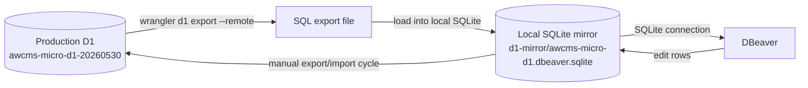

# AWCMS-Micro D1 Mirror Sync

## Purpose

This workflow gives DBeaver a local SQLite file that mirrors the production Cloudflare D1 database for `awcms-micro-d1-20260530`.

It is a limited two-way sync model, not a live remote connection.

## How It Works

- Production D1 is exported with `wrangler d1 export --remote`.
- The export is loaded into a local SQLite mirror at `awcmsmicro-dev/.local/d1-mirror/awcms-micro-d1.dbeaver.sqlite`.
- DBeaver connects to that SQLite file.
- The local mirror can be edited in DBeaver and refreshed from a new production export when needed.

## Available Helper

- `pnpm --dir awcmsmicro-dev d1:mirror:status` prints a read-only summary of the local mirror and checks content-table parity against `_emdash_collections`.

## Access Required

- Any future mirror automation should read the parent repository `.env` automatically when present.
- Any future mirror automation should map `CLOUDFLARE_WORKER_D1_DATABASE_ID` to the D1 mirror workflow when needed.
- `wrangler` must already be authenticated to the Cloudflare account that owns `awcms-micro-d1-20260530`.
- The account/token needs D1 query access.
- If `wrangler` returns `SQLITE_AUTH`, the local mirror cannot be refreshed until the account access issue is resolved.

## Eligibility Rules

Only tables that meet all of these rules are synced:

- primary key is a single `id` column
- table has `updated_at` or `updatedAt`
- table exists in both local mirror and remote export

## Conflict Rules

- If only one side changed since the last sync, that side wins.
- If both sides changed, the row with the newer `updated_at` wins.
- If timestamps tie or cannot be parsed, production D1 wins.
- Hard deletes are ignored. If a row disappears in DBeaver, the next sync restores it unless the row is represented by a soft-delete field such as `deleted_at`.

## DBeaver Setup

1. Create or refresh the mirror file from a production D1 export.
2. In DBeaver, create a new SQLite connection.
3. Point it at `awcmsmicro-dev/.local/d1-mirror/awcms-micro-d1.dbeaver.sqlite`.
4. Disconnect or close the DBeaver connection before replacing the file.
5. After editing rows in DBeaver, refresh the mirror again with a new export/import cycle.

## Current Snapshot

This repository snapshot includes the read-only `pnpm d1:mirror:status` helper, but not the `sync`, `reset`, or `watch` helpers referenced by earlier workflow notes.

Use the local SQLite mirror directly in DBeaver, and refresh it with the manual export/import process described above when you need a new production snapshot.

## Limits

- No direct D1 driver is involved.
- Schema drift aborts sync and requires a reset.
- Hard deletes are not propagated automatically.
