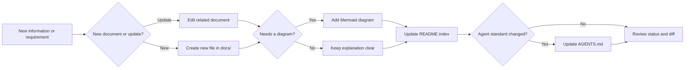

# AWCMS-Micro Documentation Workflow Standard

## Purpose

This standard defines the required workflow for adding or updating root-level AWCMS-Micro documentation.

Use it when new information, requirements, operator guidance, implementation rules, security guidance, deployment guidance, or project governance needs to be captured in repository documentation.

## Required Workflow



## Rules

- Update an existing document when the new information belongs to an existing topic.
- Create a new file under `docs/` when the topic is distinct enough to need its own title, index entry, and maintenance boundary.
- Add or update Mermaid diagrams when the documentation changes architecture, module boundaries, database schema, UI/UX flow, frontend-backend integration, security decision flow, deployment topology, migration, rebuild, recovery, or data preservation behavior.
- If a diagram is not required, make sure the written explanation is still complete enough for maintainers and agents to execute safely.
- Update `docs/README.md` whenever a new documentation file is added or the reading order changes.
- `bash scripts/validate-awcmsmicro-boundaries.sh` enforces that every Markdown file under `docs/` is discoverable from `docs/README.md`.
- Update the root `README.md` core documentation list when a new root-governance document becomes part of the standard documentation set.
- Update `AGENTS.md` when the documentation change modifies required reading, agent execution rules, implementation boundaries, safety rules, or validation expectations.
- For root-level documentation, script, governance, synchronization, or protected admin branding changes, add a root `.awcms-changesets/*.md` entry and run `bash scripts/awcms-root-versioning.sh version` before final validation.

## Validation

For documentation workflow changes, run:

```bash
bash scripts/validate-awcmsmicro-boundaries.sh
```

If the change also affects sync behavior, run:

```bash
bash scripts/sync-preflight-checklist.sh --continuation
```
