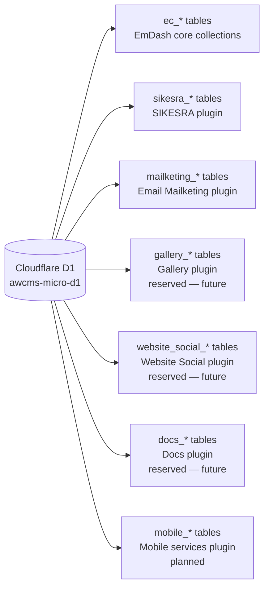
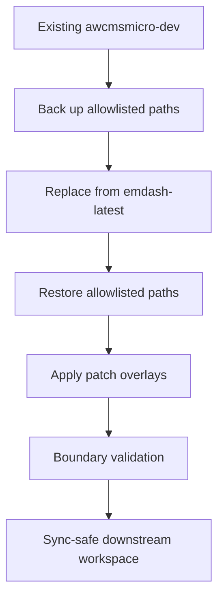
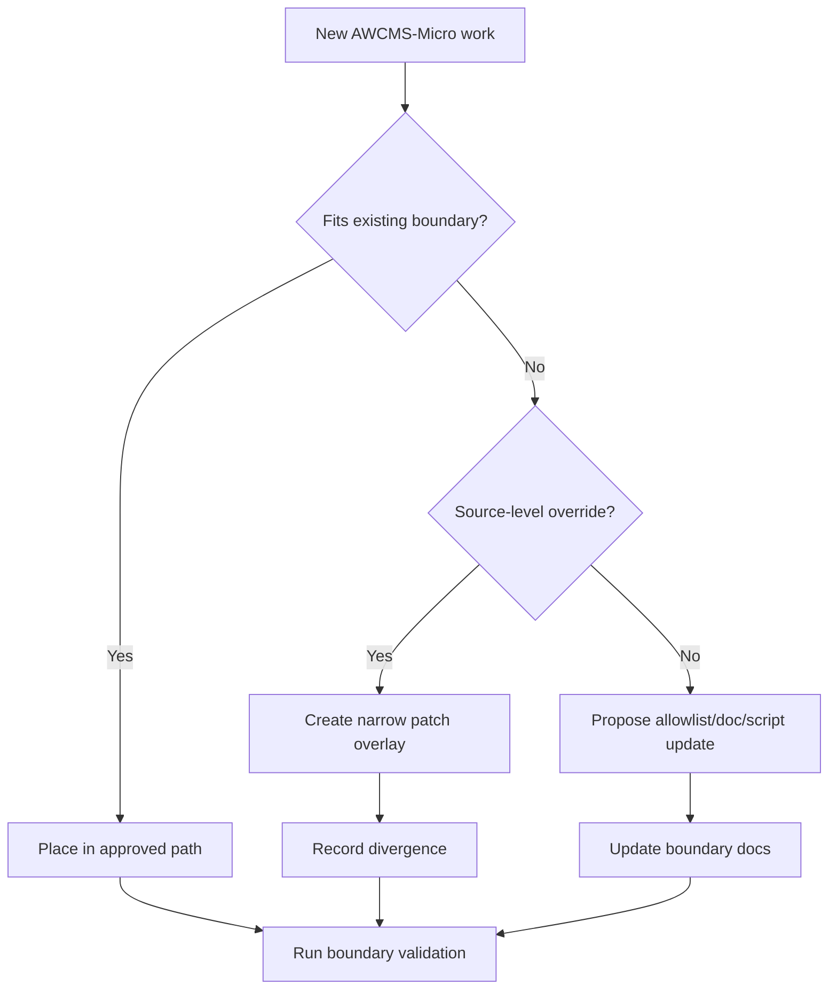

# AWCMS-Micro Implementation Boundaries

## Purpose

AWCMS-Micro-specific implementation work inside `awcmsmicro-dev/` needs an explicit sync-safe boundary because `bash scripts/update-awcmsmicro-dev.sh` rebuilds the workspace from `emdash-latest/` with `rsync --delete`.

Without an allowlisted boundary, future AWCMS-Micro-only paths can be deleted during rebuilds even when those paths are intentionally outside upstream EmDash.

## Approved Custom Paths

These paths are relative to `awcmsmicro-dev/` and are the only locations that may carry AWCMS-Micro-owned implementation work across rebuilds:

- `templates/awcms-micro-default`
- `templates/awcms-micro-default-cloudflare`
- `packages/plugins/awcms-micro-sikesra`
- `packages/plugins/awcms-micro-docs`
- `packages/plugins/awcms-micro-gallery`
- `packages/plugins/awcms-micro-website-social`
- `packages/plugins/awcms-micro-email-mailketing`
- `demos/awcms-micro-cloudflare`
- `docs/awcms-micro`
- `docs/package.json`
- `packages/blocks/playground/package.json`
- `templates/awcms-micro-default/data.db`
- `e2e/awcms-micro`
- `.awcms-changesets`
- `.awcms-patches`
- `.changeset`
- `.github/workflows`
- `.github/scripts`
- `.github/dependabot.yml`
- `pnpm-workspace.yaml`
- `infra/perf-monitor/package.json`
- `AGENTS.md`
- `.env`
- `.env.age`
- `packages/admin/src/components/Sidebar.tsx`
- `packages/admin/src/components/Shell.tsx`
- `packages/admin/src/components/AdminCommandPalette.tsx`
- `packages/admin/src/components/WelcomeModal.tsx`
- `packages/admin/tests/components/Sidebar.test.tsx`
- `packages/admin/tests/components/AdminCommandPalette.test.tsx`
- `packages/admin/tests/components/WelcomeModal.test.tsx`

These are the active product-development boundaries:

- plugin boundaries under `packages/plugins/`
- template boundaries under `templates/`
- supporting docs, demos, E2E, and release-automation boundaries listed above

Plugin-owned storage collections must use a plugin-specific prefix and remain isolated from other plugins' collection names. See the prefix standard below.

Local bootstrap state used by sync and backup workflows is also preserved across rebuilds:

- `awcmsmicro-dev/.env`
- `awcmsmicro-dev/.env.age`

The current allowlist is stored in `scripts/awcmsmicro-dev-protected-paths.txt`.

## D1 Table and Storage Collection Prefix Standard

Every AWCMS-Micro plugin that owns Cloudflare D1 tables or EmDash plugin storage collections **must** use a dedicated, plugin-specific prefix for all of its table and collection names.

This keeps every plugin's data visually grouped and unambiguously identifiable inside the shared D1 database — both in the Cloudflare dashboard and in Wrangler query output.

### Prefix Rules

- Every plugin-owned D1 table name must begin with `{prefix}_`.
- Every plugin-owned EmDash storage collection name must begin with `{prefix}_`.
- The prefix must be lowercase alphanumeric with underscores only.
- No two AWCMS-Micro plugins may share the same prefix.
- A plugin's prefix must be consistent across all of its tables and collections — do not mix prefixes within one plugin.
- Plugins that use EmDash content collections via the EmDash content API (which creates `ec_*` tables) do not need to rename those collections. The `ec_` prefix is applied by EmDash core. Reserve your plugin prefix for any plugin-owned D1 tables added via migrations.
- When a new plugin is created, claim its prefix in the registry below before adding any migrations.

### Active Prefix Registry

| Plugin | Package | Assigned Prefix | Tables owned |
| --- | --- | --- | --- |
| SIKESRA | `@awcms-micro/plugin-sikesra` | `sikesra_` | `sikesra_persons`, `sikesra_audit_events`, etc. |
| Email Mailketing | `@awcms-micro/plugin-email-mailketing` | `mailketing_` | `mailketing_settings`, `mailketing_send_log`, `mailketing_audit_events`, etc. |
| Gallery | `@awcms-micro/plugin-gallery` | `gallery_` *(reserved)* | None yet — uses EmDash `ec_galleries` content collection |
| Website Social | `@awcms-micro/plugin-website-social` | `website_social_` *(reserved)* | None yet — uses EmDash `ec_website_social` content collection |
| Docs | `@awcms-micro/plugin-docs` | `docs_` *(reserved)* | None yet — uses EmDash content API |
| Mobile services *(planned)* | `@awcms-micro/plugin-mobile-services` | `mobile_` | Planned — see `docs/awcms-micro-mobile-services-plugin-standard.md` |

### Adding a New Plugin Prefix

1. Choose a short, unique keyword derived from the plugin's identifier.
2. Add it to the registry table above in the same commit that adds the plugin boundary to `scripts/awcmsmicro-dev-protected-paths.txt`.
3. Name all plugin migration files `{prefix}_*` and all storage collections `{prefix}_*`.
4. Add a prefix validation test (see SIKESRA's `pnpm awcms:sikesra:check-d1-prefix` as a model).

## Upstream-Only Paths

The following areas must remain upstream-only unless they are first moved into an approved custom path:

- all of `emdash-latest/`
- all paths in `awcmsmicro-dev/` that are not listed in `scripts/awcmsmicro-dev-protected-paths.txt`
- EmDash core packages, built-in templates, built-in demos, built-in docs, and built-in test suites copied from upstream

This keeps AWCMS-Micro aligned with EmDash rather than turning `awcmsmicro-dev/` into a divergent EmDash fork.

## Sync-Safe Preservation Strategy

`bash scripts/update-awcmsmicro-dev.sh` uses a strict allowlist strategy:

1. back up approved custom paths from `awcmsmicro-dev/` if they exist
2. rebuild `awcmsmicro-dev/` from `emdash-latest/` with `rsync --delete`
3. restore only the backed-up allowlisted paths
4. reapply any patch overlays stored in `awcmsmicro-dev/.awcms-patches/`

That means downstream fixes can live entirely in `awcmsmicro-dev/` without changing `emdash-latest/`, as long as they are captured in the protected path allowlist or a patch overlay and are documented in the divergence log.

No arbitrary unknown paths are preserved.

## Preserved Change Categories

When `emdash-latest/` is refreshed and `awcmsmicro-dev/` is rebuilt, these change categories must be preserved inside the approved boundaries above:

- AWCMS-Micro release-note inputs in `awcmsmicro-dev/.awcms-changesets/`
- workspace package-release metadata in `awcmsmicro-dev/.changeset/`
- preserved workflow and release automation in `awcmsmicro-dev/.github/workflows/` and `awcmsmicro-dev/.github/scripts/`
- preserved Dependabot config in `awcmsmicro-dev/.github/dependabot.yml`
- dev-workspace agent guidance in `awcmsmicro-dev/AGENTS.md`
- local bootstrap state in `awcmsmicro-dev/.env` and `awcmsmicro-dev/.env.age`
- sidebar branding/header/footer, welcome modal branding, plugin-group ordering, command-palette ordering, contextual sidebar icons, and their regression tests are preserved through the protected path allowlist and restore step during `update-awcmsmicro-dev.sh`
- file-level persistence exceptions include `packages/admin/src/components/Sidebar.tsx`, `packages/admin/src/components/Shell.tsx`, `packages/admin/src/components/AdminCommandPalette.tsx`, `packages/admin/src/components/WelcomeModal.tsx`, `packages/admin/tests/components/Sidebar.test.tsx`, `packages/admin/tests/components/AdminCommandPalette.test.tsx`, and `packages/admin/tests/components/WelcomeModal.test.tsx`
- workspace configuration persistence exceptions include `pnpm-workspace.yaml`, `docs/package.json`, `infra/perf-monitor/package.json`, and `packages/blocks/playground/package.json`
- local workspace database persistence includes `awcmsmicro-dev/templates/awcms-micro-default/data.db` when present, so menu/content edits can survive rebuilds via the protected-path restore step
- persistent source-level downstream overrides in `awcmsmicro-dev/.awcms-patches/`
- supported AWCMS-Micro downstream plugin and template work in `awcmsmicro-dev/packages/plugins/` and `awcmsmicro-dev/templates/`
- plugin and template PO translation catalogs under each project boundary at `src/locales/{en,id}/messages.po`
- file-level AWCMS-Micro persistence exceptions for the admin sidebar and its regression test above
- supporting docs, demos, and E2E assets under the approved custom paths listed above
- root maintenance snapshot updates, including `CHANGELOG.md` and the latest plugin/template version notes

If a change does not fit one of these categories, do not assume it should survive rebuilds.

Active patch overlays under `awcmsmicro-dev/.awcms-patches/` must be recorded in `docs/upstream-sync/DIVERGENCE_LOG.md`. This keeps source-level overrides auditable without expanding the protected allowlist to broad upstream-owned files.

`bash scripts/validate-awcmsmicro-boundaries.sh` also dry-runs an unprotected `emdash-latest/` to `awcmsmicro-dev/` rebuild comparison. Any tracked downstream-only file outside the allowlist, or any unprotected content drift not covered by an active patch overlay, fails normal validation before it can survive accidentally. The validator also replays active patch overlays against a temporary copy of `emdash-latest` so corrupt or stale patches fail before a rebuild depends on them. The sync preflight intentionally skips only the drift check because `bash scripts/update-awcmsmicro-dev.sh` is the controlled operation that overwrites upstream-owned drift; post-rebuild validation checks the clean state again. Untracked generated/local artifacts are not treated as protected changes.

Protected directories are still checked for tracked temporary artifacts. Files such as `tmp-*`, `temp-*`, `*.tmp`, `*.bak`, `*.orig`, `*.rej`, and editor swap files must not be committed just because the containing plugin or template boundary is preserved across rebuilds.

## Compatibility Guardrail

This boundary preserves EmDash compatibility by keeping upstream behavior in upstream-owned locations and confining AWCMS-Micro downstream work to explicitly approved paths.

That means:

- upstream EmDash can continue to refresh `awcmsmicro-dev/`
- AWCMS-Micro downstream plugin and template work can survive rebuilds
- EmDash core does not need to be modified to host AWCMS-Micro additions
- new AWCMS-Micro behavior can stay in plugin and template surfaces instead of growing a competing core layer

## Adding Future Work Safely

When adding a new AWCMS-Micro plugin, template, demo, docs area, or test boundary:

1. place it inside an existing approved custom path when possible
2. if it is a persistent source-level change that must survive rebuilds, encode it as a patch file under `awcmsmicro-dev/.awcms-patches/`
3. record active patch overlays in `docs/upstream-sync/DIVERGENCE_LOG.md`
4. if a new boundary is required, add it to `scripts/awcmsmicro-dev-protected-paths.txt`
5. if preserving the change requires updating rebuild or validation scripts, make those script/doc changes before the next `update-awcmsmicro-dev.sh` run
6. update this document and the root workflow docs in the same change
7. run `bash scripts/update-awcmsmicro-dev.sh`
8. run `bash scripts/validate-awcmsmicro-boundaries.sh`

Do not preserve upstream overrides by adding random paths to the allowlist.

Do not create new shared AWCMS-Micro product code outside plugin or template boundaries unless the repository rules are intentionally changed first.

## Rollback Notes

If a custom boundary needs to be removed:

1. move or delete the AWCMS-Micro-owned files in that path
2. remove the path from `scripts/awcmsmicro-dev-protected-paths.txt`
3. update this document and related root docs
4. rebuild `awcmsmicro-dev/` so the path returns to the upstream state

Do not remove a path from the allowlist until its contents are intentionally retired or relocated.
