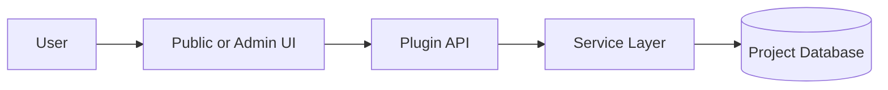
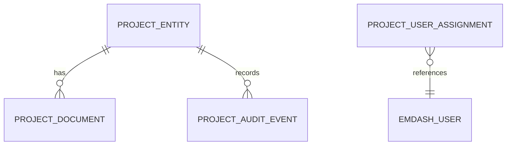
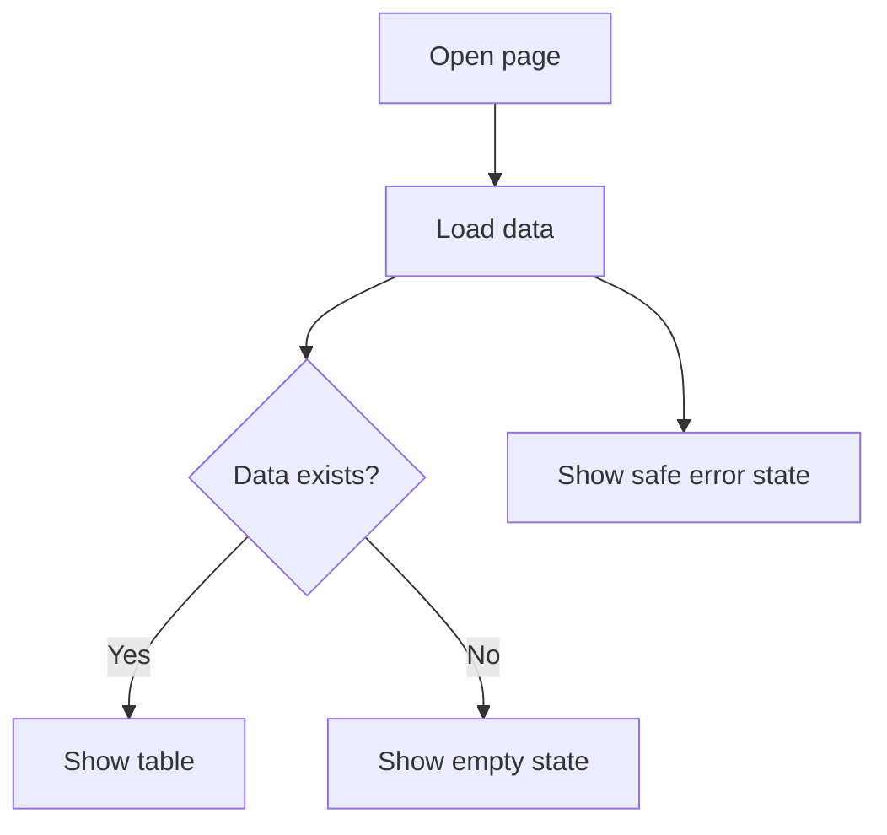
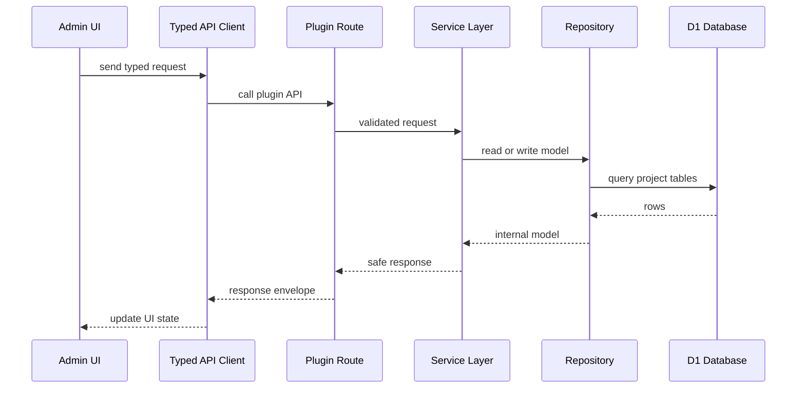
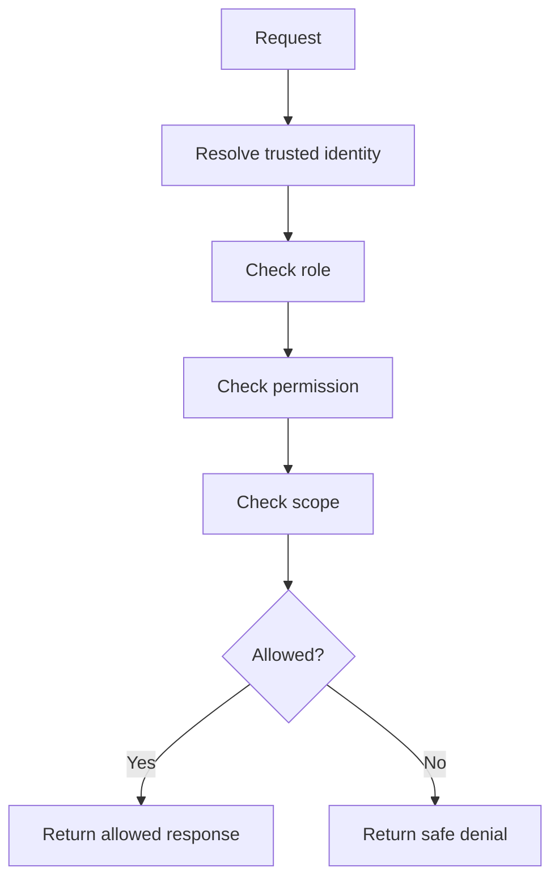
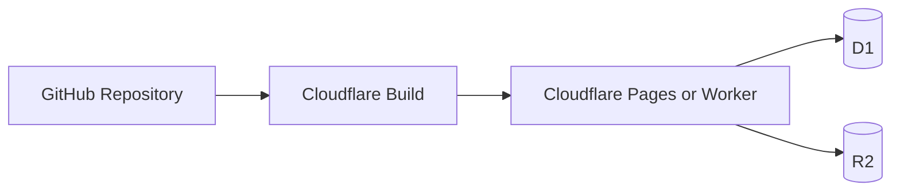

# AWCMS-Micro Mermaid Diagram Standard

This document defines how Mermaid diagrams should be used in AWCMS-Micro issues and documentation.

The standard applies to all AWCMS-Micro work: plugins, templates, database/D1, UI/UX, frontend, backend, API integration, security, deployment, testing, documentation, and governance.

## 1. Purpose

Mermaid diagrams help maintainers, developers, and AI coding agents understand implementation boundaries before code is changed.

Use diagrams when text alone may be ambiguous.

## 2. When Diagrams Are Required

Add or update Mermaid diagrams when an issue or document defines or changes:

- product architecture;
- module boundaries;
- database schema or D1 tables;
- migration or data preservation flow;
- UI/UX journey or page flow;
- form wizard flow;
- frontend-backend-database integration;
- RBAC/ABAC decision flow;
- audit, masking, or export flow;
- Cloudflare deployment topology;
- rebuild or recovery path.

Small isolated bug fixes may state that Mermaid diagrams are not required.

## 3. Diagram Type Guide

| Work Type | Recommended Mermaid Type |
| --- | --- |
| Product PRD | `flowchart`, `journey`, `mindmap` |
| Database/D1 | `erDiagram`, `flowchart` |
| UI/UX | `journey`, `flowchart`, `stateDiagram-v2` |
| Frontend-backend integration | `sequenceDiagram`, `flowchart` |
| RBAC/ABAC/security | `flowchart`, `sequenceDiagram`, `stateDiagram-v2` |
| Import/export | `flowchart`, `sequenceDiagram` |
| Cloudflare/deployment | `architecture-beta`, `flowchart` |
| Testing/QA | `flowchart`, `stateDiagram-v2` |
| Roadmap | `flowchart`, `mindmap`, `timeline` |

## 4. Issue Section Standard

For major issues, add:

```md
## Mermaid Diagrams

Add or update diagrams for architecture, database, UI/UX, integration, security, deployment, or data flow where relevant.
```

For small issues, add:

```md
## Mermaid Diagrams

Not required because this issue changes only a small isolated behavior.
```

## 5. PRD Diagram Requirements

Large PRDs should include:

- product scope diagram;
- user or actor journey;
- module relationship diagram;
- system boundary diagram;
- integration flow diagram when UI/API/backend/database work is included.

Example:



## 6. Database and D1 Diagram Requirements

Database issues and docs should include:

- logical ERD;
- table boundary diagram;
- migration flow;
- repository read/write path;
- data preservation flow when applicable.

Example:



## 7. UI/UX Diagram Requirements

UI/UX issues and docs should include:

- user journey;
- page flow;
- wizard step flow;
- state diagram for loading, empty, error, permission-denied, and success states.

Example:



## 8. Integration Diagram Requirements

Frontend-backend-D1 issues and docs should include:

- request and response sequence;
- typed contract boundary;
- service and repository path;
- serializer and masking flow;
- error handling flow.

Example:



## 9. Security and RBAC/ABAC Diagram Requirements

Security-sensitive issues should include:

- authorization decision flow;
- deny or allow precedence;
- masking or reveal flow;
- audit event flow.

Example:



## 10. Deployment Diagram Requirements

Deployment issues and docs should include:

- topology diagram;
- environment and binding diagram;
- build/deploy validation flow;
- recovery path.

Example:



## 11. SIKESRA Recommended Diagrams

The SIKESRA plugin should maintain diagrams for:

1. plugin boundary and EmDash compatibility;
2. admin UI to typed API to service to repository to D1;
3. logical `sikesra_` ERD;
4. registry create/edit wizard;
5. verification state flow;
6. RBAC/ABAC decision flow;
7. import staging workflow;
8. export/report safety workflow;
9. data preservation after rebuild;
10. Cloudflare D1/R2 topology.

## 12. Style Rules

- Keep diagrams readable in GitHub Markdown.
- Use short node labels.
- Prefer logical grouping over exhaustive detail.
- Split large diagrams into multiple smaller diagrams.
- Use stable names for project boundaries, tables, and services.
- Keep diagrams close to the text they explain.

## 13. Validation

For documentation-only changes:

```bash
bash scripts/validate-awcmsmicro-boundaries.sh
```

If a docs site or template renders the diagrams, also run that docs/template build.

## 14. Final Rule

Mermaid diagrams are part of the implementation contract when an issue or document changes architecture, database, UI/UX, integration, security, deployment, migration, or data preservation behavior.
