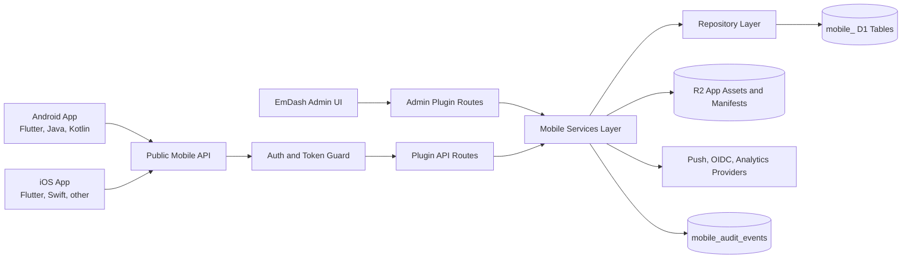
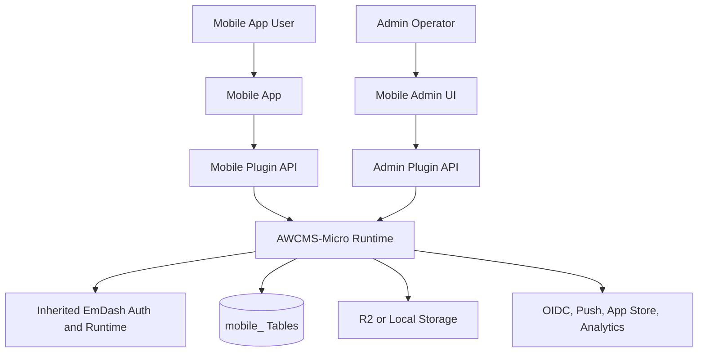
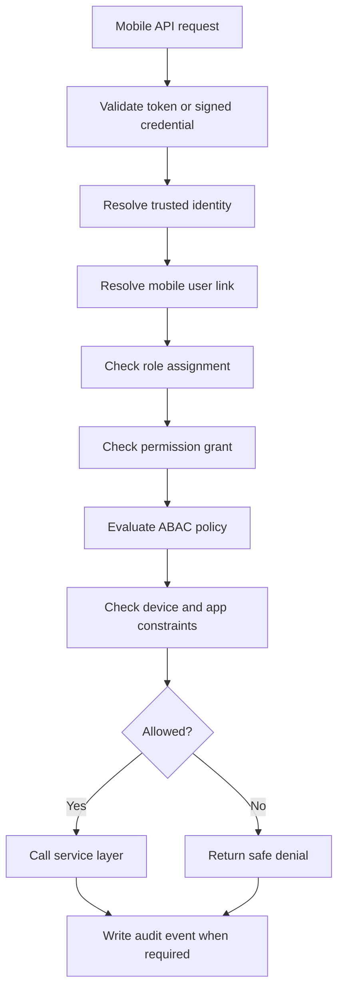
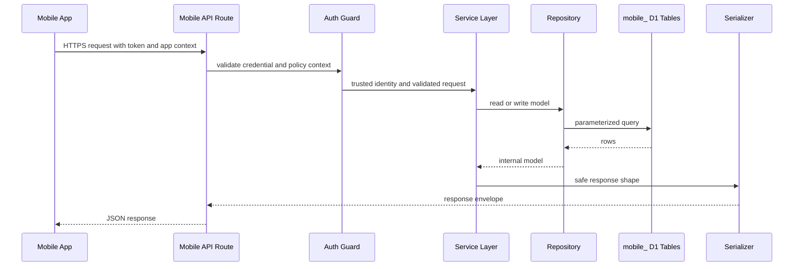
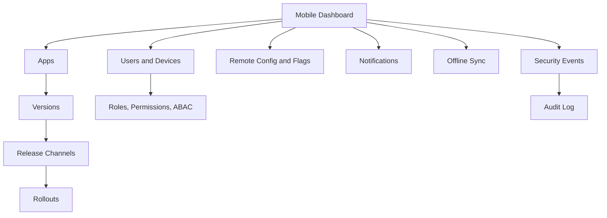
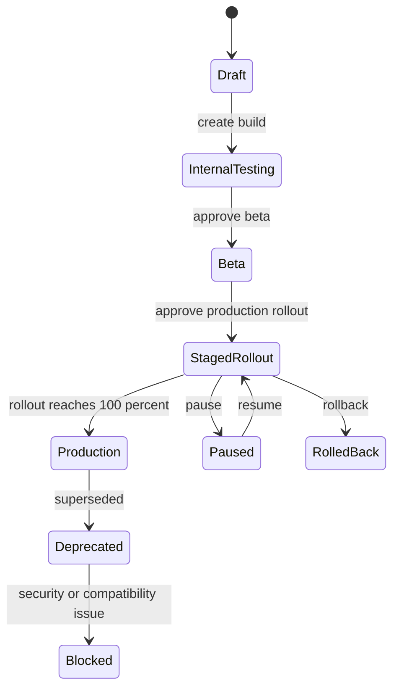
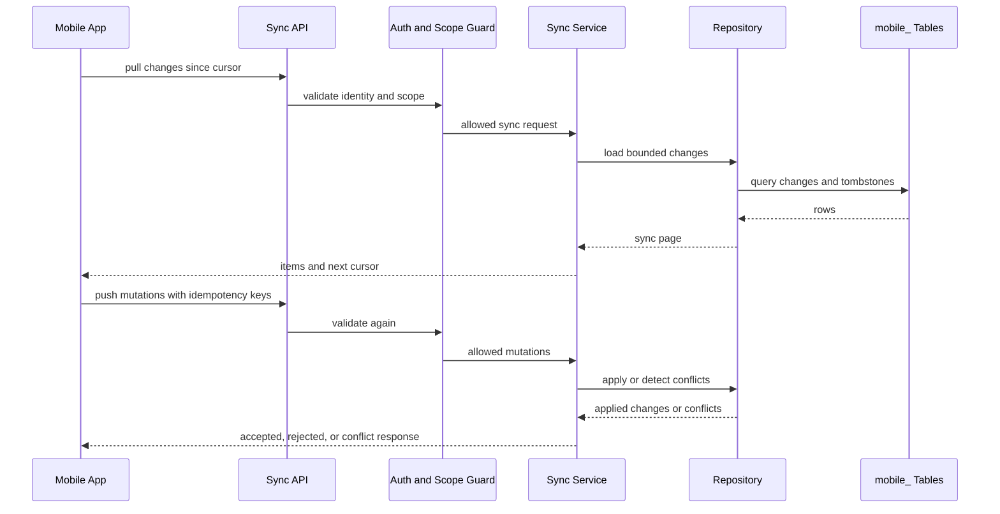
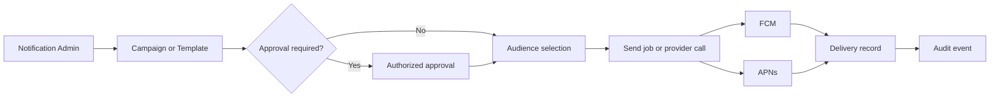
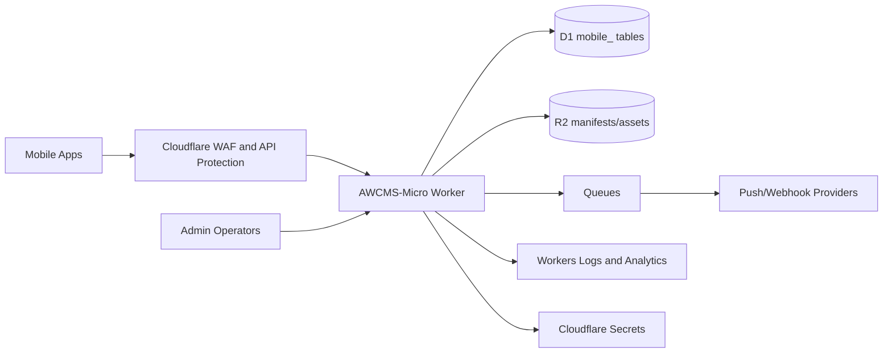

# AWCMS-Micro Mobile Services Plugin Standard

## Purpose

This document defines the official AWCMS-Micro standard for a plugin that manages mobile application services for Android and iOS clients.

The plugin may serve apps built with:

- Flutter for Android and iOS;
- native Android with Java or Kotlin;
- native iOS with Swift or Objective-C;
- React Native, Kotlin Multiplatform, .NET MAUI, Capacitor, or other mobile technologies when the same security and integration standards are met.

The standard is intentionally technology-neutral on the mobile client side and strict on the AWCMS-Micro integration side. The plugin must keep all mobile-service behavior inside an approved AWCMS-Micro plugin boundary and must not modify EmDash core.

Recommended future package identity:

```txt
Package: @awcms-micro/plugin-mobile-services
Plugin ID: awcms-micro-mobile-services
Database prefix: mobile_
Admin base route: /_emdash/admin/plugins/awcms-micro-mobile-services
API base route: /_emdash/api/plugins/awcms-micro-mobile-services
```

## Scope

The plugin should manage the backend-facing operational layer for mobile apps, including:

- application registry and platform metadata;
- app versions, release channels, compatibility rules, and rollout policy;
- mobile user access, roles, permissions, device bindings, and sessions;
- API credentials, JWT/OIDC/OAuth2 integration, and mobile authorization scopes;
- feature flags, remote configuration, and maintenance banners;
- push-notification providers and campaigns;
- offline/online data synchronization contracts;
- audit logs, operational logs, security events, and compliance evidence;
- endpoint documentation and SDK integration guidance;
- deployment, monitoring, incident response, and support workflows.

The plugin should not become a mobile source-code repository. Android/iOS source code belongs in separate app repositories. AWCMS-Micro stores service configuration, API contracts, release governance, and operational state.

## Architecture

The plugin should use a layered architecture that keeps mobile clients, public API, admin UI, service logic, D1 repositories, storage, and external providers separated.



Required layers:

| Layer | Responsibility |
| --- | --- |
| Mobile clients | Consume public mobile APIs, authenticate securely, send device telemetry only when allowed, and follow version/update policy |
| Public mobile API | Stable, versioned endpoints for mobile apps; no admin-only behavior |
| Admin UI | Operational dashboard for apps, versions, devices, users, roles, releases, notifications, sync, and audit |
| Typed API client | Shared TypeScript contracts for admin UI and backend route integration |
| Route layer | Thin request/response adapter with validation, auth, CSRF for admin calls, safe errors, and stable status codes |
| Service layer | Business decisions, rollout policy, permission checks, notification orchestration, sync conflict rules |
| Repository layer | Only direct access point to `mobile_` D1 tables |
| Serializer layer | Masks sensitive fields and prevents raw D1 rows from leaving backend code |
| Integration adapters | External push, auth, analytics, crash, or app-store providers |
| Audit/log layer | Durable evidence for security-sensitive and operational changes |

## EmDash And AWCMS-Micro Boundary Rules

- Implement the plugin under `awcmsmicro-dev/packages/plugins/awcms-micro-mobile-services/` when work begins.
- Keep root documentation and scripts only for governance, validation, and operator support.
- Do not modify `emdash-latest/` for mobile-specific behavior.
- Do not add mobile-specific logic to EmDash core packages.
- Use standard plugin descriptors, capabilities, routes, hooks, storage, and admin UI rules from EmDash.
- Prefer standard plugin format for sandbox compatibility unless React admin components or direct host integrations require native format.
- Keep all plugin-owned database tables and collections under the `mobile_` prefix.
- Add rebuild-safety rules, protected paths, and validation scripts before implementing persistent mobile plugin code.

## System Context



## Database Structure

The plugin should use dedicated D1 tables with the `mobile_` prefix. SQLite-compatible D1 column types should be used: `text`, `integer`, `real`, and `blob`. Store timestamps as ISO text. Booleans should be integers using `0` or `1`.

Every canonical table should include:

```txt
id
tenant_id
site_id
created_at
updated_at
deleted_at
created_by
updated_by
```

Soft delete should be the default for operational objects. Permanent delete should require elevated permission, reason, audit event, and integrity review.

### Recommended Tables

| Table | Purpose |
| --- | --- |
| `mobile_apps` | Registered mobile applications and product metadata |
| `mobile_platforms` | Platform rows for Android, iOS, or cross-platform clients |
| `mobile_app_versions` | Version records, build numbers, release notes, compatibility policy |
| `mobile_release_channels` | Channels such as internal, alpha, beta, staging, production |
| `mobile_rollout_rules` | Percentage, region, role, device, or channel rollout rules |
| `mobile_api_clients` | Client identifiers, allowed grant types, token policy, status |
| `mobile_device_registrations` | Device identifiers, app instance IDs, platform, push token hash, status |
| `mobile_user_links` | Links between EmDash users, external identities, and mobile principals |
| `mobile_role_assignments` | Mobile-service roles assigned to users or service principals |
| `mobile_permission_grants` | Explicit permission grants and scoped access decisions |
| `mobile_abac_policies` | Attribute-based policies for tenant, site, app, platform, region, or channel |
| `mobile_sessions` | Refresh-token families, session metadata, revocation status, risk signals |
| `mobile_feature_flags` | Mobile feature switches and audience rules |
| `mobile_remote_config` | Remote configuration keys, values, variants, and validation schemas |
| `mobile_notification_providers` | FCM, APNs, or other provider configuration metadata |
| `mobile_notification_campaigns` | Push campaigns, transactional templates, and approval workflow |
| `mobile_notification_deliveries` | Delivery attempts, provider message IDs, state, and failure reasons |
| `mobile_sync_collections` | Offline-sync dataset definitions and conflict strategy |
| `mobile_sync_cursors` | Per-device or per-user sync checkpoints |
| `mobile_sync_conflicts` | Conflict records requiring retry, policy resolution, or admin review |
| `mobile_api_keys` | Hashed API keys for non-user service integrations when JWT/OIDC is not suitable |
| `mobile_webhooks` | Outbound integration targets and signing metadata |
| `mobile_audit_events` | Security, release, notification, auth, device, and admin action audit events |
| `mobile_security_events` | Suspicious login, token, device, replay, and abuse signals |
| `mobile_operational_logs` | Structured operational events retained according to policy |

### Logical ERD

```mermaid
erDiagram
  MOBILE_APPS ||--o{ MOBILE_PLATFORMS : supports
  MOBILE_APPS ||--o{ MOBILE_APP_VERSIONS : releases
  MOBILE_APPS ||--o{ MOBILE_RELEASE_CHANNELS : has
  MOBILE_RELEASE_CHANNELS ||--o{ MOBILE_ROLLOUT_RULES : controls
  MOBILE_APP_VERSIONS ||--o{ MOBILE_ROLLOUT_RULES : targets
  MOBILE_APPS ||--o{ MOBILE_API_CLIENTS : exposes
  MOBILE_API_CLIENTS ||--o{ MOBILE_SESSIONS : issues
  MOBILE_APPS ||--o{ MOBILE_DEVICE_REGISTRATIONS : registers
  MOBILE_DEVICE_REGISTRATIONS ||--o{ MOBILE_SYNC_CURSORS : tracks
  MOBILE_SYNC_COLLECTIONS ||--o{ MOBILE_SYNC_CURSORS : checkpoints
  MOBILE_SYNC_COLLECTIONS ||--o{ MOBILE_SYNC_CONFLICTS : records
  MOBILE_NOTIFICATION_PROVIDERS ||--o{ MOBILE_NOTIFICATION_CAMPAIGNS : sends
  MOBILE_NOTIFICATION_CAMPAIGNS ||--o{ MOBILE_NOTIFICATION_DELIVERIES : creates
  MOBILE_APPS ||--o{ MOBILE_FEATURE_FLAGS : configures
  MOBILE_APPS ||--o{ MOBILE_REMOTE_CONFIG : configures
  MOBILE_USER_LINKS ||--o{ MOBILE_ROLE_ASSIGNMENTS : receives
  MOBILE_ROLE_ASSIGNMENTS ||--o{ MOBILE_PERMISSION_GRANTS : grants
  MOBILE_ABAC_POLICIES ||--o{ MOBILE_PERMISSION_GRANTS : constrains
  MOBILE_APPS ||--o{ MOBILE_AUDIT_EVENTS : audits
```



### Data Retention

- Keep audit events immutable for the configured retention period.
- Store push tokens encrypted or hashed when the provider does not require the raw token at rest.
- Store refresh tokens as hashes, never raw values.
- Store API keys as hashes with key prefix metadata for lookup.
- Separate operational logs from audit events so log retention can be shorter than audit retention.
- Provide data export and deletion workflows for privacy-regulated mobile user data.

## Backend Requirements

The backend must be implemented through plugin route, service, repository, serializer, and adapter layers.

Required backend modules:

- app registry service;
- app version and rollout service;
- mobile auth service;
- mobile user access service;
- device registration service;
- notification service;
- offline sync service;
- remote config and feature flag service;
- webhook service;
- monitoring and audit service;
- provider adapters for FCM, APNs, OIDC, analytics, crash reporting, and app-store metadata when enabled.

Backend rules:

- Validate every request body with schemas.
- Use typed request and response contracts.
- Return stable error codes and safe messages.
- Never expose raw provider errors or raw `error.message` to mobile clients.
- Never trust client-provided user IDs, roles, device ownership, tenant IDs, or scopes.
- Use cursor pagination for list endpoints.
- Clamp limits and reject unbounded queries.
- Use idempotency keys for notification send, sync mutation, release action, and webhook retry endpoints.
- Use replay protection for signed requests and webhook callbacks.
- Use transactional repository behavior where D1 support and runtime constraints allow it.
- Defer non-critical logging, metrics, and provider retries with safe background execution where supported.

## Authentication And Authorization

The plugin should support multiple authentication models, but one model must be selected and documented per deployment.

Recommended models:

| Model | Use Case | Requirement |
| --- | --- | --- |
| OIDC Authorization Code with PKCE | Mobile users authenticating through an identity provider | Preferred for production user login |
| JWT access token plus rotating refresh token | First-party mobile apps with plugin-managed sessions | Allowed when securely implemented |
| OAuth2 client credentials | service-to-service mobile backend integrations | Only for non-user workloads |
| Signed API key | constrained legacy service integrations | Must be scoped, hashed, rotated, and audited |
| EmDash admin session | admin UI only | Must not be accepted as mobile public API identity |

JWT requirements:

- Use asymmetric signing such as RS256 or EdDSA when tokens are issued by an external IdP.
- Validate `iss`, `aud`, `exp`, `nbf`, `iat`, `jti`, and allowed algorithms.
- Reject tokens with missing or unexpected `kid` when using JWKS.
- Cache JWKS safely with expiry and key rotation support.
- Keep access-token lifetime short.
- Rotate refresh tokens and detect reuse.
- Store refresh-token hashes only.
- Include mobile scopes and tenant/site/app claims only from trusted issuer or server-side policy.

Authorization requirements:

- Resolve trusted identity before any service call.
- Map external identity to EmDash user or mobile principal through `mobile_user_links`.
- Evaluate role, permission, ABAC, app, platform, channel, tenant, site, and device trust before allowing access.
- Deny by default.
- Prefer explicit permissions over role-string shortcuts.
- Record audit events for permission changes, token revocation, device blocking, release rollout, and notification sends.



## User, Role, Permission, And Access Management

The plugin should define mobile-specific access without duplicating EmDash user management.

Rules:

- Use EmDash users as admin/operator identities.
- Use external IdP subject IDs or plugin-managed mobile principals for mobile app users when mobile users are not EmDash admins.
- Do not reset, mutate, or delete EmDash core users from the plugin.
- Store mobile roles, permissions, scopes, policy attributes, and device access in `mobile_` tables.
- Keep admin roles distinct from mobile app roles.
- Support device-level blocking independent of user-level blocking.
- Support app/channel/platform access restrictions.

Recommended roles:

| Role | Scope |
| --- | --- |
| `mobile_admin` | Full mobile service administration except irreversible governance actions |
| `mobile_release_manager` | App versions, release channels, rollout, and update policy |
| `mobile_support` | Device/user lookup, safe support actions, limited logs |
| `mobile_notification_manager` | Notification templates, campaigns, approvals, delivery review |
| `mobile_security_officer` | Security events, token revocation, device blocking, audit review |
| `mobile_api_client` | Non-user service API access with explicit scopes |
| `mobile_user` | Mobile app user access to allowed app APIs |

Recommended permissions:

- `mobile:apps:read`
- `mobile:apps:write`
- `mobile:versions:read`
- `mobile:versions:write`
- `mobile:versions:publish`
- `mobile:rollouts:manage`
- `mobile:users:read`
- `mobile:users:manage`
- `mobile:devices:read`
- `mobile:devices:block`
- `mobile:notifications:read`
- `mobile:notifications:send`
- `mobile:sync:read`
- `mobile:sync:resolve_conflict`
- `mobile:security:read`
- `mobile:security:respond`
- `mobile:audit:read`
- `mobile:settings:manage`

## API Standard

All APIs must be versioned. Use a stable URL version segment for mobile clients.

Recommended public base:

```txt
/_emdash/api/plugins/awcms-micro-mobile-services/v1/mobile
```

Recommended admin base:

```txt
/_emdash/api/plugins/awcms-micro-mobile-services/admin/v1
```

Response envelope:

```json
{
  "success": true,
  "data": {},
  "meta": {
    "requestId": "req_...",
    "apiVersion": "v1"
  }
}
```

Error envelope:

```json
{
  "success": false,
  "error": {
    "code": "MOBILE_VALIDATION_ERROR",
    "message": "The request is invalid."
  },
  "meta": {
    "requestId": "req_...",
    "apiVersion": "v1"
  }
}
```

API rules:

- Use HTTPS only in production.
- Use `Authorization: Bearer <token>` for JWT/OIDC access tokens.
- Use `X-EmDash-Request: 1` for state-changing admin endpoints.
- Use `X-Mobile-App-ID`, `X-Mobile-Platform`, `X-Mobile-App-Version`, and `X-Mobile-Device-ID` only as contextual hints, not as trusted identity.
- Support `X-Request-ID` or generate a request ID server-side.
- Support idempotency with `Idempotency-Key` on mutation endpoints where retries are expected.
- Return `401` for missing/invalid authentication and `403` for authenticated but unauthorized access.
- Return `409` for sync conflicts and incompatible version state.
- Return `426` or a documented error code for mandatory app update requirements.
- Publish OpenAPI documentation for all public and admin endpoints before implementation is considered complete.

### Recommended Endpoint Catalog

| Method | Endpoint | Purpose | Auth |
| --- | --- | --- | --- |
| `GET` | `/v1/mobile/status` | Public mobile service status and minimum supported API version | optional or app token |
| `GET` | `/v1/mobile/apps/{appId}/config` | Remote config and feature flags for app/platform/version | mobile token |
| `GET` | `/v1/mobile/apps/{appId}/version-policy` | Required, recommended, or optional update policy | app token or mobile token |
| `POST` | `/v1/mobile/auth/session` | Exchange trusted OIDC/JWT assertion for plugin session when plugin-managed sessions are enabled | OIDC/JWT |
| `POST` | `/v1/mobile/auth/refresh` | Rotate refresh token and issue a new access token | refresh token |
| `POST` | `/v1/mobile/auth/logout` | Revoke current session/device token family | mobile token |
| `POST` | `/v1/mobile/devices/register` | Register or update device metadata and push-token hash | mobile token |
| `POST` | `/v1/mobile/devices/unregister` | Remove push token or deactivate device registration | mobile token |
| `GET` | `/v1/mobile/sync/{collection}` | Pull offline-sync changes since cursor | mobile token |
| `POST` | `/v1/mobile/sync/{collection}` | Push local mutations with idempotency and conflict detection | mobile token |
| `GET` | `/v1/mobile/notifications/preferences` | Read notification preferences | mobile token |
| `PUT` | `/v1/mobile/notifications/preferences` | Update notification preferences | mobile token |
| `POST` | `/admin/v1/apps` | Create app registry entry | admin permission |
| `GET` | `/admin/v1/apps` | List apps | admin permission |
| `GET` | `/admin/v1/apps/{appId}` | Get app detail | admin permission |
| `PATCH` | `/admin/v1/apps/{appId}` | Update app metadata | admin permission |
| `POST` | `/admin/v1/apps/{appId}/versions` | Create version record | release permission |
| `PATCH` | `/admin/v1/apps/{appId}/versions/{versionId}` | Update version policy | release permission |
| `POST` | `/admin/v1/apps/{appId}/rollouts` | Create rollout rule | release permission |
| `POST` | `/admin/v1/apps/{appId}/rollouts/{rolloutId}/pause` | Pause rollout | release permission |
| `GET` | `/admin/v1/devices` | Search devices | support permission |
| `POST` | `/admin/v1/devices/{deviceId}/block` | Block device | security permission |
| `GET` | `/admin/v1/users` | Search linked mobile users | support permission |
| `POST` | `/admin/v1/users/{userId}/revoke-sessions` | Revoke sessions | security permission |
| `POST` | `/admin/v1/notifications/campaigns` | Create campaign | notification permission |
| `POST` | `/admin/v1/notifications/campaigns/{id}/send` | Send or schedule campaign | notification permission |
| `GET` | `/admin/v1/sync/conflicts` | List sync conflicts | sync permission |
| `POST` | `/admin/v1/sync/conflicts/{id}/resolve` | Resolve sync conflict | sync permission |
| `GET` | `/admin/v1/audit-events` | Search audit events | audit permission |
| `GET` | `/admin/v1/security-events` | Search security events | security permission |

### API Sequence



## Admin Pages

The plugin admin UI should use Kumo components, Lingui-compatible localization, RTL-safe layout classes, and accessible interaction states.

Required admin pages:

| Page | Purpose |
| --- | --- |
| Dashboard | Health, version adoption, active devices, errors, notification status, sync health |
| Apps | App registry, platform metadata, app identifiers, store links |
| Versions | Version list, semantic version, build number, platform, release notes, compatibility policy |
| Release Channels | Internal, alpha, beta, staging, production, channel membership |
| Rollouts | Percentage rollout, staged release, pause/resume, rollback, targeting rules |
| API Clients | Client IDs, scopes, grant types, allowed origins/hosts, token policy |
| Users | Linked mobile users, EmDash references, external subject IDs, role assignment |
| Devices | Device registry, push-token status, blocked devices, last seen, risk score |
| Roles And Permissions | Role definitions, permission grants, ABAC policies, scope previews |
| Remote Config | Key/value config, variants, schema validation, targeting rules |
| Feature Flags | Mobile flags, audience targeting, rollout, kill switches |
| Notifications | Providers, templates, campaigns, transactional messages, delivery review |
| Offline Sync | Collections, cursors, pending conflicts, retry and resolution policy |
| Webhooks | Outbound event targets, signing keys, retry status |
| Security Events | Suspicious activity, token reuse, blocked devices, provider failures |
| Audit Log | Immutable administrative and security-sensitive events |
| Settings | Provider config metadata, retention policy, update policy defaults |

Admin UI states required for each data-driven page:

- loading;
- empty;
- filtered empty;
- error with safe message;
- permission denied;
- success;
- destructive-action confirmation;
- pending background operation;
- audit-visible completion state.



## UI/UX Requirements

Design goals:

- Make release state and production risk visible before any publish action.
- Separate configuration, release, user access, and security workflows.
- Use progressive disclosure for advanced ABAC, sync, notification, and provider settings.
- Keep dangerous actions behind explicit confirmation, reason capture, permission check, and audit event.
- Provide copy-ready mobile integration snippets without exposing secrets.
- Support mobile app teams, support teams, release managers, and security operators with distinct workflows.

Recommended release workflow:



Accessibility requirements:

- keyboard navigation for every table, filter, dialog, and destructive action;
- visible focus states;
- descriptive labels and ARIA names;
- semantic table markup for operational lists;
- accessible color contrast for release, risk, and status badges;
- no interaction that depends only on color;
- localized date/time and number formatting;
- mobile-friendly admin pages where operational use from tablets is expected.

## Public Pages

Public pages are optional. If implemented, they must be public-safe and should not expose operational data.

Allowed public pages:

- mobile app download landing page;
- release notes page for public versions;
- support and troubleshooting page;
- privacy notice and data-use page;
- status page with aggregate service state;
- developer documentation page for public SDK setup when no secrets are included.

Forbidden public output:

- raw device identifiers;
- push tokens;
- user identity links;
- security events;
- audit logs;
- provider configuration;
- rollout targeting rules that reveal restricted operational policy;
- internal API client identifiers or secrets.

## Integration With Other AWCMS-Micro Plugins

The mobile services plugin should integrate through typed contracts and explicit capabilities, not by reading another plugin's private tables directly.

Recommended integration patterns:

| Integration | Purpose | Rule |
| --- | --- | --- |
| SIKESRA plugin | Mobile registry workflows, verification status, document status, public aggregate views | Use SIKESRA-approved public or admin APIs; do not bypass SIKESRA RBAC/ABAC |
| Gallery plugin | Mobile media listing and safe image delivery | Use public-safe gallery APIs and R2 URLs only where allowed |
| Docs plugin | Mobile documentation and onboarding pages | Read shared docs copy, no privileged access |
| Default templates | App download pages, release notes, status pages | Keep public output public-safe |
| Cloudflare template | Worker, D1, R2, queues, analytics, push provider integration | Keep bindings and secrets outside tracked code where required |

Integration requirements:

- Define every cross-plugin request and response type.
- Document permissions required for each integration.
- Avoid circular plugin dependencies.
- Use stable API contracts and compatibility versions.
- Record audit events when integration actions affect users, releases, notifications, or sensitive data.
- Add integration tests or contract tests before relying on another plugin for production mobile behavior.

## Data Security

Required controls:

- TLS for all mobile and admin traffic.
- Strict token validation and short-lived access tokens.
- Refresh-token rotation and reuse detection.
- Device binding and revocation where appropriate.
- Hash API keys, refresh tokens, and sensitive tokens at rest.
- Encrypt or avoid storing raw push tokens where provider workflows allow it.
- Sign outbound webhooks and verify inbound callbacks.
- Protect against replay with nonce, timestamp, idempotency, and token-family checks.
- Rate-limit auth, refresh, sync, and notification endpoints.
- Mask sensitive fields in admin lists by default.
- Restrict support-role visibility to the minimum data needed.
- Keep personal data out of operational logs.
- Use audit events for all high-impact admin actions.
- Provide incident response playbooks for token compromise, provider compromise, bad rollout, and data exposure.

Security event examples:

- invalid token burst;
- refresh token reuse;
- device ID mismatch;
- impossible travel or abnormal region shift when such signals are available;
- blocked device access attempt;
- excessive sync retries;
- notification provider credential failure;
- webhook signature failure;
- app version blocked due to security issue.

## Offline And Online Data Synchronization

Offline sync is optional, but if the plugin supports it, it must be designed as a first-class data contract.

Sync requirements:

- Define sync collections explicitly in `mobile_sync_collections`.
- Use stable server IDs and client mutation IDs.
- Use cursor-based pull sync.
- Use idempotent push sync.
- Track per-device or per-user sync cursor state.
- Define conflict strategy per collection.
- Support tombstones for deletes when clients need offline delete awareness.
- Never expose data outside the authenticated user's allowed scope.
- Re-check authorization on every sync request.
- Keep sync payloads bounded by size and item count.
- Provide retry and backoff guidance for mobile clients.

Conflict strategies:

| Strategy | Use Case |
| --- | --- |
| server wins | authoritative settings, release policy, feature flags |
| client wins | low-risk draft preferences with clear audit trail |
| field merge | non-overlapping editable profile fields |
| manual review | sensitive records, regulated workflows, conflicting documents |
| reject and retry | stale writes or missing prerequisites |



## Notification Integration

Supported providers should include:

- Firebase Cloud Messaging for Android and Flutter;
- Apple Push Notification service for iOS;
- Expo push service when an Expo-based app is explicitly selected;
- provider-agnostic webhook or queue adapter for custom notification backends.

Notification requirements:

- Store provider credential references outside tracked code.
- Store only the minimum push-token metadata needed.
- Support opt-in, opt-out, and per-topic preferences.
- Support transactional and campaign notifications separately.
- Require approval workflow for broad campaigns.
- Use idempotency keys for sends.
- Record delivery attempts and provider message IDs.
- Avoid sending personal or sensitive data in notification payloads.
- Provide dry-run and audience preview before campaign send.
- Support quiet hours, locale, region, tenant, app, platform, and version targeting when needed.



## Mobile App Versioning

The plugin must distinguish these version concepts:

| Concept | Example | Purpose |
| --- | --- | --- |
| App semantic version | `1.4.2` | Human-readable release version |
| Platform build number | Android `versionCode`, iOS `CFBundleVersion` | Platform-enforced build ordering |
| API version | `v1` | Backend compatibility contract |
| Config schema version | `2026-01` | Remote config validation and migration |
| Sync schema version | `sync-v3` | Offline payload compatibility |
| Release channel | beta, production | Audience and rollout grouping |

Versioning rules:

- Track Android and iOS builds separately even when the app is built with Flutter.
- Store minimum supported app version per platform.
- Store recommended version separately from mandatory version.
- Store blocked versions for security incidents.
- Define API compatibility by app version and platform.
- Require release notes for production versions.
- Require rollback notes for risky releases.
- Keep historical release records immutable after production release except for status metadata.

## App Update Mechanism

The plugin should not replace official app stores. It should provide policy and metadata that mobile apps can consume.

Supported update policies:

- no update required;
- optional update available;
- recommended update;
- mandatory update;
- blocked version due to security or compatibility risk;
- maintenance mode.

Update response example:

```json
{
  "success": true,
  "data": {
    "policy": "recommended",
    "currentVersion": "1.4.0",
    "latestVersion": "1.4.2",
    "minimumVersion": "1.3.8",
    "releaseNotesUrl": "/mobile/apps/example/releases/1.4.2",
    "storeUrl": "https://example.com/app-store-link"
  }
}
```

Rules:

- Use app-store links for production updates.
- Do not distribute production APK/IPA files directly unless the organization has a documented enterprise distribution policy.
- Store internal test artifacts in R2 only when access control, expiry, audit, and legal policy are defined.
- For Flutter, do not rely on unauthorized binary patching or hot update mechanisms that violate platform policies.
- Remote config can change behavior but must not bypass app-store review for regulated app functionality.

## Deployment Strategy

The plugin should support Node/SQLite local development and Cloudflare production deployment.

Recommended Cloudflare resources:

- Workers for API runtime;
- D1 for mobile service tables;
- R2 for release manifests, public release notes assets, or approved internal artifacts;
- KV only for short-lived config cache when justified;
- Queues for notification fanout, webhook retry, heavy sync reconciliation, or audit enrichment;
- Cron Triggers for cleanup, token-family pruning, campaign scheduling, and provider status checks;
- Analytics Engine or Workers Logs for operational metrics when configured;
- WAF and API protection for public mobile endpoints.



Deployment requirements:

- Validate bindings before deploy.
- Keep provider secrets in Cloudflare secrets or CI secrets, never in git.
- Use separate environments for development, staging, and production.
- Use environment-specific app IDs, provider credentials, and callback URLs.
- Run smoke checks against public mobile status, version policy, auth, admin dashboard, and notification dry-run endpoints.
- Keep rollback procedure for Worker version, D1 migrations, notification provider keys, and release policy.
- Document production cutover and DNS/API gateway policy.

## Monitoring, Logging, And Audit

Monitoring must cover API health, mobile adoption, auth, release rollout, sync, notifications, provider integrations, and security.

Required metrics:

- request count and error rate by endpoint;
- auth failures and token refresh failures;
- active device count by app/platform/version;
- mandatory-update hit rate;
- rollout progress and rollback count;
- notification send, delivery, and failure count;
- sync pull/push count, conflict count, and average payload size;
- provider API failure rate;
- blocked device and revoked session count;
- audit event write success rate.

Logging rules:

- Use structured logs with request ID, app ID, platform, API version, and safe status fields.
- Do not log raw tokens, API keys, push tokens, passwords, personal identifiers, or full request bodies containing personal data.
- Separate operational logs from audit events.
- Use stable event names.
- Include safe correlation IDs for incident response.

Audit events must capture:

- actor identity;
- action;
- target type and ID;
- reason for high-impact actions;
- before/after summary when safe;
- request ID;
- IP/user-agent where allowed by policy;
- timestamp;
- result and error code.

## Mobile SDK And Client Guidance

The plugin documentation should include mobile developer guidance for each supported platform.

Required client guidance:

- Android Kotlin setup;
- Android Java setup if Java is supported;
- iOS Swift setup;
- Flutter setup;
- token acquisition and refresh lifecycle;
- secure local storage of refresh tokens using platform keystore/keychain;
- API base URL and API version selection;
- retry and backoff rules;
- offline sync contract;
- app update policy handling;
- push notification registration and preference update;
- telemetry and privacy rules;
- error-code mapping;
- test environment setup.

Client security rules:

- Never embed long-lived secrets in mobile apps.
- Treat app IDs and public client IDs as public identifiers, not secrets.
- Use PKCE for user login flows.
- Store tokens only in platform-secure storage.
- Clear token state on logout, device compromise, or session revocation response.
- Pinning may be considered for high-risk deployments, but pin rotation and recovery must be documented before use.

## Nontechnical Requirements

Professional mobile service management requires governance outside code.

Required nontechnical standards:

- product owner for each registered app;
- release manager for production rollout;
- security owner for auth, token, and device policy;
- privacy owner for mobile personal-data handling;
- support owner for device/user support workflows;
- incident response owner for compromised tokens, bad releases, or provider failures;
- documented app-store ownership and credential custody;
- documented provider account ownership for FCM, APNs, OIDC, analytics, and crash reporting;
- service-level objectives for uptime, latency, sync freshness, notification delivery, and support response;
- change-management policy for production release and mandatory update decisions;
- legal review for privacy notice, telemetry, push notifications, and app-store distribution terms.

## Testing And QA

Required test categories:

- unit tests for services, repositories, serializers, and policy evaluators;
- API contract tests for public and admin endpoints;
- auth tests for JWT/OIDC validation, refresh rotation, session revocation, and role/permission denial;
- database migration and prefix validation tests for `mobile_` tables;
- admin UI tests for critical flows and permission-denied states;
- integration tests for FCM/APNs adapters using mocked provider boundaries;
- offline sync tests for cursor, conflict, tombstone, and idempotency behavior;
- security tests for replay, missing token, wrong audience, expired token, blocked device, and scope mismatch;
- deployment smoke tests for Cloudflare bindings and production-safe endpoints;
- mobile client contract tests for Flutter, Android, and iOS sample calls where SDKs are provided.

Minimum validation commands once the plugin exists:

```bash
pnpm --filter @awcms-micro/plugin-mobile-services typecheck
pnpm --filter @awcms-micro/plugin-mobile-services test
pnpm --filter @awcms-micro/plugin-mobile-services build
bash scripts/validate-awcmsmicro-boundaries.sh
```

## Documentation Deliverables

Before the plugin is considered implementation-ready, it should include:

- plugin README;
- technical PRD;
- implementation governance document;
- API reference with OpenAPI schema;
- database schema and migration notes;
- admin UI/UX flow document;
- security model;
- deployment runbook;
- notification provider setup guide;
- mobile app integration guide for Flutter, Android Kotlin/Java, and iOS Swift;
- offline sync contract when sync is enabled;
- monitoring and audit guide;
- release and rollback guide;
- issue backlog or project index with sequenced implementation issues.

## Recommended Implementation Backlog

Use sequenced GitHub issues before implementation starts. Suggested project key: `MOBILE-SERVICES`.

| Sequence | Type | Priority | Goal |
| --- | --- | --- | --- |
| `SEQ-01` | DOCS/GOVERNANCE | P0 | Create plugin README, PRD, implementation governance, and issue index |
| `SEQ-02` | ARCHITECTURE | P0 | Define plugin identity, descriptor format, capabilities, and boundary validation |
| `SEQ-03` | DB | P0 | Add `mobile_` D1 migration framework and prefix validation tests |
| `SEQ-04` | API | P0 | Define typed public/admin API contracts and OpenAPI output |
| `SEQ-05` | SECURITY | P0 | Implement auth model, JWT/OIDC validation, token rotation, and RBAC/ABAC guard |
| `SEQ-06` | UI/UX | P1 | Implement admin dashboard, apps, versions, devices, users, and access pages |
| `SEQ-07` | DEPLOYMENT | P1 | Add Cloudflare bindings, secrets guidance, and smoke tests |
| `SEQ-08` | INTEGRATION | P1 | Add app version policy, remote config, and feature flags |
| `SEQ-09` | NOTIFICATION | P1 | Add FCM/APNs provider adapters and notification workflows |
| `SEQ-10` | SYNC | P2 | Add offline sync contracts, cursors, conflicts, and tests when required |
| `SEQ-11` | OBSERVABILITY | P1 | Add monitoring, structured logs, audit, and security event workflows |
| `SEQ-12` | SDK | P2 | Add Flutter, Android Kotlin/Java, and iOS Swift integration guides or SDK samples |
| `SEQ-13` | QA | P1 | Add end-to-end contract tests and production readiness checklist |

## Acceptance Criteria For The Standard

A mobile services plugin implementation is aligned with this standard only when:

- all mobile behavior lives inside approved AWCMS-Micro plugin/template/support boundaries;
- all plugin-owned data uses the `mobile_` prefix;
- public and admin APIs are versioned, typed, documented, and tested;
- JWT/OIDC/API-key behavior is explicitly selected, implemented securely, and audited;
- mobile user, role, permission, ABAC, session, and device access workflows are implemented;
- admin UI covers app registry, versions, rollouts, users, devices, notifications, sync, security, audit, and settings;
- public pages, if any, expose only public-safe information;
- notifications, offline sync, remote config, and version policy have explicit contracts;
- Cloudflare deployment, secrets, monitoring, logging, audit, rollback, and incident response are documented;
- mobile client integration guidance exists for every supported client technology;
- validation commands pass and rebuild safety is proven.
