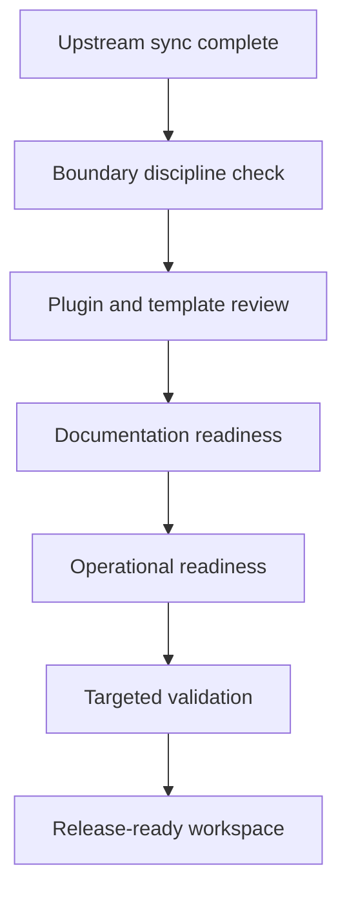

# AWCMS-Micro Release Readiness Checklist

## Purpose

This checklist is used to decide whether the maintained `awcmsmicro-dev/` workspace is ready to be promoted or released as the basis for an independent `awcms-micro` repository state.

## Scope

Use this checklist after upstream sync work and after AWCMS-Micro plugin/template changes are complete.

## Release Readiness Checks

### 1. Upstream Alignment

- `emdash-latest/` is refreshed to the intended upstream EmDash revision
- `awcmsmicro-dev/` has been rebuilt from that upstream snapshot
- no required AWCMS-Micro behavior depends on direct EmDash core edits

### 2. Boundary Discipline

- all new product behavior lives in plugin or template boundaries
- supporting docs, demos, and E2E assets remain support surfaces only
- boundary validation passes
- no retired or disallowed paths are being used as active product layers

### 3. Product Surface Review

- all active AWCMS-Micro plugins in release scope build and test cleanly
- target templates typecheck cleanly for the intended release surface
- plugin/template naming is consistent across docs and package examples
- product-facing README source is current

### 4. Documentation Readiness

- promotion checklist is current
- AWCMS versioning documentation is current
- root workspace snapshot changelog is current for the active EmDash revision and all workspace plugins/templates
- deployment runbook is current for the intended environment
- security baseline reflects the current plugin-and-template-only model
- compatibility matrix reflects the current overlays accurately

### 5. Operational Readiness

- smoke checks are defined for the intended deployment target
- rollback guidance is current
- no secrets or private identifiers are staged in tracked files
- any required release notes or divergence notes are updated

## Suggested Validation Commands

Run the closest available checks for the intended release surface.

Minimum recommended checks:

1. `bash scripts/validate-awcmsmicro-boundaries.sh`
2. `bash scripts/awcms-root-versioning.sh status`
3. `node awcmsmicro-dev/.github/scripts/awcms-version.mjs status`
4. `pnpm --filter @awcms-micro/plugin-docs typecheck`
5. `pnpm --filter @awcms-micro/plugin-docs test`
6. `pnpm --filter @awcms-micro/plugin-gallery typecheck`
7. `pnpm --filter @awcms-micro/plugin-gallery test`
8. `pnpm --filter @awcms-micro/plugin-sikesra typecheck`
9. `pnpm --filter @awcms-micro/plugin-sikesra test`
10. `pnpm --filter @awcms-micro/plugin-email-mailketing typecheck`
11. `pnpm --filter @awcms-micro/plugin-email-mailketing test`
12. `pnpm --filter @awcms-micro/template-default-example typecheck`
13. `pnpm --filter @awcms-micro/template-default-cloudflare typecheck`

These commands are examples. Repeat the relevant plugin or template checks for every package in the current release scope, and add any surface-specific UI, backend, or database checks that apply.

## Exit Criteria

The workspace is release-ready when:

- sync status is understood and intentional
- plugin and template boundaries are clean
- core product docs are current
- targeted validation passes for the intended release surface
