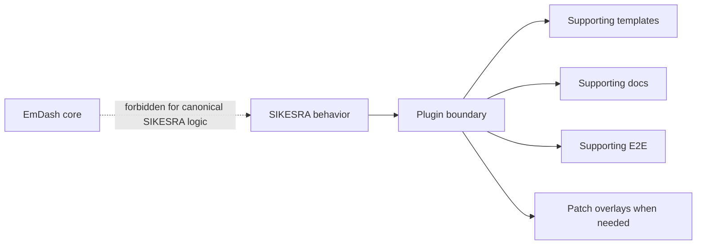
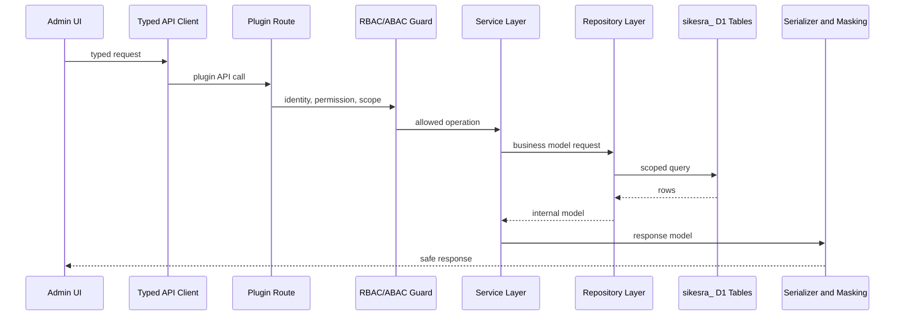
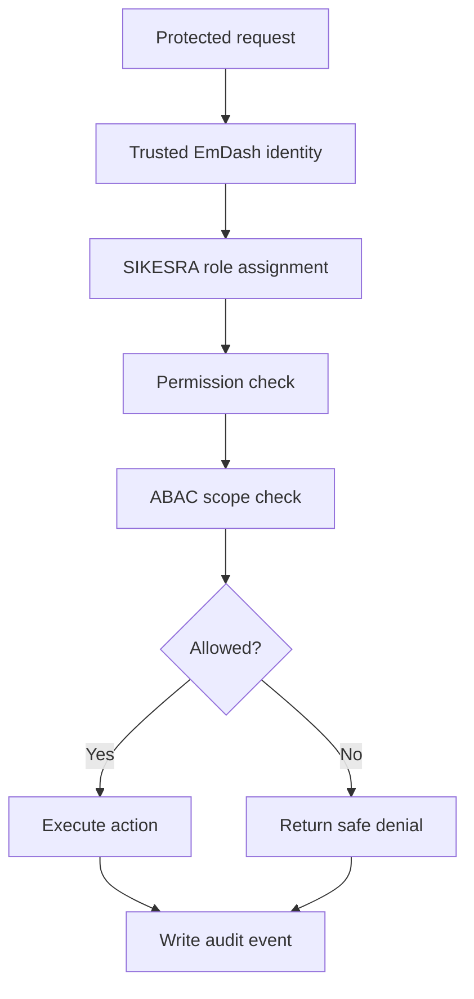

# AWCMS-Micro SIKESRA Plugin Governance

This document summarizes the repository-level governance rules for the AWCMS-Micro SIKESRA plugin.

The detailed implementation backlog is tracked in GitHub issues #119 through #143 and follows the issue execution standard in `docs/awcms-micro-github-issue-system.md`.

## 1. Plugin Boundary

SIKESRA is a downstream AWCMS-Micro plugin.

Canonical location:

```txt
awcmsmicro-dev/packages/plugins/awcms-micro-sikesra/
```

Allowed supporting locations:

```txt
awcmsmicro-dev/templates/awcms-micro-default/
awcmsmicro-dev/templates/awcms-micro-default-cloudflare/
awcmsmicro-dev/docs/awcms-micro/
awcmsmicro-dev/e2e/awcms-micro/
awcmsmicro-dev/.awcms-changesets/
awcmsmicro-dev/.awcms-patches/
docs/
scripts/
```

Do not place SIKESRA-specific canonical logic inside EmDash core packages.



Forbidden locations for SIKESRA canonical business behavior:

```txt
emdash-latest/packages/core/
emdash-latest/packages/admin/
emdash-latest/packages/*
```

Exception: an explicit upstream EmDash contribution may touch EmDash core, but it must be tracked as upstream work and must not be required for SIKESRA data safety.

## 2. GitHub Issue System

SIKESRA issues are implementation contracts.

Issue title pattern:

```txt
[SIKESRA][SEQ-XX][TYPE][PRIORITY] Title
```

Rules:

- `SEQ` controls execution order.
- `P0/P1/P2/P3` controls risk and urgency.
- Suffixes such as `SEQ-01A` or `SEQ-07A` insert urgent or dependency issues without renumbering the backlog.
- Before executing an issue, read its related issues and the current sequence order.
- When the issue order changes, update this document, `docs/awcms-micro-github-issue-system.md`, `README.md`, `AGENTS.md`, and plugin-local docs.

## 3. Current Ordered Backlog

| Order | Issue | Purpose |
| ---: | ---: | --- |
| 1 | #140 | Final SIKESRA plugin identity and export name |
| 2 | #141 | Admin dashboard route bug fix |
| 3 | #142 | End-to-end admin UI/UX design system |
| 4 | #119 | Dedicated `sikesra_` D1 table and collection naming policy |
| 5 | #121 | D1 table prefix validation test |
| 6 | #136 | EmDash update/rebuild compatibility guardrails |
| 7 | #137 | Data preservation guardrails for update/rebuild safety |
| 8 | #120 | SIKESRA D1 migration framework |
| 9 | #122 | D1 repository layer |
| 10 | #143 | Typed frontend-backend-D1 integration contract |
| 11 | #123 | Core D1 tables for settings, data types, and regions |
| 12 | #135 | Standard personal and non-personal fields for all 8 modules |
| 13 | #124 | Migration from KV/plugin storage to dedicated D1 tables |
| 14 | #125 | Registry D1 tables for all 8 data modules |
| 15 | #132 | SIKESRA RBAC/ABAC with EmDash user assignment |
| 16 | #133 | Canonical D1 audit table and redaction policy |
| 17 | #126 | Registry list/save route refactor to D1 |
| 18 | #127 | D1-backed 20-digit SIKESRA ID sequence service |
| 19 | #128 | Verification D1 tables and routes |
| 20 | #129 | Document D1 tables and secure R2 metadata workflow |
| 21 | #130 | D1-backed staged CSV/XLSX import workflow |
| 22 | #131 | Duplicate detection and duplicate decisions |
| 23 | #134 | D1 export job and controlled report/export workflow |
| 24 | #138 | Dynamic custom attributes by data type, subtype, entity, or SIKESRA ID |
| 25 | #139 | Full CRUD and highest-admin governance |

## 4. Execution Guidance

Recommended phases:

1. **Identity and immediate admin safety**: #140, #141.
2. **UI/UX standard**: #142.
3. **Naming and guardrails**: #119, #121, #136, #137.
4. **D1 foundation**: #120, #122, #143, #123.
5. **Data model and state migration**: #135, #124, #125.
6. **Authorization and audit foundation**: #132, #133.
7. **Core workflows**: #126, #127, #128, #129, #130, #131, #134.
8. **Advanced extensibility and lifecycle governance**: #138, #139.

Do not start later workflow implementation before the earlier identity, route, UI/UX, naming, guardrail, migration, repository, integration-contract, field-standard, RBAC/ABAC, and audit foundations are ready.

## 5. D1 Data Boundary

All canonical SIKESRA production tables must use the `sikesra_` prefix.

Examples:

```txt
sikesra_registry_entities
sikesra_person_profiles
sikesra_supporting_documents
sikesra_verification_events
sikesra_audit_events
sikesra_user_role_assignments
sikesra_abac_policy_rules
sikesra_custom_attribute_definitions
sikesra_delete_requests
```

Rules:

- Do not create unprefixed SIKESRA tables.
- Do not store SIKESRA canonical business data in EmDash core tables.
- Do not store SIKESRA canonical production data only in generic plugin storage once D1 migration is implemented.
- Every business table must be tenant-ready and site-ready.
- Every normal read must be tenant/site scoped.
- Soft-deleted rows must be excluded by default.

Minimum business-table columns:

```txt
tenant_id
site_id
created_at
updated_at
deleted_at
created_by
updated_by
```

## 6. Frontend-Backend-D1 Contract

Issue #143 defines the required integration contract.

Target flow:

```txt
Admin UI → typed API client → plugin route → trusted EmDash user → SIKESRA RBAC/ABAC guard → service layer → repository layer → sikesra_ D1 tables → serializer/masking → Admin UI
```

Rules:

- admin UI must use typed API clients instead of scattered raw `fetch()` calls;
- plugin routes must validate request contracts before service/repository calls;
- repository layer should be the only direct access point to `sikesra_` business tables;
- serializers must prevent raw D1 rows from being returned to the UI;
- public serializers must not expose personal, sensitive personal, restricted, address, document, or internal storage data.



## 7. EmDash User Reference Rule

SIKESRA must not create a separate user system.

Rules:

- Use trusted EmDash user/session identity as the source of user identity.
- Reference EmDash user IDs from SIKESRA assignment tables.
- Store SIKESRA role, permission, scope, and ABAC data in `sikesra_` tables.
- Do not mutate EmDash core user tables from the SIKESRA plugin.
- Do not delete EmDash users from the SIKESRA plugin.
- If an EmDash user is removed or deactivated, preserve SIKESRA assignment history and mark/report the reference as inactive or orphaned.

## 8. Field Standards

Every SIKESRA field must have a clear classification:

```txt
non_personal
personal
sensitive_personal
restricted
```

Personal modules must distinguish between:

```txt
alamat_ktp_*
alamat_domisili_*
alamat_domisili_sama_dengan_ktp
```

Rules:

- KTP address and domicile address are sensitive personal data.
- Public APIs must never expose KTP or domicile address details.
- Export of KTP or domicile address requires restricted export permission, reason, and audit.
- Import mapping must distinguish KTP address fields and domicile address fields.

## 9. Public Aggregate Rule

SIKESRA public output must be aggregate-only and public-safe.

Rules:

- Public routes may expose only approved aggregate counts or public-safe non-personal aggregate attributes.
- Public output must not expose names, NIK/KIA, KK, phone numbers, emails, KTP addresses, domicile addresses, exact residential coordinates, sensitive welfare data, raw document metadata, or internal storage details.
- Small-cell suppression must remain enabled for vulnerable groups.

## 10. RBAC, ABAC, and Lifecycle Governance

SIKESRA authorization must enforce:

```txt
trusted EmDash user identity
SIKESRA role assignment
SIKESRA permission
ABAC region scope
ABAC organization/module scope
data sensitivity and masking policy
audit logging for sensitive or mutating actions
```

Lifecycle policy:

- soft delete is the default;
- restore is allowed where applicable;
- high-impact lifecycle actions require the dedicated governance workflow in #139;
- governance actions must not affect EmDash core users.



## 11. Update/Rebuild Safety

SIKESRA must remain safe across:

```txt
EmDash upstream update
dependency reinstall
workspace rebuild
local template rebuild
Cloudflare template rebuild
D1 migration rerun
template regeneration
```

Guardrails required by #136 and #137 include:

```txt
awcms:sikesra:check-boundary
awcms:sikesra:check-d1-prefix
awcms:sikesra:check-routes
awcms:sikesra:check-admin-pages
awcms:sikesra:check-data-boundary
awcms:sikesra:check-destructive-migrations
awcms:sikesra:check-user-references
awcms:sikesra:check-file-links
awcms:sikesra:backup-inventory
awcms:sikesra:validate-data-after-rebuild
```

These scripts may be introduced incrementally, but every implemented script must be documented and testable.

## 12. Validation Baseline

Plugin validation:

```bash
cd awcmsmicro-dev/packages/plugins/awcms-micro-sikesra
pnpm typecheck
pnpm test
pnpm build
```

Local template validation:

```bash
cd awcmsmicro-dev/templates/awcms-micro-default
pnpm typecheck
pnpm build
```

Cloudflare template validation:

```bash
cd awcmsmicro-dev/templates/awcms-micro-default-cloudflare
pnpm validate:cloudflare-env
pnpm typecheck
pnpm build
```

Root validation:

```bash
bash scripts/validate-awcmsmicro-boundaries.sh
bash scripts/validate-awcmsmicro-dev.sh
```

## 13. Non-Negotiable Rules

- Do not modify EmDash core for SIKESRA-specific behavior.
- Do not store SIKESRA production data in unprefixed tables.
- Do not expose personal or sensitive SIKESRA data publicly.
- Do not trust client-provided SIKESRA user headers in production.
- Do not use high-risk migrations by default.
- Do not delete EmDash core users from SIKESRA.
- Do not let rebuilds silently reset, expose, or corrupt SIKESRA data.
