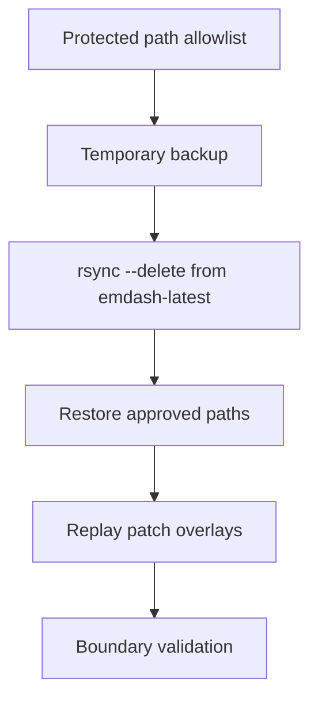

# AWCMS-Micro Protected Path Allowlist

## Goal

Define the exact allowlist consumed by `bash scripts/update-awcmsmicro-dev.sh`.

Use `docs/awcms-micro-implementation-boundaries.md` for the full governance rules, upstream-only constraints, and rollback guidance.

## Approved Paths

These paths are relative to `awcmsmicro-dev/`:

- `templates/awcms-micro-default`
- `templates/awcms-micro-default-cloudflare`
- `packages/plugins/awcms-micro-sikesra`
- `packages/plugins/awcms-micro-docs`
- `packages/plugins/awcms-micro-gallery`
- `packages/plugins/awcms-micro-website-social`
- `packages/plugins/awcms-micro-email-mailketing`
- `demos/awcms-micro-cloudflare`
- `docs/awcms-micro`
- `docs/package.json`
- `packages/blocks/playground/package.json`
- `templates/awcms-micro-default/data.db`
- `e2e/awcms-micro`
- `.awcms-changesets`
- `.awcms-patches`
- `.changeset`
- `.github/workflows`
- `.github/scripts`
- `.github/dependabot.yml`
- `pnpm-workspace.yaml`
- `infra/perf-monitor/package.json`
- `AGENTS.md`
- `.env`
- `.env.age`
- `packages/admin/src/components/Sidebar.tsx`
- `packages/admin/src/components/Shell.tsx`
- `packages/admin/src/components/AdminCommandPalette.tsx`
- `packages/admin/src/components/WelcomeModal.tsx`
- `packages/admin/tests/components/Sidebar.test.tsx`
- `packages/admin/tests/components/AdminCommandPalette.test.tsx`
- `packages/admin/tests/components/WelcomeModal.test.tsx`

## How Rebuild Preservation Works

`scripts/update-awcmsmicro-dev.sh` reads `scripts/awcmsmicro-dev-protected-paths.txt` before rebuilding `awcmsmicro-dev/` from `emdash-latest/`.

For each approved path, the script:

1. copies the current AWCMS-Micro path to a temporary backup if it exists
2. runs the upstream `rsync --delete` rebuild
3. restores only the approved backed-up paths into `awcmsmicro-dev/`
4. replays any patch files stored under `awcmsmicro-dev/.awcms-patches/`

This keeps `emdash-latest/` disposable and upstream-faithful while preserving explicitly approved AWCMS-Micro implementation boundaries.

Patch overlays under `.awcms-patches/` are the protection mechanism for narrow source-level downstream overrides whose target files should otherwise remain upstream-owned. Do not add those target files to the allowlist unless the downstream version of the whole file must be restored before patch replay. Active overlay files must also be recorded in `docs/upstream-sync/DIVERGENCE_LOG.md` so rebuild-sensitive changes have an auditable reason and review trigger.

Boundary validation dry-runs the rebuild comparison outside this allowlist. Tracked downstream-only files outside approved paths, and unprotected content drift that is not listed as a patch target in `.awcms-patches/`, fail normal validation. The same validation also replays active patch overlays against a temporary copy of `emdash-latest`, so stale or corrupt patches fail before a rebuild depends on them. Sync preflight skips only the drift check because the rebuild itself intentionally overwrites upstream-owned drift, then post-rebuild validation checks the clean state again. Untracked generated files and other local artifacts are disposable and should not be added to this allowlist.

Boundary validation also rejects tracked temporary artifacts under `awcmsmicro-dev/`, including `tmp-*`, `temp-*`, `*.tmp`, `*.bak`, `*.orig`, `*.rej`, and editor swap files. Directory-level protected paths are not a reason to preserve scratch scripts or one-off replacement files.

## Rules

- Add new protected paths only when they are AWCMS-Micro-owned implementation areas.
- New product behavior belongs in plugin or template boundaries, not a new shared core layer.
- Do not use this list to preserve arbitrary upstream overrides.
- Use `.awcms-patches/` for narrow source-level overrides that must survive rebuilds without converting upstream-owned files into downstream-owned allowlist entries.
- Keep the protected-path list synchronized with the root workflow docs when it changes.
- Do not store secrets or Cloudflare credentials anywhere under these protected paths.
