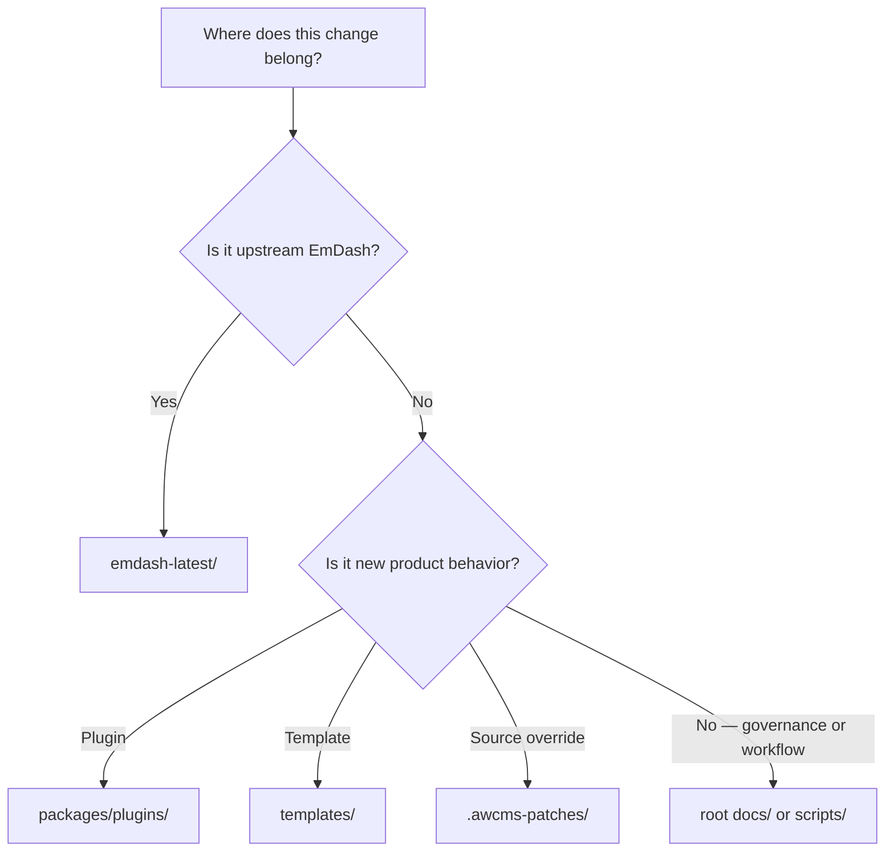

# Implementation Instructions

## Mandate

Analyze `https://github.com/emdash-cms/emdash`, then update `https://github.com/ahliweb/awcms-micro` so the repository stays fully synchronized with EmDash.

## Repository Identity

`awcms-micro` is an independent repository. It must not act as a host for other repositories. It should serve as an implementation workspace that fully adopts EmDash 100% and includes only AWCMS-Micro plugins and templates that follow the AWCMS-Micro standard, without modifying any part of EmDash core.

## Practical Interpretation In This Parent Workspace

- Use `emdash-latest/` as the latest upstream reference source.
- Use `awcmsmicro-dev/` as the actual AWCMS-Micro working tree.
- Keep the root repository focused on synchronization, documentation, and maintenance workflow.
- Keep the root maintenance changelog and workspace snapshot current when the EmDash revision or workspace package inventory changes.
- Keep AWCMS-Micro downstream plugin and template work isolated in the approved protected paths inside `awcmsmicro-dev/`.
- Persist any source-level downstream customization that must survive sync as a patch overlay in `awcmsmicro-dev/.awcms-patches/` and ensure the rebuild script reapplies it automatically.
- Preserve local sync bootstrap state in `awcmsmicro-dev/.env` and `awcmsmicro-dev/.env.age` when rebuilding the workspace.
- Before any sync or validation script runs, detect the host platform/user context and verify `bash`, `git`, `node`, `pnpm`, `python3`, and `rsync` are available so missing tools can be installed before continuing.
- Supported hosts are Linux, macOS, and Windows when using a Bash-compatible shell such as Git Bash, MSYS2, Cygwin, or WSL.
- Implement new AWCMS-Micro product behavior through plugins and templates, with docs, demos, and E2E coverage as supporting layers.
- Use `docs/awcms-micro-implementation-boundaries.md` as the source of truth for what must survive `bash scripts/update-awcmsmicro-dev.sh` rebuilds.

## Execution Strategy

- Proceed step by step using an atomic strategy.
- Always analyze the upstream/downstream state before any update or sync pass.
- If analysis shows sync, update, or validation scripts need changes to preserve a downstream adjustment, stop the update and align those scripts/docs first.
- Prefer small, reviewable changes.
- Separate upstream refresh work from AWCMS-Micro adaptation work whenever practical.
- Keep documentation synchronized with the actual repository state.

## Task Splitting Guidance

If a task is too large for one pass, create smaller tracked follow-ups. If useful, create GitHub issues so work can later be implemented by a smaller or lower-cost AI model.

## Decision Rule

When choosing where a change belongs:

- if it represents upstream EmDash, it belongs in `emdash-latest/`
- if it represents AWCMS-Micro downstream implementation work, it belongs in `awcmsmicro-dev/`
- if it is new product behavior, prefer `awcmsmicro-dev/packages/plugins/` or `awcmsmicro-dev/templates/` rather than a new shared core layer
- if it changes repository governance or operator workflow, it belongs in the root docs or `scripts/`

## Required References

- Sync governance and validation records live in `docs/upstream-sync/`.
- The approved rebuild-safe boundary rules live in `docs/awcms-micro-implementation-boundaries.md` and `scripts/awcmsmicro-dev-protected-paths.txt`.
- Deployment guidance lives in `docs/deployment/`.
- Security and compliance baselines live in `docs/security/`.
- AWCMS-Micro template work belongs in `awcmsmicro-dev/templates/awcms-micro-default/` or `awcmsmicro-dev/templates/awcms-micro-default-cloudflare/`.
- AWCMS-Micro SIKESRA plugin work belongs in `awcmsmicro-dev/packages/plugins/awcms-micro-sikesra/`.
- AWCMS-Micro docs plugin work belongs in `awcmsmicro-dev/packages/plugins/awcms-micro-docs/` and `awcmsmicro-dev/docs/awcms-micro/`.
- AWCMS-Micro gallery plugin work belongs in `awcmsmicro-dev/packages/plugins/awcms-micro-gallery/`.
- AWCMS-Micro website social plugin work belongs in `awcmsmicro-dev/packages/plugins/awcms-micro-website-social/`.
- AWCMS-Micro email mailketing plugin work belongs in `awcmsmicro-dev/packages/plugins/awcms-micro-email-mailketing/`.
- Reserved Cloudflare demo work belongs in `awcmsmicro-dev/demos/awcms-micro-cloudflare/`.
- Reserved docs work belongs in `awcmsmicro-dev/docs/awcms-micro/`.
- Reserved E2E work belongs in `awcmsmicro-dev/e2e/awcms-micro/`.
- Workspace package-release metadata belongs in `awcmsmicro-dev/.changeset/`.
- AWCMS-Micro release-note inputs belong in `awcmsmicro-dev/.awcms-changesets/`.
- AWCMS-Micro release automation scripts belong in preserved `.github` boundaries such as `awcmsmicro-dev/.github/scripts/` when workflow-specific logic is required.
- Preserved workflow work belongs in `awcmsmicro-dev/.github/workflows/`.
- Preserved Dependabot config belongs in `awcmsmicro-dev/.github/dependabot.yml`.
- Preserved dev-workspace agent guidance belongs in `awcmsmicro-dev/AGENTS.md`.

## Language Rule

- Use English (US) for root-level documentation, instructions, scripts, and governance text.
- Preserve upstream wording in `emdash-latest/`, including non-US spelling.
- Accept inherited upstream wording in `awcmsmicro-dev/` when it comes from synchronization rather than AWCMS-Micro-specific authorship.
- Active AWCMS-Micro plugins and templates must default to English (`en`) and provide a full Indonesian translation (`id`).

## Translation Rule

- AWCMS-Micro plugin translations must live in `awcmsmicro-dev/packages/plugins/<plugin-id>/src/locales/{en,id}/messages.po`.
- AWCMS-Micro template translations must live in `awcmsmicro-dev/templates/<template-id>/src/locales/{en,id}/messages.po`.
- Use Lingui-compatible gettext PO catalogs as the authoritative translation source for user-facing plugin and template strings.
- Do not add new translations only as inline manifest `i18n.messages` maps or code-level copy objects unless they are temporary migration adapters.
- Follow `awcmsmicro-dev/docs/awcms-micro/i18n-po-translation-standard.md` before adding or changing plugin or template translation behavior.

## Plugin Sidebar Layout & Grouping Rules

- Active plugins must have their admin sidebar menus displayed at the top, directly below the Dashboard and before the default EmDash menus.
- Every active plugin must render its custom links inside its own collapsible, distinct group to prevent items from mixing across plugins.
