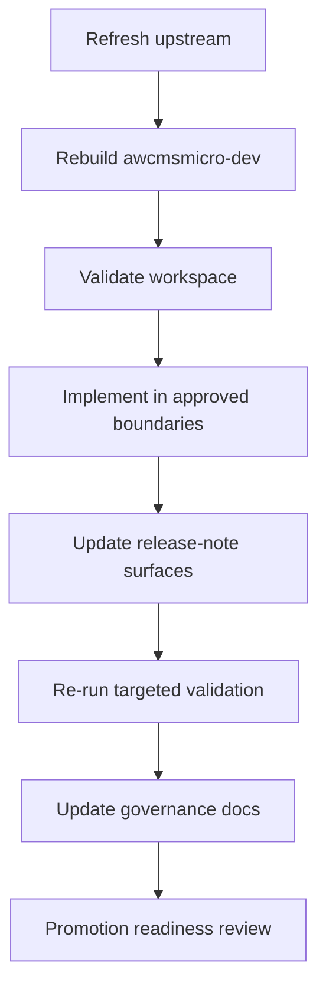
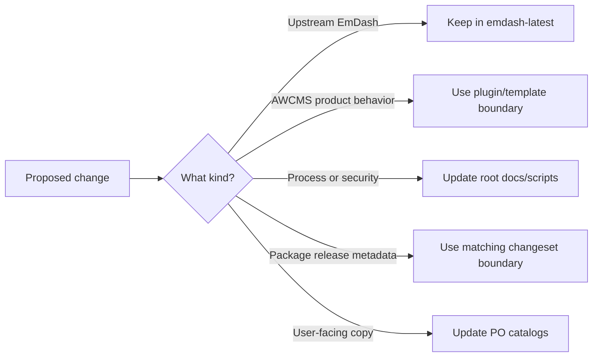

# Operator Workflow

## Purpose

This document gives operators one concise end-to-end workflow for maintaining the parent repository, validating AWCMS-Micro changes, and preparing an independent repository promotion.

## Workflow Summary

1. Refresh upstream EmDash into `emdash-latest/`.
2. Rebuild `awcmsmicro-dev/` from `emdash-latest/`.
3. Validate the rebuilt workspace.
4. Implement AWCMS-Micro work only in approved plugin and template boundaries.
5. Prepare AWCMS release-note inputs when plugin or template versions should change, keep `awcmsmicro-dev/.changeset/` preserved for workspace packages like `@emdash-cms/admin`, and run `bash scripts/awcms-root-versioning.sh version` for root-level documentation, script, governance, synchronization, or protected admin branding changes so `VERSION`, `CHANGELOG.md`, and the root workspace snapshot update automatically.
6. Re-run targeted validation.
7. Update governance docs if boundaries, workflow, deployment, or security rules changed.
8. Check promotion and release-readiness artifacts when preparing an independent repository state.



## Update Modes

- Use `continuation` when the workspace already has its local configuration and you are continuing an existing sync or implementation cycle.
- Use `fresh-clone` when the workspace was just cloned or reset and local bootstrap config still needs to be prepared.
- In `fresh-clone` mode, make sure local `.env` or encrypted backup config exists before running sync commands so GitHub and Cloudflare settings are not skipped.
- Fresh-clone mode also asks for a unique template folder name and whether built-in plugins should be used; those choices are saved into `awcmsmicro-dev/.env` as local bootstrap values.
- The saved bootstrap values are local-only and should not be committed, and rebuilds preserve both `awcmsmicro-dev/.env` and `awcmsmicro-dev/.env.age` when present.
- Every sync or validation entrypoint now performs a runtime preflight that reports host platform and user context and confirms `bash`, `git`, `node`, `pnpm`, `python3`, and `rsync` are usable before continuing.
- Supported hosts are Linux, macOS, and Windows when using a Bash-compatible shell such as Git Bash, MSYS2, Cygwin, or WSL.
- Example safe answers: `awcms-micro-alpha`, `awcms-micro-studio`, or another unique lowercase hyphenated name that does not reuse `awcms-micro-default` or `awcms-micro-default-cloudflare`.
- If the workspace is meant to rely on the current AWCMS-Micro plugin set, answer yes; if the template should stay plugin-free for now, answer no.

## Standard Commands

### 1. Refresh Upstream Snapshot

```bash
bash scripts/update-emdash-latest.sh continuation
bash scripts/update-emdash-latest.sh fresh-clone
```

### 2. Rebuild The AWCMS-Micro Workspace

```bash
bash scripts/update-awcmsmicro-dev.sh continuation
bash scripts/update-awcmsmicro-dev.sh fresh-clone
```

This rebuild path also prunes stale directories that remain only because they contain excluded transient artifacts such as `node_modules/`, `dist/`, `.vite/`, or `.mf/` after an upstream path is removed.

### 3. Validate Boundaries And Workspace

```bash
bash scripts/validate-awcmsmicro-boundaries.sh
bash scripts/validate-awcmsmicro-dev.sh
```

### 4. Combined Sync Path

```bash
bash scripts/sync-and-validate-awcmsmicro-dev.sh continuation
bash scripts/sync-and-validate-awcmsmicro-dev.sh fresh-clone
```

### 5. Check AWCMS Versioning Status

```bash
bash scripts/awcms-root-versioning.sh status
node awcmsmicro-dev/.github/scripts/awcms-version.mjs status
```

## Decision Rules During Work

- If the change is upstream EmDash, keep it in `emdash-latest/` only.
- If the change is AWCMS-Micro product behavior, put it in plugin or template boundaries only.
- If the change affects process, structure, deployment guidance, or security guidance, update root docs and scripts.
- If the change affects package release metadata, keep `awcmsmicro-dev/.changeset/` for workspace packages and `awcmsmicro-dev/.awcms-changesets/` for downstream `@awcms-micro/*` packages.
- If the change adds or changes user-facing plugin/template copy, update the matching PO catalogs under `src/locales/{en,id}/messages.po` and follow `awcmsmicro-dev/docs/awcms-micro/i18n-po-translation-standard.md`.



## Promotion Path

When preparing the independent `awcms-micro` repository state:

1. Review `docs/awcms-micro-product-readme-final.md`.
2. Review `docs/awcms-micro-repository-promotion-checklist.md`.
3. Review `docs/awcms-micro-release-readiness-checklist.md`.
4. Review `docs/awcms-micro-versioning.md`.
5. Review `docs/awcms-micro-root-versioning.md` if the workspace snapshot or root maintenance changelog changed.
6. Confirm targeted plugin and template validation passes.

## Minimum Promotion-Readiness Signals

- boundary validation passes
- target plugin package typechecks and tests pass
- target deployment template typechecks pass
- product-facing docs are current
- no active product behavior relies on forbidden non-plugin, non-template layers

## Documentation To Update When Needed

- `docs/upstream-sync/UPSTREAM_SYNC_STATUS.md`
- `docs/upstream-sync/DIVERGENCE_LOG.md`
- `docs/upstream-sync/COMPATIBILITY_MATRIX.md`
- `docs/deployment/cloudflare.md`
- `docs/security/security-baseline.md`
- `awcmsmicro-dev/docs/awcms-micro/i18n-po-translation-standard.md`

## Operating Principle

Keep upstream synchronization, AWCMS-Micro customization, and repository promotion as separate, reviewable concerns even when they happen close together in time.
