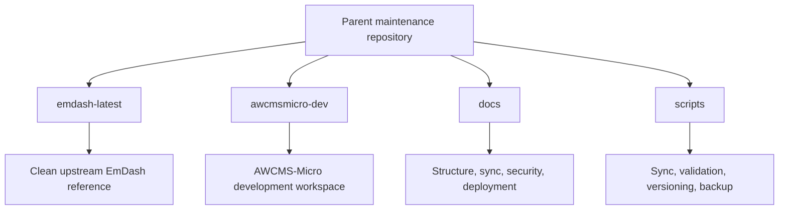
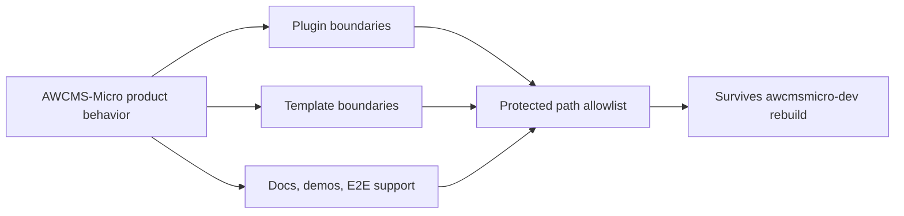

# Repository Structure

## Overview

The root repository is a parent maintenance layer with four primary folders:

- `emdash-latest/`
- `awcmsmicro-dev/`
- `docs/`
- `scripts/`



## Folder Responsibilities

### `emdash-latest/`

Contains the latest updated EmDash source tree. This folder is the local upstream reference copied from `https://github.com/emdash-cms/emdash`.

Rules:

- Keep it as close to upstream EmDash as possible.
- Use it as the comparison baseline for synchronization work.
- Do not place AWCMS-Micro-specific customization here unless the task is explicitly about analyzing upstream differences.

### `awcmsmicro-dev/`

Contains a clone of `emdash-latest/` and serves as the AWCMS-Micro development workspace.

Rules:

- Rebuild it from `emdash-latest/` when upstream synchronization is needed.
- Apply AWCMS-Micro-specific downstream plugin and template work here.
- Keep new product behavior in plugin and template boundaries rather than introducing a new shared core fork layer.
- Keep AWCMS-Micro-owned additions inside the approved protected paths documented in `docs/awcms-micro-implementation-boundaries.md`.
- Preserve the goal that AWCMS-Micro remains a full EmDash adoption, not a divergent fork of EmDash core.

### `docs/`

Contains root-level technical documentation for this parent repository.

Documents in this folder define:

- the repository structure
- the synchronization workflow
- the implementation instructions and execution model
- the root maintenance versioning and workspace snapshot model
- upstream sync status and divergence tracking
- deployment and security baselines

### `scripts/`

Contains update and synchronization scripts.

Expected root scripts include:

- a script to update `emdash-latest/` from upstream EmDash
- a script to rebuild `awcmsmicro-dev/` from `emdash-latest/`
- a preflight checklist script for `continuation` and `fresh-clone` update modes
- boundary validation and workspace validation scripts
- a script to validate `awcmsmicro-dev/` after sync
- a script to run sync and validation together
- root versioning scripts for `VERSION`, `CHANGELOG.md`, and workspace snapshot updates
- backup and recovery scripts under `scripts/backup/`

## AWCMS-Micro Downstream Locations

- Node/SQLite template: `awcmsmicro-dev/templates/awcms-micro-default/`
- Cloudflare template: `awcmsmicro-dev/templates/awcms-micro-default-cloudflare/`
- SIKESRA plugin: `awcmsmicro-dev/packages/plugins/awcms-micro-sikesra/`
- Docs plugin: `awcmsmicro-dev/packages/plugins/awcms-micro-docs/`
- Gallery plugin: `awcmsmicro-dev/packages/plugins/awcms-micro-gallery/`
- Website social plugin: `awcmsmicro-dev/packages/plugins/awcms-micro-website-social/`
- Email Mailketing plugin: `awcmsmicro-dev/packages/plugins/awcms-micro-email-mailketing/`
- Reserved Cloudflare demo boundary: `awcmsmicro-dev/demos/awcms-micro-cloudflare/`
- Reserved docs boundary: `awcmsmicro-dev/docs/awcms-micro/`
- Reserved E2E boundary: `awcmsmicro-dev/e2e/awcms-micro/`
- Reserved AWCMS changesets boundary: `awcmsmicro-dev/.awcms-changesets/`
- Downstream patch overlay: `awcmsmicro-dev/.awcms-patches/`
- Preserved workspace package-release boundary: `awcmsmicro-dev/.changeset/`
- Preserved workflow boundary: `awcmsmicro-dev/.github/workflows/`
- Preserved workflow scripts boundary: `awcmsmicro-dev/.github/scripts/`
- Preserved Dependabot config: `awcmsmicro-dev/.github/dependabot.yml`
- Preserved dev-workspace agent guidance: `awcmsmicro-dev/AGENTS.md`
- AWCMS-Micro PO translation standard: `awcmsmicro-dev/docs/awcms-micro/i18n-po-translation-standard.md`

These AWCMS-Micro surfaces are intentionally isolated in downstream boundaries and do not replace EmDash built-in templates or built-in plugins.

New AWCMS-Micro product development should be implemented as:

- plugins under `awcmsmicro-dev/packages/plugins/`
- templates under `awcmsmicro-dev/templates/`
- optional supporting docs, demos, and E2E coverage inside the corresponding approved boundaries
- workspace package-release metadata under `awcmsmicro-dev/.changeset/`
- release-note inputs under `awcmsmicro-dev/.awcms-changesets/`
- workflow automation under preserved `.github/` boundaries when needed for AWCMS-Micro-specific release operations
- local bootstrap state under `awcmsmicro-dev/.env` and `awcmsmicro-dev/.env.age`
- protected admin branding/navigation file exceptions listed in `scripts/awcmsmicro-dev-protected-paths.txt`

The approved preserved path list for rebuilds lives in `scripts/awcmsmicro-dev-protected-paths.txt` and is governed by `docs/awcms-micro-implementation-boundaries.md`.



## Root-Level Supporting Files

The root repository also contains:

- `README.md`: repository purpose and operator entry point
- `AGENTS.md`: agent-facing execution rules for this parent repository
- `CHANGELOG.md`: root maintenance changelog and workspace snapshot
- `VERSION`: root maintenance release version
- `.awcms-changesets/`: root maintenance release-note inputs
- `scripts/check-runtime-prereqs.sh`: runtime OS/user/tool preflight used by sync and validation entrypoints
- `.gitignore`: local artifact and secret-protection rules
- local-only `.env`: optional operator secrets, excluded from git and preserved in `awcmsmicro-dev/` rebuilds when present alongside `awcmsmicro-dev/.env.age`

## Language Policy

English (US) is the official language for root-level repository documentation, instructions, scripts, and governance text.

Exceptions:

- `emdash-latest/` preserves upstream EmDash wording as-is
- `awcmsmicro-dev/` may inherit upstream wording when synchronized from `emdash-latest/`

## Translation Standard

AWCMS-Micro-owned plugin and template translations belong inside their project boundaries as Lingui-compatible gettext PO catalogs:

```txt
awcmsmicro-dev/packages/plugins/<plugin-id>/src/locales/{en,id}/messages.po
awcmsmicro-dev/templates/<template-id>/src/locales/{en,id}/messages.po
```

The authoritative rules live in `awcmsmicro-dev/docs/awcms-micro/i18n-po-translation-standard.md`.

## Design Principle

The root repository is not a runtime host. It is a maintenance, synchronization, and documentation layer. Product behavior belongs in `awcmsmicro-dev/`, while `emdash-latest/` remains the clean upstream reference used for refresh, comparison, and validation.
