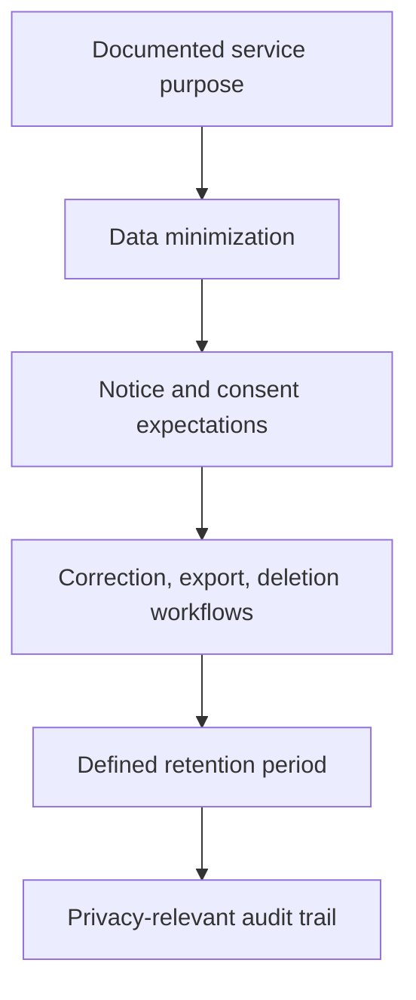

# Privacy Baseline

## Principles

- collect only the personal data needed for the documented service purpose
- document legal basis, notice, and consent expectations where relevant
- support correction, export, and deletion workflows for personal data
- define retention periods before production usage

## Operational Expectations

- separate public content data from operator or user personal data
- keep audit trails for privacy-relevant changes
- review data-sharing and processor dependencies during deployment planning
