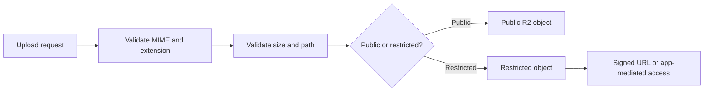

# Upload Security

## Controls

- validate MIME type and file extension
- validate file size and upload path
- separate public and restricted assets when required
- prefer signed URLs for restricted access
- review image processing and metadata handling before production use

## R2 Notes

Public R2 delivery should be limited to files intended for public access. Sensitive or controlled assets should use signed URLs or application-mediated delivery.
