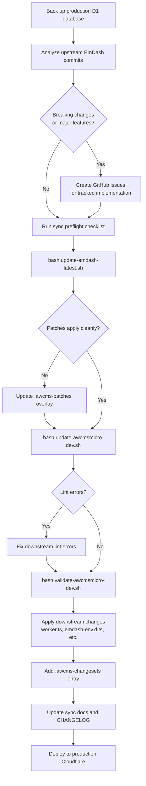
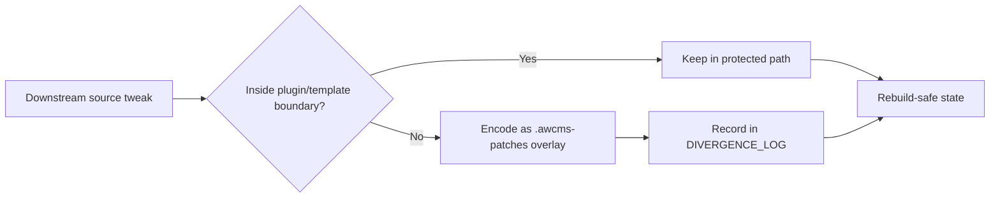

# Synchronization Workflow

## Goal

Keep AWCMS-Micro aligned with the latest EmDash source while preserving a strict separation between:

- the upstream reference tree in `emdash-latest/`
- the AWCMS-Micro development workspace in `awcmsmicro-dev/`

## Standard Sequence

1. Analyze upstream EmDash changes.
2. If analysis shows sync, update, or validation scripts must change to preserve a downstream adjustment, stop the update and align those scripts/docs first.
3. Choose the update mode: `continuation` for an existing workspace or `fresh-clone` for a new clone that still needs local config bootstrap (`.env` or backup config) and fresh-clone template/plugin choices.
   - Safe fresh-clone examples: `awcms-micro-alpha`, `awcms-micro-studio`, or another unique lowercase hyphenated name that does not reuse `awcms-micro-default` or `awcms-micro-default-cloudflare`.
   - For the built-in plugin choice, answer yes when the fresh-clone template should use the current AWCMS-Micro plugin set, or no when it should stay plugin-free for now.
   - The saved bootstrap values live in `awcmsmicro-dev/.env` and are local-only; do not commit them. Rebuilds preserve `awcmsmicro-dev/.env` and `awcmsmicro-dev/.env.age` when they already exist.
4. Run `bash scripts/sync-preflight-checklist.sh --mode <continuation|fresh-clone>` to enforce the operator checklist before any sync command. It fails fast if required docs/scripts are missing, boundary validation fails, or fresh-clone config/bootstrap choices are not ready.
   - The preflight also prints the detected host platform, login/effective user, and checks that `bash`, `git`, `node`, `pnpm`, `python3`, and `rsync` can run before the sync proceeds.
   - Supported hosts are Linux, macOS, and Windows when using a Bash-compatible shell such as Git Bash, MSYS2, Cygwin, or WSL.
5. Refresh `emdash-latest/` from upstream.
6. Rebuild `awcmsmicro-dev/` from `emdash-latest/`.
7. Validate `awcmsmicro-dev/` with `bash scripts/validate-awcmsmicro-dev.sh`.
8. Continue AWCMS-Micro-specific implementation work only inside the approved protected paths in `awcmsmicro-dev/`.
9. Keep new product development in plugin and template boundaries; use docs, demos, and E2E paths only as supporting surfaces.
10. Update root documentation if process, structure, or rules changed.
11. Update the root workspace snapshot in `CHANGELOG.md` when the EmDash upstream SHA or the plugin/template inventory changes.



### Downstream Patch Policy

- `emdash-latest/` stays upstream-faithful and should not be patched for downstream-only fixes.
- `awcmsmicro-dev/` is the downstream implementation workspace; AWCMS-Micro-specific fixes may be applied there through the protected path allowlist and `awcmsmicro-dev/.awcms-patches/` overlays.
- When a downstream patch fully remediates a Dependabot alert in `awcmsmicro-dev/`, document the patch in the divergence log and dismiss the matching GitHub alert as fixed with a short note referencing the overlay.
- Keep patch overlays narrow, reviewable, and reproducible through `bash scripts/update-awcmsmicro-dev.sh`.



## Refresh `emdash-latest/`

Run:

```bash
bash scripts/update-emdash-latest.sh continuation
bash scripts/update-emdash-latest.sh fresh-clone
```

Result:

- clones the latest `https://github.com/emdash-cms/emdash`
- replaces the contents of `emdash-latest/`
- excludes upstream `.git` metadata from the copied tree

## Rebuild `awcmsmicro-dev/`

Run:

```bash
bash scripts/update-awcmsmicro-dev.sh continuation
bash scripts/update-awcmsmicro-dev.sh fresh-clone
```

Result:

- copies the current `emdash-latest/` tree into `awcmsmicro-dev/`
- removes stale files in `awcmsmicro-dev/` that no longer exist in `emdash-latest/`
- preserves only the approved AWCMS-Micro paths listed in `scripts/awcmsmicro-dev-protected-paths.txt`, including the workflow and Dependabot config under `awcmsmicro-dev/.github/`
- preserves local bootstrap state in `awcmsmicro-dev/.env` and `awcmsmicro-dev/.env.age` when present
- preserves local workspace database files such as `awcmsmicro-dev/templates/awcms-micro-default/data.db` when present so menu/content edits survive rebuilds
- reapplies downstream patch overlays from `awcmsmicro-dev/.awcms-patches/` after the restore step so persistent source tweaks do not need to be recreated manually
- refreshes `awcmsmicro-dev/pnpm-lock.yaml` after restore so workspace installs remain in frozen-lockfile sync
- preserves workspace package-release metadata in `awcmsmicro-dev/.changeset/` alongside the approved AWCMS-Micro paths listed in `scripts/awcmsmicro-dev-protected-paths.txt`
- excludes transient local build artifacts such as `node_modules/`, `dist/`, `.astro/`, `.wrangler/`, `.vite/`, and `.mf/`
- prunes stale directories that remain only because they contain excluded transient artifacts after upstream paths are removed

## Protected AWCMS-Micro Paths

The approved rebuild-safe boundary list is governed by `docs/awcms-micro-implementation-boundaries.md` and stored in `scripts/awcmsmicro-dev-protected-paths.txt`.

Only those listed paths are backed up and restored during `bash scripts/update-awcmsmicro-dev.sh`.

Run `bash scripts/validate-awcmsmicro-boundaries.sh` after boundary or allowlist changes.

## Validate `awcmsmicro-dev/`

Run:

```bash
bash scripts/validate-awcmsmicro-dev.sh
```

Result:

- runs install, typecheck, lint, test, and build commands when `pnpm` is available
- performs a clean `pnpm install --frozen-lockfile` before typecheck/lint so stale workspace links are rebuilt
- writes the latest validation record to `docs/upstream-sync/LAST_VALIDATION.md`
- fails clearly when dependency install, tests, or validation steps fail

## Combined Sync Workflow

Run:

```bash
bash scripts/sync-and-validate-awcmsmicro-dev.sh
```

This wrapper refreshes `emdash-latest/`, rebuilds `awcmsmicro-dev/`, runs validation, and updates `docs/upstream-sync/UPSTREAM_SYNC_STATUS.md`.

## Operating Rules

- Treat `emdash-latest/` as disposable and reproducible from upstream.
- Treat `awcmsmicro-dev/` as the only place for AWCMS-Micro implementation work inside this parent repository.
- Keep AWCMS-Micro-owned divergence limited to the approved protected paths rather than editing upstream core locations.
- Keep persistent source-level downstream tweaks as patch overlays in `awcmsmicro-dev/.awcms-patches/` instead of relying on unprotected source edits.
- If preserving a downstream tweak requires sync, update, or validation script changes, make those script/doc changes first and only then rerun the rebuild.
- Keep new product behavior in plugins and templates instead of introducing a parallel shared core implementation layer.
- Keep AWCMS-Micro plugin and template translations in project-local Lingui-compatible PO catalogs under `src/locales/{en,id}/messages.po`; follow `awcmsmicro-dev/docs/awcms-micro/i18n-po-translation-standard.md`.
- Keep changes atomic so upstream sync and downstream adaptation can be reviewed separately.
- When a sync or adaptation effort is too large, split it into smaller GitHub issues.
- Keep AWCMS-Micro-specific release automation inputs inside preserved boundaries such as `.awcms-changesets/` and `.github/scripts/`.
- Keep workspace package-release metadata in `awcmsmicro-dev/.changeset/` and downstream AWCMS release-note inputs in `awcmsmicro-dev/.awcms-changesets/`.
- Keep the root maintenance changelog snapshot aligned with the current `emdash-latest/` revision and the latest plugin/template versions in `awcmsmicro-dev/`.
- Treat `docs/awcms-micro-implementation-boundaries.md` as the authoritative list of paths and change categories that must survive an `update-awcmsmicro-dev.sh` rebuild.

## Language Rule During Synchronization

- Keep root-level workflow and governance documentation in English (US).
- Do not rewrite `emdash-latest/` content to normalize spelling, because it must remain faithful to upstream EmDash.
- Allow `awcmsmicro-dev/` to inherit upstream wording when it is rebuilt from `emdash-latest/`.
- For AWCMS-Micro-owned plugin and template strings, English (`en`) is the PO source locale and Indonesian (`id`) is required for active plugins/templates.
