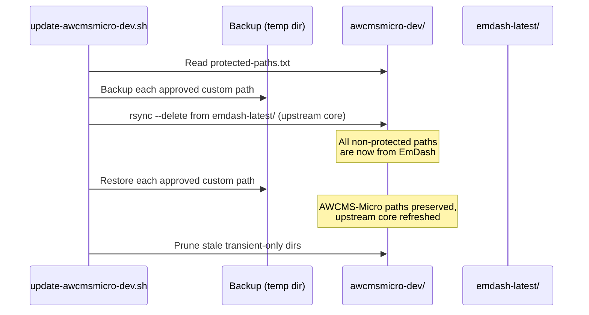

# AWCMS-Micro Implementation Boundaries

## Purpose

AWCMS-Micro-specific implementation work inside `awcmsmicro-dev/` needs an explicit sync-safe boundary because `bash scripts/update-awcmsmicro-dev.sh` rebuilds the workspace from `emdash-latest/` with `rsync --delete`.

Without an allowlisted boundary, future AWCMS-Micro-only paths can be deleted during rebuilds even when those paths are intentionally outside upstream EmDash.

## Approved Custom Paths

These paths are relative to `awcmsmicro-dev/` and are the only locations that may carry AWCMS-Micro-owned implementation work across rebuilds:

- `templates/awcms-micro-default`
- `templates/awcms-sskobar-cloudflare`
- `packages/plugins/awcms-micro-sikesra`
- `packages/plugins/awcms-micro-gallery`
- `demos/awcms-micro-cloudflare`
- `docs/awcms-micro`
- `docs/gallery`
- `e2e/awcms-micro`
- `.awcms-changesets`
- `.changeset`
- `.github/workflows`
- `.github/scripts`
- `.github/dependabot.yml`

These are the active product-development boundaries:

- plugin boundaries under `packages/plugins/`
- template boundaries under `templates/`
- supporting docs, demos, E2E, and release-automation boundaries listed above

The current allowlist is stored in `scripts/awcmsmicro-dev-protected-paths.txt`.

## Upstream-Only Paths

The following areas must remain upstream-only unless they are first moved into an approved custom path:

- all of `emdash-latest/`
- all paths in `awcmsmicro-dev/` that are not listed in `scripts/awcmsmicro-dev-protected-paths.txt`
- EmDash core packages, built-in templates, built-in demos, built-in docs, and built-in test suites copied from upstream

This keeps AWCMS-Micro aligned with EmDash rather than turning `awcmsmicro-dev/` into a divergent EmDash fork.

## Sync-Safe Preservation Strategy

`bash scripts/update-awcmsmicro-dev.sh` uses a strict allowlist strategy:

1. back up approved custom paths from `awcmsmicro-dev/` if they exist
2. rebuild `awcmsmicro-dev/` from `emdash-latest/` with `rsync --delete`
3. restore only the backed-up allowlisted paths

No arbitrary unknown paths are preserved.

## Compatibility Guardrail

This boundary preserves EmDash compatibility by keeping upstream behavior in upstream-owned locations and confining AWCMS-Micro example work to explicitly approved paths.

That means:

- upstream EmDash can continue to refresh `awcmsmicro-dev/`
- AWCMS-Micro example work can survive rebuilds
- EmDash core does not need to be modified to host AWCMS-Micro additions
- new AWCMS-Micro behavior can stay in plugin and template surfaces instead of growing a competing core layer

## Adding Future Work Safely

When adding a new AWCMS-Micro plugin, template, demo, docs area, or test boundary:

1. place it inside an existing approved custom path when possible
2. if a new boundary is required, add it to `scripts/awcmsmicro-dev-protected-paths.txt`
3. update this document and the root workflow docs in the same change
4. run `bash scripts/update-awcmsmicro-dev.sh`
5. run `bash scripts/validate-awcmsmicro-boundaries.sh`

Each new Satu Sehat Kobar product plugin (`packages/plugins/awcms-micro-<key>`) is exactly this case: add its path here and to `scripts/awcmsmicro-dev-protected-paths.txt` before the next rebuild, otherwise it is deleted by `rsync --delete`. See `docs/prd/24.TECHNICAL_IMPLEMENTATION_REFERENCES.md` §5 for the PRD-to-path mapping.

Do not preserve upstream overrides by adding random paths to the allowlist.

Do not create new shared AWCMS-Micro product code outside plugin or template boundaries unless the repository rules are intentionally changed first.

## Rollback Notes

If a custom boundary needs to be removed:

1. move or delete the AWCMS-Micro-owned files in that path
2. remove the path from `scripts/awcmsmicro-dev-protected-paths.txt`
3. update this document and related root docs
4. rebuild `awcmsmicro-dev/` so the path returns to the upstream state

Do not remove a path from the allowlist until its contents are intentionally retired or relocated.
