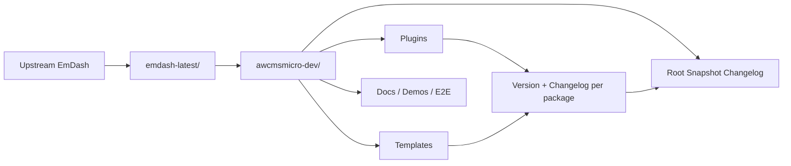
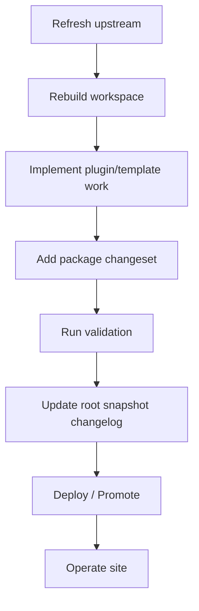
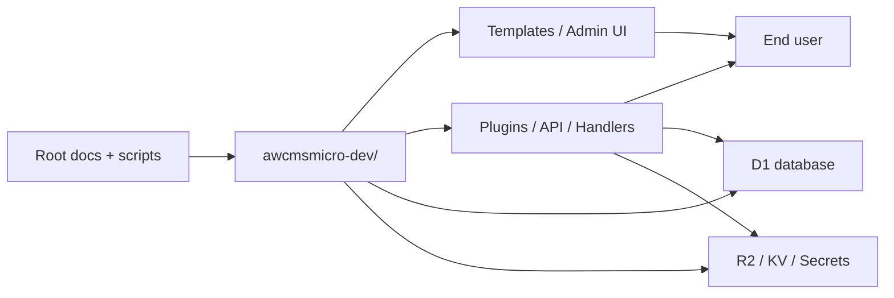
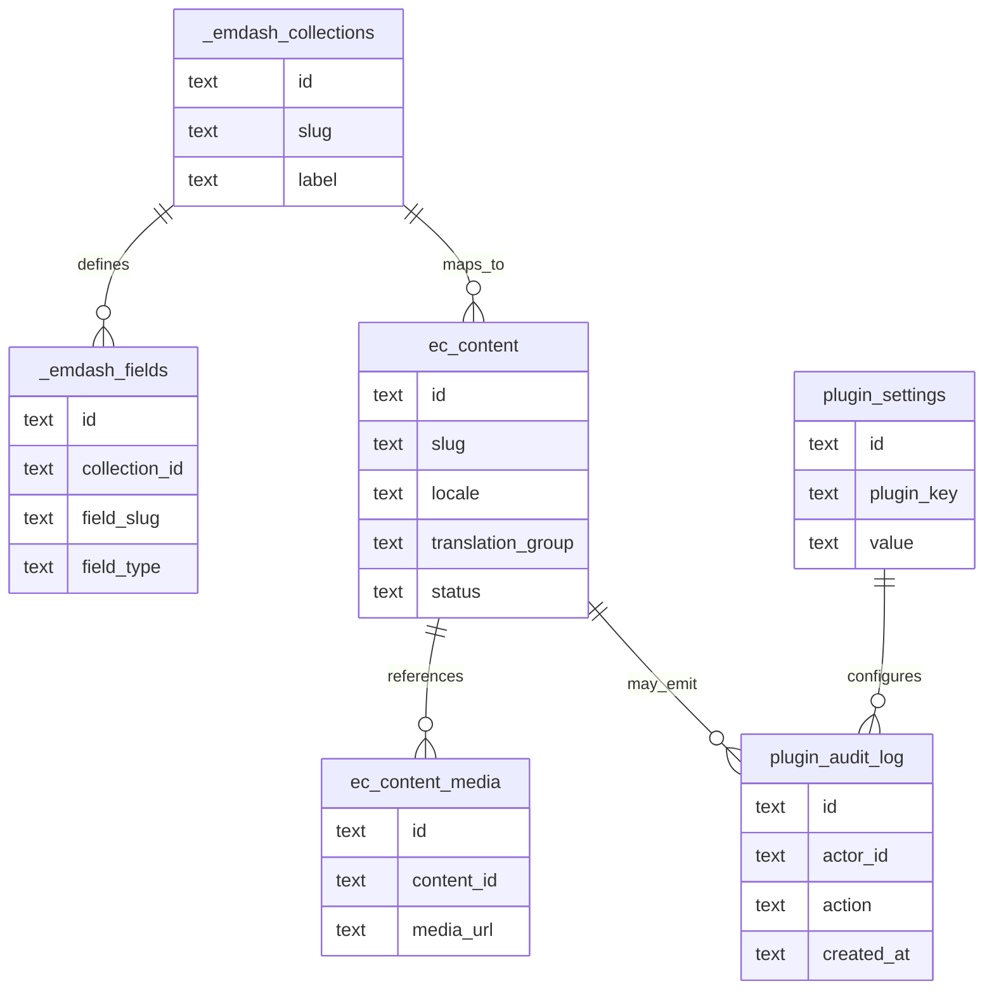

# AWCMS-Micro PRD

## 1. Overview

AWCMS-Micro is a downstream, EmDash-compatible example repository that stays synchronized with upstream EmDash while expressing AWCMS-specific behavior only through plugins, templates, docs, workflows, and release automation.

This PRD describes the product direction for the eventual independent `awcms-micro` repository and the same implementation model already used in `awcmsmicro-dev/`.

### Product Goals

- keep the product aligned with upstream EmDash without forking core behavior
- make plugin and template boundaries the only place for product-specific behavior
- support clear admin UX, public site delivery, and deployment guidance
- keep release/versioning history visible per package and at the root maintenance level

### Non-Goals

- no new shared core layer parallel to EmDash
- no nested-product hosting at the repository root
- no hidden behavior that depends on untracked secrets or undocumented infrastructure

## 1.1 Personas

### Operator / Maintainer

- refreshes upstream EmDash
- rebuilds `awcmsmicro-dev/`
- validates boundaries, builds, tests, and release readiness
- manages release notes, version bumps, and root snapshot updates

### Plugin Developer

- extends behavior through plugin boundaries only
- owns plugin UI, API routes, validation, and package changelog updates
- keeps admin UX localized and accessible

### Template Developer

- implements environment-specific presentation and wiring
- owns template UI, seed data, and deployment config
- keeps platform-specific dependencies isolated in the template boundary

### Product / Content User

- uses the admin to configure content, media, and settings
- publishes and reviews content through the selected template
- expects a localized, stable, and accessible interface

### Reviewer / Approver

- evaluates scope, risk, and release readiness
- checks that package and root changelogs match the current state
- confirms legal, security, and deployment constraints are satisfied

## 1.2 Scope Per Release

### Patch Release

- localized copy fixes
- small admin UX polish
- validation or documentation fixes
- bug fixes with no public API or schema breakage

### Minor Release

- new plugin or template features
- additive API routes or settings fields
- new docs, examples, or deployment guidance
- backward-compatible schema additions or migrations

### Major Release

- breaking package-level API or UX changes
- schema changes that require migration planning
- major navigation, layout, or workflow changes
- any intentionally incompatible release that must be called out clearly

## 2. Requirements

### Functional Requirements

- The repository must expose product behavior through plugins and templates.
- Active plugins must render admin sidebar entries above default EmDash menus and inside distinct collapsible groups.
- User-facing strings must be localized.
- RTL-safe layout rules must be respected in admin UI surfaces.
- Plugin and template packages must keep their own versions and changelogs.
- The root maintenance workspace must keep a current snapshot of the active EmDash SHA and the latest version/changelog entry of every plugin and template.
- Cloudflare-oriented templates must support deployment bindings, D1, R2, and secret injection.
- Database and API work must respect EmDash route, handler, migration, and auth rules.

### Non-Functional Requirements

- compatibility first: prefer additive changes
- maintainability: keep changes reviewable and small
- recoverability: preserve rollback and backup paths
- security: do not commit secrets or private credentials
- performance: keep core paths efficient and avoid unnecessary round-trips
- localization: English default with complete Indonesian translations for active example surfaces

## 3. Core Features

### Example Plugin Surfaces

- governance and navigation plugin behavior
- gallery/media plugin behavior
- plugin-owned admin pages and settings
- plugin-owned API routes and validation

#### Acceptance Criteria Per Feature

- navigation feature: appears above default EmDash menus, grouped separately, and remains RTL-safe
- gallery feature: validates media and shows localized errors in admin and public surfaces
- settings feature: persists correctly, validates inputs, and survives rebuilds
- API feature: returns documented responses and respects auth and permission checks

### Example Template Surfaces

- Node/SQLite reference template
- Cloudflare reference template
- seed data, example routes, and deployment wiring

#### Acceptance Criteria Per Feature

- Node template: runs locally, typechecks, and serves the admin and public site correctly
- Cloudflare template: deploys with documented bindings and smoke checks pass
- seed wiring: matches the intended demo content and plugin set
- deployment wiring: keeps secrets out of source control and supports repeatable release steps

### Product Operations

- upstream sync into `emdash-latest/`
- rebuild `awcmsmicro-dev/`
- boundary validation
- package-level release notes and changelogs
- root maintenance snapshot changelog

#### Acceptance Criteria Per Feature

- sync workflow: reproduces `awcmsmicro-dev/` from upstream without losing allowlisted paths
- versioning workflow: updates the correct package versions and changelogs, then updates the root snapshot
- validation workflow: fails clearly when boundaries, builds, or tests fail

## 4. User Flow

### Primary Operator Flow

1. refresh upstream EmDash
2. rebuild `awcmsmicro-dev/`
3. implement work in plugin or template boundaries
4. add release notes for the affected package(s)
5. run validation and build checks
6. update the root snapshot changelog
7. deploy or promote after checks pass

### End-User Flow

1. open the selected template
2. sign in to the admin
3. configure plugins
4. manage content, media, and settings
5. publish content and review the public site

## 5. Architecture

### Logical Layers

- root maintenance layer: sync, validation, versioning, docs, scripts
- workspace layer: `awcmsmicro-dev/`
- product layer: plugins and templates
- runtime layer: EmDash app, API routes, admin UI, database, media storage

### Runtime Surfaces

- frontend: Astro templates and React admin UI
- backend: EmDash handlers, routes, auth, and plugin hooks
- database: EmDash schema tables and plugin-owned data tables when needed
- storage: D1 for relational data, R2 for media, optional KV for settings or edge state

## 6. Database Schema

### Schema Model

The database model follows EmDash conventions:

- system tables store collections, fields, settings, and operational metadata
- each content collection maps to a real SQL table
- plugin settings and plugin data stay isolated from upstream core tables where possible
- media references are stored separately from blobs in object storage

### Logical Entities

- `_emdash_collections`: collection registry and source of truth
- `_emdash_fields`: field metadata for collection schemas
- `ec_*`: collection tables for real content rows
- plugin-owned settings or audit tables where a feature requires persistent plugin state
- media storage references for asset metadata and URLs

### Out-Of-Scope By Module

#### Root Maintenance Module

- business feature implementation
- custom product UI
- direct data-model changes outside governance or release support

#### Plugin Module

- modifying EmDash core tables directly when a plugin-owned table or setting is sufficient
- introducing global shared logic that bypasses plugin ownership
- storing secrets in tracked docs or source files

#### Template Module

- replacing plugin-owned behavior with template-only hacks
- duplicating backend authorization logic that should remain in EmDash or plugin routes
- embedding environment secrets in template source

#### Upstream EmDash Module

- downstream feature forks inside `emdash-latest/`
- local changes to upstream core to satisfy AWCMS-Micro product needs
- maintenance snapshot logic in upstream source

## 7. Design & Technical Constraints

### UI/UX Constraints

- keep admin UX localized through Lingui
- use RTL-safe logical classes only
- use Kumo components for admin UI controls where applicable
- keep plugin menus grouped and ordered above default EmDash menus

### Frontend Constraints

- prefer template-owned presentation logic
- keep example template defaults clear and production-aware
- avoid direct coupling between template UI and upstream core internals

### Backend Constraints

- routes must stay thin and authorization-aware
- handlers should own business logic
- validation must be explicit
- public read routes and state-changing routes must stay separated

### Database Constraints

- never interpolate raw SQL with unvalidated identifiers
- keep migrations forward-only
- preserve locale-aware content handling
- avoid schema drift that breaks upstream compatibility

### Release And Workflow Constraints

- root maintenance release notes stay in root `.awcms-changesets/`
- package release notes stay in `awcmsmicro-dev/.awcms-changesets/`
- each plugin and template keeps its own version and changelog
- the root changelog must continue to carry the workspace snapshot
- do not modify `emdash-latest/` to satisfy downstream product needs

### Operational Constraints

- no secrets in tracked docs
- preserve rebuild-safe boundaries
- keep changes small, reviewable, and atomic
- open an issue when a needed change is too large for one pass

## 8. Business Management

### Ownership Model

- root maintainers own synchronization, documentation, release automation, and repository governance
- plugin owners own plugin functionality, package versioning, and changelogs
- template owners own presentation, deployment wiring, and environment-specific validation

### Release Management

- releases should be scoped per plugin or template package
- the root changelog snapshot should be updated whenever the workspace inventory changes
- changes that touch multiple packages should name the affected packages explicitly

### Support And Maintenance

- document maintenance expectations for plugin and template surfaces separately
- keep rollback guidance current for template and database changes
- prefer small releases that are easy to review and revert

### Cost And Operations

- favor additive work that limits revalidation cost
- keep Cloudflare and database usage explicit so operating cost stays visible
- avoid hidden dependencies that create support burden or unexpected deployment cost

## 9. Regulatory And Legal Considerations

This section is a product-planning checklist, not legal advice. Confirm jurisdiction-specific requirements with qualified counsel when needed.

### Indonesia Considerations

- personal data handling should be reviewed against applicable Indonesian data protection obligations
- content ownership, publication rights, and retention rules should be documented for operators
- consumer-facing or public-facing flows should be checked for local accessibility and disclosure expectations

### International Considerations

- cross-border data transfer rules may apply when using non-local infrastructure or SaaS services
- open-source licensing must remain consistent with package-level and root-level obligations
- accessibility and privacy expectations should be reviewed for the target market
- export, sanctions, and payment/commercial rules may apply depending on deployment and audience

### Operational Legal Controls

- keep license metadata current for root, plugin, and template packages
- avoid shipping secrets, tokens, or private identifiers in tracked files
- document where data is stored, who can access it, and how it is deleted or restored
- keep third-party service terms and deployment constraints in the release checklist

## 10. AI Strategy & Governance

### AI Strategy

- use AI as an assistive layer, not an autonomous replacement for product ownership
- limit AI to clearly scoped tasks such as content assistance, moderation support, summarization, translation help, search assistance, and operator productivity
- keep deterministic non-AI fallback paths for every AI-assisted feature
- prefer AI features that can be disabled without breaking the core product

### Governance Principles

- human review is required for actions that publish, delete, moderate, or change critical settings
- AI-generated output must be attributable to the model or workflow that produced it
- all AI-assisted decisions that affect users should be reviewable in logs or audit trails
- model/provider selection must be explicit and documented before release
- prompt injection, unsafe tool use, and data leakage must be treated as release-blocking risks

### Operational Guardrails

- AI features must fail closed when prompts, tools, or model responses are invalid
- AI features must not silently escalate privileges or bypass authorization checks
- AI features must not train on private data unless the policy, contract, and user consent explicitly allow it
- AI-assisted changes should be previewed before being committed to content or settings

## 11. AI UX & Evaluation

### UX Requirements

- disclose when content or recommendations are AI-assisted
- show confidence, uncertainty, or review-needed states when the output may be ambiguous
- provide a clear override or undo action for human operators
- keep AI actions inside the same localized and RTL-safe UI system as the rest of the product
- avoid surprise automation; AI should ask for confirmation before high-impact actions

### Evaluation Requirements

- define success metrics before release for each AI feature
- measure accuracy, false positives, false negatives, latency, and cost
- maintain a regression set for common prompts, edge cases, and abuse cases
- run manual review for critical paths such as moderation, publishing, and administrative actions
- compare output quality against a non-AI baseline when relevant

### Acceptance Criteria For AI Features

- the feature clearly states that AI is being used
- users can review, edit, or reject AI output
- failures fall back to a safe non-AI path
- the feature meets its target quality, latency, and cost envelope
- the feature can be audited after deployment

## 12. AI Data Policy

### Data Classification

- public content may be eligible for AI-assisted processing when allowed by policy
- private content, credentials, secrets, and internal operator notes must be excluded unless explicitly approved
- personal data requires stricter handling, minimization, and retention rules
- any data sent to a third-party model/provider must be reviewed as a transfer of information

### Data Handling Rules

- anonymize or redact sensitive fields before AI processing when possible
- retain only the minimum logs needed for debugging, safety, and auditability
- separate prompt inputs, model outputs, and human edits in records where practical
- document retention and deletion behavior for AI logs and artifacts
- do not use production secrets in prompts, examples, or evaluation datasets

### Model Training And Fine-Tuning

- default to no-training-on-customer-data unless explicitly approved
- any fine-tuning or retrieval workflow must be documented and reviewed as a data-processing change
- use consent, contractual terms, and legal review before using external or user-generated data for training

### AI Data Acceptance Criteria

- the policy states exactly what data can and cannot be sent to AI systems
- the product has a safe redaction or minimization step where needed
- AI logs are retained only as long as necessary
- the workflow remains compliant with the repository's privacy and security baseline

## Acceptance Criteria

- the product can be explained clearly from the PRD without reading source code first
- plugin and template boundaries are obvious
- deployment and validation paths are documented
- versioning/changelog behavior is visible for root and per package
- the repository remains EmDash-compatible and upstream-safe
- personas, scope per release, and out-of-scope boundaries are explicit
- business management and legal/regulatory considerations are documented for operators and reviewers
- AI strategy, UX, evaluation, and data policy are documented for modern AI-enabled development
