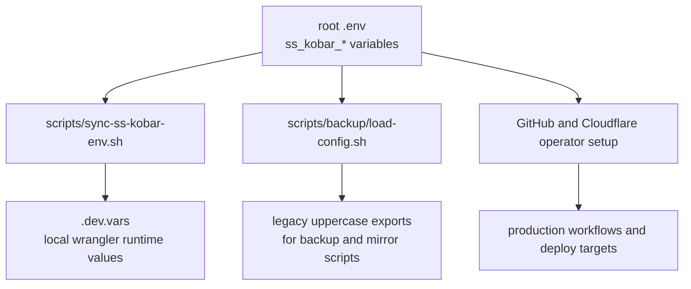
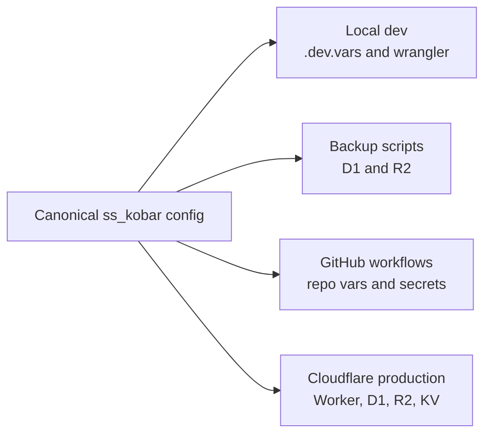

# Environment Configuration

This repository now uses the root `.env` file as the canonical operator-managed configuration source for the `satusehatkobar` workspace.

All root-managed variables in that file use the `ss_kobar_` prefix so local development, backup automation, Cloudflare deployment notes, and GitHub/GitLab operations can stay aligned without storing live secrets in tracked files.

## Canonical Model



## What The Root `.env` Owns

- workspace identity and environment label
- local development URLs
- production URLs
- Cloudflare account credentials and Worker metadata
- development and production D1, R2, and KV identifiers
- backup retention and encryption settings
- GitHub workflow defaults and PAT-based local access
- GitLab mirror settings

## Automation

Run the sync script after editing `.env`:

```bash
bash scripts/sync-ss-kobar-env.sh
```

That script updates the tracked root `.dev.vars` file with non-secret local Cloudflare runtime values derived from `.env`.

`scripts/backup/load-config.sh` also reads `ss_kobar_*` values directly and exports the legacy uppercase names expected by the current backup and mirror scripts. That compatibility layer keeps the repository operational while the canonical namespace stays in one place.

## Local And Production Consistency

Use one naming model for both environments:

- local development values live under `ss_kobar_local_*` and `ss_kobar_cloudflare_dev_*`
- production values live under `ss_kobar_production_*` and `ss_kobar_cloudflare_prod_*`
- backup defaults point at the production D1 and R2 targets unless explicitly overridden



## Required Manual Inputs

The new `.env` is created with safe placeholders or blank values for anything secret or environment-specific.

These items still require operator attention before production use:

- `ss_kobar_cloudflare_account_id`
- `ss_kobar_cloudflare_api_token`
- `ss_kobar_cloudflare_deploy_token`
- `ss_kobar_cloudflare_prod_d1_database_id`
- `ss_kobar_cloudflare_prod_kv_namespace_id`
- `ss_kobar_backup_passphrase`
- `ss_kobar_github_pat`
- `ss_kobar_gitlab_username`
- `ss_kobar_gitlab_pat`

Recommended action:

1. Fill the blank or `REPLACE_WITH_...` values in the root `.env`.
2. Run `bash scripts/sync-ss-kobar-env.sh`.
3. Mirror the production-facing values into GitHub repository secrets and variables.
4. Keep live secrets out of tracked files and documentation.

## GitHub Mapping

The repository workflows still consume their established GitHub secret and variable names. Use the root `.env` as the source of truth when setting them.

| Canonical root value | GitHub target |
| --- | --- |
| `ss_kobar_cloudflare_api_token` | `CLOUDFLARE_API_TOKEN` secret |
| `ss_kobar_cloudflare_deploy_token` | `CLOUDFLARE_DEPLOY_TOKEN` secret |
| `ss_kobar_cloudflare_account_id` | `CLOUDFLARE_ACCOUNT_ID` secret |
| `ss_kobar_backup_passphrase` | `BACKUP_PASSPHRASE` secret |
| `ss_kobar_backup_d1_database_name` | `D1_DATABASE_NAME` variable or secret |
| `ss_kobar_backup_r2_bucket_name` | `R2_BUCKET_NAME` variable or secret |
| `ss_kobar_gitlab_pat` | `GITLAB_PAT` secret |
| `ss_kobar_gitlab_username` | `GITLAB_USERNAME` variable or secret |
| `ss_kobar_gitlab_repo_name` | `GITLAB_REPO_NAME` variable or secret |
| `ss_kobar_github_action_node_version` | `GITHUB_ACTION_NODE_VERSION` variable |
| `ss_kobar_github_action_pnpm_version` | `GITHUB_ACTION_PNPM_VERSION` variable |
| `ss_kobar_github_action_worker_template_package` | `GITHUB_ACTION_WORKER_TEMPLATE_PACKAGE` variable |

## Operational Rule

Treat the root `.env` as the only editable source of truth for root-managed operator configuration. Any derived local file should be regenerated from it, not edited by hand unless there is a temporary debugging need.
