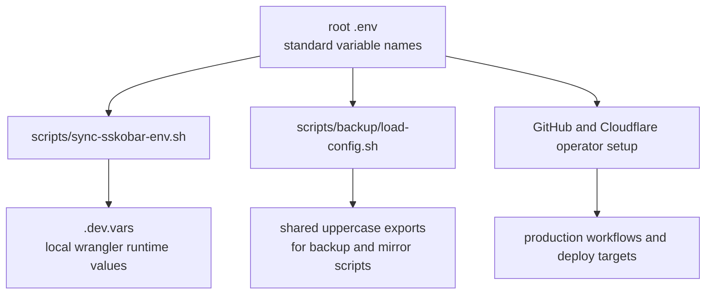
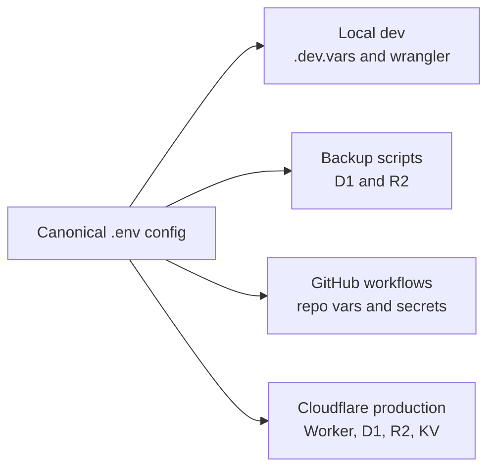

# Environment Configuration

This repository now uses the root `.env` file as the canonical operator-managed configuration source for the `satusehatkobar` workspace.

The variable names stay standard and readable. The `awcms-sskkobar` naming family is applied to managed remote-service resource values where this workspace owns the resource naming, such as the template identifier, Worker name, R2 bucket names, and D1 database name.

## Canonical Model



## What The Root `.env` Owns

- workspace identity and environment label
- canonical template identifier
- local development URLs
- production URLs
- Cloudflare account credentials and Worker metadata
- development and production D1, R2, and KV identifiers
- backup retention and encryption settings
- GitHub workflow defaults and PAT-based local access
- GitLab mirror settings

## Automation

Run the sync script after editing `.env`:

```bash
bash scripts/sync-sskobar-env.sh
```

That script updates the tracked root `.dev.vars` file plus related deployment/config files derived from `.env`, including the root `wrangler.toml`, the Cloudflare template `wrangler.jsonc`, workflow defaults, and operator config examples.

`scripts/backup/load-config.sh` reads the same canonical `.env` and exports the values needed by the current backup and mirror scripts.

Validate the canonical naming model after any resource-name change:

```bash
bash scripts/validate-sskobar-config.sh
```

## Local And Production Consistency

Use one naming model for both environments:

- standard variable names carry both local and production configuration
- remote resource names under workspace control use the `awcms-sskkobar` naming family in their values
- backup defaults point at the production D1 and R2 targets unless explicitly overridden



## Required Manual Inputs

The new `.env` is created with safe placeholders or blank values for anything secret or environment-specific.

These items still require operator attention before production use:

- `CLOUDFLARE_ACCOUNT_ID`
- `CLOUDFLARE_API_TOKEN`
- `CLOUDFLARE_DEPLOY_TOKEN`
- `CLOUDFLARE_WORKER_D1_DATABASE_ID`
- `CLOUDFLARE_WORKER_KV_NAMESPACE_ID`
- `BACKUP_PASSPHRASE`
- `GITHUB_PAT`
- `GITLAB_USERNAME`
- `GITLAB_PAT`

Recommended action:

1. Fill the blank or `REPLACE_WITH_...` values in the root `.env`.
2. Run `bash scripts/sync-sskobar-env.sh`.
3. Mirror the production-facing values into GitHub repository secrets and variables.
4. Keep live secrets out of tracked files and documentation.

## GitHub Mapping

The repository workflows still consume their established GitHub secret and variable names. Use the root `.env` as the source of truth when setting them.

| Canonical root value | GitHub target |
| --- | --- |
| `CLOUDFLARE_API_TOKEN` | `CLOUDFLARE_API_TOKEN` secret |
| `CLOUDFLARE_DEPLOY_TOKEN` | `CLOUDFLARE_DEPLOY_TOKEN` secret |
| `CLOUDFLARE_ACCOUNT_ID` | `CLOUDFLARE_ACCOUNT_ID` secret |
| `BACKUP_PASSPHRASE` | `BACKUP_PASSPHRASE` secret |
| `D1_DATABASE_NAME` | `D1_DATABASE_NAME` variable or secret |
| `R2_BUCKET_NAME` | `R2_BUCKET_NAME` variable or secret |
| `GITLAB_PAT` | `GITLAB_PAT` secret |
| `GITLAB_USERNAME` | `GITLAB_USERNAME` variable or secret |
| `GITLAB_REPO_NAME` | `GITLAB_REPO_NAME` variable or secret |
| `GITHUB_ACTION_NODE_VERSION` | `GITHUB_ACTION_NODE_VERSION` variable |
| `GITHUB_ACTION_PNPM_VERSION` | `GITHUB_ACTION_PNPM_VERSION` variable |
| `GITHUB_ACTION_TEMPLATE_NAME` | `GITHUB_ACTION_TEMPLATE_NAME` variable |
| `GITHUB_ACTION_WORKER_TEMPLATE_PACKAGE` | `GITHUB_ACTION_WORKER_TEMPLATE_PACKAGE` variable |

## Operational Rule

Treat the root `.env` as the only editable source of truth for root-managed operator configuration. Any derived local file should be regenerated from it, not edited by hand unless there is a temporary debugging need.

## Naming Rule

- variable names remain standard, for example `CLOUDFLARE_WORKER_NAME`
- remote resource values owned by this workspace should use the agreed `awcms-sskkobar` naming family where appropriate, for example `awcms-sskkobar-r2`
- values that reference existing external systems you do not control, such as `git@github.com:ahliweb/awcms-micro.git`, should remain unchanged
