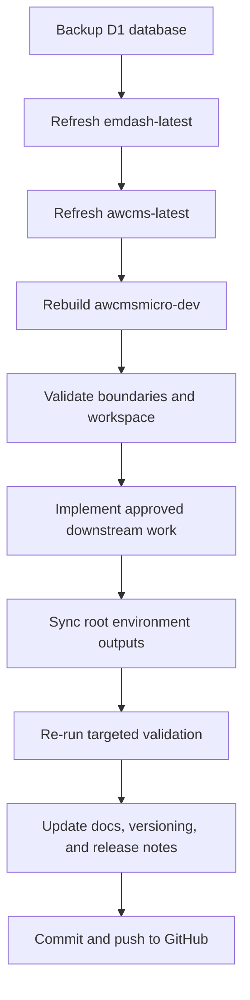

# Operator Workflow

## Purpose

This document gives operators one concise end-to-end workflow for maintaining the parent repository, validating AWCMS-Micro changes, and preparing an independent repository promotion.

## Workflow Summary



1. Backup the production D1 database.
2. Refresh upstream EmDash into `emdash-latest/`.
3. Refresh upstream AWCMS-Micro into `awcms-latest/`.
4. Rebuild `awcmsmicro-dev/` from `emdash-latest/`.
5. Validate the rebuilt workspace.
6. Implement AWCMS-Micro work only in approved plugin and template boundaries.
7. Sync derived environment and deployment files from the canonical root `.env`.
8. Prepare AWCMS release-note inputs when plugin or template versions should change, keep `awcmsmicro-dev/.changeset/` preserved for workspace packages like `@emdash-cms/admin`, and update the root workspace snapshot when the plugin/template inventory changes.
9. Re-run targeted validation.
10. Update governance docs if boundaries, workflow, deployment, or security rules changed.
11. Check promotion and release-readiness artifacts when preparing an independent repository state.

## Standard Commands

### 1. Refresh Upstream Snapshot

```bash
bash scripts/update-emdash-latest.sh
bash scripts/update-awcms-latest.sh
```

### 2. Rebuild The AWCMS-Micro Workspace

```bash
bash scripts/update-awcmsmicro-dev.sh
```

This rebuild path also prunes stale directories that remain only because they contain excluded transient artifacts such as `node_modules/`, `dist/`, `.vite/`, or `.mf/` after an upstream path is removed.

### 3. Validate Boundaries And Workspace

```bash
bash scripts/validate-awcmsmicro-boundaries.sh
bash scripts/validate-sskobar-config.sh
bash scripts/validate-awcmsmicro-dev.sh
```

### 4. Combined Sync Path

```bash
bash scripts/sync-and-validate-awcmsmicro-dev.sh
```

This combined path now refreshes env-derived config from the root `.env`, validates the canonical `awcms-sskkobar` deployment/resource configuration, and only then runs the workspace validation sequence for the `awcms-sskobar-cloudflare` template and the rest of `awcmsmicro-dev`.

### 5. Check Root And Workspace Versioning Status

```bash
bash scripts/awcms-root-versioning.sh status
node scripts/awcms-version.mjs status
node awcmsmicro-dev/.github/scripts/awcms-version.mjs status
```

### 6. Sync Root Environment Outputs

```bash
bash scripts/sync-sskobar-env.sh
bash scripts/validate-sskobar-config.sh
```

## Decision Rules During Work

- If the change is upstream EmDash, keep it in `emdash-latest/` only.
- If the change is AWCMS-Micro product behavior, put it in plugin or template boundaries only.
- If the change affects process, structure, deployment guidance, or security guidance, update root docs and scripts.
- If the change affects package release metadata, keep `awcmsmicro-dev/.changeset/` for workspace packages and `awcmsmicro-dev/.awcms-changesets/` for downstream `@awcms-micro/*` packages.

## Promotion Path

When preparing the independent `awcms-micro` repository state:

1. Review `docs/awcms-micro-product-readme-final.md`.
2. Review `docs/awcms-micro-repository-promotion-checklist.md`.
3. Review `docs/awcms-micro-release-readiness-checklist.md`.
4. Review `docs/awcms-micro-versioning.md`.
5. Review `docs/awcms-micro-root-versioning.md` if the workspace snapshot or root maintenance changelog changed.
6. Confirm targeted plugin and template validation passes.

## Minimum Promotion-Readiness Signals

- boundary validation passes
- target plugin package typechecks and tests pass
- target deployment template typechecks pass
- product-facing docs are current
- no active product behavior relies on forbidden non-plugin, non-template layers

## Documentation To Update When Needed

- `docs/upstream-sync/UPSTREAM_SYNC_STATUS.md`
- `docs/upstream-sync/LAST_AWCMS_MICRO_FETCH.md`
- `docs/upstream-sync/DIVERGENCE_LOG.md`
- `docs/upstream-sync/COMPATIBILITY_MATRIX.md`
- `docs/deployment/cloudflare.md`
- `docs/environment-configuration.md`
- `docs/security/security-baseline.md`

## Operating Principle

Keep upstream synchronization, AWCMS-Micro customization, and repository promotion as separate, reviewable concerns even when they happen close together in time.
