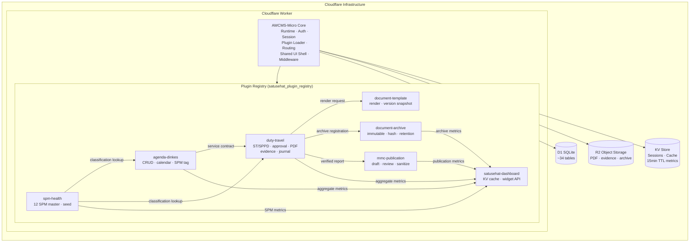
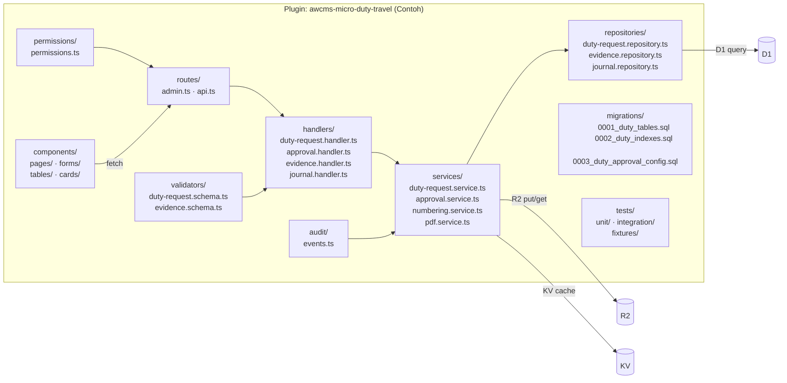
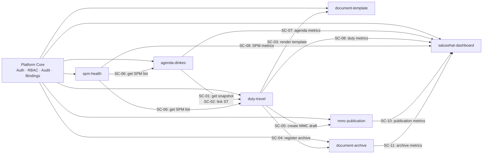
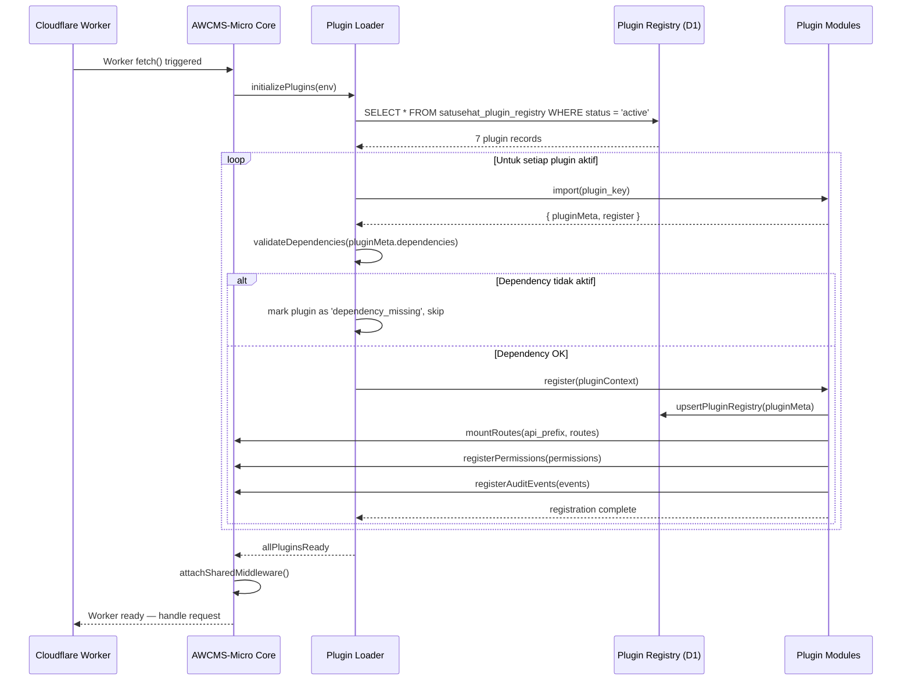
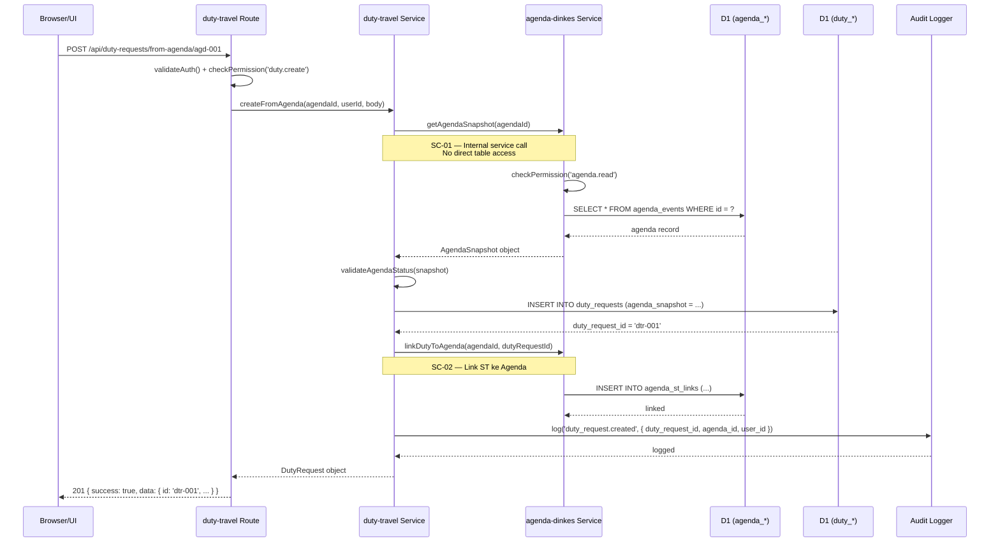

# Plugin Architecture — Satu Sehat Kobar

**Platform**: AWCMS-Micro (Cloudflare Workers / D1 / R2 / KV)  
**Versi Dokumen**: v1.5  
**Tanggal**: Juni 2026  
**Status**: Final — Siap Eksekusi  
**Instansi**: Dinas Kesehatan Kabupaten Kotawaringin Barat

---

## 1. Prinsip Arsitektur Plugin

### 1.1 Lima Aturan Tidak Dapat Diubah (Immutable Rules)

Kelima aturan ini berlaku untuk semua developer, AI coding agent, dan reviewer selama masa hidup sistem.

| # | Aturan | Penjelasan |
|---|--------|-----------|
| **R1** | **Tidak ada akses tabel lintas plugin secara langsung** | Plugin hanya boleh membaca atau menulis tabel miliknya sendiri. Akses ke data plugin lain wajib melalui service contract (API call atau shared service method yang terdokumentasi). |
| **R2** | **Tidak ada fork terhadap core AWCMS-Micro** | Logika bisnis Satu Sehat Kobar tidak boleh ditanam langsung di core. Core hanya mengelola runtime, auth, session, routing dasar, plugin loader, shared UI shell, dan shared bindings. |
| **R3** | **Setiap inter-plugin call harus memiliki kontrak tertulis** | Tidak ada undocumented dependency. Setiap method yang dipanggil antar plugin wajib terdaftar di seksi 4 dokumen ini. |
| **R4** | **Permission harus diperiksa di setiap level** | Route, service, dan repository wajib memvalidasi authentication, RBAC permission, dan ABAC scope. Tidak ada bypass permission antar plugin. |
| **R5** | **Plugin harus dapat diuji, di-deploy, dan di-rollback secara mandiri** | Setiap plugin memiliki migration, seed, test, dan dokumentasi sendiri. Kegagalan satu plugin tidak boleh menghentikan plugin lain. |

### 1.2 Prinsip Isolasi Plugin

1. **Isolasi Data**: Tabel dengan prefix `agenda_*` hanya dimiliki oleh plugin Agenda. Tabel `duty_*` hanya dimiliki oleh plugin Duty Travel. Tabel `document_*` dimiliki oleh plugin Document Archive. Tabel `satusehat_*` adalah milik platform.

2. **Isolasi Logic**: Business logic satu plugin tidak boleh disebut atau dipanggil langsung dari plugin lain kecuali melalui service method yang sudah terdaftar.

3. **Isolasi Failure**: Plugin yang gagal load atau crash tidak boleh menjatuhkan plugin lain. Setiap plugin harus memiliki fallback state.

4. **Isolasi Deployment**: Plugin dapat di-deploy ulang secara terpisah tanpa deploy ulang seluruh sistem.

5. **Isolasi Dependency Eksternal**: Plugin tidak menyimpan API secret. Secret dikelola di environment binding level platform.

### 1.3 Batas Tanggung Jawab Core vs Plugin

| Komponen | Milik Core AWCMS-Micro | Milik Plugin Satu Sehat Kobar |
|----------|------------------------|-------------------------------|
| Authentication & Session | Ya | Tidak |
| RBAC framework | Ya | Permission definitions per plugin |
| Plugin loader mechanism | Ya | Plugin registration |
| Shared UI shell & layout | Ya | Halaman fitur dan form |
| Database bindings (D1) | Ya | Migrasi dan query per plugin |
| Storage bindings (R2/KV) | Ya | Upload/read policy per plugin |
| Audit log writer | Ya | Audit event definitions per plugin |
| Business logic workflow | Tidak | Ya |
| Document template rendering | Tidak | Ya (plugin document-template) |
| Approval chain logic | Tidak | Ya (plugin duty-travel) |
| SPM classification | Tidak | Ya (plugin spm-health) |
| Dashboard aggregation | Tidak | Ya (plugin satusehat-dashboard) |

---

## 2. Daftar Plugin MVP

| Plugin ID | Nama Teknis | Nama Tampilan | Status MVP | Fungsi Inti | Prefix Tabel | Sprint |
|-----------|-------------|---------------|------------|-------------|--------------|--------|
| `satusehat-dashboard` | `awcms-micro-satusehat-dashboard` | Dashboard Satu Sehat Kobar | Must Have | Dashboard utama, widget ringkasan, KV cache metrics, indikator SPM | `satusehat_` | Sprint 4–5 |
| `agenda-dinkes` | `awcms-micro-agenda-dinkes` | Agenda Dinkes | Must Have | Agenda kegiatan, kalender, lampiran, SPM tagging, relasi ke ST, soft-delete | `agenda_` | Sprint 1–2 |
| `duty-travel` | `awcms-micro-duty-travel` | ST/SPPD Perjalanan Dinas | Must Have | Pengajuan ST/SPPD, approval multitingkat, generate PDF, upload bukti, jurnal pegawai | `duty_` | Sprint 2–4 |
| `spm-health` | `awcms-micro-spm-health` | SPM Kesehatan | Should Have | Master 12 layanan SPM, klasifikasi program, seed-only MVP | `duty_spm_` (shared) | Sprint 1 |
| `mmc-publication` | `awcms-micro-mmc-publication` | Publikasi MMC | Should Have | Draft publikasi dari laporan verified, review, sanitasi data PII | `duty_publication_` (shared) | Sprint 5–6 |
| `document-template` | `awcms-micro-document-template` | Template Dokumen | Must Have | Template ST/SPPD, versioning otomatis saat generate, snapshot per dokumen | `duty_template_` (shared) | Sprint 2 |
| `document-archive` | `awcms-micro-document-archive` | Arsip Dokumen | Must Have | Arsip final immutable, metadata, hash SHA-256, access log, retensi | `document_` | Sprint 4–5 |

**Catatan**: Plugin `document-template` dan `mmc-publication` menggunakan tabel dengan prefix `duty_` karena beroperasi dalam lingkup duty workflow. Plugin `document-archive` menggunakan prefix `document_` karena bersifat lintas-plugin (arsip dari duty dan potensi arsip masa depan lainnya).

---

## 3. Arsitektur Komponen

### 3.1 Diagram Arsitektur Keseluruhan



### 3.2 Diagram Struktur Internal Plugin



---

## 4. Service Contracts Antar Plugin

### 4.1 Diagram Dependency Antar Plugin



### 4.2 SC-01: Agenda → Duty (Get Agenda Snapshot)

| Atribut | Detail |
|---------|--------|
| **Contract ID** | SC-01 |
| **Provider** | `agenda-dinkes` |
| **Consumer** | `duty-travel` |
| **Method** | `GET` |
| **Endpoint** | `/api/agenda/events/:id` |
| **Permission** | `agenda.read` ATAU `duty.create` |
| **ABAC** | User harus dari unit yang sama atau memiliki scope dinas_all |

**Request:**
```
GET /api/agenda/events/agd-001
Authorization: Bearer <token>
```

**Response sukses:**
```json
{
  "success": true,
  "data": {
    "id": "agd-001",
    "title": "Monitoring Puskesmas Arsel",
    "description": "Monitoring pelaksanaan program SPM di Puskesmas Arsel",
    "start_at": "2026-07-01T08:00:00+07:00",
    "end_at": "2026-07-03T17:00:00+07:00",
    "location_name": "Puskesmas Arsel",
    "location_address": "Jl. Pangkalan Bun - Arsel KM 12",
    "organizer_unit_id": "unit-bidang-yankes",
    "visibility": "internal",
    "status": "confirmed",
    "spm_category": "Pelayanan Kesehatan Penderita Hipertensi",
    "spm_services": ["spm-06"],
    "priority_program": "SPM Kesehatan",
    "need_st": true,
    "potential_mmc": false,
    "agenda_snapshot": { "captured_at": "2026-06-13T10:00:00Z" },
    "participants": [
      { "user_id": "usr-001", "name": "dr. Budi Santoso", "nip": "197801012006041001", "role_in_activity": "Ketua Tim" }
    ]
  }
}
```

**Error codes:**

| Status | Error Code | Kondisi |
|--------|-----------|---------|
| 401 | `ERR_UNAUTHORIZED` | User belum login |
| 403 | `ERR_FORBIDDEN` | User tidak memiliki akses agenda ini |
| 404 | `ERR_AGENDA_NOT_FOUND` | Agenda tidak ditemukan |
| 409 | `ERR_AGENDA_STATUS_INVALID` | Status agenda tidak dapat digunakan (misal: cancelled) |

### 4.3 SC-02: Agenda → Duty (Link ST ke Agenda)

| Atribut | Detail |
|---------|--------|
| **Contract ID** | SC-02 |
| **Provider** | `agenda-dinkes` |
| **Consumer** | `duty-travel` |
| **Method** | `POST` |
| **Endpoint** | `/api/agenda/events/:id/st-links` |
| **Permission** | `duty.create` |

**Request body:**
```json
{
  "duty_request_id": "dtr-001",
  "tracking_number": "800/023/ST/DINKES/2026",
  "status": "submitted"
}
```

**Response sukses:**
```json
{
  "success": true,
  "data": { "linked": true, "agenda_id": "agd-001", "duty_request_id": "dtr-001" }
}
```

### 4.4 SC-03: Duty → Template (Render Dokumen)

| Atribut | Detail |
|---------|--------|
| **Contract ID** | SC-03 |
| **Provider** | `document-template` |
| **Consumer** | `duty-travel` |
| **Method** | `POST` |
| **Endpoint** | `/api/document-templates/render` |
| **Permission** | `duty.document.generate` (internal service call) |

**Request body:**
```json
{
  "template_key": "st-standard",
  "template_version": "latest",
  "context": {
    "nomor_surat": "800/023/ST/DINKES/2026",
    "perihal": "Monitoring Puskesmas Arsel",
    "dasar": ["Permenkes No. 4 Tahun 2019"],
    "ditugaskan": [
      { "nama": "dr. Budi Santoso", "nip": "197801012006041001", "jabatan": "Dokter Ahli Pertama" }
    ],
    "tujuan": "Puskesmas Arsel",
    "tanggal_mulai": "2026-07-01",
    "tanggal_selesai": "2026-07-03",
    "pejabat_ttd": { "nama": "drg. Rina Susanti, M.Kes", "nip": "196905221995032002", "jabatan": "Kepala Dinas Kesehatan" }
  },
  "output_format": "pdf",
  "save_snapshot": true,
  "duty_request_id": "dtr-001"
}
```

**Response sukses:**
```json
{
  "success": true,
  "data": {
    "document_id": "doc-001",
    "template_version_id": "tv-001",
    "r2_key": "documents/2026/07/st-dtr-001-v1.pdf",
    "hash_sha256": "a3f9b2c1...",
    "generated_at": "2026-06-13T10:05:00Z",
    "download_url": "/api/duty-documents/doc-001/download"
  }
}
```

**Catatan penting**: Template auto-snapshot dibuat otomatis pada setiap pemanggilan `generate`. Field `save_snapshot: true` memastikan versi template yang digunakan tersimpan sebagai `duty_template_versions` record, sehingga dokumen dapat di-reproduksi dengan template yang sama di masa mendatang.

### 4.5 SC-04: Duty → Archive (Registrasi Arsip)

| Atribut | Detail |
|---------|--------|
| **Contract ID** | SC-04 |
| **Provider** | `document-archive` |
| **Consumer** | `duty-travel` |
| **Method** | `POST` |
| **Endpoint** | `/api/document-archives` |
| **Permission** | `archive.create` (internal service call) |

**Request body:**
```json
{
  "source_plugin": "duty-travel",
  "source_entity_type": "duty_request",
  "source_entity_id": "dtr-001",
  "document_type": "st",
  "classification": "internal",
  "title": "Surat Tugas 800/023/ST/DINKES/2026",
  "r2_key": "documents/2026/07/st-dtr-001-v1.pdf",
  "hash_sha256": "a3f9b2c1...",
  "file_size_bytes": 245760,
  "retention_rule_key": "st-5-years",
  "metadata": {
    "duty_request_id": "dtr-001",
    "nomor_surat": "800/023/ST/DINKES/2026",
    "tanggal_terbit": "2026-06-13"
  }
}
```

### 4.6 SC-05: Duty → MMC (Buat Draft Publikasi)

| Atribut | Detail |
|---------|--------|
| **Contract ID** | SC-05 |
| **Provider** | `mmc-publication` |
| **Consumer** | `duty-travel` |
| **Method** | `POST` |
| **Endpoint** | `/api/mmc/drafts/from-duty/:duty_request_id` |
| **Trigger** | `potential_mmc = true` AND laporan terverifikasi |
| **Permission** | `mmc.draft.create` (internal atau Reviewer MMC) |

**Request body:**
```json
{
  "duty_request_id": "dtr-001",
  "report_id": "rpt-001",
  "suggested_title": "Monitoring Pelayanan SPM Hipertensi di Puskesmas Arsel",
  "draft_content": "Pada tanggal 1–3 Juli 2026, tim Dinas Kesehatan...",
  "potential_media_type": "berita_website"
}
```

### 4.7 SC-06: SPM → Agenda/Duty (Lookup SPM List)

| Atribut | Detail |
|---------|--------|
| **Contract ID** | SC-06 |
| **Provider** | `spm-health` |
| **Consumer** | `agenda-dinkes`, `duty-travel` |
| **Method** | `GET` |
| **Endpoint** | `/api/spm/services` |
| **Permission** | `spm.read` (public in-app) |

**Response:**
```json
{
  "success": true,
  "data": [
    { "id": "spm-01", "code": "SPM-01", "name": "Pelayanan Kesehatan Ibu Hamil", "target_percentage": 100, "program_category": "Kesehatan Ibu dan Anak" },
    { "id": "spm-06", "code": "SPM-06", "name": "Pelayanan Kesehatan Penderita Hipertensi", "target_percentage": 100, "program_category": "Penyakit Tidak Menular" }
  ]
}
```

### 4.8 SC-07 s/d SC-11: All → Dashboard (Metrics Endpoints)

Semua plugin menyediakan endpoint metrics untuk konsumsi Dashboard:

| Contract | Provider | Endpoint | Data |
|----------|----------|----------|------|
| SC-07 | `agenda-dinkes` | `GET /api/agenda/metrics` | Total agenda, by status, by SPM |
| SC-08 | `duty-travel` | `GET /api/duty-requests/metrics` | Total ST, approval rate, avg duration |
| SC-09 | `spm-health` | `GET /api/spm/metrics` | Capaian per 12 SPM |
| SC-10 | `mmc-publication` | `GET /api/mmc/metrics` | Draft, published, rejected |
| SC-11 | `document-archive` | `GET /api/document-archives/metrics` | Total archived, by classification |

Dashboard membaca semua metrics ini dan menyimpan hasilnya di KV dengan **TTL 15 menit** per resolved decision #8.

---

## 5. Plugin Registry

### 5.1 Tabel `satusehat_plugin_registry`

```sql
CREATE TABLE satusehat_plugin_registry (
    id            TEXT PRIMARY KEY DEFAULT (lower(hex(randomblob(8)))),
    plugin_key    TEXT NOT NULL UNIQUE,       -- e.g. 'agenda-dinkes'
    plugin_name   TEXT NOT NULL,              -- e.g. 'Agenda Dinkes'
    version       TEXT NOT NULL,              -- e.g. '1.0.0'
    status        TEXT NOT NULL DEFAULT 'active'
                  CHECK (status IN ('active','inactive','disabled','error')),
    description   TEXT,
    mvp_priority  TEXT NOT NULL DEFAULT 'must'
                  CHECK (mvp_priority IN ('must','should','could','wont')),
    dependencies  TEXT DEFAULT '[]',          -- JSON array of plugin_key strings
    admin_route   TEXT,                       -- e.g. '/admin/agenda'
    api_prefix    TEXT,                       -- e.g. '/api/agenda'
    table_prefix  TEXT,                       -- e.g. 'agenda_'
    config_schema TEXT DEFAULT '{}',          -- JSON Schema for plugin config
    enabled_at    TEXT,
    disabled_at   TEXT,
    error_message TEXT,
    created_at    TEXT NOT NULL DEFAULT (datetime('now')),
    updated_at    TEXT NOT NULL DEFAULT (datetime('now'))
);

CREATE INDEX idx_plugin_registry_status ON satusehat_plugin_registry(status);
CREATE INDEX idx_plugin_registry_key    ON satusehat_plugin_registry(plugin_key);
```

### 5.2 Cara Plugin Mendaftarkan Diri

Setiap plugin mengekspor fungsi `register(ctx)` yang dipanggil oleh core plugin loader saat startup:

```typescript
// packages/plugins/agenda-dinkes/index.ts
export const pluginMeta = {
  plugin_key:   'agenda-dinkes',
  plugin_name:  'Agenda Dinkes',
  version:      '1.0.0',
  mvp_priority: 'must',
  dependencies: [],
  admin_route:  '/admin/agenda',
  api_prefix:   '/api/agenda',
  table_prefix: 'agenda_',
  description:  'Manajemen agenda kegiatan Dinkes, SPM tagging, dan relasi ST/SPPD.',
};

export async function register(ctx: PluginContext): Promise<void> {
  // 1. Upsert plugin registry record
  await ctx.db.upsertPluginRegistry(pluginMeta);
  // 2. Register routes
  ctx.router.mount(pluginMeta.api_prefix, apiRoutes);
  ctx.adminRouter.mount(pluginMeta.admin_route, adminRoutes);
  // 3. Register permissions
  await ctx.permissions.registerPluginPermissions('agenda-dinkes', agendaPermissions);
  // 4. Register audit events
  ctx.audit.registerEvents('agenda-dinkes', agendaAuditEvents);
}
```

### 5.3 Seed Data Plugin Registry MVP

```sql
INSERT INTO satusehat_plugin_registry (plugin_key, plugin_name, version, status, mvp_priority, dependencies, admin_route, api_prefix, table_prefix, description) VALUES
  ('satusehat-dashboard', 'Dashboard Satu Sehat Kobar', '1.0.0', 'active', 'must',    '["agenda-dinkes","duty-travel","spm-health"]', '/admin/dashboard',  '/api/satusehat', 'satusehat_',           'Dashboard utama, widget ringkasan, KV-cached metrics.'),
  ('agenda-dinkes',       'Agenda Dinkes',              '1.0.0', 'active', 'must',    '[]',                                           '/admin/agenda',     '/api/agenda',    'agenda_',              'Manajemen agenda kegiatan, SPM tagging, relasi ST.'),
  ('duty-travel',         'ST/SPPD Perjalanan Dinas',  '1.0.0', 'active', 'must',    '["agenda-dinkes","document-template","document-archive"]', '/admin/duty', '/api/duty-requests', 'duty_', 'Pengajuan ST/SPPD, approval multitingkat, bukti, jurnal.'),
  ('spm-health',          'SPM Kesehatan',              '1.0.0', 'active', 'should',  '[]',                                           '/admin/spm',        '/api/spm',       'duty_spm_',            'Master 12 layanan SPM Kesehatan, seed-only MVP.'),
  ('mmc-publication',     'Publikasi MMC',              '1.0.0', 'active', 'should',  '["duty-travel"]',                              '/admin/mmc',        '/api/mmc',       'duty_publication_',    'Draft publikasi dari laporan verified, review, sanitasi.'),
  ('document-template',   'Template Dokumen',           '1.0.0', 'active', 'must',    '[]',                                           '/admin/templates',  '/api/document-templates', 'duty_template_', 'Template ST/SPPD, auto-snapshot versi saat generate.'),
  ('document-archive',    'Arsip Dokumen',              '1.0.0', 'active', 'must',    '["duty-travel"]',                              '/admin/archives',   '/api/document-archives',  'document_',      'Arsip final immutable, hash SHA-256, retensi, access log.');
```

---

## 6. Alur Loading Plugin



---

## 7. Alur Request Antar Plugin (Inter-Plugin Call)



---

## 8. Konfigurasi dan Feature Flags

### 8.1 Environment Variables

| Variabel | Tipe | Default | Keterangan |
|----------|------|---------|-----------|
| `DATABASE_URL` | binding | — | D1 database binding name |
| `R2_BUCKET` | binding | — | R2 bucket binding name |
| `KV_STORE` | binding | — | KV namespace binding name |
| `APP_ENV` | string | `production` | `development` / `staging` / `production` |
| `APP_URL` | string | — | Base URL aplikasi |
| `JWT_SECRET` | secret | — | Secret untuk JWT signing |
| `DASHBOARD_KV_TTL` | number | `900` | TTL cache dashboard KV dalam detik (default 15 menit) |
| `MAX_UPLOAD_SIZE_MB` | number | `10` | Batas ukuran upload file bukti (MB) |
| `PDF_RENDER_TIMEOUT_MS` | number | `30000` | Timeout rendering PDF (ms) |
| `RATE_LIMIT_API` | number | `100` | Req/menit per user untuk API umum |
| `RATE_LIMIT_UPLOAD` | number | `20` | Req/menit per user untuk upload |
| `AUDIT_LOG_RETENTION_DAYS` | number | `365` | Retensi audit log (hari) |
| `NOTIFICATION_ENABLED` | boolean | `true` | Aktifkan in-app notification |

### 8.2 Runtime Config (Tabel `satusehat_settings`)

```sql
CREATE TABLE satusehat_settings (
    id          TEXT PRIMARY KEY DEFAULT (lower(hex(randomblob(8)))),
    setting_key TEXT NOT NULL UNIQUE,
    value       TEXT NOT NULL,
    value_type  TEXT NOT NULL CHECK (value_type IN ('string','boolean','integer','json')),
    description TEXT,
    is_public   INTEGER NOT NULL DEFAULT 0,  -- 1 = visible to frontend
    updated_by  TEXT,
    updated_at  TEXT NOT NULL DEFAULT (datetime('now'))
);
```

**Seed data settings runtime:**

| `setting_key` | `value` | `value_type` | Keterangan |
|---------------|---------|-------------|-----------|
| `enable_mmc_draft` | `true` | boolean | Aktifkan fitur MMC draft |
| `enable_finance_required` | `true` | boolean | Finance approval step aktif |
| `enable_finance_skip_if_unbudgeted` | `true` | boolean | Skip finance approval jika `is_budgeted=false` |
| `enable_potential_mmc_auto` | `true` | boolean | potential_mmc diwarisi dari agenda otomatis |
| `enable_document_template_versioning` | `true` | boolean | Auto-snapshot template versi |
| `enable_agenda_soft_delete_only` | `true` | boolean | Agenda hanya soft-delete |
| `enable_cross_faskes_approval` | `true` | boolean | Approval lintas faskes berdasar primary_health_facility_id |
| `dashboard_kv_ttl_seconds` | `900` | integer | TTL KV cache dashboard |
| `max_approval_steps` | `5` | integer | Maks langkah approval per duty request |
| `spm_master_editable` | `false` | boolean | CRUD SPM master — false di MVP (seed-only) |
| `evidence_pii_scan_enabled` | `false` | boolean | AI PII scan — Phase 2, false di MVP |
| `notification_channel` | `in_app` | string | `in_app` (Phase 1), `email`/`sms` (Phase 2) |
| `document_numbering_auto_reset` | `true` | boolean | Reset nomor urut dokumen setiap tahun |

---

## 9. Penomoran Dokumen

### 9.1 Tabel `duty_numbering_sequences`

```sql
CREATE TABLE duty_numbering_sequences (
    id              TEXT PRIMARY KEY DEFAULT (lower(hex(randomblob(8)))),
    sequence_key    TEXT NOT NULL UNIQUE,   -- e.g. 'st-dinkes-2026'
    unit_id         TEXT,                  -- NULL = dinas level
    document_type   TEXT NOT NULL          -- 'st','sppd','biaya','laporan'
                    CHECK (document_type IN ('st','sppd','biaya','laporan','umum')),
    pattern         TEXT NOT NULL,         -- e.g. '{kode}/{###}/{jenis}/{unit}/{yyyy}'
    kode_surat      TEXT NOT NULL DEFAULT '800',
    jenis_surat     TEXT NOT NULL,         -- e.g. 'ST', 'SPPD'
    unit_code       TEXT NOT NULL,         -- e.g. 'DINKES', 'PKM-ARSEL'
    current_value   INTEGER NOT NULL DEFAULT 0,
    year            INTEGER NOT NULL,
    last_reset_at   TEXT,
    created_at      TEXT NOT NULL DEFAULT (datetime('now')),
    updated_at      TEXT NOT NULL DEFAULT (datetime('now'))
);

CREATE UNIQUE INDEX idx_numbering_key_year ON duty_numbering_sequences(sequence_key, year);
CREATE INDEX idx_numbering_unit_type ON duty_numbering_sequences(unit_id, document_type, year);
```

### 9.2 Format Pattern Penomoran

| Parameter | Keterangan | Contoh |
|-----------|-----------|--------|
| `{kode}` | Kode klasifikasi arsip | `800` |
| `{###}` | Nomor urut 3 digit, auto-increment per tahun | `023` |
| `{jenis}` | Jenis dokumen | `ST`, `SPPD` |
| `{unit}` | Kode unit penerbit | `DINKES`, `PKM-ARSEL` |
| `{yyyy}` | Tahun 4 digit | `2026` |

**Contoh hasil format**:
- ST level Dinas: `800/023/ST/DINKES/2026`
- SPPD level Dinas: `800/023/SPPD/DINKES/2026`
- ST level Puskesmas Arsel: `800/015/ST/PKM-ARSEL/2026`

### 9.3 Logika Auto-Increment dan Reset Tahunan

```typescript
async function getNextNumber(sequenceKey: string, year: number): Promise<string> {
  // Gunakan D1 transaction untuk atomic increment
  return await db.transaction(async (tx) => {
    const seq = await tx.get('duty_numbering_sequences', { sequence_key: sequenceKey, year });
    if (!seq) throw new Error(`Sequence ${sequenceKey}/${year} not found`);
    
    const nextVal = seq.current_value + 1;
    await tx.update('duty_numbering_sequences', 
      { current_value: nextVal, updated_at: new Date().toISOString() },
      { sequence_key: sequenceKey, year }
    );
    
    return seq.pattern
      .replace('{kode}', seq.kode_surat)
      .replace('{###}', String(nextVal).padStart(3, '0'))
      .replace('{jenis}', seq.jenis_surat)
      .replace('{unit}', seq.unit_code)
      .replace('{yyyy}', String(year));
  });
}

// Reset otomatis: dipanggil pada awal tahun baru atau pertama kali dokumen dibuat di tahun baru
async function resetSequenceForYear(sequenceKey: string, newYear: number): Promise<void> {
  await db.upsert('duty_numbering_sequences', {
    sequence_key: `${sequenceKey}-${newYear}`,
    current_value: 0,
    year: newYear,
    last_reset_at: new Date().toISOString(),
  });
}
```

---

## 10. Standar Pengembangan Plugin

### 10.1 Struktur Folder Template Plugin

```
packages/plugins/<plugin-name>/
├── README.md                    # Deskripsi plugin, setup, dan API ringkasan
├── CHANGELOG.md                 # Riwayat perubahan versi
├── package.json                 # Plugin metadata dan scripts
├── index.ts                     # Entry point: export pluginMeta + register()
│
├── migrations/                  # SQL migration files (D1)
│   ├── 0001_<plugin>_tables.sql
│   ├── 0002_<plugin>_indexes.sql
│   └── 0003_<plugin>_seed.sql
│
├── seeds/                       # Seed data TypeScript
│   └── initial-data.ts
│
├── routes/                      # Hono route definitions
│   ├── admin.ts                 # Admin UI routes (/admin/...)
│   └── api.ts                   # API routes (/api/...)
│
├── handlers/                    # Request handlers (thin layer)
│   └── *.handler.ts
│
├── services/                    # Business logic
│   └── *.service.ts
│
├── repositories/                # Database access layer
│   └── *.repository.ts
│
├── contracts/                   # Service contract implementations
│   ├── provided/                # Contracts this plugin provides
│   └── consumed/                # Contracts this plugin consumes
│
├── components/                  # React/UI components
│   ├── pages/
│   ├── forms/
│   ├── tables/
│   ├── cards/
│   └── shared/
│
├── permissions/
│   └── permissions.ts           # Permission definitions untuk plugin ini
│
├── audit/
│   └── events.ts                # Audit event key definitions
│
├── validators/
│   └── *.schema.ts              # Zod schemas untuk request validation
│
├── tests/
│   ├── unit/
│   ├── integration/
│   └── fixtures/
│
└── docs/
    ├── api.md                   # Dokumentasi API endpoint
    ├── database.md              # Dokumentasi schema tabel
    ├── permissions.md           # Daftar permission dan aturan
    └── service-contracts.md     # Kontrak yang disediakan dan dikonsumsi
```

### 10.2 Konvensi Penamaan Migration

Format: `NNNN_<plugin>_<deskripsi_singkat>.sql`

| Contoh | Keterangan |
|--------|-----------|
| `0001_agenda_tables.sql` | Migration pertama: buat tabel utama |
| `0002_agenda_indexes.sql` | Migration kedua: tambah indeks |
| `0003_agenda_seed.sql` | Migration ketiga: seed data awal |
| `0004_agenda_add_spm_links.sql` | Migration keempat: tambah tabel baru |
| `0005_agenda_alter_status_enum.sql` | Migration kelima: ubah enum/constraint |

**Aturan migration**:
- Nomor migration harus berurutan dan tidak loncat.
- Migration tidak boleh destruktif (`DROP COLUMN`, `DROP TABLE`) tanpa persetujuan teknis.
- Migration harus idempotent: gunakan `CREATE TABLE IF NOT EXISTS`, `CREATE INDEX IF NOT EXISTS`.
- Data migration (UPDATE massal) harus terpisah dari schema migration.

### 10.3 File Wajib Per Plugin

| File | Status | Keterangan |
|------|--------|-----------|
| `index.ts` (dengan `pluginMeta` + `register()`) | Wajib | Entry point plugin |
| `README.md` | Wajib | Dokumentasi dasar |
| `CHANGELOG.md` | Wajib | Riwayat perubahan |
| `migrations/0001_*.sql` | Wajib | Setidaknya satu migration |
| `routes/api.ts` | Wajib | Minimal satu route API |
| `permissions/permissions.ts` | Wajib | Permission definitions |
| `audit/events.ts` | Wajib | Audit event keys |
| `validators/` | Wajib | Minimal satu Zod schema |
| `tests/` | Wajib | Minimal satu test file |
| `docs/api.md` | Wajib | Dokumentasi API |

### 10.4 Checklist Plugin Siap MVP

- [ ] `pluginMeta` terdefinisi dengan benar dan terdaftar di seed registry
- [ ] Semua migration berjalan tanpa error di D1 lokal dan staging
- [ ] Semua permission terdefinisi dan terdaftar di role-permission mapping
- [ ] Semua route memiliki authentication check
- [ ] Semua route yang mengubah data memiliki RBAC + ABAC check
- [ ] Semua inter-plugin call menggunakan service contract (tidak direct table access)
- [ ] Semua aksi penting menulis audit log
- [ ] Setidaknya satu unit test dan satu integration test
- [ ] `README.md` dan `docs/api.md` diperbarui
- [ ] `CHANGELOG.md` memiliki entry untuk versi ini
- [ ] Plugin dapat di-disable tanpa mengganggu plugin lain

---

*Dokumen ini adalah referensi arsitektur hidup. Setiap keputusan desain baru yang memengaruhi batas plugin, service contract, atau aturan loading harus diperbarui di sini sebelum implementasi.*
