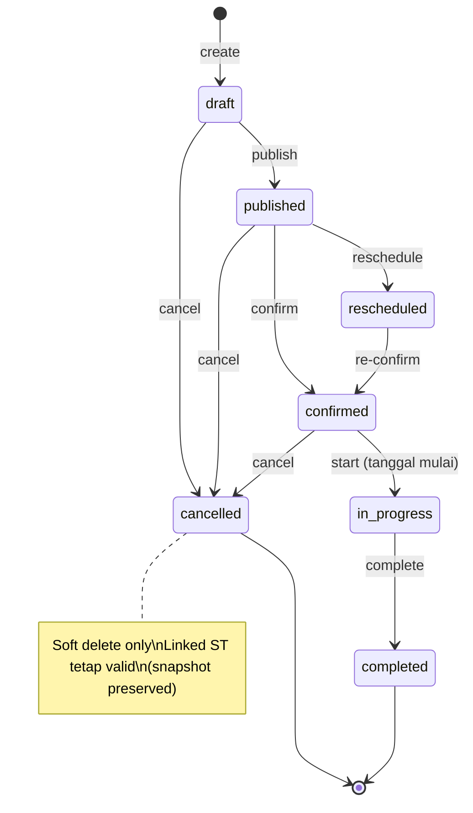
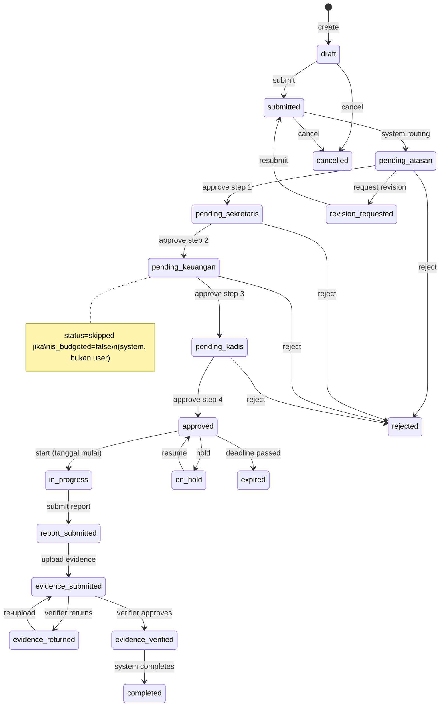
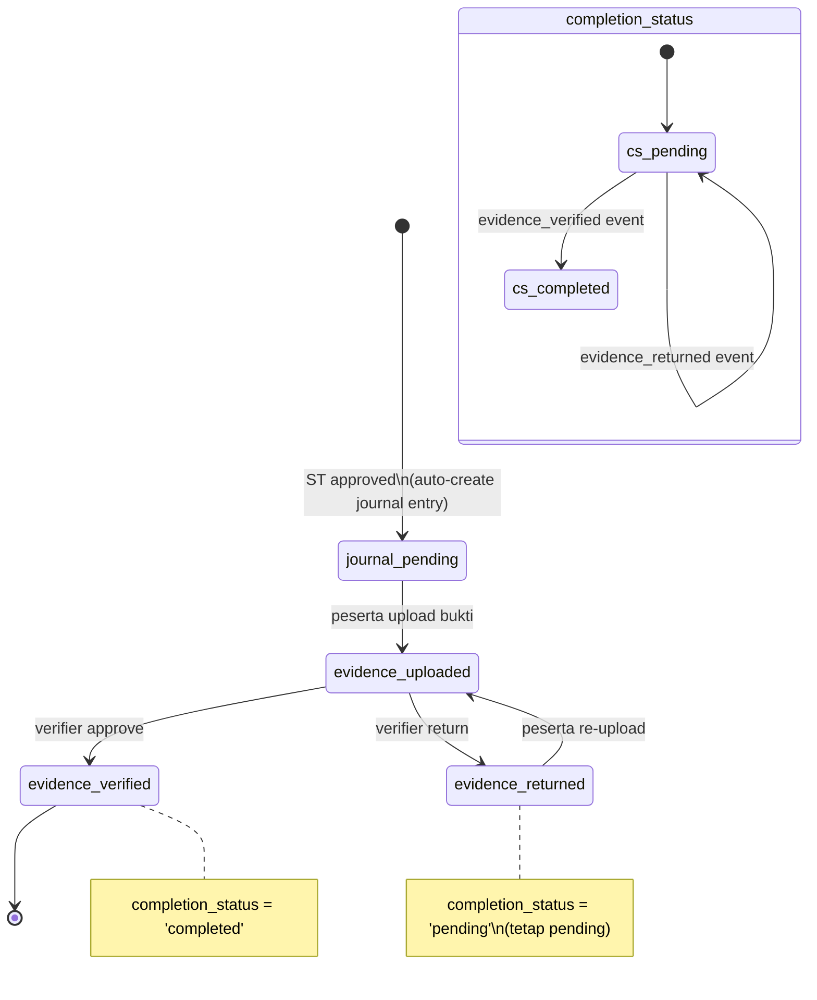

# Database MVP Schema — Satu Sehat Kobar

**Platform**: AWCMS-Micro (Cloudflare D1 / SQLite)
**Versi Dokumen**: v1.5
**Tanggal**: Juni 2026
**Status**: Final — Siap Eksekusi
**Instansi**: Dinas Kesehatan Kabupaten Kotawaringin Barat

---

## 1. Prinsip Desain Database

> **Mekanisme persistensi (DEC-019).** Skema di dokumen ini adalah **skema fisik** yang diimplementasikan **langsung di Cloudflare D1** oleh tiap plugin melalui `ctx.db` (query builder Kysely di atas binding `DB`) — bukan abstraksi storage collections EmDash. Karena EmDash tidak menyediakan plugin migration runner, **setiap plugin mengelola migrasi skema-nya sendiri secara idempoten** (`CREATE TABLE IF NOT EXISTS`, `CREATE INDEX IF NOT EXISTS`, alter terurut) yang dijalankan pada lifecycle hook `install`/`activate`, dilacak via tabel `<prefix>_migrations`. Detail runtime: `24.TECHNICAL_IMPLEMENTATION_REFERENCES.md` §4.4 & §7.2; keputusan: `12.CHANGE_CONTROL_AND_DECISION_LOG.docx.md` DEC-019.

### 1.1 Prinsip Utama

| # | Prinsip | Implementasi |
|---|---------|-------------|
| P1 | **Prefix Isolation** | Setiap plugin memiliki prefix tabel tersendiri: `agenda_*`, `duty_*`, `document_*`, `satusehat_*` |
| P2 | **Soft Delete** | Semua entitas utama memiliki kolom `deleted_at TEXT NULL`. Hard delete tidak diizinkan di MVP |
| P3 | **Snapshot Pattern** | Data dari plugin lain disimpan sebagai snapshot JSON (`agenda_snapshot`, `participant_snapshot`) sehingga perubahan di sumber tidak merusak data historis |
| P4 | **Immutable Archive** | Tabel `document_archives` tidak boleh diubah setelah `status = 'archived'`. Tidak ada UPDATE atau DELETE pada record final |
| P5 | **Audit Trail** | Semua aksi penting ditulis ke `satusehat_audit_logs`. Field minimum: `user_id`, `action`, `entity_type`, `entity_id`, `timestamp` |
| P6 | **Template Versioning** | Setiap kali dokumen di-generate, versi template saat itu disimpan sebagai snapshot di `duty_template_versions` |
| P7 | **Status Lifecycle Eksplisit** | Setiap tabel utama memiliki field `status` dengan CHECK constraint enum yang ketat |
| P8 | **PII Minimum** | Hanya NIP, nama, dan jabatan yang disimpan di tabel operasional. Tidak ada data klinis pasien |
| P9 | **Timestamps Wajib** | Semua tabel memiliki `created_at` dan `updated_at`. Tabel yang dibuat user menambahkan `created_by` |
| P10 | **Index untuk Query Utama** | Index dibuat untuk query dashboard, filter workflow, dan ABAC lookup — bukan untuk semua kolom |

### 1.2 Konvensi Penamaan

- **Primary key**: `id TEXT` dengan nilai `lower(hex(randomblob(8)))` (16-char hex)
- **Foreign key**: `<entity>_id TEXT` — tidak ada FK constraint di D1 (enforced di aplikasi)
- **Timestamps**: `TEXT NOT NULL DEFAULT (datetime('now'))` — ISO 8601 UTC
- **Enums**: `TEXT NOT NULL CHECK (field IN (...))` — SQLite tidak punya native enum
- **JSON fields**: `TEXT DEFAULT '{}'` atau `TEXT DEFAULT '[]'` — parse di aplikasi
- **Boolean**: `INTEGER NOT NULL DEFAULT 0` — 0=false, 1=true

---

## 2. ERD Konseptual

```mermaid
erDiagram
    satusehat_plugin_registry {
        text id PK
        text plugin_key
        text version
        text status
    }
    satusehat_settings {
        text id PK
        text setting_key
        text value
        text value_type
    }
    satusehat_audit_logs {
        text id PK
        text user_id FK
        text action
        text entity_type
        text entity_id
        text created_at
    }
    satusehat_dashboard_widgets {
        text id PK
        text widget_key
        text plugin_key FK
        text config
    }
    duty_approval_step_config {
        text id PK
        text org_level
        text step_order
        text role_key
        text is_required
    }
    duty_numbering_sequences {
        text id PK
        text sequence_key
        text document_type
        text pattern
        integer current_value
        integer year
    }
    agenda_events {
        text id PK
        text title
        text status
        text organizer_unit_id FK
        text created_by FK
        integer need_st
        integer potential_mmc
    }
    agenda_participants {
        text id PK
        text agenda_id FK
        text user_id FK
        text role_in_activity
    }
    agenda_attachments {
        text id PK
        text agenda_id FK
        text r2_key
        text classification
    }
    agenda_spm_links {
        text id PK
        text agenda_id FK
        text spm_service_id FK
    }
    agenda_st_links {
        text id PK
        text agenda_id FK
        text duty_request_id FK
        text status
    }
    agenda_status_logs {
        text id PK
        text agenda_id FK
        text from_status
        text to_status
        text changed_by FK
    }
    duty_requests {
        text id PK
        text agenda_id FK
        text agenda_snapshot
        text status
        text primary_health_facility_id FK
        text created_by FK
        integer is_budgeted
        integer potential_mmc
    }
    duty_request_participants {
        text id PK
        text duty_request_id FK
        text user_id FK
        text participant_snapshot
    }
    duty_request_destinations {
        text id PK
        text duty_request_id FK
        text location_name
        text tanggal_mulai
        text tanggal_selesai
    }
    duty_request_budget_lines {
        text id PK
        text duty_request_id FK
        text budget_category
        text description
        numeric amount
    }
    duty_request_approvals {
        text id PK
        text duty_request_id FK
        text step_order
        text approver_role
        text approver_user_id FK
        text status
    }
    duty_request_status_logs {
        text id PK
        text duty_request_id FK
        text from_status
        text to_status
        text changed_by FK
    }
    duty_agenda_links {
        text id PK
        text duty_request_id FK
        text agenda_id FK
    }
    duty_spm_links {
        text id PK
        text duty_request_id FK
        text spm_service_id FK
    }
    duty_reports {
        text id PK
        text duty_request_id FK
        text content
        text status
        text created_by FK
    }
    duty_evidences {
        text id PK
        text duty_request_id FK
        text uploader_user_id FK
        text r2_key
        text classification
        text evidence_status
    }
    duty_evidence_reviews {
        text id PK
        text evidence_id FK
        text reviewer_user_id FK
        text decision
    }
    duty_follow_ups {
        text id PK
        text duty_request_id FK
        text description
        text due_date
        text status
    }
    duty_person_journals {
        text id PK
        text duty_request_id FK
        text user_id FK
        text evidence_status
        text completion_status
    }
    duty_visit_effectiveness_scores {
        text id PK
        text duty_request_id FK
        text score
        text assessed_by FK
    }
    duty_publication_drafts {
        text id PK
        text duty_request_id FK
        text title
        text content
        text status
    }
    duty_publication_reviews {
        text id PK
        text draft_id FK
        text reviewer_user_id FK
        text decision
    }
    duty_publication_assets {
        text id PK
        text draft_id FK
        text r2_key
        text asset_type
    }
    duty_templates {
        text id PK
        text template_key
        text document_type
        text status
    }
    duty_template_versions {
        text id PK
        text template_id FK
        text version_number
        text snapshot_content
        text created_at
    }
    duty_documents {
        text id PK
        text duty_request_id FK
        text template_version_id FK
        text document_type
        text r2_key
        text hash_sha256
        text status
    }
    duty_document_versions {
        text id PK
        text document_id FK
        text version_number
        text r2_key
        text hash_sha256
    }
    document_archives {
        text id PK
        text source_entity_id FK
        text document_type
        text classification
        text r2_key
        text hash_sha256
        text status
        text retention_rule_id FK
    }
    document_access_logs {
        text id PK
        text archive_id FK
        text accessed_by FK
        text access_type
        text accessed_at
    }
    document_retention_rules {
        text id PK
        text rule_key
        text retention_years
        text document_type
    }

    agenda_events ||--o{ agenda_participants : "has"
    agenda_events ||--o{ agenda_attachments : "has"
    agenda_events ||--o{ agenda_spm_links : "tagged"
    agenda_events ||--o{ agenda_st_links : "linked"
    agenda_events ||--o{ agenda_status_logs : "tracked"

    duty_requests ||--o{ duty_request_participants : "has"
    duty_requests ||--o{ duty_request_destinations : "has"
    duty_requests ||--o{ duty_request_budget_lines : "has"
    duty_requests ||--o{ duty_request_approvals : "has"
    duty_requests ||--o{ duty_request_status_logs : "tracked"
    duty_requests ||--o{ duty_agenda_links : "links"
    duty_requests ||--o{ duty_spm_links : "tagged"
    duty_requests ||--o{ duty_reports : "has"
    duty_requests ||--o{ duty_evidences : "has"
    duty_requests ||--o{ duty_follow_ups : "has"
    duty_requests ||--o{ duty_person_journals : "generates"
    duty_requests ||--o{ duty_visit_effectiveness_scores : "scored"
    duty_requests ||--o{ duty_publication_drafts : "may_have"
    duty_requests ||--o{ duty_documents : "has"

    duty_evidences ||--o{ duty_evidence_reviews : "reviewed"
    duty_publication_drafts ||--o{ duty_publication_reviews : "reviewed"
    duty_publication_drafts ||--o{ duty_publication_assets : "has"
    duty_templates ||--o{ duty_template_versions : "versioned"
    duty_documents ||--o{ duty_document_versions : "versioned"
    duty_documents }o--|| duty_template_versions : "uses"

    document_archives ||--o{ document_access_logs : "logged"
    document_archives }o--|| document_retention_rules : "governed"

    agenda_st_links }o--|| duty_requests : "links"
```



---

## 3. Schema Platform Core (prefix: `satusehat_`)

### 3.1 `satusehat_plugin_registry`

```sql
CREATE TABLE satusehat_plugin_registry (
    id            TEXT PRIMARY KEY DEFAULT (lower(hex(randomblob(8)))),
    plugin_key    TEXT NOT NULL UNIQUE,
    plugin_name   TEXT NOT NULL,
    version       TEXT NOT NULL DEFAULT '1.0.0',
    status        TEXT NOT NULL DEFAULT 'active'
                  CHECK (status IN ('active','inactive','disabled','error','dependency_missing')),
    description   TEXT,
    mvp_priority  TEXT NOT NULL DEFAULT 'must'
                  CHECK (mvp_priority IN ('must','should','could','wont')),
    dependencies  TEXT NOT NULL DEFAULT '[]',   -- JSON array
    admin_route   TEXT,
    api_prefix    TEXT,
    table_prefix  TEXT,
    config_schema TEXT NOT NULL DEFAULT '{}',   -- JSON Schema
    enabled_at    TEXT,
    disabled_at   TEXT,
    error_message TEXT,
    created_at    TEXT NOT NULL DEFAULT (datetime('now')),
    updated_at    TEXT NOT NULL DEFAULT (datetime('now'))
);

CREATE INDEX idx_plugin_registry_status ON satusehat_plugin_registry(status);
```

### 3.2 `satusehat_settings`

```sql
CREATE TABLE satusehat_settings (
    id          TEXT PRIMARY KEY DEFAULT (lower(hex(randomblob(8)))),
    setting_key TEXT NOT NULL UNIQUE,
    value       TEXT NOT NULL,
    value_type  TEXT NOT NULL CHECK (value_type IN ('string','boolean','integer','json')),
    description TEXT,
    is_public   INTEGER NOT NULL DEFAULT 0,
    updated_by  TEXT,
    updated_at  TEXT NOT NULL DEFAULT (datetime('now'))
);
```

### 3.3 `satusehat_audit_logs`

```sql
CREATE TABLE satusehat_audit_logs (
    id            TEXT PRIMARY KEY DEFAULT (lower(hex(randomblob(8)))),
    user_id       TEXT,                    -- NULL untuk system actions
    user_name     TEXT,                    -- snapshot nama user saat aksi
    user_role     TEXT,                    -- snapshot role user saat aksi
    action        TEXT NOT NULL,           -- e.g. 'duty_request.created'
    entity_type   TEXT NOT NULL,           -- e.g. 'duty_request'
    entity_id     TEXT,                    -- ID entitas yang terdampak
    plugin_key    TEXT,                    -- plugin sumber event
    changes       TEXT,                    -- JSON diff sebelum/sesudah
    metadata      TEXT DEFAULT '{}',       -- JSON context tambahan
    ip_address    TEXT,
    user_agent    TEXT,
    created_at    TEXT NOT NULL DEFAULT (datetime('now'))
);

-- Index strategy untuk audit log
CREATE INDEX idx_audit_user_id      ON satusehat_audit_logs(user_id);
CREATE INDEX idx_audit_action       ON satusehat_audit_logs(action);
CREATE INDEX idx_audit_entity       ON satusehat_audit_logs(entity_type, entity_id);
CREATE INDEX idx_audit_plugin       ON satusehat_audit_logs(plugin_key);
CREATE INDEX idx_audit_created_at   ON satusehat_audit_logs(created_at);
-- Composite: audit trail per user per hari
CREATE INDEX idx_audit_user_date    ON satusehat_audit_logs(user_id, created_at);
-- Composite: audit trail per entitas
CREATE INDEX idx_audit_entity_date  ON satusehat_audit_logs(entity_type, entity_id, created_at);
```

### 3.4 `satusehat_dashboard_widgets`

```sql
CREATE TABLE satusehat_dashboard_widgets (
    id          TEXT PRIMARY KEY DEFAULT (lower(hex(randomblob(8)))),
    widget_key  TEXT NOT NULL UNIQUE,
    plugin_key  TEXT NOT NULL,
    widget_name TEXT NOT NULL,
    description TEXT,
    config      TEXT NOT NULL DEFAULT '{}',   -- JSON widget config
    roles_visible TEXT NOT NULL DEFAULT '[]', -- JSON array of role keys
    display_order INTEGER NOT NULL DEFAULT 0,
    is_active   INTEGER NOT NULL DEFAULT 1,
    created_at  TEXT NOT NULL DEFAULT (datetime('now')),
    updated_at  TEXT NOT NULL DEFAULT (datetime('now'))
);
```

### 3.5 `duty_approval_step_config` (NEW — Resolved Decision #11)

Tabel ini menyimpan konfigurasi rantai approval per level organisasi. Setiap duty request menggunakan konfigurasi ini untuk menentukan langkah approval yang harus dilalui.

```sql
CREATE TABLE duty_approval_step_config (
    id            TEXT PRIMARY KEY DEFAULT (lower(hex(randomblob(8)))),
    org_level     TEXT NOT NULL
                  CHECK (org_level IN ('dinas','puskesmas','klinik','rs','labkesda')),
    step_order    INTEGER NOT NULL,         -- 1, 2, 3, 4, 5
    step_name     TEXT NOT NULL,            -- e.g. 'Atasan Langsung'
    role_key      TEXT NOT NULL,            -- e.g. 'kepala_bidang'
    is_required   INTEGER NOT NULL DEFAULT 1,
    can_be_skipped INTEGER NOT NULL DEFAULT 0,
    skip_condition TEXT,                    -- JSON condition, e.g. '{"is_budgeted": false}'
    description   TEXT,
    is_active     INTEGER NOT NULL DEFAULT 1,
    created_at    TEXT NOT NULL DEFAULT (datetime('now')),
    updated_at    TEXT NOT NULL DEFAULT (datetime('now')),
    UNIQUE(org_level, step_order)
);

CREATE INDEX idx_approval_config_org ON duty_approval_step_config(org_level, is_active);
```

**Seed data `duty_approval_step_config`:**

```sql
-- Rantai approval level Dinas
INSERT INTO duty_approval_step_config (org_level, step_order, step_name, role_key, is_required, can_be_skipped, skip_condition) VALUES
  ('dinas', 1, 'Atasan Langsung',     'kepala_bidang',    1, 0, NULL),
  ('dinas', 2, 'Sekretaris Dinas',    'sekretaris_dinas', 1, 0, NULL),
  ('dinas', 3, 'Persetujuan Keuangan','keuangan_dinas',   1, 1, '{"is_budgeted": false}'),
  ('dinas', 4, 'Kepala Dinas',        'kadis',            1, 0, NULL),
  ('dinas', 5, 'Admin ST',            'admin_st',         1, 0, NULL);

-- Rantai approval level Puskesmas
INSERT INTO duty_approval_step_config (org_level, step_order, step_name, role_key, is_required, can_be_skipped, skip_condition) VALUES
  ('puskesmas', 1, 'Atasan Langsung',     'kepala_tata_usaha', 1, 0, NULL),
  ('puskesmas', 2, 'Persetujuan Keuangan','keuangan_faskes',   1, 1, '{"is_budgeted": false}'),
  ('puskesmas', 3, 'Kepala Puskesmas',    'kepala_puskesmas',  1, 0, NULL),
  ('puskesmas', 4, 'Admin ST Faskes',     'admin_st',          1, 0, NULL);
```

**Logika skip finance (Resolved Decision #2)**:
Ketika sebuah duty request memiliki `is_budgeted = false`, approval step dengan `can_be_skipped = 1` dan `skip_condition = '{"is_budgeted": false}'` akan otomatis di-set ke `status = 'skipped'` oleh sistem — bukan oleh user.

---

## 4. Schema Agenda Plugin (prefix: `agenda_`)

### 4.1 `agenda_events`

```sql
CREATE TABLE agenda_events (
    id                   TEXT PRIMARY KEY DEFAULT (lower(hex(randomblob(8)))),
    title                TEXT NOT NULL,
    description          TEXT,
    start_at             TEXT NOT NULL,        -- ISO 8601
    end_at               TEXT NOT NULL,
    location_name        TEXT,
    location_address     TEXT,
    location_coordinates TEXT,                 -- JSON {lat, lng}
    organizer_unit_id    TEXT NOT NULL,
    organizer_user_id    TEXT NOT NULL,
    visibility           TEXT NOT NULL DEFAULT 'internal'
                         CHECK (visibility IN ('internal','restricted','public')),
    status               TEXT NOT NULL DEFAULT 'draft'
                         CHECK (status IN ('draft','published','confirmed','in_progress','completed','cancelled','rescheduled','deleted')),
    spm_category         TEXT,                 -- free text atau kode SPM
    spm_service_ids      TEXT DEFAULT '[]',    -- JSON array of spm_service IDs
    priority_program     TEXT,
    need_st              INTEGER NOT NULL DEFAULT 0,
    potential_mmc        INTEGER NOT NULL DEFAULT 0,
    notes                TEXT,
    deleted_at           TEXT,                 -- soft delete
    created_by           TEXT NOT NULL,
    updated_by           TEXT,
    created_at           TEXT NOT NULL DEFAULT (datetime('now')),
    updated_at           TEXT NOT NULL DEFAULT (datetime('now'))
);

CREATE INDEX idx_agenda_status            ON agenda_events(status);
CREATE INDEX idx_agenda_organizer_unit    ON agenda_events(organizer_unit_id);
CREATE INDEX idx_agenda_start_at          ON agenda_events(start_at);
CREATE INDEX idx_agenda_need_st           ON agenda_events(need_st, status);
CREATE INDEX idx_agenda_potential_mmc     ON agenda_events(potential_mmc, status);
CREATE INDEX idx_agenda_deleted           ON agenda_events(deleted_at);
-- Dashboard aggregate query
CREATE INDEX idx_agenda_unit_date         ON agenda_events(organizer_unit_id, start_at, status);
```

### 4.2 `agenda_participants`

```sql
CREATE TABLE agenda_participants (
    id                TEXT PRIMARY KEY DEFAULT (lower(hex(randomblob(8)))),
    agenda_id         TEXT NOT NULL,
    user_id           TEXT NOT NULL,
    name              TEXT NOT NULL,       -- snapshot
    nip               TEXT,               -- snapshot
    jabatan           TEXT,               -- snapshot
    unit_id           TEXT,               -- snapshot
    role_in_activity  TEXT,               -- e.g. 'Ketua Tim', 'Anggota', 'Narasumber'
    attendance_status TEXT DEFAULT 'invited'
                      CHECK (attendance_status IN ('invited','confirmed','attended','absent','excused')),
    created_at        TEXT NOT NULL DEFAULT (datetime('now')),
    UNIQUE(agenda_id, user_id)
);

CREATE INDEX idx_agenda_participants_agenda ON agenda_participants(agenda_id);
CREATE INDEX idx_agenda_participants_user   ON agenda_participants(user_id);
```

### 4.3 `agenda_attachments`

```sql
CREATE TABLE agenda_attachments (
    id             TEXT PRIMARY KEY DEFAULT (lower(hex(randomblob(8)))),
    agenda_id      TEXT NOT NULL,
    file_name      TEXT NOT NULL,
    r2_key         TEXT NOT NULL,
    mime_type      TEXT,
    file_size      INTEGER,
    classification TEXT NOT NULL DEFAULT 'internal'
                   CHECK (classification IN ('public','internal','restricted','confidential')),
    uploaded_by    TEXT NOT NULL,
    deleted_at     TEXT,
    created_at     TEXT NOT NULL DEFAULT (datetime('now'))
);

CREATE INDEX idx_agenda_attachments_agenda ON agenda_attachments(agenda_id);
```

### 4.4 `agenda_spm_links`

```sql
CREATE TABLE agenda_spm_links (
    id             TEXT PRIMARY KEY DEFAULT (lower(hex(randomblob(8)))),
    agenda_id      TEXT NOT NULL,
    spm_service_id TEXT NOT NULL,
    created_at     TEXT NOT NULL DEFAULT (datetime('now')),
    UNIQUE(agenda_id, spm_service_id)
);

CREATE INDEX idx_agenda_spm_agenda ON agenda_spm_links(agenda_id);
CREATE INDEX idx_agenda_spm_svc    ON agenda_spm_links(spm_service_id);
```

### 4.5 `agenda_st_links`

```sql
CREATE TABLE agenda_st_links (
    id              TEXT PRIMARY KEY DEFAULT (lower(hex(randomblob(8)))),
    agenda_id       TEXT NOT NULL,
    duty_request_id TEXT NOT NULL,
    tracking_number TEXT,
    status          TEXT NOT NULL DEFAULT 'submitted'
                    CHECK (status IN ('submitted','approved','completed','cancelled')),
    linked_at       TEXT NOT NULL DEFAULT (datetime('now')),
    linked_by       TEXT NOT NULL,
    UNIQUE(agenda_id, duty_request_id)
);

CREATE INDEX idx_agenda_st_links_agenda ON agenda_st_links(agenda_id);
CREATE INDEX idx_agenda_st_links_duty   ON agenda_st_links(duty_request_id);
```

### 4.6 `agenda_status_logs`

```sql
CREATE TABLE agenda_status_logs (
    id          TEXT PRIMARY KEY DEFAULT (lower(hex(randomblob(8)))),
    agenda_id   TEXT NOT NULL,
    from_status TEXT,
    to_status   TEXT NOT NULL,
    reason      TEXT,
    changed_by  TEXT NOT NULL,
    changed_at  TEXT NOT NULL DEFAULT (datetime('now'))
);

CREATE INDEX idx_agenda_status_logs_agenda ON agenda_status_logs(agenda_id);
```

---

## 5. Schema Duty Plugin (prefix: `duty_`)

### 5.1 `duty_requests` (Core Table)

```sql
CREATE TABLE duty_requests (
    id                        TEXT PRIMARY KEY DEFAULT (lower(hex(randomblob(8)))),
    -- Relasi Agenda
    agenda_id                 TEXT,              -- NULL jika ST mandiri
    agenda_snapshot           TEXT,              -- JSON snapshot agenda saat ST dibuat
    -- Identitas ST
    nomor_surat               TEXT,              -- auto-generated saat approved
    perihal                   TEXT NOT NULL,
    dasar_hukum               TEXT DEFAULT '[]', -- JSON array string dasar
    -- Organisasi
    primary_health_facility_id TEXT NOT NULL,    -- menentukan rantai approval (Resolved Decision #14)
    org_level                 TEXT NOT NULL
                              CHECK (org_level IN ('dinas','puskesmas','klinik','rs','labkesda')),
    unit_id                   TEXT NOT NULL,
    -- Status Workflow
    status                    TEXT NOT NULL DEFAULT 'draft'
                              CHECK (status IN (
                                'draft','submitted','pending_atasan','pending_sekretaris',
                                'pending_keuangan','pending_kadis','approved','in_progress',
                                'report_submitted','evidence_submitted','evidence_verified',
                                'evidence_returned','completed','rejected','cancelled',
                                'on_hold','revision_requested','expired'
                              )),
    -- Flags
    is_budgeted               INTEGER NOT NULL DEFAULT 1,  -- 0 = tidak ada anggaran, skip finance
    potential_mmc             INTEGER NOT NULL DEFAULT 0,  -- Resolved Decision #3
    has_report                INTEGER NOT NULL DEFAULT 0,
    has_evidence              INTEGER NOT NULL DEFAULT 0,
    -- Metadata
    notes                     TEXT,
    rejection_reason          TEXT,
    return_reason             TEXT,
    -- Timestamps
    submitted_at              TEXT,
    approved_at               TEXT,
    completed_at              TEXT,
    deleted_at                TEXT,
    created_by                TEXT NOT NULL,
    updated_by                TEXT,
    created_at                TEXT NOT NULL DEFAULT (datetime('now')),
    updated_at                TEXT NOT NULL DEFAULT (datetime('now'))
);

CREATE INDEX idx_duty_status              ON duty_requests(status);
CREATE INDEX idx_duty_facility            ON duty_requests(primary_health_facility_id);
CREATE INDEX idx_duty_unit                ON duty_requests(unit_id);
CREATE INDEX idx_duty_agenda              ON duty_requests(agenda_id);
CREATE INDEX idx_duty_created_by          ON duty_requests(created_by);
CREATE INDEX idx_duty_potential_mmc       ON duty_requests(potential_mmc, status);
CREATE INDEX idx_duty_is_budgeted         ON duty_requests(is_budgeted);
CREATE INDEX idx_duty_created_at          ON duty_requests(created_at);
-- Dashboard aggregate
CREATE INDEX idx_duty_facility_status_date ON duty_requests(primary_health_facility_id, status, created_at);
```

### 5.2 `duty_request_participants`

```sql
CREATE TABLE duty_request_participants (
    id                  TEXT PRIMARY KEY DEFAULT (lower(hex(randomblob(8)))),
    duty_request_id     TEXT NOT NULL,
    user_id             TEXT NOT NULL,
    -- Snapshot data pegawai saat ST dibuat (immutable setelah submit)
    participant_snapshot TEXT NOT NULL,   -- JSON: {nama, nip, jabatan, pangkat, unit_id, unit_name}
    role_in_duty        TEXT,             -- e.g. 'Ketua Tim', 'Anggota'
    transport_mode      TEXT,             -- e.g. 'kendaraan_dinas', 'umum', 'pribadi'
    is_lead             INTEGER NOT NULL DEFAULT 0,
    created_at          TEXT NOT NULL DEFAULT (datetime('now')),
    UNIQUE(duty_request_id, user_id)
);

CREATE INDEX idx_duty_participants_request ON duty_request_participants(duty_request_id);
CREATE INDEX idx_duty_participants_user    ON duty_request_participants(user_id);
```

### 5.3 `duty_request_destinations`

```sql
CREATE TABLE duty_request_destinations (
    id              TEXT PRIMARY KEY DEFAULT (lower(hex(randomblob(8)))),
    duty_request_id TEXT NOT NULL,
    location_name   TEXT NOT NULL,
    location_address TEXT,
    tanggal_mulai   TEXT NOT NULL,
    tanggal_selesai TEXT NOT NULL,
    duration_days   INTEGER,             -- computed field, opsional
    order_index     INTEGER NOT NULL DEFAULT 1,
    created_at      TEXT NOT NULL DEFAULT (datetime('now'))
);

CREATE INDEX idx_duty_dest_request ON duty_request_destinations(duty_request_id);
```

### 5.4 `duty_request_budget_lines` (Resolved Decision #1)

```sql
CREATE TABLE duty_request_budget_lines (
    id              TEXT PRIMARY KEY DEFAULT (lower(hex(randomblob(8)))),
    duty_request_id TEXT NOT NULL,
    budget_category TEXT NOT NULL
                    CHECK (budget_category IN (
                      'perjalanan_dinas','honorarium','atk','kegiatan','lainnya'
                    )),
    description     TEXT NOT NULL,
    unit            TEXT,               -- e.g. 'orang', 'hari', 'paket'
    quantity        REAL,
    unit_price      REAL,
    amount          REAL NOT NULL,
    kode_rekening   TEXT,               -- kode anggaran pemerintah
    is_approved     INTEGER DEFAULT 0,
    notes           TEXT,
    created_at      TEXT NOT NULL DEFAULT (datetime('now'))
);

CREATE INDEX idx_duty_budget_request  ON duty_request_budget_lines(duty_request_id);
CREATE INDEX idx_duty_budget_category ON duty_request_budget_lines(budget_category);
```

**Catatan**: Field `budget_category` mencakup semua jenis anggaran yang mungkin dalam satu kegiatan (perjalanan dinas, honorarium narasumber, ATK, biaya kegiatan, dan lainnya) — bukan terbatas pada SPPD saja.

### 5.5 `duty_request_approvals` (Resolved Decision #2)

```sql
CREATE TABLE duty_request_approvals (
    id               TEXT PRIMARY KEY DEFAULT (lower(hex(randomblob(8)))),
    duty_request_id  TEXT NOT NULL,
    step_order       INTEGER NOT NULL,
    step_name        TEXT NOT NULL,         -- snapshot dari config
    approver_role    TEXT NOT NULL,         -- role key yang bertanggung jawab
    approver_user_id TEXT,                  -- siapa yang actual approve
    approver_name    TEXT,                  -- snapshot nama
    status           TEXT NOT NULL DEFAULT 'pending'
                     CHECK (status IN ('pending','approved','rejected','returned','skipped','expired')),
    -- 'skipped' diset OTOMATIS oleh sistem jika is_budgeted=false (Resolved Decision #2)
    notes            TEXT,
    actioned_at      TEXT,
    created_at       TEXT NOT NULL DEFAULT (datetime('now')),
    updated_at       TEXT NOT NULL DEFAULT (datetime('now')),
    UNIQUE(duty_request_id, step_order)
);

CREATE INDEX idx_approvals_request     ON duty_request_approvals(duty_request_id);
CREATE INDEX idx_approvals_status      ON duty_request_approvals(status);
CREATE INDEX idx_approvals_role        ON duty_request_approvals(approver_role, status);
CREATE INDEX idx_approvals_user        ON duty_request_approvals(approver_user_id, status);
```

### 5.6 `duty_request_status_logs`

```sql
CREATE TABLE duty_request_status_logs (
    id              TEXT PRIMARY KEY DEFAULT (lower(hex(randomblob(8)))),
    duty_request_id TEXT NOT NULL,
    from_status     TEXT,
    to_status       TEXT NOT NULL,
    reason          TEXT,
    metadata        TEXT DEFAULT '{}',  -- JSON context
    changed_by      TEXT NOT NULL,
    changed_at      TEXT NOT NULL DEFAULT (datetime('now'))
);

CREATE INDEX idx_duty_status_logs_request ON duty_request_status_logs(duty_request_id);
```

### 5.7 `duty_agenda_links`

```sql
CREATE TABLE duty_agenda_links (
    id              TEXT PRIMARY KEY DEFAULT (lower(hex(randomblob(8)))),
    duty_request_id TEXT NOT NULL,
    agenda_id       TEXT NOT NULL,
    link_type       TEXT DEFAULT 'primary'
                    CHECK (link_type IN ('primary','supporting')),
    created_at      TEXT NOT NULL DEFAULT (datetime('now')),
    UNIQUE(duty_request_id, agenda_id)
);
```

### 5.8 `duty_spm_links`

```sql
CREATE TABLE duty_spm_links (
    id              TEXT PRIMARY KEY DEFAULT (lower(hex(randomblob(8)))),
    duty_request_id TEXT NOT NULL,
    spm_service_id  TEXT NOT NULL,
    created_at      TEXT NOT NULL DEFAULT (datetime('now')),
    UNIQUE(duty_request_id, spm_service_id)
);

CREATE INDEX idx_duty_spm_request ON duty_spm_links(duty_request_id);
CREATE INDEX idx_duty_spm_service ON duty_spm_links(spm_service_id);
```

### 5.9 `duty_reports`

```sql
CREATE TABLE duty_reports (
    id              TEXT PRIMARY KEY DEFAULT (lower(hex(randomblob(8)))),
    duty_request_id TEXT NOT NULL,
    title           TEXT NOT NULL,
    content         TEXT,              -- teks laporan
    summary         TEXT,
    findings        TEXT,              -- JSON array temuan
    recommendations TEXT,             -- JSON array rekomendasi
    status          TEXT NOT NULL DEFAULT 'draft'
                    CHECK (status IN ('draft','submitted','verified','rejected')),
    submitted_at    TEXT,
    verified_at     TEXT,
    verified_by     TEXT,
    deleted_at      TEXT,
    created_by      TEXT NOT NULL,
    updated_by      TEXT,
    created_at      TEXT NOT NULL DEFAULT (datetime('now')),
    updated_at      TEXT NOT NULL DEFAULT (datetime('now'))
);

CREATE INDEX idx_duty_reports_request ON duty_reports(duty_request_id);
CREATE INDEX idx_duty_reports_status  ON duty_reports(status);
```

### 5.10 `duty_evidences` (Resolved Decision #7 dan #13)

```sql
CREATE TABLE duty_evidences (
    id               TEXT PRIMARY KEY DEFAULT (lower(hex(randomblob(8)))),
    duty_request_id  TEXT NOT NULL,
    uploader_user_id TEXT NOT NULL,     -- semua peserta ST dapat upload (Resolved Decision #7)
    file_name        TEXT NOT NULL,
    r2_key           TEXT NOT NULL,
    mime_type        TEXT,
    file_size        INTEGER,
    evidence_type    TEXT NOT NULL DEFAULT 'other'
                     CHECK (evidence_type IN ('foto','video','dokumen','kwitansi','surat','laporan_kunjungan','other')),
    -- Klasifikasi PII (Resolved Decision #13 — Phase 1: manual)
    classification   TEXT NOT NULL DEFAULT 'internal'
                     CHECK (classification IN ('internal','finance','confidential')),
    contains_pii_warning INTEGER NOT NULL DEFAULT 0,  -- user menyatakan ada PII
    description      TEXT,
    evidence_status  TEXT NOT NULL DEFAULT 'uploaded'
                     CHECK (evidence_status IN ('uploaded','under_review','verified','returned')),
    deleted_at       TEXT,
    created_at       TEXT NOT NULL DEFAULT (datetime('now')),
    updated_at       TEXT NOT NULL DEFAULT (datetime('now'))
);

CREATE INDEX idx_evidence_request    ON duty_evidences(duty_request_id);
CREATE INDEX idx_evidence_uploader   ON duty_evidences(uploader_user_id);
CREATE INDEX idx_evidence_status     ON duty_evidences(evidence_status);
CREATE INDEX idx_evidence_class      ON duty_evidences(classification, duty_request_id);
```

**Catatan**: `classification` field menentukan visibilitas bukti: `finance` hanya terlihat oleh Keuangan, `confidential` hanya oleh Reviewer dan Kadis. Mapping dokumen: ST→internal, SPPD/biaya→finance, laporan→internal, bukti keuangan→finance (Resolved Decision #15).

### 5.11 `duty_evidence_reviews`

```sql
CREATE TABLE duty_evidence_reviews (
    id               TEXT PRIMARY KEY DEFAULT (lower(hex(randomblob(8)))),
    evidence_id      TEXT NOT NULL,
    reviewer_user_id TEXT NOT NULL,
    decision         TEXT NOT NULL
                     CHECK (decision IN ('verified','returned','flagged')),
    notes            TEXT,
    reviewed_at      TEXT NOT NULL DEFAULT (datetime('now'))
);

CREATE INDEX idx_evidence_reviews_evidence  ON duty_evidence_reviews(evidence_id);
CREATE INDEX idx_evidence_reviews_reviewer  ON duty_evidence_reviews(reviewer_user_id);
```

### 5.12 `duty_follow_ups`

```sql
CREATE TABLE duty_follow_ups (
    id              TEXT PRIMARY KEY DEFAULT (lower(hex(randomblob(8)))),
    duty_request_id TEXT NOT NULL,
    description     TEXT NOT NULL,
    assigned_to     TEXT,              -- user_id penanggung jawab
    due_date        TEXT,
    status          TEXT NOT NULL DEFAULT 'open'
                    CHECK (status IN ('open','in_progress','completed','cancelled')),
    completed_at    TEXT,
    created_by      TEXT NOT NULL,
    created_at      TEXT NOT NULL DEFAULT (datetime('now')),
    updated_at      TEXT NOT NULL DEFAULT (datetime('now'))
);

CREATE INDEX idx_follow_up_request ON duty_follow_ups(duty_request_id);
CREATE INDEX idx_follow_up_status  ON duty_follow_ups(status);
```

### 5.13 `duty_person_journals` (Resolved Decision #9)

```sql
CREATE TABLE duty_person_journals (
    id                  TEXT PRIMARY KEY DEFAULT (lower(hex(randomblob(8)))),
    duty_request_id     TEXT NOT NULL,
    user_id             TEXT NOT NULL,
    user_snapshot       TEXT NOT NULL,           -- JSON: {nama, nip, jabatan}
    -- State machine evidence (Resolved Decision #9)
    evidence_status     TEXT NOT NULL DEFAULT 'pending'
                        CHECK (evidence_status IN ('pending','uploaded','verified','returned')),
    -- State machine completion
    completion_status   TEXT NOT NULL DEFAULT 'pending'
                        CHECK (completion_status IN ('pending','completed')),
    -- evidence_returned → completion_status = 'pending'  (tetap pending sampai re-upload)
    -- evidence_verified → completion_status = 'completed'
    -- Ringkasan jurnal
    duty_date_start     TEXT,
    duty_date_end       TEXT,
    duty_location       TEXT,
    duty_purpose        TEXT,
    spm_services        TEXT DEFAULT '[]',       -- JSON array
    notes               TEXT,
    journal_entry       TEXT,                    -- narasi jurnal otomatis
    verified_at         TEXT,
    verified_by         TEXT,
    created_at          TEXT NOT NULL DEFAULT (datetime('now')),
    updated_at          TEXT NOT NULL DEFAULT (datetime('now')),
    UNIQUE(duty_request_id, user_id)
);

CREATE INDEX idx_journal_user           ON duty_person_journals(user_id);
CREATE INDEX idx_journal_request        ON duty_person_journals(duty_request_id);
CREATE INDEX idx_journal_evidence_status ON duty_person_journals(evidence_status);
CREATE INDEX idx_journal_completion     ON duty_person_journals(completion_status);
CREATE INDEX idx_journal_user_date      ON duty_person_journals(user_id, duty_date_start);
```

### 5.14 `duty_visit_effectiveness_scores`

```sql
CREATE TABLE duty_visit_effectiveness_scores (
    id              TEXT PRIMARY KEY DEFAULT (lower(hex(randomblob(8)))),
    duty_request_id TEXT NOT NULL,
    score           INTEGER NOT NULL CHECK (score BETWEEN 1 AND 5),
    criteria        TEXT DEFAULT '{}',   -- JSON scoring criteria
    notes           TEXT,
    assessed_by     TEXT NOT NULL,
    assessed_at     TEXT NOT NULL DEFAULT (datetime('now'))
);
```

### 5.15 `duty_publication_drafts`

```sql
CREATE TABLE duty_publication_drafts (
    id              TEXT PRIMARY KEY DEFAULT (lower(hex(randomblob(8)))),
    duty_request_id TEXT NOT NULL,
    report_id       TEXT,
    title           TEXT NOT NULL,
    content         TEXT,              -- konten draft, sudah disanitasi PII
    summary         TEXT,
    potential_media_type TEXT DEFAULT 'berita_website'
                    CHECK (potential_media_type IN ('berita_website','sosial_media','leaflet','siaran_pers','other')),
    status          TEXT NOT NULL DEFAULT 'draft'
                    CHECK (status IN ('draft','under_review','approved','rejected','published','archived')),
    -- potential_mmc = true diset: auto dari agenda ATAU manual oleh Reviewer MMC (Resolved Decision #3)
    mmc_flag_source TEXT CHECK (mmc_flag_source IN ('agenda_inherited','manual_reviewer')),
    published_url   TEXT,
    rejected_reason TEXT,
    deleted_at      TEXT,
    created_by      TEXT NOT NULL,
    updated_by      TEXT,
    created_at      TEXT NOT NULL DEFAULT (datetime('now')),
    updated_at      TEXT NOT NULL DEFAULT (datetime('now'))
);

CREATE INDEX idx_pub_drafts_request ON duty_publication_drafts(duty_request_id);
CREATE INDEX idx_pub_drafts_status  ON duty_publication_drafts(status);
```

### 5.16 `duty_publication_reviews`

```sql
CREATE TABLE duty_publication_reviews (
    id               TEXT PRIMARY KEY DEFAULT (lower(hex(randomblob(8)))),
    draft_id         TEXT NOT NULL,
    reviewer_user_id TEXT NOT NULL,
    decision         TEXT NOT NULL
                     CHECK (decision IN ('approved','rejected','revision_requested','mark_published')),
    notes            TEXT,
    reviewed_at      TEXT NOT NULL DEFAULT (datetime('now'))
);

CREATE INDEX idx_pub_reviews_draft ON duty_publication_reviews(draft_id);
```

### 5.17 `duty_publication_assets`

```sql
CREATE TABLE duty_publication_assets (
    id          TEXT PRIMARY KEY DEFAULT (lower(hex(randomblob(8)))),
    draft_id    TEXT NOT NULL,
    file_name   TEXT NOT NULL,
    r2_key      TEXT NOT NULL,
    asset_type  TEXT NOT NULL DEFAULT 'image'
                CHECK (asset_type IN ('image','video','document','infographic')),
    file_size   INTEGER,
    description TEXT,
    deleted_at  TEXT,
    created_at  TEXT NOT NULL DEFAULT (datetime('now'))
);

CREATE INDEX idx_pub_assets_draft ON duty_publication_assets(draft_id);
```

### 5.18 `duty_templates`

```sql
CREATE TABLE duty_templates (
    id            TEXT PRIMARY KEY DEFAULT (lower(hex(randomblob(8)))),
    template_key  TEXT NOT NULL UNIQUE,    -- e.g. 'st-standard', 'sppd-standard'
    template_name TEXT NOT NULL,
    document_type TEXT NOT NULL
                  CHECK (document_type IN ('st','sppd','biaya','laporan','umum')),
    description   TEXT,
    content       TEXT NOT NULL,           -- HTML/Handlebars template
    variables     TEXT DEFAULT '[]',       -- JSON schema of required variables
    status        TEXT NOT NULL DEFAULT 'active'
                  CHECK (status IN ('active','inactive','deprecated')),
    current_version INTEGER NOT NULL DEFAULT 1,
    deleted_at    TEXT,
    created_by    TEXT NOT NULL,
    updated_by    TEXT,
    created_at    TEXT NOT NULL DEFAULT (datetime('now')),
    updated_at    TEXT NOT NULL DEFAULT (datetime('now'))
);
```

### 5.19 `duty_template_versions` (Resolved Decision #4)

```sql
CREATE TABLE duty_template_versions (
    id               TEXT PRIMARY KEY DEFAULT (lower(hex(randomblob(8)))),
    template_id      TEXT NOT NULL,
    version_number   INTEGER NOT NULL,
    snapshot_content TEXT NOT NULL,     -- snapshot penuh konten template saat versi ini
    snapshot_variables TEXT,            -- JSON schema variabel versi ini
    change_notes     TEXT,
    -- Auto-snapshot: dibuat otomatis setiap kali dokumen di-generate (Resolved Decision #4)
    auto_snapshot    INTEGER NOT NULL DEFAULT 0,  -- 1 jika dibuat otomatis saat generate
    generated_for_document_id TEXT,               -- jika auto_snapshot, link ke dokumen
    created_by       TEXT NOT NULL,
    created_at       TEXT NOT NULL DEFAULT (datetime('now')),
    UNIQUE(template_id, version_number)
);

CREATE INDEX idx_template_versions_template ON duty_template_versions(template_id);
CREATE INDEX idx_template_versions_doc      ON duty_template_versions(generated_for_document_id);
```

### 5.20 `duty_documents`

```sql
CREATE TABLE duty_documents (
    id                  TEXT PRIMARY KEY DEFAULT (lower(hex(randomblob(8)))),
    duty_request_id     TEXT NOT NULL,
    template_version_id TEXT NOT NULL,   -- versi template yang digunakan
    document_type       TEXT NOT NULL
                        CHECK (document_type IN ('st','sppd','biaya','laporan','signed_st','signed_sppd')),
    classification      TEXT NOT NULL DEFAULT 'internal'
                        CHECK (classification IN ('internal','finance','confidential')),
    nomor_surat         TEXT,
    title               TEXT NOT NULL,
    r2_key              TEXT,            -- lokasi file di R2
    signed_r2_key       TEXT,           -- lokasi file TTD di R2
    hash_sha256         TEXT,
    signed_hash_sha256  TEXT,
    file_size           INTEGER,
    status              TEXT NOT NULL DEFAULT 'draft'
                        CHECK (status IN ('draft','generated','signed','uploaded','archived','revoked')),
    -- Version history JSON (ringkas, untuk audit cepat)
    version_count       INTEGER NOT NULL DEFAULT 1,
    generated_at        TEXT,
    signed_at           TEXT,
    uploaded_at         TEXT,
    deleted_at          TEXT,
    created_by          TEXT NOT NULL,
    created_at          TEXT NOT NULL DEFAULT (datetime('now')),
    updated_at          TEXT NOT NULL DEFAULT (datetime('now'))
);

CREATE INDEX idx_duty_docs_request  ON duty_documents(duty_request_id);
CREATE INDEX idx_duty_docs_type     ON duty_documents(document_type);
CREATE INDEX idx_duty_docs_status   ON duty_documents(status);
```

### 5.21 `duty_document_versions`

```sql
CREATE TABLE duty_document_versions (
    id            TEXT PRIMARY KEY DEFAULT (lower(hex(randomblob(8)))),
    document_id   TEXT NOT NULL,
    version_number INTEGER NOT NULL,
    r2_key        TEXT NOT NULL,
    hash_sha256   TEXT,
    file_size     INTEGER,
    change_reason TEXT,
    created_by    TEXT NOT NULL,
    created_at    TEXT NOT NULL DEFAULT (datetime('now')),
    UNIQUE(document_id, version_number)
);

CREATE INDEX idx_doc_versions_doc ON duty_document_versions(document_id);
```

### 5.22 `duty_numbering_sequences`

(Didefinisikan di seksi 3.5 dokumen Plugin Architecture — lihat docs/prd/03.PLUGIN_ARCHITECTURE.docx.md)

---

## 6. Schema Archive Plugin (prefix: `document_`)

### 6.1 `document_archives` (Immutable — Resolved Decision #4)

```sql
CREATE TABLE document_archives (
    id                TEXT PRIMARY KEY DEFAULT (lower(hex(randomblob(8)))),
    -- Source
    source_plugin     TEXT NOT NULL,              -- e.g. 'duty-travel'
    source_entity_type TEXT NOT NULL,             -- e.g. 'duty_request'
    source_entity_id  TEXT NOT NULL,
    -- Identitas dokumen
    document_type     TEXT NOT NULL
                      CHECK (document_type IN ('st','sppd','biaya','laporan','bukti','umum')),
    classification    TEXT NOT NULL DEFAULT 'internal'
                      CHECK (classification IN ('public','internal','finance','confidential')),
    title             TEXT NOT NULL,
    nomor_surat       TEXT,
    -- Storage
    r2_key            TEXT NOT NULL,
    hash_sha256       TEXT NOT NULL,              -- integritas file
    file_size         INTEGER,
    mime_type         TEXT,
    -- Retensi
    retention_rule_id TEXT NOT NULL,
    retain_until      TEXT,                       -- tanggal kadaluarsa retensi
    -- Status (immutable setelah 'archived')
    status            TEXT NOT NULL DEFAULT 'archived'
                      CHECK (status IN ('pending','archived','retention_review','disposed','error')),
    -- Metadata JSON (extensible)
    metadata          TEXT DEFAULT '{}',
    -- Timestamps — tidak ada updated_at (immutable record)
    archived_at       TEXT NOT NULL DEFAULT (datetime('now')),
    archived_by       TEXT NOT NULL
);

CREATE INDEX idx_archive_source      ON document_archives(source_entity_type, source_entity_id);
CREATE INDEX idx_archive_type        ON document_archives(document_type);
CREATE INDEX idx_archive_class       ON document_archives(classification);
CREATE INDEX idx_archive_status      ON document_archives(status);
CREATE INDEX idx_archive_retain      ON document_archives(retain_until);
CREATE INDEX idx_archive_plugin      ON document_archives(source_plugin);
```

**Immutability rule**: Setelah `status = 'archived'`, record ini tidak boleh diubah (UPDATE) atau dihapus (DELETE). Setiap akses tercatat di `document_access_logs`. Perubahan status (misal ke `retention_review`) hanya boleh dilakukan oleh sistem dengan audit trail.

### 6.2 `document_access_logs`

```sql
CREATE TABLE document_access_logs (
    id          TEXT PRIMARY KEY DEFAULT (lower(hex(randomblob(8)))),
    archive_id  TEXT NOT NULL,
    accessed_by TEXT NOT NULL,          -- user_id
    user_name   TEXT,                   -- snapshot
    user_role   TEXT,                   -- snapshot role saat akses
    access_type TEXT NOT NULL DEFAULT 'view'
                CHECK (access_type IN ('view','download','share','export')),
    ip_address  TEXT,
    user_agent  TEXT,
    metadata    TEXT DEFAULT '{}',
    accessed_at TEXT NOT NULL DEFAULT (datetime('now'))
);

CREATE INDEX idx_access_log_archive ON document_access_logs(archive_id);
CREATE INDEX idx_access_log_user    ON document_access_logs(accessed_by);
CREATE INDEX idx_access_log_date    ON document_access_logs(accessed_at);
```

### 6.3 `document_retention_rules`

```sql
CREATE TABLE document_retention_rules (
    id              TEXT PRIMARY KEY DEFAULT (lower(hex(randomblob(8)))),
    rule_key        TEXT NOT NULL UNIQUE,    -- e.g. 'st-5-years'
    rule_name       TEXT NOT NULL,
    document_type   TEXT NOT NULL,
    retention_years INTEGER NOT NULL,
    legal_basis     TEXT,                   -- e.g. 'Perka ANRI No. 2 Tahun 2014'
    disposal_method TEXT DEFAULT 'review'
                    CHECK (disposal_method IN ('destroy','transfer','review','permanent')),
    description     TEXT,
    is_active       INTEGER NOT NULL DEFAULT 1,
    created_at      TEXT NOT NULL DEFAULT (datetime('now'))
);
```

---

## 7. Seed Data Requirements

### 7.1 Plugin Registry — 7 Baris

Lihat seksi 5.3 di dokumen Plugin Architecture.

### 7.2 Roles — 17 Roles

```sql
INSERT INTO roles (role_key, role_name, org_level) VALUES
  ('superadmin',          'Super Administrator',          'system'),
  ('admin_sistem',        'Administrator Sistem',         'dinas'),
  ('kadis',              'Kepala Dinas Kesehatan',       'dinas'),
  ('sekretaris_dinas',   'Sekretaris Dinas',             'dinas'),
  ('kepala_bidang',      'Kepala Bidang',                'dinas'),
  ('staf_dinas',         'Staf Dinas',                   'dinas'),
  ('admin_st',           'Admin Surat Tugas',            'dinas'),
  ('keuangan_dinas',     'Keuangan Dinas (scope: dinas_all)', 'dinas'),
  ('reviewer_mmc',       'Reviewer MMC',                 'dinas'),
  ('viewer_dinas',       'Viewer Dinas',                 'dinas'),
  ('kepala_puskesmas',   'Kepala Puskesmas',             'puskesmas'),
  ('kepala_tata_usaha',  'Kepala Tata Usaha Puskesmas',  'puskesmas'),
  ('staf_puskesmas',     'Staf Puskesmas',               'puskesmas'),
  ('keuangan_faskes',    'Keuangan Faskes (scope: faskes_own)', 'puskesmas'),
  ('dokter_puskesmas',   'Dokter Puskesmas',             'puskesmas'),
  ('bidan_puskesmas',    'Bidan Puskesmas',              'puskesmas'),
  ('viewer_faskes',      'Viewer Faskes',                'puskesmas');
```

### 7.3 Permissions — ~30 Permissions

```sql
-- Agenda permissions
INSERT INTO permissions (permission_key) VALUES
  ('agenda.read'), ('agenda.create'), ('agenda.update'), ('agenda.delete'),
  ('agenda.publish'), ('agenda.approve'), ('agenda.cancel');

-- Duty permissions
INSERT INTO permissions (permission_key) VALUES
  ('duty.read'), ('duty.create'), ('duty.update'), ('duty.submit'),
  ('duty.approve'), ('duty.reject'), ('duty.return'),
  ('duty.document.generate'), ('duty.document.upload'), ('duty.document.download'),
  ('duty.evidence.upload'), ('duty.evidence.verify'), ('duty.evidence.view_finance'),
  ('duty.report.create'), ('duty.report.verify'),
  ('duty.journal.read_own'), ('duty.journal.read_all'), ('duty.journal.export');

-- MMC permissions
INSERT INTO permissions (permission_key) VALUES
  ('mmc.draft.create'), ('mmc.draft.review'), ('mmc.draft.publish');

-- Archive permissions
INSERT INTO permissions (permission_key) VALUES
  ('archive.read'), ('archive.create'), ('archive.download_classified');

-- System permissions
INSERT INTO permissions (permission_key) VALUES
  ('system.settings.manage'), ('system.plugins.manage'), ('system.audit.read');
```

### 7.4 SPM Services — 12 Layanan

```sql
INSERT INTO duty_spm_services (id, code, name, target_percentage, program_category) VALUES
  ('spm-01', 'SPM-01', 'Pelayanan Kesehatan Ibu Hamil',                       100, 'Kesehatan Ibu dan Anak'),
  ('spm-02', 'SPM-02', 'Pelayanan Kesehatan Ibu Bersalin',                    100, 'Kesehatan Ibu dan Anak'),
  ('spm-03', 'SPM-03', 'Pelayanan Kesehatan Bayi Baru Lahir',                 100, 'Kesehatan Ibu dan Anak'),
  ('spm-04', 'SPM-04', 'Pelayanan Kesehatan Balita',                          100, 'Kesehatan Ibu dan Anak'),
  ('spm-05', 'SPM-05', 'Pelayanan Kesehatan Pada Usia Pendidikan Dasar',      100, 'Kesehatan Anak Usia Sekolah'),
  ('spm-06', 'SPM-06', 'Pelayanan Kesehatan Pada Usia Produktif',             100, 'Kesehatan Masyarakat'),
  ('spm-07', 'SPM-07', 'Pelayanan Kesehatan Pada Usia Lanjut',               100, 'Kesehatan Lansia'),
  ('spm-08', 'SPM-08', 'Pelayanan Kesehatan Penderita Hipertensi',            100, 'Penyakit Tidak Menular'),
  ('spm-09', 'SPM-09', 'Pelayanan Kesehatan Penderita Diabetes Melitus',      100, 'Penyakit Tidak Menular'),
  ('spm-10', 'SPM-10', 'Pelayanan Kesehatan Orang dengan Gangguan Jiwa Berat',100, 'Kesehatan Jiwa'),
  ('spm-11', 'SPM-11', 'Pelayanan Kesehatan Orang Terduga TBC',              100, 'Penyakit Menular'),
  ('spm-12', 'SPM-12', 'Pelayanan Kesehatan Orang dengan Risiko HIV',         100, 'Penyakit Menular');
```

### 7.5 Document Templates — 5 Template

```sql
INSERT INTO duty_templates (template_key, template_name, document_type, status, created_by) VALUES
  ('st-standard',      'Surat Tugas Standar Dinkes',     'st',      'active', 'system'),
  ('sppd-standard',    'SPPD Standar Perjalanan Dinas',  'sppd',    'active', 'system'),
  ('biaya-standard',   'Rincian Biaya Perjalanan Dinas', 'biaya',   'active', 'system'),
  ('laporan-standard', 'Laporan Pelaksanaan Tugas',      'laporan', 'active', 'system'),
  ('st-faskes',        'Surat Tugas Faskes/Puskesmas',   'st',      'active', 'system');
```

### 7.6 Retention Rules — 5 Aturan

```sql
INSERT INTO document_retention_rules (rule_key, rule_name, document_type, retention_years, legal_basis, disposal_method) VALUES
  ('st-5-years',      'Surat Tugas — Retensi 5 Tahun',          'st',      5,  'Perka ANRI No. 2/2014', 'review'),
  ('sppd-5-years',    'SPPD — Retensi 5 Tahun',                 'sppd',    5,  'Perka ANRI No. 2/2014', 'review'),
  ('laporan-7-years', 'Laporan Kegiatan — Retensi 7 Tahun',     'laporan', 7,  'Perka ANRI No. 2/2014', 'review'),
  ('bukti-3-years',   'Bukti Pelaksanaan — Retensi 3 Tahun',    'bukti',   3,  'Perka ANRI No. 2/2014', 'destroy'),
  ('keuangan-10-years','Dokumen Keuangan — Retensi 10 Tahun',   'biaya',   10, 'Permenkeu No. 248/2010','permanent');
```

### 7.7 `duty_approval_step_config` Seed

Lihat seksi 3.5 di atas.

---

## 8. Strategi Index

### 8.1 Index untuk Workflow Queries

| Query Pattern | Table | Index |
|--------------|-------|-------|
| Daftar ST pending approval per role | `duty_request_approvals` | `(approver_role, status)` |
| ST milik unit tertentu | `duty_requests` | `(unit_id, status)` |
| ST by faskes + status | `duty_requests` | `(primary_health_facility_id, status, created_at)` |
| Agenda bulan ini per unit | `agenda_events` | `(organizer_unit_id, start_at, status)` |
| Bukti per ST, per uploader | `duty_evidences` | `(duty_request_id)`, `(uploader_user_id)` |
| Jurnal per pegawai | `duty_person_journals` | `(user_id, duty_date_start)` |

### 8.2 Index untuk Dashboard Aggregates

| Query Pattern | Table | Index |
|--------------|-------|-------|
| COUNT ST per status per bulan | `duty_requests` | `(primary_health_facility_id, status, created_at)` |
| COUNT agenda per SPM | `agenda_spm_links` | `(spm_service_id)` |
| SPM capaian aggregate | `duty_spm_links` | `(spm_service_id)` |
| Archive count per type | `document_archives` | `(document_type, status)` |

### 8.3 Index untuk Audit/ABAC Queries

| Query Pattern | Table | Index |
|--------------|-------|-------|
| Audit trail per user | `satusehat_audit_logs` | `(user_id, created_at)` |
| Audit trail per entitas | `satusehat_audit_logs` | `(entity_type, entity_id, created_at)` |
| ABAC: akses dokumen per klasifikasi | `duty_evidences` | `(classification, duty_request_id)` |
| Archive access log per file | `document_access_logs` | `(archive_id, accessed_at)` |

---

## 9. Lifecycle Status Reference

### 9.1 Agenda Status Lifecycle (8 Status)



### 9.2 Duty Request Status Lifecycle (18 Status)



### 9.3 Document Status Lifecycle (8 Status)

```
draft → generated → signed → uploaded → archived
generated → revoked
signed → revoked
uploaded → revoked
```

### 9.4 Evidence Status Lifecycle (4 Status)

```
uploaded → under_review → verified
                        → returned → (re-upload → uploaded)
```

### 9.5 Journal State Machine (Resolved Decision #9)



### 9.6 Archive Status Lifecycle (7 Status)

```
pending → archived → retention_review → disposed
                   → retention_review → permanent_transfer
archived → error (jika hash gagal verifikasi)
```

---

## 10. Kebijakan Data

### 10.1 Soft Delete

| Tabel | Field | Keterangan |
|-------|-------|-----------|
| `agenda_events` | `deleted_at` | Soft delete. Agenda cancelled tidak menghapus linked ST |
| `duty_requests` | `deleted_at` | Soft delete. Draft saja yang dapat dihapus user |
| `duty_reports` | `deleted_at` | Soft delete |
| `duty_evidences` | `deleted_at` | Soft delete. Evidence yang sudah verified tidak bisa dihapus |
| `duty_templates` | `deleted_at` | Soft delete. Template aktif tidak bisa dihapus |
| `duty_publication_drafts` | `deleted_at` | Soft delete |
| `duty_publication_assets` | `deleted_at` | Soft delete |
| `agenda_attachments` | `deleted_at` | Soft delete |

### 10.2 Snapshot Fields

| Field | Lokasi | Konten |
|-------|--------|--------|
| `agenda_snapshot` | `duty_requests` | JSON snapshot data agenda saat ST dibuat |
| `participant_snapshot` | `duty_request_participants` | JSON: nama, NIP, jabatan, pangkat, unit |
| `user_snapshot` | `duty_person_journals` | JSON: nama, NIP, jabatan |
| `approver_name` | `duty_request_approvals` | Nama approver saat aksi |
| `snapshot_content` | `duty_template_versions` | Konten template penuh saat versi dibuat |

### 10.3 Immutability Rules

| Kondisi | Tabel | Aturan |
|---------|-------|--------|
| `status = 'archived'` | `document_archives` | Tidak ada UPDATE atau DELETE. Append-only |
| `evidence_status = 'verified'` | `duty_evidences` | Tidak dapat di-delete atau diganti |
| `status = 'approved'` dst | `duty_request_approvals` | Record approval tidak dapat diubah setelah aksi |

### 10.4 Field yang Mengandung PII

| Field | Tabel | Perlakuan |
|-------|-------|-----------|
| `nip` | `participant_snapshot`, `user_snapshot` | Disimpan untuk operasional. Tidak dipublikasikan |
| `nama` | Semua snapshot | Nama resmi pegawai. Bukan data sensitif klinis |
| `jabatan` | Semua snapshot | Data jabatan, dibutuhkan untuk dokumen resmi |
| `ip_address` | `satusehat_audit_logs`, `document_access_logs` | Disimpan untuk audit. Akses dibatasi admin |
| `user_agent` | Audit logs | Disimpan untuk audit |

**Kebijakan PII**: Tidak ada data klinis pasien (diagnosa, rekam medis) yang disimpan di platform ini. Scanning PII otomatis direncanakan di Phase 2 (Resolved Decision #13). Pada Phase 1, user secara manual menandai `contains_pii_warning = 1` pada bukti yang dianggap mengandung PII.

---

*Dokumen ini adalah sumber kebenaran schema database MVP. Setiap penambahan tabel atau kolom baru harus didokumentasikan di sini sebelum migration dibuat.*
