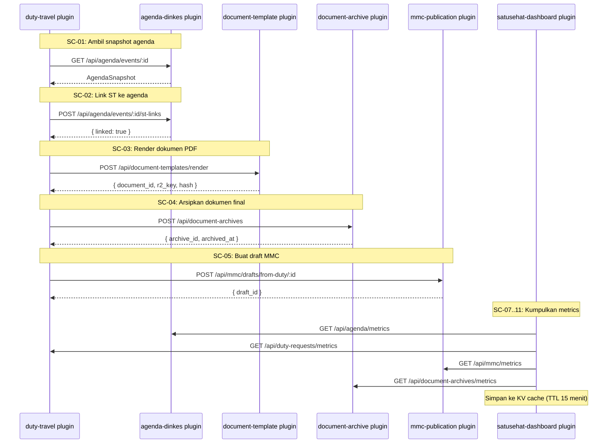

# API Service Contract — Satu Sehat Kobar v1.5

**Platform**: AWCMS-Micro (Cloudflare Workers / D1 / R2 / KV)
**Versi Dokumen**: v1.5
**Tanggal**: Juni 2026
**Status**: Final — Siap Eksekusi
**Instansi**: Dinas Kesehatan Kabupaten Kotawaringin Barat

---

## 1. Prinsip API

### 1.1 Base URL dan Versioning

| Lingkungan | Base URL |
|-----------|---------|
| Production | `https://sikskobar.dinkes-kobar.go.id` |
| Staging | `https://staging.sikskobar.dinkes-kobar.go.id` |
| Development | `http://localhost:8787` |

Semua API berada di path `/api/`. Tidak ada prefix versi di MVP (misal `/api/v1/`). Versioning dilakukan melalui header `X-API-Version` untuk kebutuhan masa depan.

### 1.2 Format dan Encoding

- Content-Type: `application/json; charset=utf-8`
- Encoding: UTF-8 untuk semua request dan response
- Tanggal: ISO 8601 dengan timezone (`2026-06-13T10:00:00+07:00`) atau UTC (`2026-06-13T03:00:00Z`)
- File upload: `multipart/form-data`
- Pagination: query params `page` (default 1) dan `per_page` (default 20, max 100)

### 1.3 Authentication

Semua endpoint kecuali `/api/satusehat/health` memerlukan autentikasi.

```
Authorization: Bearer <jwt_token>
```

Token diperoleh dari endpoint login AWCMS-Micro Core. Masa berlaku token: 8 jam. Refresh token: 7 hari.

### 1.4 ABAC Fields

Untuk endpoint yang menerapkan ABAC, sistem membaca claim JWT berikut:

| Claim | Keterangan |
|-------|-----------|
| `user_id` | ID unik user |
| `role_key` | Role aktif user (misal `kepala_bidang`) |
| `unit_id` | Unit organisasi user |
| `primary_health_facility_id` | Faskes utama user |
| `keuangan_scope` | `dinas_all` atau `faskes_own` — khusus role keuangan (Resolved Decision #6) |
| `org_level` | Level organisasi: `dinas`, `puskesmas`, `klinik`, dll |

### 1.5 Timeout dan Rate Limiting

| Parameter | Nilai |
|----------|-------|
| Request timeout | 30 detik |
| PDF generation timeout | 60 detik |
| File upload timeout | 120 detik |
| Rate limit — API umum | 100 request/menit per user |
| Rate limit — file upload | 20 request/menit per user |
| Rate limit — PDF generate | 10 request/menit per user |
| Rate limit — export | 5 request/menit per user |

Header rate limit yang dikembalikan:
```
X-RateLimit-Limit: 100
X-RateLimit-Remaining: 87
X-RateLimit-Reset: 1749772800
```

---

## 2. Format Response Standar

### 2.1 Success — Single Object

```json
{
  "success": true,
  "data": {
    "id": "dtr-001",
    "perihal": "Monitoring Puskesmas Arsel",
    "status": "draft",
    "created_at": "2026-06-13T10:00:00Z"
  }
}
```

### 2.2 Success — List (Paginated)

```json
{
  "success": true,
  "data": [
    { "id": "dtr-001", "perihal": "Monitoring Puskesmas Arsel", "status": "approved" },
    { "id": "dtr-002", "perihal": "Supervisi Gizi Puskesmas Pangkalan", "status": "draft" }
  ],
  "meta": {
    "page": 1,
    "per_page": 20,
    "total": 47,
    "total_pages": 3,
    "has_next": true,
    "has_prev": false
  }
}
```

### 2.3 Error Response

```json
{
  "success": false,
  "error": {
    "code": "ERR_DUTY_STATUS_INVALID",
    "message": "Pengajuan ST tidak dapat disetujui karena status saat ini bukan pending_atasan.",
    "field": null,
    "details": {
      "current_status": "draft",
      "allowed_statuses": ["pending_atasan"]
    }
  }
}
```

### 2.4 Validation Error (400)

```json
{
  "success": false,
  "error": {
    "code": "ERR_VALIDATION",
    "message": "Input tidak valid.",
    "field": null,
    "details": [
      { "field": "perihal", "message": "perihal wajib diisi" },
      { "field": "primary_health_facility_id", "message": "faskes tidak ditemukan" }
    ]
  }
}
```

### 2.5 HTTP Status Code Reference

| Status | Kondisi |
|--------|---------|
| `200 OK` | Request berhasil, data dikembalikan |
| `201 Created` | Resource baru berhasil dibuat |
| `204 No Content` | Request berhasil, tidak ada data dikembalikan (misal DELETE) |
| `400 Bad Request` | Input tidak valid — validasi gagal |
| `401 Unauthorized` | Token tidak ada atau tidak valid |
| `403 Forbidden` | Token valid tapi tidak punya izin (RBAC/ABAC) |
| `404 Not Found` | Resource tidak ditemukan atau sudah soft-deleted |
| `409 Conflict` | Konflik state — misal agenda sudah di-link ke ST lain |
| `413 Payload Too Large` | File upload melebihi batas ukuran |
| `422 Unprocessable Entity` | Request valid secara format tapi gagal business rule |
| `429 Too Many Requests` | Rate limit terlampaui |
| `500 Internal Server Error` | Error server tidak terduga |

---

## 3. Platform APIs (`/api/satusehat/`)

### 3.1 GET `/api/satusehat/health`

Cek status sistem. Tidak memerlukan autentikasi.

**Response:**
```json
{
  "success": true,
  "data": {
    "status": "healthy",
    "version": "1.5.0",
    "timestamp": "2026-06-13T10:00:00Z",
    "plugins": {
      "agenda-dinkes": "active",
      "duty-travel": "active",
      "spm-health": "active",
      "mmc-publication": "active",
      "document-template": "active",
      "document-archive": "active",
      "satusehat-dashboard": "active"
    }
  }
}
```

### 3.2 GET `/api/satusehat/plugins`

Daftar semua plugin dan statusnya.

- **Permission**: `system.plugins.manage`
- **Response**: List plugin registry records

### 3.3 PATCH `/api/satusehat/plugins/:key/status`

Aktifkan atau nonaktifkan plugin.

- **Permission**: `system.plugins.manage`

**Request body:**
```json
{ "status": "inactive", "reason": "Maintenance terjadwal" }
```

### 3.4 GET `/api/satusehat/dashboard`

Data dashboard utama. KV-cached 15 menit (Resolved Decision #8).

- **Permission**: Semua role yang login
- **ABAC**: Data difilter berdasarkan `org_level` dan `unit_id` user

**Response:**
```json
{
  "success": true,
  "data": {
    "cached_at": "2026-06-13T09:45:00Z",
    "cache_ttl_seconds": 900,
    "agenda_summary": {
      "total_this_month": 12,
      "confirmed": 8,
      "completed": 3,
      "cancelled": 1
    },
    "duty_summary": {
      "total_active": 23,
      "pending_approval": 5,
      "in_progress": 11,
      "completed_this_month": 7
    },
    "spm_summary": {
      "services_above_target": 7,
      "services_below_target": 5,
      "overall_average_percentage": 78.4
    },
    "evidence_summary": {
      "pending_verification": 8,
      "verified_this_month": 31
    }
  }
}
```

### 3.5 GET `/api/satusehat/dashboard/spm`

Data capaian SPM per layanan. KV-cached 15 menit.

- **Permission**: Semua role yang login

**Response:**
```json
{
  "success": true,
  "data": [
    {
      "spm_id": "spm-08",
      "code": "SPM-08",
      "name": "Pelayanan Kesehatan Penderita Hipertensi",
      "target_percentage": 100,
      "current_percentage": 82.3,
      "status": "below_target",
      "related_duty_count": 14
    }
  ]
}
```

### 3.6 GET `/api/satusehat/audit-logs`

Riwayat audit log sistem.

- **Permission**: `system.audit.read`
- **ABAC**: `superadmin` dan `admin_sistem` dapat melihat semua. Role lain hanya log milik sendiri

**Query params:**

| Param | Tipe | Keterangan |
|-------|------|-----------|
| `user_id` | string | Filter by user |
| `action` | string | Filter by action key |
| `entity_type` | string | Filter by entity type |
| `entity_id` | string | Filter by entity ID |
| `plugin_key` | string | Filter by plugin |
| `from` | datetime | Rentang waktu mulai |
| `to` | datetime | Rentang waktu akhir |
| `page` | integer | Halaman (default 1) |
| `per_page` | integer | Per halaman (default 20, max 100) |

---

## 4. Agenda APIs (`/api/agenda/`)

### 4.1 GET `/api/agenda/events`

Daftar agenda dengan filter dan pagination.

- **Permission**: `agenda.read`
- **ABAC**: User hanya melihat agenda dari unit sendiri kecuali role dengan `org_level = dinas` yang melihat semua

**Query params:**

| Param | Keterangan |
|-------|-----------|
| `status` | Filter status agenda |
| `need_st` | `true`/`false` — filter agenda yang butuh ST |
| `potential_mmc` | `true`/`false` |
| `unit_id` | Filter by unit (hanya jika punya akses) |
| `start_from` | Filter tanggal mulai >= |
| `start_to` | Filter tanggal mulai <= |
| `spm_service_id` | Filter by SPM service |
| `page`, `per_page` | Pagination |

### 4.2 POST `/api/agenda/events`

Buat agenda baru.

- **Permission**: `agenda.create`
- **ABAC**: User hanya dapat membuat agenda untuk unit sendiri

**Request body:**
```json
{
  "title": "Monitoring Puskesmas Arsel",
  "description": "Monitoring pelaksanaan program SPM",
  "start_at": "2026-07-01T08:00:00+07:00",
  "end_at": "2026-07-03T17:00:00+07:00",
  "location_name": "Puskesmas Arsel",
  "location_address": "Jl. Pangkalan Bun - Arsel KM 12",
  "organizer_unit_id": "unit-bidang-yankes",
  "visibility": "internal",
  "need_st": true,
  "potential_mmc": false,
  "spm_service_ids": ["spm-08"],
  "priority_program": "SPM Kesehatan",
  "participants": [
    { "user_id": "usr-001", "role_in_activity": "Ketua Tim" }
  ]
}
```

**Response:** `201` dengan agenda object.

**Audit event**: `agenda.created`

### 4.3 GET `/api/agenda/events/:id`

Detail agenda (juga digunakan sebagai SC-01 service contract).

- **Permission**: `agenda.read` ATAU `duty.create`
- **ABAC**: Cek unit atau scope dinas_all

### 4.4 PATCH `/api/agenda/events/:id`

Update agenda. Hanya agenda berstatus `draft` atau `published` yang dapat diubah.

- **Permission**: `agenda.update`
- **ABAC**: Hanya `created_by` atau atasan unit yang dapat update

**Audit event**: `agenda.updated`

### 4.5 DELETE `/api/agenda/events/:id`

Soft delete agenda (set `deleted_at`). Hanya `draft` yang dapat dihapus. Agenda `confirmed` dan seterusnya hanya bisa di-cancel.

- **Permission**: `agenda.delete`
- **Resolved Decision #5**: Agenda yang di-cancel tidak memblokir ST yang sudah terhubung

**Audit event**: `agenda.deleted`

### 4.6 POST `/api/agenda/events/:id/publish`

Ubah status `draft` → `published`.

- **Permission**: `agenda.publish`

### 4.7 POST `/api/agenda/events/:id/confirm`

Ubah status `published` → `confirmed`.

- **Permission**: `agenda.approve`

### 4.8 POST `/api/agenda/events/:id/cancel`

Ubah status ke `cancelled`. Menulis reason di `agenda_status_logs`.

- **Permission**: `agenda.cancel`

**Request body:**
```json
{ "reason": "Narasumber tidak dapat hadir, dijadwal ulang." }
```

### 4.9 POST `/api/agenda/events/:id/st-links`

Catat bahwa agenda sudah digunakan sebagai dasar ST (SC-02).

- **Permission**: `duty.create`
- **Validasi**: Agenda harus berstatus `confirmed` atau `in_progress`

**Request body:**
```json
{
  "duty_request_id": "dtr-001",
  "tracking_number": "800/023/ST/DINKES/2026",
  "status": "submitted"
}
```

### 4.10 GET `/api/agenda/metrics`

Metrics ringkasan untuk dashboard (SC-07).

- **Permission**: Semua role yang login
- **Cache**: Tidak dicache secara mandiri — dikonsumsi oleh dashboard yang melakukan caching

---

## 5. Duty Request APIs (`/api/duty-requests/`)

### 5.1 POST `/api/duty-requests`

Buat ST/SPPD baru secara mandiri (tanpa agenda).

- **Permission**: `duty.create`
- **ABAC**: User hanya dapat membuat ST untuk unit sendiri

**Request body:**
```json
{
  "perihal": "Konsultasi Program Gizi ke Dinkes Provinsi",
  "dasar_hukum": ["Permenkes No. 4 Tahun 2019", "DPA Dinas Kesehatan Tahun 2026"],
  "primary_health_facility_id": "faskes-dinkes-kobar",
  "org_level": "dinas",
  "unit_id": "unit-bidang-kesmas",
  "is_budgeted": true,
  "potential_mmc": false,
  "destinations": [
    {
      "location_name": "Dinas Kesehatan Provinsi Kalteng",
      "location_address": "Palangka Raya",
      "tanggal_mulai": "2026-07-10",
      "tanggal_selesai": "2026-07-11"
    }
  ],
  "participants": [
    { "user_id": "usr-002", "role_in_duty": "Anggota", "transport_mode": "umum" }
  ],
  "budget_lines": [
    {
      "budget_category": "perjalanan_dinas",
      "description": "Tiket pesawat PP Pangkalan Bun - Palangka Raya",
      "unit": "orang",
      "quantity": 2,
      "unit_price": 750000,
      "amount": 1500000
    },
    {
      "budget_category": "honorarium",
      "description": "Honorarium Narasumber",
      "unit": "sesi",
      "quantity": 1,
      "unit_price": 500000,
      "amount": 500000
    }
  ]
}
```

**Response:** `201` dengan duty request object.

**Audit event**: `duty_request.created`

### 5.2 POST `/api/duty-requests/from-agenda/:agenda_id`

Buat ST dari agenda (SC-01 + SC-02 digabung). Sistem otomatis mengambil snapshot agenda dan mengisi data participant dari agenda.

- **Permission**: `duty.create`
- **ABAC**: User harus memiliki akses ke agenda tersebut
- **Validasi**: Agenda harus berstatus `confirmed` atau `in_progress`
- **Resolved Decision #3**: `potential_mmc` diwarisi dari agenda jika `agenda.potential_mmc = true`

**Request body:**
```json
{
  "perihal": "Monitoring Puskesmas Arsel — dari Agenda",
  "is_budgeted": true,
  "additional_participants": [],
  "budget_lines": [
    {
      "budget_category": "perjalanan_dinas",
      "description": "Biaya perjalanan dinas",
      "amount": 2000000
    }
  ]
}
```

**Audit event**: `duty_request.created_from_agenda`

### 5.3 GET `/api/duty-requests`

Daftar ST dengan filter.

- **Permission**: `duty.read`
- **ABAC**: 
  - `staf_dinas`, `staf_puskesmas`: hanya ST milik sendiri atau yang di-participate
  - `kepala_bidang`, `kepala_puskesmas`: ST dari unit sendiri
  - `admin_st`, `sekretaris_dinas`: ST yang menunggu tindakan mereka
  - `kadis`: semua ST level dinas
  - `keuangan_dinas` (scope `dinas_all`): semua ST dengan finance step
  - `keuangan_faskes` (scope `faskes_own`): ST dari faskes sendiri saja

**Query params:**

| Param | Keterangan |
|-------|-----------|
| `status` | Filter status |
| `my_duties` | `true` — hanya ST saya sebagai participant |
| `pending_my_approval` | `true` — ST yang menunggu approval saya |
| `primary_health_facility_id` | Filter by faskes |
| `unit_id` | Filter by unit |
| `is_budgeted` | `true`/`false` |
| `potential_mmc` | `true`/`false` |
| `from`, `to` | Filter by `created_at` |
| `page`, `per_page` | Pagination |

### 5.4 GET `/api/duty-requests/:id`

Detail ST lengkap termasuk participants, destinations, budget lines, approval steps, documents, dan evidences.

- **Permission**: `duty.read`
- **ABAC**: Cek kepemilikan atau scope unit

### 5.5 PATCH `/api/duty-requests/:id`

Update draft ST. Hanya berstatus `draft` atau `revision_requested`.

- **Permission**: `duty.update`
- **ABAC**: Hanya `created_by` atau admin

**Audit event**: `duty_request.updated`

### 5.6 POST `/api/duty-requests/:id/submit`

Submit ST untuk memulai alur approval. Status: `draft` → `submitted` → `pending_atasan`.

- **Permission**: `duty.submit`
- **Validasi**:
  - Minimal satu participant
  - Minimal satu destination
  - `perihal` tidak kosong
  - Status saat ini harus `draft` atau `revision_requested`
- **Side effects**:
  - Sistem membuat records `duty_request_approvals` berdasarkan `duty_approval_step_config` untuk `org_level` yang sesuai
  - Jika `is_budgeted = false`, step finance di-set `status = 'skipped'` otomatis (Resolved Decision #2)
  - In-app notification dikirim ke approver step 1 (Resolved Decision #12)
  - Participant snapshots dikunci (tidak dapat diubah)

**Audit event**: `duty_request.submitted`

### 5.7 POST `/api/duty-requests/:id/approve`

Setujui ST pada step approval yang sedang berlangsung.

- **Permission**: `duty.approve`
- **ABAC**: User harus memiliki `role_key` yang sesuai dengan step approval saat ini
- **Validasi**: Status duty harus `pending_<role>` yang sesuai step

**Request body:**
```json
{ "notes": "Disetujui. Pastikan laporan diserahkan dalam 7 hari setelah pelaksanaan." }
```

**Side effects**:
- Step saat ini di-set `status = 'approved'`
- Jika ada step berikutnya: status duty berubah ke `pending_<next_role>`, notifikasi dikirim
- Jika step terakhir: status duty berubah ke `approved`, notifikasi ke pengaju

**Audit event**: `duty_request.approved` (dengan step info)

### 5.8 POST `/api/duty-requests/:id/return`

Kembalikan ST untuk revisi.

- **Permission**: `duty.return`
- **ABAC**: User harus memiliki role yang sesuai step saat ini

**Request body:**
```json
{ "reason": "Dasar hukum perlu dilengkapi. Tambahkan nomor DPA yang relevan." }
```

**Side effects**:
- Status berubah ke `revision_requested`
- Notifikasi ke pengaju
- `return_reason` disimpan di duty_requests

**Audit event**: `duty_request.returned`

### 5.9 POST `/api/duty-requests/:id/reject`

Tolak ST secara permanen.

- **Permission**: `duty.reject`
- **ABAC**: Hanya approver pada step saat ini

**Request body:**
```json
{ "reason": "Kegiatan tidak sesuai dengan program prioritas tahun berjalan." }
```

**Audit event**: `duty_request.rejected`

### 5.10 GET `/api/duty-requests/metrics`

Metrics ringkasan untuk dashboard (SC-08).

- **Permission**: Semua role yang login
- **ABAC**: Data difilter berdasarkan scope user

---

## 6. Document APIs

### 6.1 POST `/api/duty-requests/:id/generate-st`

Generate PDF Surat Tugas. Menggunakan SC-03 (Duty → Template).

- **Permission**: `duty.document.generate`
- **ABAC**: Hanya `admin_st`, `kepala_bidang`, atau `kadis`
- **Validasi**: Status duty harus `approved`
- **Resolved Decision #4**: Template auto-snapshot dibuat otomatis

**Request body:**
```json
{
  "template_key": "st-standard",
  "pejabat_ttd": {
    "user_id": "usr-kadis-001",
    "nama": "drg. Rina Susanti, M.Kes",
    "nip": "196905221995032002",
    "jabatan": "Kepala Dinas Kesehatan Kabupaten Kotawaringin Barat"
  },
  "custom_notes": null
}
```

**Response:**
```json
{
  "success": true,
  "data": {
    "document_id": "doc-001",
    "document_type": "st",
    "nomor_surat": "800/023/ST/DINKES/2026",
    "status": "generated",
    "template_version_id": "tv-023",
    "hash_sha256": "a3f9b2c1d4e5...",
    "download_url": "/api/duty-documents/doc-001/download",
    "generated_at": "2026-06-13T10:05:00Z"
  }
}
```

**Side effects**:
- Record `duty_documents` dibuat
- Record `duty_template_versions` dibuat sebagai auto-snapshot
- `duty_numbering_sequences` di-increment untuk mendapatkan nomor surat

**Audit event**: `duty_document.generated`

### 6.2 POST `/api/duty-requests/:id/generate-sppd`

Generate PDF SPPD. Logika identik dengan generate-st, menggunakan template `sppd-standard`.

- **Permission**: `duty.document.generate`
- **Validasi**: Status duty `approved`, dan document ST sudah dibuat

**Audit event**: `duty_document.generated` (type: `sppd`)

### 6.3 GET `/api/duty-documents/:id`

Detail metadata dokumen.

- **Permission**: `duty.read`
- **ABAC**: Cek kepemilikan duty request atau scope unit

### 6.4 GET `/api/duty-documents/:id/download`

Download file PDF dokumen dari R2.

- **Permission**: `duty.document.download`
- **ABAC**: 
  - Dokumen `classification = 'internal'`: semua participant ST dan atasan
  - Dokumen `classification = 'finance'`: tambahan role keuangan

**Side effects**: Access log dicatat di `document_access_logs` jika dokumen sudah diarsip.

**Audit event**: `duty_document.downloaded`

### 6.5 POST `/api/duty-documents/:id/upload-signed`

Upload dokumen yang sudah ditandatangani (TTD manual/basah).

- **Permission**: `duty.document.upload`
- **Content-Type**: `multipart/form-data`

**Form fields:**

| Field | Tipe | Keterangan |
|-------|------|-----------|
| `file` | file | PDF yang sudah di-TTD |
| `signed_by_user_id` | string | User yang menandatangani |
| `signed_at` | datetime | Waktu TTD |
| `notes` | string | Catatan opsional |

**Validasi**:
- File harus PDF
- Ukuran maks 10 MB
- Status dokumen harus `generated`

**Side effects**:
- File disimpan ke R2 di `signed_r2_key`
- `hash_sha256` dihitung dan disimpan
- Status dokumen berubah ke `signed`
- Jika semua dokumen wajib sudah signed: status duty berubah ke `in_progress`

**Audit event**: `duty_document.signed_uploaded`

---

## 7. Evidence & Report APIs

### 7.1 POST `/api/duty-requests/:id/reports`

Buat laporan pelaksanaan tugas.

- **Permission**: `duty.report.create`
- **ABAC**: Hanya participant ST yang dapat membuat laporan (Resolved Decision #7)
- **Validasi**: Status duty harus `in_progress`

**Request body:**
```json
{
  "title": "Laporan Monitoring Puskesmas Arsel 1-3 Juli 2026",
  "content": "Pada tanggal 1-3 Juli 2026, tim Dinas Kesehatan melakukan monitoring...",
  "summary": "Capaian SPM hipertensi di Puskesmas Arsel mencapai 76%, masih di bawah target.",
  "findings": [
    "Ketersediaan alat tensimeter masih kurang",
    "Pencatatan di SIMPUS belum konsisten"
  ],
  "recommendations": [
    "Pengadaan tensimeter melalui DAK tahun berikutnya",
    "Pelatihan entry data SIMPUS untuk petugas"
  ]
}
```

**Audit event**: `duty_report.created`

### 7.2 PATCH `/api/duty-requests/:id/reports/:report_id`

Update laporan. Hanya `draft`.

- **Permission**: `duty.report.create`

### 7.3 POST `/api/duty-requests/:id/reports/:report_id/submit`

Submit laporan. Status laporan: `draft` → `submitted`. Status duty: `in_progress` → `report_submitted`.

- **Permission**: `duty.report.create`

**Audit event**: `duty_report.submitted`

### 7.4 POST `/api/duty-requests/:id/evidences`

Upload bukti pelaksanaan. Semua participant ST dapat upload (Resolved Decision #7).

- **Permission**: `duty.evidence.upload`
- **ABAC**: User harus terdaftar sebagai participant ST
- **Content-Type**: `multipart/form-data`

**Form fields:**

| Field | Tipe | Keterangan |
|-------|------|-----------|
| `file` | file | File bukti (foto, dokumen, kwitansi) |
| `evidence_type` | string | `foto`, `video`, `dokumen`, `kwitansi`, `surat`, `laporan_kunjungan`, `other` |
| `classification` | string | `internal`, `finance`, `confidential` |
| `description` | string | Deskripsi singkat bukti |
| `contains_pii_warning` | boolean | Tandai jika ada PII (Phase 1 manual — Resolved Decision #13) |

**Validasi**:
- Ukuran maks 10 MB
- Tipe file yang diizinkan: `image/jpeg`, `image/png`, `application/pdf`, `video/mp4`
- Status duty harus `in_progress`, `report_submitted`, atau `evidence_returned`

**Side effects**:
- File disimpan ke R2
- `duty_person_journals` record diperbarui: `evidence_status = 'uploaded'`
- Status duty berubah ke `evidence_submitted` jika minimal 1 bukti terupload

**Audit event**: `duty_evidence.uploaded`

### 7.5 GET `/api/duty-requests/:id/evidences`

Daftar bukti pelaksanaan.

- **Permission**: `duty.read`
- **ABAC** (Resolved Decision #15):
  - `classification = 'internal'`: semua participant dan atasan
  - `classification = 'finance'`: tambahan `keuangan_dinas` dan `keuangan_faskes`
  - `classification = 'confidential'`: hanya `admin_st`, `sekretaris_dinas`, `kadis`

### 7.6 POST `/api/duty-requests/:id/evidences/:evidence_id/verify`

Verifikasi bukti pelaksanaan.

- **Permission**: `duty.evidence.verify`
- **ABAC**: Role `admin_st`, `kepala_bidang`, atau `sekretaris_dinas`

**Request body:**
```json
{ "notes": "Bukti lengkap dan sesuai." }
```

**Side effects**:
- `evidence_status` berubah ke `verified`
- `duty_person_journals` diperbarui: `evidence_status = 'verified'`, `completion_status = 'completed'` (Resolved Decision #9)
- Jika semua participant sudah verified: status duty berubah ke `evidence_verified`
- Jika `potential_mmc = true` dan laporan sudah verified: SC-05 dipicu (Duty → MMC)

**Audit event**: `duty_evidence.verified`

### 7.7 POST `/api/duty-requests/:id/evidences/:evidence_id/return`

Kembalikan bukti untuk diperbaiki.

- **Permission**: `duty.evidence.verify`

**Request body:**
```json
{ "reason": "Kwitansi tidak terbaca. Mohon upload ulang dengan kualitas yang lebih baik." }
```

**Side effects**:
- `evidence_status` berubah ke `returned`
- `duty_person_journals` diperbarui: `evidence_status = 'returned'`, `completion_status = 'pending'` (Resolved Decision #9)
- Status duty berubah ke `evidence_returned`
- Notifikasi ke uploader

**Audit event**: `duty_evidence.returned`

---

## 8. Journal APIs (`/api/duty-journals/`)

### 8.1 GET `/api/duty-journals`

Daftar jurnal tugas pegawai.

- **Permission**: `duty.journal.read_own` ATAU `duty.journal.read_all`
- **ABAC**:
  - Pegawai biasa: hanya jurnal sendiri (read_own)
  - Atasan/admin: jurnal semua bawahan di unit sendiri (read_all, filtered by unit)
  - `kadis`, `admin_sistem`: semua jurnal

**Query params:**

| Param | Keterangan |
|-------|-----------|
| `user_id` | Filter by pegawai (butuh read_all) |
| `unit_id` | Filter by unit |
| `completion_status` | `pending` atau `completed` |
| `evidence_status` | `pending`, `uploaded`, `verified`, `returned` |
| `from`, `to` | Filter by `duty_date_start` |
| `spm_service_id` | Filter by SPM |
| `page`, `per_page` | Pagination |

**Response:**
```json
{
  "success": true,
  "data": [
    {
      "id": "jnl-001",
      "duty_request_id": "dtr-001",
      "user_id": "usr-001",
      "user_snapshot": { "nama": "dr. Budi Santoso", "nip": "197801012006041001", "jabatan": "Dokter Ahli Pertama" },
      "evidence_status": "verified",
      "completion_status": "completed",
      "duty_date_start": "2026-07-01",
      "duty_date_end": "2026-07-03",
      "duty_location": "Puskesmas Arsel",
      "duty_purpose": "Monitoring pelaksanaan program SPM",
      "spm_services": ["spm-08"],
      "verified_at": "2026-07-05T10:00:00Z"
    }
  ],
  "meta": { "page": 1, "per_page": 20, "total": 8, "total_pages": 1 }
}
```

### 8.2 GET `/api/duty-journals/:id`

Detail satu jurnal.

- **Permission**: `duty.journal.read_own`
- **ABAC**: User hanya bisa lihat jurnal sendiri atau milik bawahannya

### 8.3 GET `/api/duty-journals/export`

Export jurnal ke CSV atau XLSX.

- **Permission**: `duty.journal.export`
- **ABAC**: Export semua hanya untuk `admin_sistem`, `kadis`. Export per-unit untuk atasan unit.

**Query params:**

| Param | Keterangan |
|-------|-----------|
| `format` | `csv` atau `xlsx` |
| `user_id` | Filter optional |
| `unit_id` | Filter optional |
| `from`, `to` | Rentang waktu wajib |

**Response**: File binary dengan header:
```
Content-Type: text/csv
Content-Disposition: attachment; filename="jurnal-tugas-2026-07.csv"
```

**Audit event**: `duty_journal.exported`

---

## 9. Archive APIs (`/api/document-archives/`)

### 9.1 POST `/api/document-archives`

Registrasi arsip baru (SC-04 — dipanggil secara internal dari duty plugin).

- **Permission**: `archive.create`
- **Catatan**: Endpoint ini umumnya dipanggil sebagai service call internal, bukan dari UI

**Request body** (lihat SC-04 di dokumen Plugin Architecture).

**Side effects**:
- Record `document_archives` dibuat dengan status `archived`
- `retain_until` dihitung berdasarkan `retention_rule_id`
- Immutable setelah dibuat

**Audit event**: `document_archive.created`

### 9.2 GET `/api/document-archives`

Daftar arsip.

- **Permission**: `archive.read`
- **ABAC**:
  - `classification = 'internal'`: pegawai unit terkait
  - `classification = 'finance'`: tambahan role keuangan
  - `classification = 'confidential'`: hanya admin dan kadis

**Query params:**

| Param | Keterangan |
|-------|-----------|
| `source_entity_type` | Filter by tipe entitas |
| `source_entity_id` | Filter by ID entitas |
| `document_type` | Filter by tipe dokumen |
| `classification` | Filter by klasifikasi |
| `status` | Filter by status arsip |
| `from`, `to` | Filter by `archived_at` |
| `page`, `per_page` | Pagination |

### 9.3 GET `/api/document-archives/:id`

Detail metadata arsip.

- **Permission**: `archive.read`
- **ABAC**: Cek klasifikasi dokumen vs role user

### 9.4 GET `/api/document-archives/:id/download`

Download file arsip dari R2.

- **Permission**: `archive.download_classified` untuk dokumen classified; `archive.read` untuk internal
- **ABAC**: Cek klasifikasi

**Side effects**:
- Access log wajib dicatat di `document_access_logs` untuk semua download arsip

**Audit event**: `document_archive.downloaded`

### 9.5 GET `/api/document-archives/metrics`

Metrics arsip untuk dashboard (SC-11).

- **Permission**: Semua role yang login
- **ABAC**: Filter berdasarkan scope user

---

## 10. MMC Draft APIs (`/api/mmc/`)

### 10.1 POST `/api/mmc/drafts/from-duty/:duty_request_id`

Buat draft MMC dari duty request yang sudah terverifikasi (SC-05).

- **Permission**: `mmc.draft.create`
- **ABAC**: `reviewer_mmc` atau sistem internal
- **Validasi**: 
  - Duty status harus `evidence_verified` atau `completed`
  - `potential_mmc = true` pada duty request (Resolved Decision #3)

**Request body:**
```json
{
  "suggested_title": "Inovasi Monitoring SPM Hipertensi di Puskesmas Arsel",
  "draft_content": "Pada awal Juli 2026, tim Dinas Kesehatan Kabupaten Kotawaringin Barat melakukan monitoring...",
  "potential_media_type": "berita_website",
  "mmc_flag_source": "agenda_inherited"
}
```

**Audit event**: `mmc_draft.created`

### 10.2 GET `/api/mmc/drafts`

Daftar draft MMC.

- **Permission**: `mmc.draft.create` atau `mmc.draft.review`
- **ABAC**: Creator hanya lihat milik sendiri; reviewer_mmc lihat semua yang pending review

**Query params:** `status`, `potential_media_type`, `page`, `per_page`

### 10.3 GET `/api/mmc/drafts/:id`

Detail draft MMC.

- **Permission**: `mmc.draft.create` atau `mmc.draft.review`

### 10.4 PATCH `/api/mmc/drafts/:id`

Update draft. Hapus data PII sebelum publikasi, edit konten.

- **Permission**: `mmc.draft.create`
- **ABAC**: Hanya `created_by` atau `reviewer_mmc`
- **Validasi**: Status harus `draft` atau `revision_requested`

**Request body:**
```json
{
  "title": "Monitoring Layanan Hipertensi Meningkat di Wilayah Arsel",
  "content": "Tim Dinas Kesehatan Kotawaringin Barat...",
  "potential_media_type": "berita_website"
}
```

### 10.5 POST `/api/mmc/drafts/:id/submit-review`

Submit draft untuk di-review.

- **Permission**: `mmc.draft.create`
- Status: `draft` → `under_review`
- Notifikasi ke `reviewer_mmc`

### 10.6 POST `/api/mmc/drafts/:id/review`

Review draft: approve, reject, atau mark_published.

- **Permission**: `mmc.draft.review`

**Request body:**
```json
{
  "decision": "approved",
  "notes": "Konten sudah sesuai, pastikan foto diunggah sebelum publikasi."
}
```

| Decision | Side Effect |
|----------|------------|
| `approved` | Status → `approved`. Notifikasi ke creator |
| `rejected` | Status → `rejected`. `rejected_reason` disimpan |
| `revision_requested` | Status → `revision_requested` (kembali ke creator) |
| `mark_published` | Status → `published`. `published_url` diisi |

**Audit event**: `mmc_draft.reviewed`

### 10.7 GET `/api/mmc/metrics`

Metrics MMC untuk dashboard (SC-10).

- **Permission**: Semua role yang login

---

## 11. Service Contract APIs (Inter-Plugin Summary)

Endpoint-endpoint ini digunakan sebagai service contract antar plugin. Detail request/response ada di seksi masing-masing di atas.



| Contract | Method | Endpoint | Provider | Consumer |
|----------|--------|---------|---------|---------|
| SC-01 | GET | `/api/agenda/events/:id` | agenda-dinkes | duty-travel |
| SC-02 | POST | `/api/agenda/events/:id/st-links` | agenda-dinkes | duty-travel |
| SC-03 | POST | `/api/document-templates/render` | document-template | duty-travel |
| SC-04 | POST | `/api/document-archives` | document-archive | duty-travel |
| SC-05 | POST | `/api/mmc/drafts/from-duty/:id` | mmc-publication | duty-travel |
| SC-06 | GET | `/api/spm/services` | spm-health | agenda-dinkes, duty-travel |
| SC-07 | GET | `/api/agenda/metrics` | agenda-dinkes | satusehat-dashboard |
| SC-08 | GET | `/api/duty-requests/metrics` | duty-travel | satusehat-dashboard |
| SC-09 | GET | `/api/spm/metrics` | spm-health | satusehat-dashboard |
| SC-10 | GET | `/api/mmc/metrics` | mmc-publication | satusehat-dashboard |
| SC-11 | GET | `/api/document-archives/metrics` | document-archive | satusehat-dashboard |

---

## 12. Error Codes Reference

| Error Code | HTTP Status | Keterangan |
|-----------|-------------|-----------|
| `ERR_UNAUTHORIZED` | 401 | Token tidak ada, tidak valid, atau sudah kedaluwarsa |
| `ERR_FORBIDDEN` | 403 | Permission RBAC tidak cukup |
| `ERR_ABAC_DENIED` | 403 | Permission ABAC ditolak (scope tidak sesuai) |
| `ERR_VALIDATION` | 400 | Input gagal validasi Zod schema |
| `ERR_NOT_FOUND` | 404 | Resource tidak ditemukan atau soft-deleted |
| `ERR_CONFLICT` | 409 | Konflik state — misal duplikasi unique constraint |
| `ERR_RATE_LIMITED` | 429 | Rate limit terlampaui |
| `ERR_FILE_TOO_LARGE` | 413 | File melebihi batas ukuran |
| `ERR_FILE_TYPE_INVALID` | 400 | Tipe file tidak diizinkan |
| `ERR_AGENDA_NOT_FOUND` | 404 | Agenda tidak ditemukan |
| `ERR_AGENDA_STATUS_INVALID` | 409 | Status agenda tidak valid untuk operasi ini |
| `ERR_AGENDA_ALREADY_LINKED` | 409 | Agenda sudah memiliki ST aktif |
| `ERR_DUTY_NOT_FOUND` | 404 | Duty request tidak ditemukan |
| `ERR_DUTY_STATUS_INVALID` | 422 | Status duty tidak memungkinkan operasi ini |
| `ERR_DUTY_NOT_PARTICIPANT` | 403 | User bukan participant ST ini |
| `ERR_APPROVAL_NOT_YOUR_TURN` | 403 | Bukan giliran user ini untuk menyetujui |
| `ERR_APPROVAL_STEP_SKIPPED` | 422 | Step ini sudah di-skip (is_budgeted=false) |
| `ERR_DOCUMENT_NOT_FOUND` | 404 | Dokumen tidak ditemukan |
| `ERR_DOCUMENT_STATUS_INVALID` | 422 | Status dokumen tidak valid untuk operasi ini |
| `ERR_TEMPLATE_NOT_FOUND` | 404 | Template dokumen tidak ditemukan |
| `ERR_TEMPLATE_RENDER_FAILED` | 500 | Gagal render PDF |
| `ERR_EVIDENCE_NOT_FOUND` | 404 | Bukti tidak ditemukan |
| `ERR_EVIDENCE_ALREADY_VERIFIED` | 409 | Bukti sudah diverifikasi, tidak dapat diubah |
| `ERR_ARCHIVE_NOT_FOUND` | 404 | Arsip tidak ditemukan |
| `ERR_ARCHIVE_IMMUTABLE` | 409 | Arsip tidak dapat dimodifikasi (immutable) |
| `ERR_MMC_DRAFT_NOT_FOUND` | 404 | Draft MMC tidak ditemukan |
| `ERR_MMC_NOT_ELIGIBLE` | 422 | Duty tidak eligible untuk MMC (potential_mmc=false atau belum verified) |
| `ERR_PLUGIN_INACTIVE` | 503 | Plugin yang dibutuhkan sedang tidak aktif |
| `ERR_NUMBERING_FAILED` | 500 | Gagal generate nomor surat |
| `ERR_STORAGE_UPLOAD_FAILED` | 500 | Gagal upload file ke R2 |
| `ERR_INTERNAL` | 500 | Error server tidak terduga |

---

## 13. API Security

### 13.1 Authentication Headers

```
Authorization: Bearer <jwt_token>
Content-Type: application/json
X-Request-ID: <uuid>          (opsional, untuk tracing)
X-API-Version: 1.5            (opsional)
```

### 13.2 CSRF Protection

Untuk request state-changing (POST, PATCH, DELETE) dari browser:

```
X-CSRF-Token: <csrf_token>
```

Token CSRF diperoleh dari endpoint `GET /api/auth/csrf-token` dan harus disertakan pada setiap request mutasi.

### 13.3 Input Validation Rules

Semua input divalidasi menggunakan **Zod** schema sebelum diproses di handler. Aturan validasi:

| Field Type | Aturan |
|-----------|--------|
| String | `trim()`, max length sesuai field, `XSS sanitize` |
| Text (konten panjang) | Max 50.000 karakter, HTML escaped |
| URL | `url()` Zod validator |
| Date | ISO 8601, tidak boleh masa lalu untuk start_at baru |
| Enum | `enum()` dengan nilai yang didefinisikan |
| ID references | Format hex 16 karakter, keberadaan dicek di DB |
| Numbers | `number().positive()`, batas sesuai konteks |
| File name | Sanitized, tidak boleh path traversal (`../`) |

### 13.4 ABAC Enforcement Summary

| Role | Scope Duty Request | Scope Agenda | Scope Evidence Finance |
|------|--------------------|--------------|----------------------|
| `superadmin`, `admin_sistem` | Semua | Semua | Semua |
| `kadis` | Semua (dinas level) | Semua (dinas) | Ya |
| `sekretaris_dinas` | Semua pending approval | Unit dinas | Ya |
| `kepala_bidang` | Unit sendiri | Unit sendiri | Tidak |
| `staf_dinas` | Milik sendiri | Unit sendiri | Tidak |
| `admin_st` | Semua yang perlu penomoran | Dinas | Tidak |
| `keuangan_dinas` | Semua (scope `dinas_all`) | Tidak | Ya |
| `kepala_puskesmas` | Puskesmas sendiri | Puskesmas sendiri | Ya |
| `kepala_tata_usaha` | Puskesmas sendiri | Puskesmas sendiri | Tidak |
| `staf_puskesmas` | Milik sendiri | Puskesmas sendiri | Tidak |
| `keuangan_faskes` | Faskes sendiri (scope `faskes_own`) | Tidak | Ya (faskes_own) |
| `reviewer_mmc` | Duty dengan potential_mmc=true | Tidak | Tidak |
| `viewer_dinas` | Read-only semua dinas | Read-only dinas | Tidak |
| `viewer_faskes` | Read-only faskes sendiri | Read-only faskes | Tidak |

### 13.5 Rate Limiting Implementation

Rate limiting diimplementasikan di Cloudflare Worker menggunakan KV Store untuk menyimpan counter per `user_id` + `endpoint_category`:

```
KV key: ratelimit:{user_id}:{endpoint_category}:{minute_window}
Value: { count: 87, window_start: 1749772800 }
TTL: 60 detik
```

Jika limit terlampaui, response `429` dikembalikan dengan header:
```
Retry-After: 13
X-RateLimit-Limit: 100
X-RateLimit-Remaining: 0
X-RateLimit-Reset: 1749772873
```

### 13.6 Audit Trail Wajib

Setiap endpoint yang mengubah state wajib menulis ke `satusehat_audit_logs`. Endpoint read-only tidak diwajibkan kecuali untuk download arsip dan akses dokumen classified.

| Endpoint Category | Audit Required | Notes |
|------------------|---------------|-------|
| POST (create) | Ya | `action = '<entity>.created'` |
| PATCH (update) | Ya | `action = '<entity>.updated'`, include diff |
| DELETE / soft-delete | Ya | `action = '<entity>.deleted'` |
| Status transitions | Ya | `action = '<entity>.<transition>'` |
| File upload | Ya | `action = '<entity>.uploaded'` |
| File download (classified) | Ya | `action = '<entity>.downloaded'` |
| GET (read) | Tidak | Kecuali download arsip |
| Login/logout | Ya | Core handles this |

---

*Dokumen ini adalah kontrak teknis yang mengikat. Setiap perubahan endpoint, response schema, atau ABAC rule harus diperbarui di sini sebelum implementasi dan dikomunikasikan kepada semua consumer endpoint terkait.*
