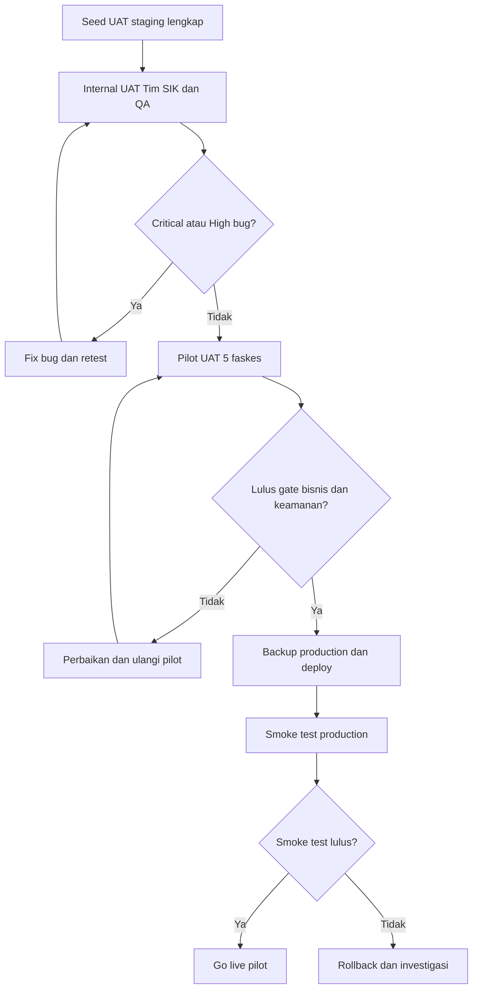

# UAT dan Deployment Checklist — Satu Sehat Kobar

**Versi:** 2.0  
**Tanggal:** Juni 2026  
**Platform:** AWCMS-Micro (Cloudflare Workers / D1 / R2 / KV)  
**Scope:** MVP Sprint 0–6 — Pilot terbatas 5 faskes, akhir 2026

> **Implementasi:** skenario UAT §3, seed test §2.4, dan deployment/rollback §4–5 sudah menjadi issue **EPIC-16 (#124–#127)** — E2E suite (REL-01 #125), seed UAT konsolidasi 17 role (REL-02 #126), deploy+smoke+rollback (REL-03 #127). Skill: `.opencode/skills/sskobar-e2e-release`. Lihat `docs/prd/25`.

---

## 1. Tujuan dan Cakupan

Dokumen ini adalah panduan resmi untuk melaksanakan User Acceptance Test (UAT) dan proses deployment MVP Satu Sehat Kobar. Dokumen ini wajib digunakan sebelum menyatakan sistem siap beroperasi.

**Tujuan dokumen:**

1. Memastikan semua fitur MVP berfungsi sesuai acceptance criteria.
2. Memvalidasi RBAC dan ABAC berjalan benar untuk semua 17 role.
3. Memverifikasi alur bisnis end-to-end: Agenda → ST → Approval → PDF → Upload → Evidence → Verifikasi → Jurnal → Arsip.
4. Memastikan keamanan sistem memenuhi standar minimal pemerintah daerah.
5. Memberikan panduan deployment yang dapat diulangi (repeatable) ke environment production.
6. Menyediakan prosedur rollback yang jelas jika deployment gagal.

**Cakupan UAT:**

- 7 plugin MVP: `agenda-dinkes`, `duty-travel`, `satusehat-dashboard`, `spm-health`, `mmc-publication`, `document-template`, `document-archive`
- 17 role pengguna
- Alur lengkap dari agenda hingga arsip
- Skenario negatif (akses ditolak, validasi gagal)
- Performa dan beban

**Yang tidak dicakup UAT MVP:**

- Integrasi TTE/BSrE (Phase 2)
- Integrasi SRIKANDI (Phase 2)
- Notifikasi email/WhatsApp (Phase 2)
- CRUD master data SPM (Phase 2)
- Integrasi SIMPEG/SIPD (Phase 2)



---

## 2. Struktur UAT

### 2.1 Pendekatan UAT

UAT dilaksanakan dalam dua tahap:

**Tahap 1 — Internal UAT (Tim SIK + QA)**
- Dilaksanakan pada Sprint 6, minggu pertama.
- Semua test case dieksekusi oleh QA dan Tim SIK.
- Bug diklasifikasikan dan diperbaiki sebelum Tahap 2.

**Tahap 2 — Pilot UAT (5 Faskes)**
- Dilaksanakan pada Sprint 6, minggu kedua.
- Melibatkan pengguna nyata dari 5 faskes pilot.
- Fokus pada usability dan alur bisnis end-to-end.
- Feedback dikumpulkan via form dan sesi wawancara singkat.

### 2.2 Tim UAT

| Peran | Tanggung Jawab |
|-------|----------------|
| QA Lead | Koordinasi eksekusi test case, triage bug |
| Tech Lead | Investigasi bug teknis, approval fix |
| Product Owner | Validasi acceptance criteria bisnis |
| Pengguna Pilot | Eksekusi skenario bisnis nyata (5 faskes) |
| Fasilitator UAT | Mendampingi pengguna pilot, mencatat temuan |

### 2.3 Lingkungan UAT

| Parameter | Nilai |
|-----------|-------|
| Environment | Staging (Cloudflare Workers — staging binding) |
| Database | D1 staging (data test, bukan production) |
| File storage | R2 staging bucket |
| URL | `https://satusehat-kobar-staging.workers.dev` |
| Akses | Hanya dari IP yang di-whitelist |
| Data | Data pegawai dummy + 5 faskes pilot data |

### 2.4 Data Test

Sebelum UAT dimulai, data berikut harus tersedia di staging:

- 17 role terseed dengan permission yang benar
- Minimal 20 akun pengguna (mewakili semua role utama)
- 5 faskes dengan data profil lengkap
- 12 indikator SPM dengan target nilai
- Seed `duty_approval_step_config` untuk org_level `dinas` dan `faskes`
- Minimal 3 template dokumen (ST, SPPD, Laporan)

### 2.5 Klasifikasi Bug

| Severity | Definisi | SLA Fix |
|----------|----------|---------|
| Critical | Sistem crash, data corruption, security breach, alur utama tidak bisa dijalankan | Wajib fix sebelum go-live |
| High | Fitur utama bermasalah, workaround tidak ada | Fix dalam 1 hari |
| Medium | Fitur bermasalah, workaround ada | Fix dalam 3 hari |
| Low | Kosmetik, typo, minor UX issue | Defer ke sprint berikutnya |

**Kriteria go-live:** 0 bug Critical, 0 bug High terbuka.

---

## 3. Skenario UAT per Modul

---

### 3.1 Platform dan Auth

#### TC-001: Login dengan Email/Password Valid

- **Prasyarat:** Akun aktif tersedia di DB
- **Langkah:**
  1. Buka halaman login
  2. Masukkan email dan password yang benar
  3. Klik tombol Login
- **Expected Result:** Redirect ke dashboard, JWT tersimpan di cookie/localStorage, notifikasi "Login berhasil"
- **Catatan Tester:** ___
- **Status:** Lulus / Gagal / Dilewati

#### TC-002: Login Gagal — Password Salah

- **Prasyarat:** Akun aktif tersedia
- **Langkah:**
  1. Buka halaman login
  2. Masukkan email benar, password salah
  3. Klik Login
- **Expected Result:** HTTP 401, pesan "Email atau password salah", tidak ada JWT
- **Status:** Lulus / Gagal / Dilewati

#### TC-003: RBAC — Pegawai Tidak Bisa Akses Menu Admin

- **Prasyarat:** Login sebagai role `pegawai`
- **Langkah:**
  1. Login dengan akun role `pegawai`
  2. Coba akses URL `/admin/users` secara langsung
- **Expected Result:** HTTP 403, redirect ke halaman "Akses Ditolak"
- **Status:** Lulus / Gagal / Dilewati

#### TC-004: ABAC — Pegawai Unit A Tidak Bisa Lihat ST Unit B

- **Prasyarat:** Login sebagai pegawai Unit A; ada ST milik Unit B
- **Langkah:**
  1. Login sebagai pegawai Unit A
  2. Akses `GET /duty-requests/:id` dengan ID milik Unit B
- **Expected Result:** HTTP 403 atau HTTP 404
- **Status:** Lulus / Gagal / Dilewati

#### TC-005: Audit Log Mencatat Login dan Logout

- **Prasyarat:** Akses admin ke tabel `satusehat_audit_logs`
- **Langkah:**
  1. Login dengan akun valid
  2. Logout
  3. Cek tabel audit log
- **Expected Result:** Ada entri `action: 'user.login'` dan `action: 'user.logout'` dengan `user_id` dan `timestamp` yang benar
- **Status:** Lulus / Gagal / Dilewati

---

### 3.2 Agenda Management

#### TC-010: Buat Agenda Baru dengan SPM Tagging

- **Prasyarat:** Login sebagai role `operator_agenda`
- **Langkah:**
  1. Navigasi ke modul Agenda → Buat Baru
  2. Isi semua field wajib: judul, tipe, tanggal mulai/selesai, lokasi, PIC
  3. Pilih 2 indikator SPM dari dropdown
  4. Klik Simpan
- **Expected Result:** Agenda tersimpan dengan status `draft`, SPM indicator terhubung, muncul di list agenda
- **Status:** Lulus / Gagal / Dilewati

#### TC-011: Edit Agenda dalam Status Draft

- **Prasyarat:** Ada agenda dengan status `draft`
- **Langkah:**
  1. Buka detail agenda berstatus `draft`
  2. Klik Edit
  3. Ubah judul dan lokasi
  4. Simpan
- **Expected Result:** Perubahan tersimpan, status tetap `draft`, audit log mencatat edit
- **Status:** Lulus / Gagal / Dilewati

#### TC-012: Submit Agenda untuk Konfirmasi Atasan

- **Prasyarat:** Ada agenda `draft` milik sendiri
- **Langkah:**
  1. Buka agenda `draft`
  2. Klik Submit untuk Konfirmasi
  3. Konfirmasi dialog
- **Expected Result:** Status berubah ke `submitted`, notifikasi in-app terkirim ke atasan langsung
- **Status:** Lulus / Gagal / Dilewati

#### TC-013: Atasan Konfirmasi Agenda

- **Prasyarat:** Login sebagai atasan; ada agenda `submitted` dari bawahan
- **Langkah:**
  1. Buka notifikasi in-app
  2. Klik link agenda
  3. Review dan klik Konfirmasi
- **Expected Result:** Status agenda berubah ke `confirmed`, notifikasi ke operator bahwa agenda dikonfirmasi
- **Status:** Lulus / Gagal / Dilewati

#### TC-014: Operator Flag Agenda need_st

- **Prasyarat:** Ada agenda `confirmed`
- **Langkah:**
  1. Buka agenda `confirmed`
  2. Klik Flag → Butuh Surat Tugas
  3. Konfirmasi
- **Expected Result:** Field `need_st = true`, tampil badge "Perlu ST" di list agenda
- **Status:** Lulus / Gagal / Dilewati

#### TC-015: Kalender Menampilkan Agenda Bulan Ini

- **Prasyarat:** Ada minimal 3 agenda di bulan ini
- **Langkah:**
  1. Navigasi ke Agenda → Tampilan Kalender
  2. Pilih bulan ini
- **Expected Result:** Kalender menampilkan semua agenda bulan ini dengan warna berbeda per status
- **Status:** Lulus / Gagal / Dilewati

#### TC-016: Filter Agenda Berdasarkan SPM

- **Prasyarat:** Ada agenda dengan SPM tagging berbeda
- **Langkah:**
  1. Navigasi ke list agenda
  2. Pilih filter SPM Indicator = "Pelayanan Ibu Hamil"
  3. Terapkan filter
- **Expected Result:** Hanya agenda yang memiliki indikator SPM tersebut yang muncul
- **Status:** Lulus / Gagal / Dilewati

---

### 3.3 ST/SPPD

#### TC-020: Buat ST dari Agenda — Data Auto-Fill

- **Prasyarat:** Ada agenda `confirmed` dengan `need_st = true`
- **Langkah:**
  1. Buka agenda tersebut
  2. Klik "Buat ST dari Agenda"
  3. Cek form Wizard Step 1
- **Expected Result:** Field tujuan, tanggal, dan lokasi ter-fill otomatis dari data agenda. `potential_mmc` dari agenda ikut terbawa.
- **Status:** Lulus / Gagal / Dilewati

#### TC-021: Buat ST Manual tanpa Agenda

- **Prasyarat:** Login sebagai `pegawai` atau `operator_stsppd`
- **Langkah:**
  1. Navigasi ke ST/SPPD → Buat Baru
  2. Isi Wizard Step 1 secara manual (tanpa link agenda)
  3. Lanjut ke Step 2 dan 3
- **Expected Result:** ST berhasil dibuat tanpa referensi agenda
- **Status:** Lulus / Gagal / Dilewati

#### TC-022: Tambah Peserta Multiple ke ST

- **Prasyarat:** Sedang mengisi Wizard Step 2
- **Langkah:**
  1. Cari pegawai berdasarkan nama
  2. Tambahkan 3 peserta dari unit berbeda
  3. Verifikasi snapshot data peserta (nama, NIP, jabatan)
- **Expected Result:** 3 peserta terdaftar, data snapshot tersimpan di `duty_request_participants`
- **Status:** Lulus / Gagal / Dilewati

#### TC-023: Tambah Rincian Anggaran SPPD dengan budget_category

- **Prasyarat:** Sedang mengisi Wizard Step 3
- **Langkah:**
  1. Tambah baris anggaran: pilih `budget_category = perjalanan_dinas`, isi deskripsi, satuan, jumlah, harga
  2. Tambah baris kedua: `budget_category = honorarium`
  3. Verifikasi total otomatis terhitung
- **Expected Result:** 2 baris anggaran tersimpan dengan kategori yang benar. Total terhitung benar.
- **Status:** Lulus / Gagal / Dilewati

#### TC-024: Submit ST untuk Persetujuan

- **Prasyarat:** Wizard 3 step sudah diisi lengkap
- **Langkah:**
  1. Di halaman review, klik Submit untuk Persetujuan
  2. Konfirmasi dialog
- **Expected Result:** Status ST berubah ke `pending_approval`. Step approval pertama ter-assign. Notifikasi in-app terkirim ke approver pertama.
- **Status:** Lulus / Gagal / Dilewati

#### TC-025: ST Urgent dengan Justifikasi

- **Prasyarat:** Dalam proses buat ST
- **Langkah:**
  1. Di Wizard Step 1, centang "ST Urgent"
  2. Isi field Alasan Urgensi
  3. Submit ST
- **Expected Result:** ST ter-submit dengan `is_urgent = true`. Approver menerima notifikasi dengan label urgent.
- **Status:** Lulus / Gagal / Dilewati

---

### 3.4 Approval Workflow

#### TC-030: Atasan Langsung Setujui ST

- **Prasyarat:** Login sebagai `atasan_langsung`; ada ST pending di langkah pertama
- **Langkah:**
  1. Buka notifikasi in-app
  2. Klik link ST
  3. Review detail ST
  4. Klik Setujui
- **Expected Result:** Status step berubah ke `approved`. ST maju ke langkah berikutnya. Notifikasi ke approver berikutnya.
- **Status:** Lulus / Gagal / Dilewati

#### TC-031: Atasan Langsung Kembalikan ST dengan Catatan

- **Prasyarat:** Login sebagai `atasan_langsung`; ada ST pending
- **Langkah:**
  1. Buka ST pending
  2. Klik Kembalikan
  3. Isi catatan: "Tujuan perjalanan tidak jelas, mohon dilengkapi"
  4. Konfirmasi
- **Expected Result:** Status ST kembali ke `draft` dengan flag `returned`. Notifikasi ke pemohon dengan isi catatan.
- **Status:** Lulus / Gagal / Dilewati

#### TC-032: Kabid Setujui setelah Atasan Setujui

- **Prasyarat:** Login sebagai `kabid`; ST sudah disetujui atasan langsung (step 1)
- **Langkah:**
  1. Buka antrian approval Kabid
  2. Review dan setujui ST
- **Expected Result:** Step Kabid `approved`, ST maju ke langkah berikutnya
- **Status:** Lulus / Gagal / Dilewati

#### TC-033: Finance Step Ter-Skip Otomatis untuk ST Tidak Berbiaya

- **Prasyarat:** Ada ST dengan `is_budgeted = false` yang sudah disetujui atasan
- **Langkah:**
  1. Cek histori approval ST tidak berbiaya tersebut
  2. Verifikasi langkah finance
- **Expected Result:** Langkah finance berstatus `skipped` dengan `skip_reason = 'not_budgeted'`. Antrian approval finance tidak menampilkan ST ini. Alur langsung ke Kadis.
- **Status:** Lulus / Gagal / Dilewati

#### TC-034: Kadis Berikan Approval Final

- **Prasyarat:** Login sebagai `kadis`; ST sudah melewati semua langkah sebelumnya
- **Langkah:**
  1. Buka antrian approval Kadis
  2. Review ST
  3. Berikan persetujuan final
- **Expected Result:** Status ST berubah ke `final_approved`. PDF ter-generate otomatis. Notifikasi ke pemohon bahwa ST disetujui.
- **Status:** Lulus / Gagal / Dilewati

#### TC-035: Reject ST oleh Approver

- **Prasyarat:** Login sebagai approver; ada ST pending
- **Langkah:**
  1. Buka ST pending
  2. Klik Tolak
  3. Isi alasan penolakan
  4. Konfirmasi
- **Expected Result:** Status ST menjadi `rejected` (terminal state). Notifikasi ke pemohon dan semua approver sebelumnya. ST tidak bisa diajukan ulang (harus buat baru).
- **Status:** Lulus / Gagal / Dilewati

---

### 3.5 Dokumen dan PDF

#### TC-040: Generate PDF ST setelah Final Approved

- **Prasyarat:** Ada ST dengan status `final_approved`
- **Langkah:**
  1. Buka detail ST `final_approved`
  2. Cek apakah PDF sudah tersedia (bisa dalam beberapa detik setelah approval)
  3. Klik Download PDF
- **Expected Result:** PDF ter-generate dengan data yang benar (nama peserta, tujuan, tanggal, dasar hukum, rincian anggaran). File dapat dibuka dan terbaca.
- **Status:** Lulus / Gagal / Dilewati

#### TC-041: Download PDF Draft untuk Ditandatangani

- **Prasyarat:** PDF sudah ter-generate untuk ST `final_approved`
- **Langkah:**
  1. Buka detail ST
  2. Klik Download PDF Draft
- **Expected Result:** File PDF diunduh. Unduhan tercatat di audit log.
- **Status:** Lulus / Gagal / Dilewati

#### TC-042: Upload Dokumen Final Bertanda Tangan

- **Prasyarat:** Login sebagai `operator_dokumen`; ada ST `final_approved`
- **Langkah:**
  1. Buka detail ST
  2. Klik Upload Dokumen Bertanda Tangan
  3. Pilih file PDF yang sudah ditandatangani
  4. Submit upload
- **Expected Result:** File tersimpan di R2 di path `signed/`. Hash SHA-256 tersimpan di DB. Status ST berubah ke `signed_uploaded`. Record arsip otomatis dibuat.
- **Status:** Lulus / Gagal / Dilewati

#### TC-043: Verifikasi Hash Dokumen Final

- **Prasyarat:** Dokumen sudah diupload (TC-042 lulus)
- **Langkah:**
  1. Buka detail ST
  2. Klik Verifikasi Integritas Dokumen
- **Expected Result:** Response menampilkan `{"verified": true, "hash_stored": "abc...", "hash_computed": "abc..."}`. Hasil verifikasi tercatat di audit log.
- **Status:** Lulus / Gagal / Dilewati

---

### 3.6 Bukti dan Verifikasi

#### TC-050: Upload Laporan Tugas

- **Prasyarat:** Login sebagai peserta ST; ST sudah dalam status `signed_uploaded`
- **Langkah:**
  1. Navigasi ke ST milik sendiri
  2. Klik Upload Bukti
  3. Pilih tipe `laporan_tugas`
  4. Upload file PDF laporan
  5. Pilih classification `internal`
- **Expected Result:** File tersimpan di R2. Hash tersimpan. Notifikasi ke verifikator.
- **Status:** Lulus / Gagal / Dilewati

#### TC-051: Upload Multi-Tipe Bukti

- **Prasyarat:** Login sebagai peserta ST yang sama
- **Langkah:**
  1. Upload bukti tipe `foto_kegiatan` (file JPG)
  2. Upload bukti tipe `tiket` (file PDF)
  3. Upload bukti tipe `daftar_hadir` (file PDF)
- **Expected Result:** 3 file berhasil diupload dengan tipe berbeda. Semua tercatat di `duty_evidence` dengan `participant_user_id` yang benar.
- **Status:** Lulus / Gagal / Dilewati

#### TC-052: Peserta Kedua Upload Bukti untuk ST yang Sama

- **Prasyarat:** Ada ST dengan 2 peserta; login sebagai peserta kedua
- **Langkah:**
  1. Navigasi ke ST yang diikuti
  2. Upload bukti laporan tugas sebagai peserta kedua
- **Expected Result:** Upload berhasil. `participant_user_id` menunjuk ke peserta kedua. Peserta pertama tidak bisa akses bukti peserta kedua (jika classification confidential).
- **Status:** Lulus / Gagal / Dilewati

#### TC-053: Verifikator Setujui Semua Bukti

- **Prasyarat:** Login sebagai `verifikator`; semua bukti sudah diupload
- **Langkah:**
  1. Buka antrian verifikasi
  2. Review setiap bukti
  3. Klik Verifikasi untuk setiap item
- **Expected Result:** Semua evidence berstatus `verified`. Notifikasi ke peserta.
- **Status:** Lulus / Gagal / Dilewati

#### TC-054: Verifikator Kembalikan Bukti untuk Revisi

- **Prasyarat:** Login sebagai `verifikator`; ada bukti yang tidak lengkap
- **Langkah:**
  1. Buka detail evidence
  2. Klik Kembalikan
  3. Isi catatan: "Laporan tidak mencantumkan hasil kegiatan"
- **Expected Result:** Status evidence berubah ke `returned`. Notifikasi ke peserta. Jurnal terkait kembali ke `pending`.
- **Status:** Lulus / Gagal / Dilewati

#### TC-055: Status ST Berubah ke evidence_verified setelah Semua Bukti OK

- **Prasyarat:** Ada ST dengan 2 peserta, masing-masing sudah upload semua bukti
- **Langkah:**
  1. Verifikator verifikasi semua bukti peserta pertama
  2. Verifikator verifikasi semua bukti peserta kedua (bukti terakhir)
  3. Cek status ST
- **Expected Result:** Setelah evidence terakhir diverifikasi, `duty_requests.status` otomatis berubah ke `evidence_verified`. Audit log mencatat trigger otomatis ini.
- **Status:** Lulus / Gagal / Dilewati

---

### 3.7 Jurnal

#### TC-060: Jurnal Auto-Terisi setelah Bukti Terverifikasi

- **Prasyarat:** TC-053 sudah dijalankan (evidence diverifikasi)
- **Langkah:**
  1. Navigasi ke Jurnal Tugas
  2. Cari jurnal untuk ST yang evidence-nya baru diverifikasi
- **Expected Result:** Jurnal sudah ada dengan `completion_status = 'completed'`. `evidence_ids_json` berisi ID semua evidence terkait. Tidak perlu input manual.
- **Status:** Lulus / Gagal / Dilewati

#### TC-061: Jurnal completion_status Kembali ke pending saat Bukti Dikembalikan

- **Prasyarat:** Jurnal sudah `completed`; verifikator mengembalikan salah satu evidence (TC-054)
- **Langkah:**
  1. Setelah evidence di-return, cek status jurnal terkait
- **Expected Result:** `duty_journals.completion_status` berubah otomatis dari `completed` ke `pending`. Perubahan tercatat di audit log dengan referensi evidence yang memicu.
- **Status:** Lulus / Gagal / Dilewati

#### TC-062: Export Jurnal ke CSV/XLSX

- **Prasyarat:** Ada minimal 5 jurnal `completed` di bulan ini
- **Langkah:**
  1. Navigasi ke Jurnal → Export
  2. Pilih format CSV, periode bulan ini
  3. Klik Download
- **Expected Result:** File CSV diunduh dengan kolom: ID ST, nama peserta, unit, tanggal, status completion, summary. Semua baris benar.
- **Status:** Lulus / Gagal / Dilewati

---

### 3.8 Dashboard dan SPM

#### TC-070: Dashboard KPI Tampil dalam kurang dari 3 Detik

- **Prasyarat:** Ada data ST, evidence, dan jurnal yang cukup
- **Langkah:**
  1. Login dan buka Dashboard
  2. Catat waktu loading (mulai dari klik sampai data tampil)
- **Expected Result:** Dashboard menampilkan semua widget KPI dalam waktu kurang dari 3 detik. Jika cache hit, lebih cepat.
- **Cara Ukur:** Browser DevTools Network tab — cek response time endpoint `/dashboard/aggregate`
- **Status:** Lulus / Gagal / Dilewati

#### TC-071: SPM Tracker 12 Indikator Tampil

- **Prasyarat:** Master data 12 indikator SPM sudah ter-seed
- **Langkah:**
  1. Navigasi ke SPM → Tracker
  2. Pilih periode tahun ini
- **Expected Result:** 12 indikator tampil dengan nama, target, dan nilai realisasi. Progress bar visual per indikator.
- **Status:** Lulus / Gagal / Dilewati

#### TC-072: Filter Dashboard per Unit/Faskes/Periode

- **Prasyarat:** Ada data dari multiple unit/faskes
- **Langkah:**
  1. Di Dashboard, pilih filter Unit = "Puskesmas A"
  2. Pilih periode = Triwulan 3 2026
  3. Terapkan filter
- **Expected Result:** Semua widget menampilkan data hanya untuk Puskesmas A di Q3 2026. URL berubah mencerminkan filter (shareable).
- **Status:** Lulus / Gagal / Dilewati

---

### 3.9 Arsip

#### TC-080: Arsip Dibuat Otomatis saat Dokumen Final Diupload

- **Prasyarat:** TC-042 sudah dijalankan (upload dokumen bertanda tangan)
- **Langkah:**
  1. Navigasi ke Arsip Dokumen
  2. Cari arsip untuk ST tersebut
- **Expected Result:** Record arsip sudah ada dengan status `active`, `file_url` menunjuk ke file di R2, `file_hash` terisi. Dibuat otomatis tanpa aksi manual.
- **Status:** Lulus / Gagal / Dilewati

#### TC-081: Download Arsip Tercatat di Audit Log

- **Prasyarat:** Ada arsip `active`; login dengan role yang berwenang
- **Langkah:**
  1. Buka detail arsip
  2. Klik Download
  3. File terunduh
  4. Cek audit log
- **Expected Result:** Ada entri di `satusehat_audit_logs` dengan `action: 'archive.download'`, `resource_id` = ID arsip, `user_id` = user yang mengunduh, `timestamp`.
- **Status:** Lulus / Gagal / Dilewati

#### TC-082: Arsip Classified Tidak Bisa Diakses oleh Role Tidak Berwenang

- **Prasyarat:** Ada arsip dengan `classification = confidential`; login sebagai `pegawai` biasa
- **Langkah:**
  1. Coba akses atau download arsip classified
- **Expected Result:** HTTP 403. Pesan "Anda tidak memiliki akses ke dokumen ini". Percobaan akses dicatat di audit log.
- **Status:** Lulus / Gagal / Dilewati

---

### 3.10 MMC Draft

#### TC-090: Buat Draft MMC dari Laporan Terverifikasi

- **Prasyarat:** Login sebagai `reviewer_mmc`; ada evidence `laporan_tugas` yang verified dari ST dengan `potential_mmc = true`
- **Langkah:**
  1. Navigasi ke MMC → Buat Draft
  2. Pilih laporan terverifikasi dari daftar
  3. Klik Buat Draft
- **Expected Result:** Draft MMC dibuat dengan konten dari laporan. Status `draft`. Muncul di daftar draft MMC.
- **Status:** Lulus / Gagal / Dilewati

#### TC-091: Edit Draft — Hapus NIP dan Rincian Biaya

- **Prasyarat:** Ada draft MMC dalam status `draft`
- **Langkah:**
  1. Buka draft MMC
  2. Edit konten: hapus NIP pegawai yang muncul
  3. Hapus bagian rincian biaya perjalanan
  4. Centang checklist PII Cleaned
  5. Simpan
- **Expected Result:** Konten tersimpan tanpa NIP dan rincian biaya. `is_pii_cleaned = true`. Checklist PII cleaning tercatat.
- **Status:** Lulus / Gagal / Dilewati

#### TC-092: Review dan Approve Draft MMC

- **Prasyarat:** Draft MMC sudah `is_pii_cleaned = true`; login sebagai `reviewer_mmc` lalu `kadis`
- **Langkah:**
  1. Reviewer MMC klik Submit untuk Review
  2. Login sebagai Kadis
  3. Buka draft yang masuk antrian review
  4. Klik Setujui
- **Expected Result:** Status berubah dari `in_review` ke `approved`. Notifikasi ke Reviewer MMC bahwa draft disetujui. Draft tidak bisa diedit lagi setelah approved.
- **Status:** Lulus / Gagal / Dilewati

---

## 4. Kriteria Go-Live

Sistem dinyatakan siap go-live jika **semua** kondisi berikut terpenuhi:

1. **UAT Lulus:** Minimal 80% test case (TC-001 s.d. TC-092) berstatus Lulus.
2. **Zero Critical Bug:** Tidak ada bug severity Critical yang masih terbuka.
3. **Zero High Bug:** Tidak ada bug severity High yang masih terbuka.
4. **Alur Utama End-to-End:** Alur Agenda → ST → Approval → PDF → Evidence → Jurnal → Arsip dapat dijalankan penuh tanpa error.
5. **Finance Skip Terverifikasi:** TC-033 lulus — langkah finance auto-skip sudah terbukti berfungsi.
6. **Backup Terverifikasi:** Backup D1 dan restore ke staging environment berhasil.
7. **Hash Integritas:** TC-043 lulus — verifikasi hash dokumen berfungsi.
8. **Keamanan Baseline:** Semua 10 item security checklist (Bagian 7) terpenuhi.
9. **Performa:** Dashboard tampil dalam kurang dari 3 detik (TC-070 lulus).
10. **Deployment Berhasil:** Production smoke test setelah deploy berhasil tanpa error.

---

## 5. Deployment Checklist

### 5.1 Pre-Deployment

Selesaikan semua item berikut sebelum menjalankan deployment production:

**Environment dan Konfigurasi**

- [ ] Semua Cloudflare Secrets ter-set via `wrangler secret put` (lihat `.env.example`)
- [ ] `wrangler.toml` production sudah dikonfigurasi dengan benar (account_id, zone_id, routes)
- [ ] D1 database production sudah dibuat: `wrangler d1 create satusehat-kobar-prod`
- [ ] R2 bucket production sudah dibuat: `wrangler r2 bucket create satusehat-kobar-files-prod`
- [ ] KV namespace production sudah dibuat dan ID-nya ada di `wrangler.toml`
- [ ] DNS records sudah ter-set di Cloudflare DNS
- [ ] SSL/TLS mode: Full (Strict) aktif
- [ ] Domain custom ter-route ke Workers

**Database**

- [ ] Semua migration files urut dan tidak ada gap nomor
- [ ] Migration sudah diuji di staging: `wrangler d1 migrations apply satusehat-kobar-staging`
- [ ] Seed files siap dan sudah divalidasi isinya

**Kode**

- [ ] Branch `main` adalah target deployment (bukan branch development)
- [ ] `npx tsc --noEmit` clean di commit terakhir
- [ ] `eslint .` clean
- [ ] Semua test passing: `npm run test`
- [ ] Versi AWCMS-Micro terkunci sesuai DEC-018

**Keamanan**

- [ ] Rate limiting aktif
- [ ] CORS dikonfigurasi hanya untuk domain yang diizinkan
- [ ] Security headers terpasang (CSP, X-Frame-Options, HSTS)
- [ ] Tidak ada endpoint debug atau test yang terbuka di production

### 5.2 Deployment Steps

Jalankan langkah berikut secara berurutan. Jangan lanjut ke langkah berikutnya jika ada error.

**Langkah 1: Deploy Workers**

```bash
# Pastikan di branch main yang sudah siap
git status
git log --oneline -5

# Deploy ke production
wrangler deploy --env production

# Verifikasi deploy berhasil
# Output harus menampilkan: "Published satusehat-kobar (production)"
```

**Langkah 2: Jalankan Migration Database**

```bash
# Jalankan semua migration ke D1 production
wrangler d1 migrations apply satusehat-kobar-prod --env production

# Verifikasi semua migration applied
wrangler d1 migrations list satusehat-kobar-prod --env production
# Semua migration harus berstatus "Applied"
```

**Langkah 3: Jalankan Seed Data**

```bash
# Seed roles dan permissions
wrangler d1 execute satusehat-kobar-prod --env production \
  --file=./seeds/001_seed_roles_permissions.sql

# Seed approval step config
wrangler d1 execute satusehat-kobar-prod --env production \
  --file=./seeds/002_seed_approval_step_config.sql

# Seed SPM indicators
wrangler d1 execute satusehat-kobar-prod --env production \
  --file=./seeds/003_seed_spm_indicators.sql

# Seed admin account awal
wrangler d1 execute satusehat-kobar-prod --env production \
  --file=./seeds/004_seed_admin_account.sql
```

**Langkah 4: Smoke Test Awal**

```bash
# Cek health endpoint
curl -s https://satusehat-kobar.dinkeskotim.go.id/health | jq .
# Expected: {"status":"ok","db":"ok","kv":"ok","r2":"ok","version":"0.x.x"}

# Cek login endpoint
curl -s -X POST https://satusehat-kobar.dinkeskotim.go.id/auth/login \
  -H "Content-Type: application/json" \
  -d '{"email":"admin@dinkeskotim.go.id","password":"[ADMIN_INITIAL_PASSWORD]"}' | jq .
# Expected: {"token":"...","user":{...}}
```

**Langkah 5: Verifikasi Data Seed**

```bash
# Verifikasi jumlah role
wrangler d1 execute satusehat-kobar-prod --env production \
  --command="SELECT COUNT(*) as role_count FROM roles;"
# Expected: 17

# Verifikasi jumlah permission
wrangler d1 execute satusehat-kobar-prod --env production \
  --command="SELECT COUNT(*) as perm_count FROM permissions;"
# Expected: 30+

# Verifikasi SPM indicators
wrangler d1 execute satusehat-kobar-prod --env production \
  --command="SELECT COUNT(*) as spm_count FROM spm_indicators;"
# Expected: 12
```

### 5.3 Post-Deployment Verification

Setelah deployment berhasil, verifikasi fungsional minimal:

| Modul | Verifikasi | Expected |
|-------|------------|----------|
| Health | `GET /health` | `{"status":"ok"}` |
| Auth | Login admin | JWT diterima |
| RBAC | Akses menu admin | Berhasil masuk |
| Agenda | Buat 1 agenda test | Tersimpan di DB |
| ST | Buat 1 ST draft | Tersimpan di DB |
| Approval | Check antrian | Halaman terbuka |
| Dashboard | Load dashboard | Widget tampil < 3 detik |
| SPM | Load SPM tracker | 12 indikator tampil |
| Notifikasi | Cek inbox | Panel terbuka |
| Arsip | Buka list arsip | Halaman terbuka |

Hapus data test setelah verifikasi selesai.

### 5.4 Rollback Plan

**Kapan rollback diperlukan:**

- Health endpoint mengembalikan status error setelah deploy
- Login tidak bisa dilakukan
- Migration menyebabkan data corruption
- Bug Critical ditemukan pada smoke test post-deployment
- Performa sangat buruk (response > 10 detik konsisten)

**Langkah Rollback:**

**Langkah 1: Rollback Workers ke versi sebelumnya**

```bash
# Lihat daftar deployment sebelumnya
wrangler deployments list --env production

# Rollback ke deployment ID sebelumnya
wrangler rollback [DEPLOYMENT_ID] --env production
```

**Langkah 2: Rollback Database (jika migration menyebabkan masalah)**

```bash
# PENTING: Lakukan ini HANYA jika ada backup sebelum deployment
# Restore dari backup D1 yang disimpan di R2

# Download backup dari R2
wrangler r2 object get satusehat-kobar-backups-prod \
  backup-pre-deployment-YYYYMMDD.sql \
  --file=./restore-backup.sql

# Restore ke D1 (hati-hati — ini akan overwrite data)
wrangler d1 execute satusehat-kobar-prod --env production \
  --file=./restore-backup.sql
```

**Langkah 3: Notifikasi Tim**

- Informasikan ke PO dan stakeholder bahwa deployment di-rollback.
- Catat insiden di Change Log.
- Jadwalkan post-mortem.

**Langkah 4: Investigasi dan Fix**

- Investigasi root cause.
- Fix di branch terpisah.
- Ulangi proses deployment setelah fix terverifikasi di staging.

---

## 6. Performance Test Checklist

### 6.1 Load Test — 50 Concurrent Users

Tool yang digunakan: `k6` atau `Artillery`

```bash
# Jalankan load test ke staging environment
k6 run --vus 50 --duration 5m ./tests/load/dashboard-load-test.js
```

**Skenario load test:**

- 50 virtual users membuka dashboard secara bersamaan
- Setiap user melakukan: login → buka dashboard → buka list ST → buka detail ST
- Durasi: 5 menit

**Kriteria pass:**

- [ ] Response time API p95 (persentil ke-95) kurang dari 500ms
- [ ] Response time dashboard (endpoint aggregate) kurang dari 3000ms
- [ ] Error rate kurang dari 1%
- [ ] Tidak ada error 5xx (server error)
- [ ] Workers tidak mencapai CPU limit (cek Cloudflare Analytics)

### 6.2 Benchmark Endpoint Utama

| Endpoint | Target p50 | Target p95 | Kondisi |
|----------|------------|------------|---------|
| `GET /health` | < 50ms | < 100ms | Tanpa cache |
| `POST /auth/login` | < 200ms | < 400ms | Tanpa cache |
| `GET /agenda` | < 200ms | < 400ms | 100 records |
| `GET /duty-requests` | < 200ms | < 400ms | 100 records |
| `GET /dashboard/aggregate` | < 500ms | < 1000ms | KV cache hit |
| `GET /dashboard/aggregate` | < 2000ms | < 3000ms | KV cache miss |
| `GET /spm/tracker` | < 500ms | < 1000ms | 12 indikator |

### 6.3 File Upload Test

- [ ] Upload file 5MB ke R2 berhasil dalam kurang dari 10 detik
- [ ] Upload file 10MB ke R2 berhasil dalam kurang dari 20 detik
- [ ] Upload file > 10MB mengembalikan HTTP 413 dengan pesan yang jelas
- [ ] Upload file tipe tidak diizinkan mengembalikan HTTP 422

---

## 7. Security Checklist Summary (Pre-Launch)

Semua item berikut harus terpenuhi sebelum go-live:

- [ ] **1. Authentication:** JWT secret berupa string acak minimal 64 karakter. Disimpan di Cloudflare Secrets, bukan di kode.
- [ ] **2. Authorization:** Setiap endpoint terproteksi sudah diuji dengan role tidak berwenang — mendapat HTTP 403.
- [ ] **3. ABAC:** Cross-unit access sudah diuji — pegawai unit A tidak bisa akses data unit B.
- [ ] **4. Input Validation:** Semua endpoint memiliki schema validation. SQL injection test sudah dilakukan.
- [ ] **5. File Upload:** Validasi tipe file (whitelist: PDF, JPG, PNG, XLSX). Validasi ukuran maksimum. Magic bytes diperiksa.
- [ ] **6. Rate Limiting:** Rate limiting aktif di production. Uji dengan 200 request dalam 1 menit — request ke-101 dst mendapat HTTP 429.
- [ ] **7. Audit Log:** Semua aksi sensitif (login, download, approve, reject, delete) tercatat di audit log dengan user_id dan timestamp.
- [ ] **8. Security Headers:** CSP, X-Frame-Options, X-Content-Type-Options, HSTS terpasang di semua response.
- [ ] **9. Secrets:** Scan kode dengan `git grep -r "password\|secret\|api_key" --include="*.ts"` tidak menemukan hardcoded secret.
- [ ] **10. Backup:** Prosedur backup D1 ke R2 sudah diuji. Restore dari backup berhasil di staging environment.

---

## 8. UAT Sign-Off

### 8.1 Lembar Sign-Off Internal UAT

| Nama | Jabatan | Tanggal | Tanda Tangan |
|------|---------|---------|--------------|
| | QA Lead | | |
| | Tech Lead | | |
| | Product Owner | | |

**Kesimpulan Internal UAT:**

```
Total Test Case      : 92
Lulus                : ___
Gagal                : ___
Dilewati             : ___
Persentase Lulus     : ___%

Bug Critical Terbuka : ___
Bug High Terbuka     : ___
Bug Medium Terbuka   : ___

Keputusan            : [ ] GO LIVE  [ ] NO GO — [alasan]
```

### 8.2 Lembar Sign-Off Pilot UAT (5 Faskes)

| Faskes | Perwakilan | Jabatan | Tanggal | Paraf |
|--------|------------|---------|---------|-------|
| Faskes 1 | | | | |
| Faskes 2 | | | | |
| Faskes 3 | | | | |
| Faskes 4 | | | | |
| Faskes 5 | | | | |

**Catatan Pilot UAT:**

```
Feedback Positif     : ___
Masalah Usability    : ___
Permintaan Tambahan  : ___ (dicatat sebagai backlog Phase 2)

Keputusan Faskes     : [ ] SETUJU GO LIVE  [ ] PERLU PERBAIKAN
```

### 8.3 Keputusan Final Go-Live

```
Tanggal Keputusan    : ___________
Diputuskan oleh      : ___________
Keputusan            : [ ] GO LIVE  [ ] NO GO
Catatan              : ___________
Target Go-Live       : ___________
```
