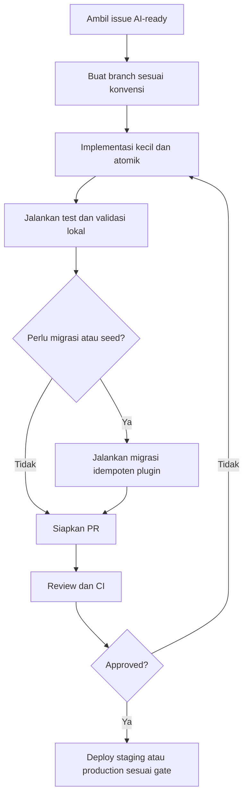

# Repository Execution SOP — Satu Sehat Kobar

**Versi:** 1.5
**Tanggal:** Juni 2026
**Status:** Active
**Berlaku untuk:** Seluruh developer dan AI coding agent yang bekerja di repository Satu Sehat Kobar

---

## 1. Struktur Repository



### 1.1 Pola Monorepo

Satu Sehat Kobar menggunakan pola yang mengikuti struktur AWCMS-Micro. Seluruh plugin berada dalam satu repository:

```
ssk-kobar/
├── CLAUDE.md                        # Konteks untuk AI coding agent
├── AGENTS.md                        # Instruksi agen
├── README.md                        # Dokumentasi utama repository
├── CHANGELOG.md                     # Log perubahan per versi
├── wrangler.toml                    # Konfigurasi Cloudflare Workers
├── package.json
├── tsconfig.json
├── src/
│   ├── core/                        # AWCMS-Micro core (JANGAN DIUBAH)
│   │   ├── auth/
│   │   ├── rbac/
│   │   ├── audit/
│   │   └── middleware/
│   └── plugins/
│       ├── agenda-dinkes/           # Plugin agenda kegiatan
│       ├── duty-travel/             # Plugin ST/SPPD
│       ├── satusehat-dashboard/     # Plugin dashboard KPI
│       ├── spm-health/              # Plugin indikator SPM
│       ├── mmc-publication/         # Plugin publikasi MMC
│       ├── document-template/       # Plugin template PDF
│       └── document-archive/        # Plugin arsip digital
├── migrations/
│   ├── agenda-dinkes/
│   ├── duty-travel/
│   └── ...                          # Satu folder migrasi per plugin
├── docs/
│   └── prd/                         # Seluruh dokumen PRD
└── tests/
    ├── unit/
    ├── integration/
    └── e2e/
```

### 1.2 Struktur Wajib per Plugin

Setiap plugin HARUS memiliki file dan folder berikut:

```
plugins/[nama-plugin]/
├── README.md                  # Deskripsi plugin, cara install, cara konfigurasi
├── CHANGELOG.md               # Log perubahan plugin
├── index.ts                   # Entry point plugin, export routes dan manifest
├── manifest.ts                # Deklarasi plugin: nama, versi, permissions, routes
├── routes/                    # Route handler (thin layer — hanya auth, RBAC, ABAC, validate, call service)
│   ├── [resource].routes.ts
│   └── ...
├── services/                  # Business logic
│   ├── [resource].service.ts
│   └── ...
├── repositories/              # Database queries (D1)
│   ├── [resource].repository.ts
│   └── ...
├── schemas/                   # Zod validation schemas
│   ├── [resource].schema.ts
│   └── ...
├── types/                     # TypeScript types dan interfaces
│   └── [resource].types.ts
├── migrations/                # SQL migration files
│   └── YYYYMMDDHHMMSS_description.sql
└── docs/                      # Dokumentasi teknis plugin
    ├── api.md
    └── permissions.md
```

---

## 2. Setup Development Environment

### 2.1 Prerequisites

| Tool | Versi Minimum | Keterangan |
|------|---------------|------------|
| Node.js | 20.x LTS | Runtime JavaScript |
| pnpm | 8.x | Package manager (diutamakan vs npm) |
| Wrangler CLI | 3.x | Cloudflare Workers toolchain |
| Git | 2.x | Version control |
| VS Code | Latest | Editor dengan ekstensi TypeScript |

### 2.2 Clone dan Setup

```bash
# Clone repository
git clone https://github.com/dinkes-kobar/ssk-kobar.git
cd ssk-kobar

# Install dependencies
pnpm install

# Salin environment variables template
cp .dev.vars.example .dev.vars
# Edit .dev.vars dengan nilai lokal — JANGAN commit file ini
```

### 2.3 Konfigurasi Environment Variables

Gunakan file `.dev.vars` untuk development lokal. File ini TIDAK boleh di-commit ke repository:

```bash
# .dev.vars (contoh — nilai aktual dari Admin Teknis)
JWT_SECRET=your-local-secret-here
ENVIRONMENT=development
D1_DATABASE_ID=your-local-d1-id
R2_BUCKET_NAME=ssk-documents-dev
```

Untuk staging dan production, secrets dikonfigurasi via Cloudflare dashboard atau CLI:

```bash
# Set secret di Cloudflare (bukan di file)
wrangler secret put JWT_SECRET --env staging
wrangler secret put JWT_SECRET --env production
```

### 2.4 Setup Database Lokal

```bash
# Buat database D1 lokal
wrangler d1 create ssk-local --local

# Jalankan seluruh migrasi (urutan penting — lihat seksi 4)
pnpm run migrate:local

# Seed data awal (master data wilayah, role, permission)
pnpm run seed:local
```

### 2.5 Menjalankan Dev Server

```bash
# Jalankan Workers dev server
wrangler dev

# Atau dengan hot reload
pnpm run dev
```

Server berjalan di `http://localhost:8787`.

---

## 3. Git Workflow

### 3.1 Branch Naming Convention

| Jenis | Format | Contoh |
|-------|--------|--------|
| Fitur baru | `feat/[plugin]-[deskripsi-singkat]` | `feat/duty-travel-approval-chain` |
| Bug fix | `fix/[plugin]-[deskripsi-singkat]` | `fix/duty-travel-finance-skip` |
| Migrasi database | `db/[plugin]-[deskripsi-singkat]` | `db/duty-travel-add-is-budgeted` |
| Dokumentasi | `docs/[deskripsi]` | `docs/update-api-contract` |
| Hotfix production | `hotfix/[deskripsi]` | `hotfix/abac-finance-scope-bypass` |

### 3.2 Conventional Commits

Format commit message yang wajib digunakan:

```
<type>(<scope>): <deskripsi singkat>

[body opsional — penjelasan lebih detail]

[footer opsional — issue yang ditutup]
```

| Type | Kapan Digunakan |
|------|-----------------|
| `feat` | Fitur baru |
| `fix` | Perbaikan bug |
| `db` | Perubahan skema database atau migrasi |
| `refactor` | Refactoring tanpa perubahan behavior |
| `test` | Penambahan atau perbaikan test |
| `docs` | Perubahan dokumentasi |
| `chore` | Update dependency, konfigurasi build |
| `security` | Perbaikan keamanan |

Contoh commit yang benar:

```
feat(duty-travel): tambah auto-skip finance jika is_budgeted=false

Approval chain langkah keuangan di-skip secara otomatis jika
duty_request.is_budgeted = false, sesuai keputusan GAP-001 di
Change Control Log.

Closes #42
```

### 3.3 Pull Request Process

Setiap PR harus:

1. Melewati semua CI check (lint, typecheck, test, build)
2. Menyertakan deskripsi singkat perubahan
3. Menyertakan link ke issue GitHub yang dikerjakan
4. Diisi checklist code review (lihat seksi 7)
5. Mendapat approval minimal 1 reviewer (Tech Lead untuk perubahan arsitektur)

**Protected branches:**

- `main` — production-ready, hanya dapat di-merge via PR yang sudah approved, tidak boleh force push
- `develop` — staging-ready, semua fitur di-merge ke sini sebelum ke `main`

**Merge strategy:**

- Feature branch → `develop`: **Squash merge** (history bersih)
- `develop` → `main`: **Merge commit** (preserve history release)

---

## 4. Database Migration SOP

### 4.1 Naming Convention

```
YYYYMMDDHHMMSS_nama-plugin_deskripsi-singkat.sql
```

Contoh:

```
20260801120000_duty-travel_create-duty-requests-table.sql
20260801130000_duty-travel_add-is-budgeted-column.sql
20260815090000_agenda-dinkes_add-spm-category.sql
```

### 4.2 Aturan Migrasi

1. **Satu file, satu perubahan** — Jangan gabungkan perubahan yang tidak berhubungan
2. **Prefix tabel wajib** — Setiap tabel HARUS menggunakan prefix plugin (contoh: `dt_` untuk duty-travel, `ag_` untuk agenda-dinkes)
3. **Tidak boleh DROP tanpa backup** — Jalankan backup D1 sebelum migration yang menghapus data
4. **Tidak boleh mengubah tabel plugin lain** — Migrasi hanya boleh menyentuh tabel plugin sendiri
5. **Ordinal urutan dijaga** — Timestamp memastikan urutan migrasi yang benar

### 4.3 Menjalankan Migrasi

```bash
# Lokal
wrangler d1 execute ssk-local --file migrations/duty-travel/20260801120000_duty-travel_create-duty-requests-table.sql --local

# Staging
wrangler d1 execute ssk-staging --file migrations/duty-travel/20260801120000_duty-travel_create-duty-requests-table.sql --env staging

# Production (wajib backup terlebih dahulu)
wrangler d1 export ssk-production --output backup/pre-migration-$(date +%Y%m%d).sql
wrangler d1 execute ssk-production --file migrations/duty-travel/20260801120000_duty-travel_create-duty-requests-table.sql --env production
```

### 4.4 Rollback Migrasi

D1 tidak mendukung automatic rollback. Jika migrasi bermasalah:

```bash
# Restore dari backup pre-migration
wrangler d1 execute ssk-production --file backup/pre-migration-YYYYMMDD.sql --env production
```

### 4.5 Data Seeding

File seed disimpan di `migrations/[plugin]/seeds/`:

```bash
# Seed data lokal
wrangler d1 execute ssk-local --file migrations/core/seeds/roles.sql --local
wrangler d1 execute ssk-local --file migrations/core/seeds/permissions.sql --local
wrangler d1 execute ssk-local --file migrations/core/seeds/master-wilayah.sql --local
```

---

## 5. Deployment SOP

### 5.1 Staging Deployment

Trigger: merge ke branch `develop` via Pull Request

```bash
# Manual staging deploy (jika tidak menggunakan CI)
pnpm run build
wrangler deploy --env staging

# Post-deploy smoke test staging
pnpm run test:smoke --env staging
```

Checklist post-deploy staging:

- [ ] Health check `GET /api/health` mengembalikan `status: ok`
- [ ] Login dengan akun test admin berhasil
- [ ] Dashboard dapat diakses
- [ ] Satu skenario end-to-end (buat agenda → buat ST → approval → PDF) berjalan

### 5.2 Production Deployment

Trigger: manual approval oleh Tech Lead atau Admin Teknis setelah UAT staging

```bash
# Wajib backup sebelum deploy production
wrangler d1 export ssk-production --output backup/pre-deploy-$(date +%Y%m%d-%H%M%S).sql

# Deploy production
pnpm run build
wrangler deploy --env production

# Health check segera setelah deploy
curl https://ssk.dinkes-kobar.go.id/api/health
```

Checklist post-deploy production:

- [ ] Health endpoint mengembalikan `status: ok` dan versi yang benar
- [ ] Login dengan akun admin production berhasil
- [ ] Satu skenario smoke test berjalan
- [ ] Tidak ada spike error di Cloudflare Analytics
- [ ] Product Owner diinformasikan bahwa deployment selesai
- [ ] CHANGELOG diperbarui

### 5.3 Rollback Procedure

Digunakan jika ditemukan bug P1 dalam 30 menit setelah deploy:

```bash
# Rollback ke deployment sebelumnya
wrangler rollback --env production

# Jika perlu rollback database (hanya jika migration menyebabkan masalah)
wrangler d1 execute ssk-production \
  --file backup/pre-deploy-YYYYMMDD-HHMMSS.sql \
  --env production

# Verifikasi setelah rollback
curl https://ssk.dinkes-kobar.go.id/api/health

# Informasikan Product Owner dan catat sebagai insiden P1
```

---

## 6. Testing SOP

### 6.1 Jenis Test

| Jenis | Tool | Coverage Target | Apa yang Diuji |
|-------|------|-----------------|----------------|
| Unit test | Vitest | ≥ 70% service layer | Business logic, kalkulasi, validasi |
| Integration test | Vitest + D1 local | Semua repository method | Query database, relasi tabel |
| E2E test | Playwright (opsional MVP) | Alur utama | Login → buat ST → approval → PDF |

### 6.2 Menjalankan Test

```bash
# Semua test
pnpm test

# Unit test saja
pnpm test:unit

# Integration test (membutuhkan D1 local)
pnpm test:integration

# Coverage report
pnpm test:coverage

# Test spesifik plugin
pnpm test --filter duty-travel
```

### 6.3 CI Gates

Semua check berikut HARUS lulus sebelum PR dapat di-merge:

```bash
pnpm lint          # ESLint — tidak boleh ada error
pnpm typecheck     # TypeScript strict — tidak boleh ada error
pnpm test          # Semua test harus pass
pnpm build         # Build harus berhasil tanpa error
```

---

## 7. Code Review Checklist

Reviewer wajib memverifikasi setiap item berikut sebelum approve PR:

### Keamanan dan Akses

- [ ] Setiap route handler mengikuti urutan: **auth check → RBAC check → ABAC check → validate input → call service → emit audit → return response**
- [ ] ABAC rules diterapkan sesuai matriks di `10.Security Checklist`: `faskes_own` vs `dinas_all` untuk Keuangan, ABAC owner untuk pegawai
- [ ] Tidak ada data sensitif (finance, restricted) yang bisa diakses tanpa permission yang tepat
- [ ] Signed URL digunakan untuk akses file R2 (bukan expose path langsung)
- [ ] Tidak ada secret atau credential yang di-hardcode

### Database dan Data

- [ ] Semua query menggunakan parameterized statements (tidak ada string interpolation SQL)
- [ ] Prefix tabel sesuai plugin yang dikerjakan
- [ ] Plugin tidak mengakses tabel plugin lain secara langsung (gunakan Service Contract API)
- [ ] Soft delete menggunakan `deleted_at` bukan `DELETE` permanen (kecuali audit cleanup)
- [ ] Migration file mengikuti naming convention dan tidak memodifikasi tabel plugin lain

### Audit dan Observability

- [ ] Audit event di-emit untuk setiap aksi mutasi (CREATE, UPDATE, DELETE, STATUS_CHANGE)
- [ ] Audit event mengandung: `actor_id`, `action`, `resource_type`, `resource_id`, `payload_before`, `payload_after`
- [ ] Error message dalam Bahasa Indonesia yang informatif

### Kode dan TypeScript

- [ ] TypeScript types didefinisikan untuk semua entitas (bukan `any`)
- [ ] Zod schema digunakan untuk validasi input di route level
- [ ] Custom error class digunakan dengan HTTP status dan error code yang sesuai
- [ ] Tidak ada `console.log` yang tertinggal di production code

### Plugin Boundaries

- [ ] Plugin tidak mengimport dari plugin lain secara langsung
- [ ] Komunikasi antar plugin hanya melalui Service Contract API yang terdokumentasi
- [ ] Permission declarations di manifest plugin lengkap

---

## 8. Plugin Development Checklist

Saat membuat plugin baru atau fitur baru dalam plugin:

### Sebelum Mulai Coding

- [ ] Baca `01.AI Implementation Prompt` untuk konteks dan hard rules
- [ ] Baca `03.Plugin Architecture` untuk struktur yang benar
- [ ] Baca `04.DB Schema` untuk tabel yang relevan
- [ ] Baca `05.API Contract` untuk endpoint yang akan dibuat
- [ ] Identifikasi issue GitHub yang dikerjakan
- [ ] Buat branch dengan naming convention yang benar

### Saat Coding

- [ ] Folder structure plugin lengkap (routes, services, repositories, schemas, types)
- [ ] Manifest plugin mendaftarkan semua permission yang dibutuhkan
- [ ] Migration file dibuat dengan timestamp dan naming convention benar
- [ ] Service layer tidak melakukan query langsung (delegasi ke repository layer)
- [ ] Route handler hanya berisi: auth → RBAC → ABAC → validate → service → audit → response
- [ ] Tidak ada modifikasi pada `src/core/`

### Sebelum PR

- [ ] `pnpm lint && pnpm typecheck && pnpm test && pnpm build` semua lulus
- [ ] Migrasi diuji di environment lokal
- [ ] Smoke test manual skenario utama berhasil
- [ ] README plugin diperbarui
- [ ] CHANGELOG diperbarui
- [ ] Implementation report ditulis (lihat template di `20.Master Document Index`)

---

## 9. Anti-Patterns yang Dilarang

Jika menemukan kode berikut saat review, **wajib ditolak**:

```typescript
// DILARANG: Query langsung ke tabel plugin lain
const agenda = await db.prepare('SELECT * FROM ag_events WHERE id = ?').bind(id).first();
// BENAR: Gunakan Service Contract API
const agenda = await AgendaService.getById(agendaId, ctx);

// DILARANG: String interpolation dalam SQL
const result = await db.prepare(`SELECT * FROM dt_requests WHERE id = ${id}`).all();
// BENAR: Parameterized query
const result = await db.prepare('SELECT * FROM dt_requests WHERE id = ?').bind(id).all();

// DILARANG: Hardcode secret
const jwtSecret = 'my-secret-key-123';
// BENAR: Dari environment
const jwtSecret = env.JWT_SECRET;

// DILARANG: Expose R2 path langsung
return { fileUrl: `https://r2.cloudflarestorage.com/ssk-docs/${key}` };
// BENAR: Generate signed URL
const signedUrl = await getSignedUrl(env.SSK_STORAGE, key, { expiresIn: 3600 });
return { fileUrl: signedUrl };

// DILARANG: Skip audit untuk mutasi
await DutyRepository.updateStatus(id, 'approved');
// BENAR: Audit setelah mutasi
await DutyRepository.updateStatus(id, 'approved');
await AuditService.emit(ctx, { action: 'DUTY_APPROVED', resourceId: id, ... });

// DILARANG: Error message dalam Bahasa Inggris ke user
throw new Error('Unauthorized access');
// BENAR: Bahasa Indonesia
throw new ForbiddenError('Anda tidak memiliki akses untuk melakukan tindakan ini');
```

---

## 10. Dokumen Terkait

| Dokumen | Relevansi |
|---------|-----------|
| `01.AI Implementation Prompt.docx.md` | Hard rules dan pola kode yang wajib diikuti AI |
| `03.PLUGIN_ARCHITECTURE.docx.md` | Arsitektur plugin yang benar |
| `04.DATABASE_MVP_SCHEMA.docx.md` | Skema tabel dan prefix per plugin |
| `05.API Service Contract.docx.md` | Kontrak API antar plugin |
| `10.Security and Privacy Checklist.docx.md` | Checklist keamanan sebagai gate PR |
| `19.Operations Support and Maintenance Plan.docx.md` | Prosedur deployment dan rollback operasional |
