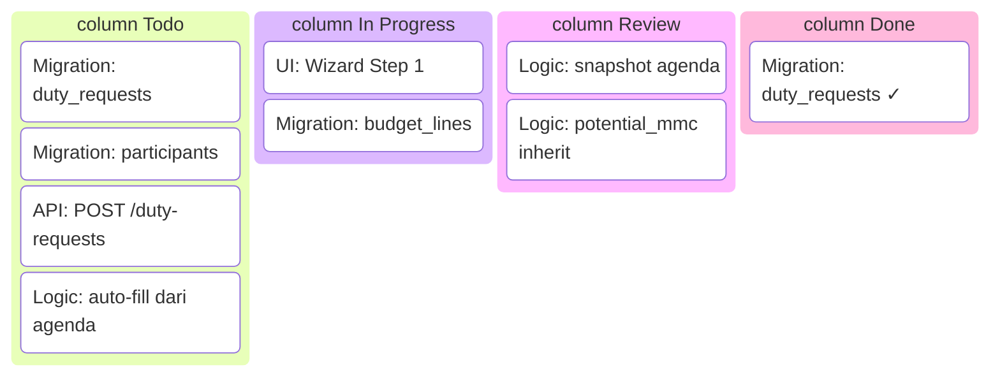
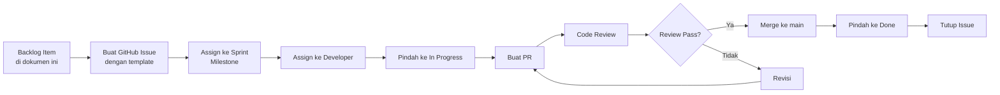

# Sprint Execution Plan — Satu Sehat Kobar

**Versi:** 2.0  
**Tanggal:** Juni 2026  
**Platform:** AWCMS-Micro (Cloudflare Workers / D1 / R2 / KV)  
**Timeline MVP:** Sprint 0–6, mid-2026 s.d. akhir 2026

---

## 1. Metodologi

### 1.1 Pendekatan: Scrum-Lite

Proyek ini menggunakan **Scrum-Lite** — adaptasi ringan dari Scrum yang disesuaikan untuk tim kecil (1–3 developer) dan lingkungan pemerintahan.

**Durasi Sprint:** 2 minggu (10 hari kerja)  
**Total Sprint MVP:** Sprint 0 s.d. Sprint 6 (7 sprint × 2 minggu = ~3,5 bulan inti + buffer)

### 1.2 Ceremonies Sprint

| Ceremony              | Waktu         | Durasi    | Peserta                    |
|-----------------------|---------------|-----------|----------------------------|
| Sprint Planning       | Hari 1 sprint | 2 jam     | Semua tim + PO             |
| Daily Standup         | Setiap pagi   | 15 menit  | Tim teknis                 |
| Sprint Review         | Hari 10       | 1 jam     | Tim + PO + stakeholder     |
| Sprint Retrospective  | Hari 10       | 45 menit  | Tim teknis                 |
| Backlog Refinement    | Hari 7–8      | 1 jam     | Tech Lead + PO             |

### 1.3 Prinsip Non-Negosiasi

1. Tidak boleh lanjut ke sprint berikutnya jika item **Must Have** sprint aktif belum selesai.
2. Tidak boleh mengerjakan fitur **Won't Have MVP** tanpa keputusan PO.
3. Tidak boleh mengubah core AWCMS-Micro tanpa keputusan teknis tertulis.
4. Setiap sprint harus menghasilkan software yang bisa didemonstrasikan.
5. Definition of Done harus dipenuhi — bukan hanya "code jalan di local".

---

## 2. Tim dan Kapasitas

### 2.1 Komposisi Tim

| Role                | Tanggung Jawab Utama                                                     |
|---------------------|--------------------------------------------------------------------------|
| Tech Lead           | Arsitektur, review PR, keputusan teknis, koordinasi dengan PO            |
| Backend Developer   | API endpoints, DB migrations, service layer, Workers logic               |
| Frontend Developer  | UI pages, wizard forms, dashboard, integrasi API                         |
| QA (part-time)      | Test case, UAT support, regression test                                  |
| Product Owner       | Prioritas backlog, acceptance criteria, keputusan scope                  |

### 2.2 Kapasitas Sprint (10 hari kerja)

| Role              | Hari Tersedia | Hari Efektif (80%) | Keterangan                        |
|-------------------|---------------|--------------------|-----------------------------------|
| Tech Lead         | 10            | 8                  | 2 hari untuk review + ceremonies  |
| Backend Dev       | 10            | 9                  | 1 hari ceremonies                 |
| Frontend Dev      | 10            | 9                  | 1 hari ceremonies                 |
| QA (0.5 FTE)      | 5             | 4                  | Part-time                         |
| **Total Tim**     |               | **30 hari efektif**|                                   |

### 2.3 Estimasi Effort

| Label | Rentang Waktu | Equiv. Story Points |
|-------|---------------|---------------------|
| S     | ≤ 1 hari      | 1–2                 |
| M     | 2–3 hari      | 3–5                 |
| L     | 4–7 hari      | 8–13                |
| XL    | > 7 hari      | 21+ (pecah dulu)    |

---

## 3. Sprint 0 — Persiapan dan Audit

**Durasi:** 2 minggu | **Target Poin:** 15–20

### 3.1 Goals

1. Audit menyeluruh repo AWCMS-Micro — pahami batas core, pola plugin, dan ekstensi yang diizinkan.
2. Setup lingkungan development (Cloudflare dev environment, wrangler, D1 local, R2 local).
3. Setup CI/CD pipeline (GitHub Actions: lint, type-check, test, deploy staging).
4. Identifikasi pola implementasi yang benar untuk plugin baru.
5. Selesaikan gap analysis dari PRD v1.5 — 10 gap sudah teridentifikasi, validasi dan prioritaskan.
6. Buat rencana seed data: master data pegawai dummy, 17 roles, 30+ permissions, 12 SPM indicators.

### 3.2 Tasks Detail

| Task ID | Tugas                                              | Effort | Owner        |
|---------|----------------------------------------------------|--------|--------------|
| S0-T01  | Clone dan audit repo AWCMS-Micro                   | S      | Tech Lead    |
| S0-T02  | Dokumen batas core — apa yang boleh/tidak diubah   | S      | Tech Lead    |
| S0-T03  | Setup Cloudflare dev account + wrangler config     | S      | Backend Dev  |
| S0-T04  | Setup D1 local (miniflare/wrangler dev)            | S      | Backend Dev  |
| S0-T05  | Setup R2 local bucket dev                          | S      | Backend Dev  |
| S0-T06  | Setup KV namespace dev                             | S      | Backend Dev  |
| S0-T07  | Setup GitHub Actions CI: lint + type-check + test  | M      | Tech Lead    |
| S0-T08  | Setup GitHub Actions CD: deploy ke staging         | M      | Tech Lead    |
| S0-T09  | Identifikasi pola plugin AWCMS-Micro (route, handler, service, migration) | M | Tech Lead |
| S0-T10  | Review gap analysis PRD v1.5 — 10 gap divalidasi  | M      | Tech Lead+PO |
| S0-T11  | Rancang schema seed data master (roles, permissions, SPM) | M | Backend Dev |
| S0-T12  | Setup folder struktur plugin baru (7 plugin)       | S      | Tech Lead    |
| S0-T13  | Setup lint rules (ESLint + Prettier) sesuai AWCMS  | S      | Backend Dev  |
| S0-T14  | Buat template migration file                       | S      | Backend Dev  |

### 3.3 Deliverables Sprint 0

- Lingkungan dev berjalan (wrangler dev tanpa error)
- CI/CD pipeline aktif di GitHub
- Dokumen: "Plugin Implementation Guide" (internal, 1–2 halaman)
- Gap analysis divalidasi dan diprioritaskan
- Struktur folder 7 plugin ter-scaffold

### 3.4 Definition of Done Sprint 0

- [ ] `wrangler dev` berjalan tanpa error
- [ ] `npx tsc --noEmit` clean
- [ ] `eslint .` clean
- [ ] GitHub Actions CI berjalan pada setiap PR
- [ ] Gap analysis didokumentasikan dan disetujui PO
- [ ] Semua tim memahami batas core AWCMS-Micro

---

## 4. Sprint 1 — Platform Foundation

**Durasi:** 2 minggu | **Target Poin:** 25–30

### 4.1 Goals

1. Tabel-tabel fondasi platform tersedia di D1.
2. 17 role dan 30+ permission ter-seed.
3. RBAC middleware berfungsi.
4. Admin login flow berjalan.
5. Plugin registry dan loader aktif.
6. `duty_approval_step_config` table tersedia (GAP RESOLUTION).
7. Infrastruktur audit log aktif.
8. Rate limiting dan secret management terpasang.
9. SPM master data ter-seed (seed-only, tidak ada CRUD di MVP).

### 4.2 Tasks Detail

| Task ID | Tugas                                                       | Effort | Owner        |
|---------|-------------------------------------------------------------|--------|--------------|
| S1-T01  | Migration: `satusehat_plugin_registry`                      | S      | Backend Dev  |
| S1-T02  | Migration: `roles`, `permissions`, `user_roles`, `role_permissions` | S | Backend Dev |
| S1-T03  | Migration: `satusehat_audit_logs`                           | S      | Backend Dev  |
| S1-T04  | Migration: `duty_approval_step_config`                      | S      | Backend Dev  |
| S1-T05  | Migration: `satusehat_notifications`                        | S      | Backend Dev  |
| S1-T06  | Seed: 17 roles + 30+ permissions + role_permissions         | M      | Backend Dev  |
| S1-T07  | Seed: `duty_approval_step_config` default (dinas + faskes)  | S      | Backend Dev  |
| S1-T08  | Seed: 12 SPM indicators (`spm_indicators` table)            | S      | Backend Dev  |
| S1-T09  | Plugin loader: baca registry dari D1, load routes kondisional | M   | Backend Dev  |
| S1-T10  | Auth: `POST /auth/login` — JWT + refresh token KV           | M      | Backend Dev  |
| S1-T11  | Auth: `POST /auth/refresh`, `POST /auth/logout`             | S      | Backend Dev  |
| S1-T12  | Middleware: RBAC route guard + permission check             | M      | Backend Dev  |
| S1-T13  | Helper: `auditLog(action, resource, userId, metadata)`      | S      | Backend Dev  |
| S1-T14  | Rate limiting middleware (per IP + per user)                | M      | Backend Dev  |
| S1-T15  | Secret management: verifikasi semua secret via wrangler     | S      | Tech Lead    |
| S1-T16  | `GET /health` endpoint (D1 + KV + R2 status)               | S      | Backend Dev  |
| S1-T17  | API: `GET /admin/approval-step-config` per org_level        | S      | Backend Dev  |
| S1-T18  | UI: Admin login page                                        | M      | Frontend Dev |
| S1-T19  | UI: Dashboard placeholder (skeleton)                        | S      | Frontend Dev |
| S1-T20  | Test: Auth flow + RBAC unit tests                           | M      | QA           |

### 4.3 Acceptance Criteria Sprint 1

1. `POST /auth/login` dengan kredensial valid mengembalikan JWT.
2. Endpoint terproteksi dengan role tidak sesuai mengembalikan HTTP 403.
3. `GET /health` mengembalikan status semua dependensi.
4. Audit log tercatat untuk login/logout dan akses terlarang.
5. `GET /admin/approval-step-config?org_level=dinas` mengembalikan 5–6 step default.
6. 12 SPM indicator tersedia di tabel `spm_indicators`.

### 4.4 Definition of Done Sprint 1

- [ ] Semua migration berhasil di staging
- [ ] Seed berhasil dijalankan tanpa error
- [ ] Auth flow diuji manual: login, access protected, logout
- [ ] RBAC diuji: setidaknya 3 role berbeda dicoba
- [ ] Audit log diverifikasi di DB
- [ ] Rate limiting diuji dengan curl

---

## 5. Sprint 2 — Agenda Plugin

**Durasi:** 2 minggu | **Target Poin:** 25–30

### 5.1 Goals

1. Plugin `agenda-dinkes` fully functional — CRUD lengkap.
2. Status lifecycle agenda berjalan (draft → submitted → confirmed → cancelled).
3. SPM tagging berfungsi.
4. Flag `need_st` dan `potential_mmc` berfungsi + auto-inherit ready.
5. Soft delete dengan proteksi ST aktif.
6. Kalender view tersedia.
7. Attachment upload ke R2.

### 5.2 Tasks Detail

| Task ID | Tugas                                                          | Effort | Owner        |
|---------|----------------------------------------------------------------|--------|--------------|
| S2-T01  | Migration: `satusehat_agenda`, `satusehat_agenda_attachments`  | S      | Backend Dev  |
| S2-T02  | API: `POST /agenda` — create dengan validasi lengkap           | M      | Backend Dev  |
| S2-T03  | API: `GET /agenda` — list dengan filter + pagination           | M      | Backend Dev  |
| S2-T04  | API: `GET /agenda/:id` — detail + peserta                      | S      | Backend Dev  |
| S2-T05  | API: `PUT /agenda/:id` — edit jika status draft                | S      | Backend Dev  |
| S2-T06  | API: `DELETE /agenda/:id` — soft delete (proteksi ST aktif)    | S      | Backend Dev  |
| S2-T07  | API: `POST /agenda/:id/submit` — submit ke atasan              | S      | Backend Dev  |
| S2-T08  | API: `POST /agenda/:id/confirm` — konfirmasi oleh atasan       | S      | Backend Dev  |
| S2-T09  | API: `PATCH /agenda/:id/flag` — set need_st, potential_mmc     | S      | Backend Dev  |
| S2-T10  | API: `GET /agenda/calendar?month=YYYY-MM` — format kalender    | M      | Backend Dev  |
| S2-T11  | API: `POST /agenda/:id/attachments` — upload ke R2             | M      | Backend Dev  |
| S2-T12  | API: `GET /agenda/:id/attachments` — list lampiran             | S      | Backend Dev  |
| S2-T13  | UI: Halaman list agenda dengan filter                          | M      | Frontend Dev |
| S2-T14  | UI: Form create/edit agenda (semua field + SPM tagging)        | M      | Frontend Dev |
| S2-T15  | UI: Kalender view bulanan                                      | M      | Frontend Dev |
| S2-T16  | UI: Detail agenda + lampiran                                   | S      | Frontend Dev |
| S2-T17  | UI: Action buttons (submit, confirm, flag)                     | S      | Frontend Dev |
| S2-T18  | Notifikasi in-app: agenda submitted ke atasan                  | S      | Backend Dev  |
| S2-T19  | Test: Agenda CRUD + lifecycle + SPM filter                     | M      | QA           |

### 5.3 Acceptance Criteria Sprint 2

1. Operator bisa buat, edit, submit, dan lihat agenda.
2. Atasan bisa konfirmasi agenda yang disubmit.
3. Filter agenda berdasarkan SPM indicator berfungsi.
4. Soft delete tidak menghapus record dari DB.
5. Agenda yang memiliki ST aktif tidak bisa dihapus (HTTP 409).
6. Upload lampiran berhasil disimpan ke R2.
7. Kalender menampilkan agenda bulan ini dengan benar.

---

## 6. Sprint 3 — ST/SPPD Plugin

**Durasi:** 2 minggu | **Target Poin:** 30–35

### 6.1 Goals

1. Plugin `duty-travel` — wizard ST 3 step selesai.
2. Multi-peserta dengan snapshot data.
3. Rincian anggaran dengan `budget_category` (GAP RESOLUTION).
4. Snapshot agenda ke ST (GAP RESOLUTION).
5. `potential_mmc` auto-inherit dari agenda (GAP RESOLUTION).
6. Penentuan rantai approval via `primary_health_facility_id` (GAP RESOLUTION).
7. ST urgent dengan justifikasi.
8. Submit ST masuk ke antrian approval.

### 6.2 Tasks Detail

| Task ID | Tugas                                                              | Effort | Owner        |
|---------|--------------------------------------------------------------------|--------|--------------|
| S3-T01  | Migration: `duty_requests`                                         | S      | Backend Dev  |
| S3-T02  | Migration: `duty_request_participants`                             | S      | Backend Dev  |
| S3-T03  | Migration: `duty_request_budget_lines` (+ `budget_category` enum) | S      | Backend Dev  |
| S3-T04  | Migration: `duty_request_agenda_snapshot`                          | S      | Backend Dev  |
| S3-T05  | API: `POST /duty-requests` — create draft ST                       | M      | Backend Dev  |
| S3-T06  | API: `PUT /duty-requests/:id/step1` — data dasar                   | S      | Backend Dev  |
| S3-T07  | API: `PUT /duty-requests/:id/participants` — tambah/hapus peserta  | M      | Backend Dev  |
| S3-T08  | API: `PUT /duty-requests/:id/budget-lines` — rincian anggaran     | M      | Backend Dev  |
| S3-T09  | Logic: auto-fill dari agenda (title, dates, location, spm_ids)    | M      | Backend Dev  |
| S3-T10  | Logic: snapshot agenda saat submit                                 | S      | Backend Dev  |
| S3-T11  | Logic: potential_mmc inherit dari agenda → ST                      | S      | Backend Dev  |
| S3-T12  | Logic: tentukan primary_health_facility_id + chain approval        | M      | Backend Dev  |
| S3-T13  | API: `POST /duty-requests/:id/submit` — validasi + trigger approval | M    | Backend Dev  |
| S3-T14  | API: `GET /duty-requests` — list dengan filter ABAC               | M      | Backend Dev  |
| S3-T15  | API: `GET /duty-requests/:id` — detail lengkap                     | S      | Backend Dev  |
| S3-T16  | UI: Wizard Step 1 — form data dasar + auto-fill dari agenda       | M      | Frontend Dev |
| S3-T17  | UI: Wizard Step 2 — multi-peserta search + tambah                 | M      | Frontend Dev |
| S3-T18  | UI: Wizard Step 3 — rincian anggaran dengan budget_category       | M      | Frontend Dev |
| S3-T19  | UI: Review & submit page                                           | S      | Frontend Dev |
| S3-T20  | UI: List ST dengan filter (status, unit, periode)                  | M      | Frontend Dev |
| S3-T21  | Test: Wizard flow + submission + snapshot + budget_category        | M      | QA           |

### 6.3 Acceptance Criteria Sprint 3

1. Wizard 3 step bisa diisi lengkap dan disubmit.
2. Auto-fill dari agenda berfungsi (pilih agenda → data dasar terisi).
3. Multi-peserta: tambah minimal 2 peserta, snapshot tersimpan.
4. `budget_category` wajib diisi untuk setiap baris anggaran.
5. `potential_mmc` dari agenda otomatis muncul di ST yang dibuat dari agenda tersebut.
6. ST yang disubmit masuk ke antrian approval langkah pertama sesuai konfigurasi.
7. ST lintas faskes menggunakan chain approval dari `primary_health_facility_id`.

---

## 7. Sprint 4 — Approval Workflow & Document

**Durasi:** 2 minggu | **Target Poin:** 30–35

### 7.1 Goals

1. Engine approval multi-step berjalan penuh berdasarkan `duty_approval_step_config`.
2. Finance step skip otomatis jika `is_budgeted = false` (GAP RESOLUTION).
3. ABAC scope untuk finance (GAP RESOLUTION).
4. In-app notification untuk setiap transisi approval (GAP RESOLUTION).
5. Generate PDF ST setelah final approved.
6. Template versioning — auto-snapshot saat generate (GAP RESOLUTION).
7. Upload dokumen bertanda tangan + hash SHA-256.
8. Verifikasi hash dokumen.

### 7.2 Tasks Detail

| Task ID | Tugas                                                             | Effort | Owner        |
|---------|-------------------------------------------------------------------|--------|--------------|
| S4-T01  | Migration: `duty_approval_history`                                | S      | Backend Dev  |
| S4-T02  | Migration: `document_templates`, `document_generated`             | S      | Backend Dev  |
| S4-T03  | Engine: `ApprovalProcessor` — baca step config, proses approve    | L      | Backend Dev  |
| S4-T04  | Logic: finance step skip jika `is_budgeted = false` → `skipped`  | M      | Backend Dev  |
| S4-T05  | Logic: ABAC filter — finance scope `dinas_all` vs `faskes_own`   | M      | Backend Dev  |
| S4-T06  | API: `POST /duty-requests/:id/approve` — dengan step validation  | M      | Backend Dev  |
| S4-T07  | API: `POST /duty-requests/:id/return` — dengan catatan wajib     | M      | Backend Dev  |
| S4-T08  | API: `POST /duty-requests/:id/reject` — terminal state           | S      | Backend Dev  |
| S4-T09  | API: `GET /duty-requests?pending_my_approval=true`               | S      | Backend Dev  |
| S4-T10  | Notification: trigger in-app saat setiap transisi step           | M      | Backend Dev  |
| S4-T11  | API: `GET /notifications`, `PATCH /notifications/:id/read`       | S      | Backend Dev  |
| S4-T12  | Template engine: render HTML → PDF (menggunakan Workers + library)| L     | Backend Dev  |
| S4-T13  | Logic: auto-snapshot template saat generate PDF                  | S      | Backend Dev  |
| S4-T14  | Logic: trigger generate PDF saat `status = 'final_approved'`     | M      | Backend Dev  |
| S4-T15  | R2: simpan PDF dengan path terstruktur `pdf/{year}/{st_id}/`     | S      | Backend Dev  |
| S4-T16  | API: `POST /duty-requests/:id/signed-document` — upload + hash   | M      | Backend Dev  |
| S4-T17  | API: `GET /duty-requests/:id/verify-document` — cek hash         | S      | Backend Dev  |
| S4-T18  | Admin: CRUD template dokumen + activate/deactivate               | M      | Backend Dev  |
| S4-T19  | UI: Halaman antrian approval per approver                        | M      | Frontend Dev |
| S4-T20  | UI: Detail ST untuk approver — approve/return/reject             | M      | Frontend Dev |
| S4-T21  | UI: Notifikasi badge + panel notifikasi                          | M      | Frontend Dev |
| S4-T22  | UI: Download PDF draft + upload signed document                  | M      | Frontend Dev |
| S4-T23  | Test: Full approval chain + skip logic + PDF                     | M      | QA           |

### 7.3 Acceptance Criteria Sprint 4

1. ST melewati 5–6 langkah approval sesuai konfigurasi `duty_approval_step_config`.
2. ST tidak berbiaya (`is_budgeted = false`): langkah finance otomatis `skipped`, alur langsung ke langkah berikutnya.
3. Finance Dinas bisa lihat semua ST; Finance Faskes hanya lihat ST unit mereka.
4. Approver menerima notifikasi in-app saat giliran mereka.
5. PDF ter-generate otomatis setelah final approved.
6. Hash SHA-256 dokumen yang diupload tersimpan dan dapat diverifikasi.
7. Histori template ter-snapshot saat PDF dibuat.

---

## 8. Sprint 5 — Evidence, Journal, dan Dashboard

**Durasi:** 2 minggu | **Target Poin:** 25–30

### 8.1 Goals

1. Upload multi-tipe bukti oleh semua peserta ST (GAP RESOLUTION).
2. Klasifikasi bukti + PII warning (GAP RESOLUTION).
3. Verifikasi/pengembalian bukti oleh verifikator.
4. Status ST auto-berubah ke `evidence_verified` setelah semua bukti OK.
5. Jurnal auto-terisi dari bukti terverifikasi.
6. Jurnal bidirectional state machine (GAP RESOLUTION).
7. Export jurnal ke CSV/XLSX.
8. Dashboard aggregate dengan KV caching 15 menit (GAP RESOLUTION).
9. SPM tracker 12 indikator.

### 8.2 Tasks Detail

| Task ID | Tugas                                                                | Effort | Owner        |
|---------|----------------------------------------------------------------------|--------|--------------|
| S5-T01  | Migration: `duty_evidence`                                           | S      | Backend Dev  |
| S5-T02  | Migration: `duty_journals`                                           | S      | Backend Dev  |
| S5-T03  | API: `POST /duty-requests/:id/evidence` — multipart upload R2       | M      | Backend Dev  |
| S5-T04  | Logic: hash SHA-256 saat evidence upload                             | S      | Backend Dev  |
| S5-T05  | Logic: ABAC check — hanya peserta ST yang bisa upload               | M      | Backend Dev  |
| S5-T06  | Logic: classification validation + PII warning trigger              | M      | Backend Dev  |
| S5-T07  | API: `POST /duty-evidence/:id/verify` — verifikasi bukti            | S      | Backend Dev  |
| S5-T08  | API: `POST /duty-evidence/:id/return` — kembalikan dengan catatan   | S      | Backend Dev  |
| S5-T09  | Logic: auto-update `duty_requests.status = 'evidence_verified'`     | M      | Backend Dev  |
| S5-T10  | Logic: journal auto-create/update saat evidence verify              | M      | Backend Dev  |
| S5-T11  | Logic: journal bidirectional — evidence returned → journal pending  | M      | Backend Dev  |
| S5-T12  | API: `GET /journals` — list dengan filter + pagination              | S      | Backend Dev  |
| S5-T13  | API: `GET /journals/export?format=csv&period=YYYY-MM`               | M      | Backend Dev  |
| S5-T14  | Notification: evidence uploaded → verifikator; evidence returned → peserta | S | Backend Dev |
| S5-T15  | Dashboard: `GET /dashboard/aggregate` — KPI utama                   | M      | Backend Dev  |
| S5-T16  | Dashboard: KV cache 15 menit + invalidasi trigger                   | M      | Backend Dev  |
| S5-T17  | Dashboard: `GET /spm/tracker` — 12 indikator dengan progres         | M      | Backend Dev  |
| S5-T18  | UI: Halaman upload evidence per ST (per peserta)                    | M      | Frontend Dev |
| S5-T19  | UI: PII warning saat pilih classification = confidential            | S      | Frontend Dev |
| S5-T20  | UI: Halaman verifikasi evidence (list + approve/return)             | M      | Frontend Dev |
| S5-T21  | UI: Jurnal saya — list dengan status completion                     | M      | Frontend Dev |
| S5-T22  | UI: Dashboard KPI dengan widget summary                             | L      | Frontend Dev |
| S5-T23  | UI: SPM tracker 12 indikator                                        | M      | Frontend Dev |
| S5-T24  | Test: Evidence flow + journal state machine + dashboard cache        | M      | QA           |

### 8.3 Acceptance Criteria Sprint 5

1. Semua peserta ST dapat upload evidence masing-masing.
2. File classified hanya bisa diakses oleh role `evidence.view_classified`.
3. Verifikator bisa approve/return evidence; peserta mendapat notifikasi.
4. Semua evidence verified → status ST otomatis `evidence_verified`.
5. Jurnal kembali ke `pending` saat evidence di-return; kembali `completed` saat di-reverify.
6. Export jurnal menghasilkan file CSV yang benar.
7. Dashboard menampilkan KPI dalam < 3 detik (termasuk KV cache hit).
8. SPM tracker menampilkan 12 indikator dengan nilai target dan realisasi.

---

## 9. Sprint 6 — MMC, Archive, Hardening, dan UAT

**Durasi:** 2 minggu | **Target Poin:** 20–25

### 9.1 Goals

1. Plugin `mmc-publication` — draft MMC lengkap.
2. Plugin `document-archive` — auto-archive + download + immutable.
3. Audit log retention job (GAP RESOLUTION).
4. Backup dan restore test.
5. Penetration test (internal scan).
6. Full UAT dengan 5 faskes pilot.
7. Semua bug kritis dari UAT diselesaikan.

### 9.2 Tasks Detail

| Task ID | Tugas                                                              | Effort | Owner        |
|---------|--------------------------------------------------------------------|--------|--------------|
| S6-T01  | Migration: `mmc_publications`                                      | S      | Backend Dev  |
| S6-T02  | Migration: `document_archives`                                     | S      | Backend Dev  |
| S6-T03  | API: `POST /mmc-publications` — buat draft dari evidence           | M      | Backend Dev  |
| S6-T04  | API: `PUT /mmc-publications/:id` — edit + PII checklist            | M      | Backend Dev  |
| S6-T05  | API: `POST /mmc-publications/:id/submit-review`                    | S      | Backend Dev  |
| S6-T06  | API: `POST /mmc-publications/:id/approve`                          | S      | Backend Dev  |
| S6-T07  | Logic: auto-archive saat signed document diupload                  | M      | Backend Dev  |
| S6-T08  | API: `GET /document-archives/:id/download` — signed URL R2        | M      | Backend Dev  |
| S6-T09  | API: `GET /document-archives` — search + filter + pagination       | M      | Backend Dev  |
| S6-T10  | Cron: audit log retention job (Cloudflare Cron Trigger, weekly)   | M      | Backend Dev  |
| S6-T11  | Security: backup D1 ke R2 + restore test                          | M      | Tech Lead    |
| S6-T12  | Security: internal penetration test (OWASP top 10 check)          | M      | Tech Lead    |
| S6-T13  | Security: review semua endpoint untuk auth bypass                  | M      | Tech Lead    |
| S6-T14  | UI: MMC draft editor + PII checklist                              | M      | Frontend Dev |
| S6-T15  | UI: MMC review dan approve flow                                   | M      | Frontend Dev |
| S6-T16  | UI: Arsip list + download                                         | M      | Frontend Dev |
| S6-T17  | UAT: Siapkan test data untuk 5 faskes                             | M      | QA + PO      |
| S6-T18  | UAT: Eksekusi skenario TC-001 s.d. TC-092                         | L      | QA + User    |
| S6-T19  | UAT: Bug triage + prioritasi fix                                  | M      | Tech Lead    |
| S6-T20  | Fix: Semua bug kritis dari UAT                                    | L      | Tim teknis   |
| S6-T21  | Deployment: wrangler deploy production + smoke test               | M      | Tech Lead    |

### 9.3 Acceptance Criteria Sprint 6

1. Draft MMC bisa dibuat dari evidence verified dengan `potential_mmc = true`.
2. PII cleaning checklist wajib sebelum submit review MMC.
3. Arsip dibuat otomatis saat signed document diupload; tidak bisa diedit.
4. Download arsip tercatat di audit log.
5. Backup D1 berhasil dan restore verified di staging.
6. Internal pen test: tidak ada critical vulnerability.
7. UAT: minimal 80% test case passed, 0 bug kritis terbuka.
8. Production deploy berhasil dengan smoke test OK.

---

## 10. Definisi Selesai per Sprint

### Go/No-Go Checklist per Sprint

| Kriteria                                                              | Sprint Berlaku  |
|-----------------------------------------------------------------------|-----------------|
| Semua Must Have sprint selesai (Acceptance Criteria terpenuhi)        | Semua sprint    |
| Tidak ada TypeScript error (`tsc --noEmit` clean)                    | Semua sprint    |
| Tidak ada lint error (`eslint .` clean)                              | Semua sprint    |
| Migration berhasil di staging                                         | Sprint 1–6      |
| Seed berhasil dijalankan                                              | Sprint 1        |
| Test: unit + integration passing                                      | Semua sprint    |
| Demo dilakukan di Sprint Review                                       | Semua sprint    |
| Tidak ada regression dari fitur sprint sebelumnya                     | Sprint 2–6      |
| Backup test berhasil                                                  | Sprint 6        |
| UAT passed (80% TC, 0 critical bug)                                  | Sprint 6        |
| Production smoke test OK                                              | Sprint 6        |

---

## 11. Risiko per Sprint dan Mitigasi

| Sprint   | Risiko Utama                                             | Mitigasi                                                            |
|----------|----------------------------------------------------------|---------------------------------------------------------------------|
| Sprint 0 | Batas core AWCMS tidak jelas, pola plugin tidak dipahami | Dedikasikan hari 1–3 untuk audit mendalam + diskusi dengan AWCMS team |
| Sprint 1 | Konfigurasi Cloudflare Workers staging bermasalah        | Sediakan fallback local (miniflare); eskalasi ke Cloudflare support  |
| Sprint 2 | Kompleksitas kalender view memakan waktu berlebih        | Gunakan library kalender open source; kurangi ke list view jika perlu |
| Sprint 3 | Wizard ST kompleks — banyak edge case validasi           | Prioritaskan happy path dulu; edge case di Sprint 3b atau buffer     |
| Sprint 4 | PDF generation di Workers — keterbatasan library         | Evaluasi: Puppeteer (Workers binding) vs HTML-to-PDF lib; riset Sprint 3 |
| Sprint 4 | Approval engine kompleks — risiko bug logika             | Buat unit test ekstensif untuk engine; code review wajib             |
| Sprint 5 | Evidence upload besar — R2 bandwidth dan timeout         | Batasi ukuran file, gunakan multipart upload dengan chunking         |
| Sprint 5 | Dashboard KV cache stale — data tidak konsisten          | Invalidasi cache setiap transaksi penting; TTL 15 menit cukup aman  |
| Sprint 6 | UAT menemukan bug kritis banyak — waktu fix kurang       | Sediakan buffer 3 hari di Sprint 6 khusus untuk bug fix UAT         |
| Sprint 6 | Production deploy gagal — konfigurasi env berbeda        | Deploy ke staging dulu; gunakan checklist deployment tertulis       |

---

## 12. Sprint Board Template

Template Kanban board untuk satu sprint tipikal:

### 12.1 GitHub Labels yang Digunakan

| Label           | Warna    | Keterangan                                  |
|-----------------|----------|---------------------------------------------|
| `epic:platform` | Biru     | EPIC-01                                     |
| `epic:agenda`   | Hijau    | EPIC-02                                     |
| `epic:stsppd`   | Kuning   | EPIC-03                                     |
| `epic:approval` | Oranye   | EPIC-04                                     |
| `epic:document` | Ungu     | EPIC-05                                     |
| `epic:evidence` | Merah    | EPIC-06                                     |
| `epic:journal`  | Abu-abu  | EPIC-07                                     |
| `epic:dashboard`| Biru tua | EPIC-08                                     |
| `epic:archive`  | Coklat   | EPIC-09                                     |
| `epic:mmc`      | Pink     | EPIC-10                                     |
| `epic:security` | Merah tua| EPIC-11                                     |
| `epic:gap`      | Hitam    | EPIC-12 Gap Resolution                      |
| `priority:P1`   | Merah    | Must Have — harus selesai sprint ini        |
| `priority:P2`   | Kuning   | Should Have — diusahakan                    |
| `priority:P3`   | Hijau    | Could Have — jika ada waktu                 |
| `blocked`       | Merah    | Tertahan, butuh tindakan                    |
| `gap-resolution`| Hitam    | Item dari EPIC-12                           |

### 12.2 Alur GitHub Issue per Item Backlog

