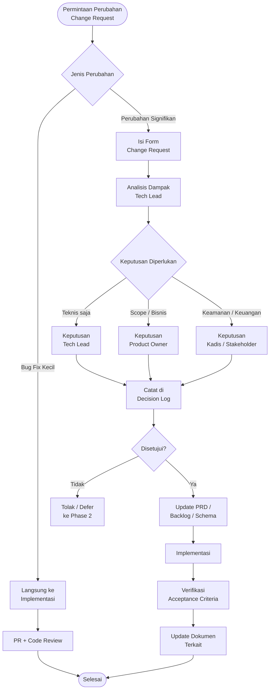

# Change Control and Decision Log — Satu Sehat Kobar

**Versi:** 2.0  
**Tanggal:** Juni 2026  
**Platform:** AWCMS-Micro (Cloudflare Workers / D1 / R2 / KV)  
**Status Dokumen:** Living document — diperbarui setiap ada keputusan baru

---

## 1. Tujuan Dokumen

Dokumen ini adalah catatan resmi pengendalian perubahan dan keputusan desain untuk proyek **Satu Sehat Kobar** MVP. Dokumen ini digunakan untuk:

1. Mencatat semua keputusan teknis dan non-teknis yang mempengaruhi implementasi.
2. Mengendalikan perubahan scope agar MVP tidak melebar tanpa keputusan eksplisit.
3. Memberikan konteks historis kepada developer baru dan AI coding agent.
4. Menjadi referensi saat ada diskusi atau konflik tentang desain sistem.
5. Mencatat dampak setiap keputusan terhadap database, API, UI, keamanan, dan SOP.
6. Memastikan setiap perubahan dapat ditelusuri ke sprint, PR, atau issue terkait.
7. Menjadi dasar bagi AI coding agent untuk berhenti dan meminta keputusan PO jika menemui ambiguitas.

**Aturan utama:** Tidak ada perubahan scope, desain database, atau alur approval yang diimplementasikan tanpa entri di dokumen ini.

---

## 2. Proses Change Control

### 2.1 Kapan Change Control Diperlukan

Proses change control **wajib** dijalankan untuk:

- Penambahan atau penghapusan fitur dari scope MVP
- Perubahan schema database (tabel, kolom, enum baru)
- Perubahan API contract (endpoint baru, perubahan response, breaking change)
- Perubahan alur approval atau business logic utama
- Perubahan integrasi eksternal
- Perubahan kebijakan keamanan atau retensi data
- Perubahan format dokumen resmi (ST, SPPD, laporan)

Change control **tidak diperlukan** untuk:

- Perbaikan bug kecil yang tidak mengubah perilaku sistem
- Perbaikan tampilan UI (styling, layout)
- Penambahan test case
- Pembaruan dokumentasi teknis internal

### 2.2 Alur Change Control



### 2.3 SLA Penanganan Change Request

| Jenis Perubahan        | Target Keputusan | Eskalasi Jika Melebihi |
|------------------------|------------------|------------------------|
| Bug fix kecil          | 1 hari           | Tech Lead              |
| Perubahan teknis minor | 2 hari           | Tech Lead              |
| Perubahan scope MVP    | 3 hari           | Product Owner          |
| Perubahan integrasi    | 5 hari           | PO + Stakeholder       |

---

## 3. Log Keputusan Desain

Setiap entri menggunakan format berikut:

```text
ID       : DEC-###
Tanggal  : YYYY-MM-DD
Requestor: [Nama / Jabatan]
Keputusan: [Isi keputusan singkat]
Rasional : [Alasan teknis atau bisnis]
Dampak   : [Apa yang berubah: DB / API / UI / SOP]
Status   : Aktif | Direvisi | Dibatalkan
```

---

### DEC-001: Pilih AWCMS-Micro sebagai Platform Base

| Field      | Detail |
|------------|--------|
| **ID**     | DEC-001 |
| **Tanggal**| 2026-06-01 |
| **Requestor** | Tech Lead / PO |
| **Keputusan** | Gunakan AWCMS-Micro sebagai platform base untuk seluruh implementasi Satu Sehat Kobar |
| **Rasional** | AWCMS-Micro sudah menyediakan fondasi plugin, routing, auth, dan deployment ke Cloudflare Workers. Menghindari pengembangan dari nol dan mempercepat time-to-market. Framework sudah teruji di proyek sebelumnya. |
| **Dampak** | Semua plugin harus mengikuti pola AWCMS-Micro. Tidak boleh ada fork core tanpa keputusan eksplisit. |
| **Status** | Aktif |

---

### DEC-002: Gunakan Cloudflare D1 / R2 / KV / Workers

| Field      | Detail |
|------------|--------|
| **ID**     | DEC-002 |
| **Tanggal**| 2026-06-01 |
| **Requestor** | Tech Lead |
| **Keputusan** | Seluruh infrastruktur menggunakan ekosistem Cloudflare: Workers (compute), D1 (database), R2 (file storage), KV (cache/session) |
| **Rasional** | Biaya operasional sangat rendah untuk skala pemerintah daerah. Tidak perlu server management. Latency rendah. D1 cukup untuk volume data dinas kesehatan kabupaten. |
| **Dampak** | Semua query menggunakan D1 SQL (SQLite dialek). File upload ke R2. Cache di KV. Tidak ada Redis, PostgreSQL, atau S3 eksternal. |
| **Status** | Aktif |

---

### DEC-003: Plugin Architecture — Tanpa Core Fork

| Field      | Detail |
|------------|--------|
| **ID**     | DEC-003 |
| **Tanggal**| 2026-06-01 |
| **Requestor** | Tech Lead |
| **Keputusan** | Semua fitur Satu Sehat Kobar diimplementasikan sebagai plugin eksternal. Core AWCMS-Micro tidak dimodifikasi kecuali ada keputusan eksplisit tercatat. |
| **Rasional** | Memudahkan update core di masa depan. Memisahkan concern bisnis dari infrastruktur. Memungkinkan plugin di-enable/disable per deployment. |
| **Dampak** | 7 plugin MVP: `agenda-dinkes`, `duty-travel`, `satusehat-dashboard`, `spm-health`, `mmc-publication`, `document-template`, `document-archive`. Plugin didaftarkan di `satusehat_plugin_registry`. |
| **Status** | Aktif |

---

### DEC-004: Multi-Role RBAC + ABAC per Unit / Faskes

| Field      | Detail |
|------------|--------|
| **ID**     | DEC-004 |
| **Tanggal**| 2026-06-01 |
| **Requestor** | PO + Tech Lead |
| **Keputusan** | Sistem menggunakan 17 role dengan RBAC sebagai lapisan pertama, diperkuat ABAC berbasis `unit_id` dan `faskes_id` sebagai lapisan kedua |
| **Rasional** | Struktur organisasi Dinas Kesehatan Kabupaten kompleks — ada pejabat dinas, kepala puskesmas, staf, dll. RBAC saja tidak cukup karena pegawai unit A tidak boleh akses data unit B meski role sama. |
| **Dampak** | Semua query ke data sensitif (ST, evidence, jurnal) harus menyertakan filter ABAC. Middleware harus mengekstrak `unit_id` dan `faskes_id` dari JWT. |
| **Status** | Aktif |

---

### DEC-005: Konfigurasi Approval Chain di Database — duty_approval_step_config

| Field      | Detail |
|------------|--------|
| **ID**     | DEC-005 |
| **Tanggal**| 2026-06-10 |
| **Requestor** | Tech Lead (Gap Analysis PRD v1.5) |
| **Keputusan** | Konfigurasi langkah approval tidak hardcoded di kode, melainkan disimpan di tabel `duty_approval_step_config` yang dapat dikonfigurasi per `org_level` (dinas/faskes) |
| **Rasional** | Setiap faskes dan dinas bisa memiliki rantai persetujuan berbeda. Hardcoding menyebabkan perlu deploy ulang setiap ada perubahan SOP. Konfigurasi di DB memungkinkan Admin mengubah alur tanpa coding. |
| **Dampak DB** | Tabel baru: `duty_approval_step_config` (id, org_level, step_order, step_name, approver_role, is_mandatory, skip_condition). |
| **Dampak API** | Endpoint baru: `GET /admin/approval-step-config`, `PUT /admin/approval-step-config/:id`. |
| **Dampak Engine** | Approval processor membaca tabel ini setiap kali memproses langkah approval. |
| **Tag** | [GAP RESOLUTION] |
| **Status** | Aktif |

---

### DEC-006: Finance Approval Step Auto-Skip Jika Not Budgeted

| Field      | Detail |
|------------|--------|
| **ID**     | DEC-006 |
| **Tanggal**| 2026-06-10 |
| **Requestor** | PO + Tech Lead (Gap Analysis) |
| **Keputusan** | Jika ST tidak memiliki anggaran (`is_budgeted = false`), langkah approval finance secara otomatis diberi status `skipped` oleh sistem. Alur langsung melanjutkan ke langkah berikutnya tanpa notifikasi ke finance. |
| **Rasional** | ST untuk kegiatan internal tanpa biaya (rapat koordinasi, kunjungan dalam kota) tidak perlu persetujuan finance. Menghentikan proses di langkah finance untuk kasus ini menciptakan bottleneck yang tidak perlu. |
| **Dampak DB** | Field `status` di `duty_approval_history` memiliki nilai enum tambahan: `skipped`. Field `skip_reason` mencatat `not_budgeted`. |
| **Dampak Engine** | Approval processor memeriksa `skip_condition` dari `duty_approval_step_config` sebelum memproses setiap langkah. |
| **Dampak UI** | Antrian approval finance tidak menampilkan ST yang di-skip. Histori approval menampilkan langkah skipped dengan indikator visual. |
| **Tag** | [GAP RESOLUTION] |
| **Status** | Aktif |

---

### DEC-007: Field budget_category untuk Rincian Anggaran Non-Travel

| Field      | Detail |
|------------|--------|
| **ID**     | DEC-007 |
| **Tanggal**| 2026-06-10 |
| **Requestor** | PO — kebutuhan rekonsiliasi keuangan |
| **Keputusan** | Tabel `duty_request_budget_lines` memiliki kolom `budget_category` dengan enum: `perjalanan_dinas`, `honorarium`, `atk`, `kegiatan`, `lainnya` |
| **Rasional** | Rekonsiliasi anggaran membutuhkan kategorisasi jenis pengeluaran. Tanpa kategori, laporan keuangan tidak bisa membedakan biaya transport dari honorarium narasumber. Ini juga selaras dengan format pertanggungjawaban anggaran daerah (DPA). |
| **Dampak DB** | Kolom `budget_category` NOT NULL di `duty_request_budget_lines`. Migration alter table atau recreate. |
| **Dampak UI** | Wizard Step 3 SPPD menampilkan dropdown `budget_category` per baris. |
| **Dampak Export** | Export jurnal dan laporan anggaran mengelompokkan per `budget_category`. |
| **Tag** | [GAP RESOLUTION] |
| **Status** | Aktif |

---

### DEC-008: potential_mmc Auto-Inherit dari Agenda + Manual Override

| Field      | Detail |
|------------|--------|
| **ID**     | DEC-008 |
| **Tanggal**| 2026-06-10 |
| **Requestor** | Tim MMC (via PO) |
| **Keputusan** | Field `potential_mmc` di ST otomatis diwarisi dari agenda asal saat ST dibuat. Reviewer MMC dapat melakukan override nilai ini secara manual melalui endpoint terpisah. |
| **Rasional** | Operator yang membuat agenda sudah tahu apakah kegiatan berpotensi untuk media sosial dinas. Jika ST dibuat dari agenda tersebut, informasi ini seharusnya terbawa otomatis agar tidak hilang. |
| **Dampak DB** | `duty_requests.potential_mmc` diisi dari `satusehat_agenda.potential_mmc` saat create ST dari agenda. |
| **Dampak API** | Endpoint `PATCH /duty-requests/:id/potential-mmc` untuk override oleh Reviewer MMC. |
| **Dampak MMC** | Filter daftar laporan yang bisa dijadikan draft MMC menggunakan `potential_mmc = true`. |
| **Tag** | [GAP RESOLUTION] |
| **Status** | Aktif |

---

### DEC-009: Template Versioning — Auto-Snapshot saat Generate

| Field      | Detail |
|------------|--------|
| **ID**     | DEC-009 |
| **Tanggal**| 2026-06-10 |
| **Requestor** | Tech Lead |
| **Keputusan** | Setiap kali PDF dokumen di-generate, versi template yang digunakan otomatis di-snapshot ke tabel `document_generated`. Tidak ada hard delete pada template — semua histori versi tersimpan. |
| **Rasional** | Audit trail dokumen resmi membutuhkan kemampuan mereproduksi dokumen versi lama. Jika template berubah setelah dokumen dibuat, dokumen lama harus tetap bisa digenerate ulang dengan template versi saat itu. |
| **Dampak DB** | Tabel `document_generated` memiliki kolom `template_version_id` yang merujuk ke snapshot template. |
| **Dampak Storage** | Template snapshot bisa disimpan sebagai record di D1 (content HTML) atau sebagai file di R2. |
| **Tag** | [GAP RESOLUTION] |
| **Status** | Aktif |

---

### DEC-010: Agenda Soft-Delete — ST Tetap Valid dengan Snapshot

| Field      | Detail |
|------------|--------|
| **ID**     | DEC-010 |
| **Tanggal**| 2026-06-10 |
| **Requestor** | Tech Lead |
| **Keputusan** | Agenda menggunakan soft delete (`deleted_at` timestamp). ST yang dibuat dari agenda tersebut tetap valid karena data agenda sudah di-snapshot ke `duty_request_agenda_snapshot` saat submit. |
| **Rasional** | Hard delete agenda yang sudah memiliki ST akan merusak integritas data. Dengan soft delete dan snapshot, audit trail tetap utuh. |
| **Dampak DB** | Kolom `deleted_at NULLABLE` di `satusehat_agenda`. Semua query agenda menambahkan `WHERE deleted_at IS NULL`. Agenda dengan ST aktif tidak bisa di-soft-delete (validasi di API). |
| **Dampak API** | `DELETE /agenda/:id` mengembalikan HTTP 409 jika ada ST aktif terkait. |
| **Tag** | [GAP RESOLUTION] |
| **Status** | Aktif |

---

### DEC-011: Finance ABAC Scope — dinas_all vs faskes_own

| Field      | Detail |
|------------|--------|
| **ID**     | DEC-011 |
| **Tanggal**| 2026-06-10 |
| **Requestor** | PO + Kepala Subbagian Keuangan |
| **Keputusan** | Role finance memiliki dua scope ABAC: `dinas_all` (Finance Dinas — dapat melihat semua ST) dan `faskes_own` (Finance Faskes — hanya dapat melihat ST dari unit/faskes sendiri) |
| **Rasional** | Staf keuangan puskesmas tidak berwenang melihat ST dinas lain karena menyangkut informasi anggaran yang sensitif. Finance Dinas perlu akses menyeluruh untuk rekonsiliasi. |
| **Dampak DB** | Tabel `user_abac_attributes` atau kolom di `user_roles` menyimpan `finance_scope`. |
| **Dampak Middleware** | ABAC middleware mengekstrak `finance_scope` dari token dan menerapkan filter query. |
| **Tag** | [GAP RESOLUTION] |
| **Status** | Aktif |

---

### DEC-012: Semua Peserta ST Dapat Upload Bukti Sendiri

| Field      | Detail |
|------------|--------|
| **ID**     | DEC-012 |
| **Tanggal**| 2026-06-10 |
| **Requestor** | PO — kebutuhan operasional lapangan |
| **Keputusan** | Semua user yang terdaftar sebagai peserta dalam `duty_request_participants` berhak mengupload evidence untuk ST yang sama, masing-masing untuk bukti mereka sendiri |
| **Rasional** | Dalam praktik lapangan, setiap peserta memiliki bukti perjalanan mereka sendiri (tiket, kwitansi, foto). Mewajibkan satu orang mengupload semua bukti menciptakan bottleneck. |
| **Dampak DB** | `duty_evidence.participant_user_id` menyimpan ID peserta yang mengupload. Validasi: `participant_user_id` harus ada di `duty_request_participants`. |
| **Dampak API** | Middleware validasi peserta sebelum izinkan upload. |
| **Tag** | [GAP RESOLUTION] |
| **Status** | Aktif |

---

### DEC-013: Journal State Machine Bidirectional

| Field      | Detail |
|------------|--------|
| **ID**     | DEC-013 |
| **Tanggal**| 2026-06-10 |
| **Requestor** | Tech Lead (konsistensi data) |
| **Keputusan** | Status jurnal bersifat bidirectional: saat evidence dikembalikan (returned), jurnal terkait kembali ke `pending`. Saat evidence diverifikasi ulang, jurnal kembali ke `completed`. |
| **Rasional** | Jika jurnal dibiarkan `completed` padahal evidence-nya dikembalikan untuk revisi, data completion tidak akurat dan laporan kinerja akan salah. |
| **Dampak DB** | Trigger atau service yang mendengarkan perubahan `duty_evidence.status` dan mengupdate `duty_journals.completion_status`. |
| **Dampak Audit** | Setiap perubahan status jurnal dicatat di `satusehat_audit_logs` dengan referensi ke evidence yang memicu perubahan. |
| **Tag** | [GAP RESOLUTION] |
| **Status** | Aktif |

---

### DEC-014: Dashboard KV Caching 15 Menit

| Field      | Detail |
|------------|--------|
| **ID**     | DEC-014 |
| **Tanggal**| 2026-06-10 |
| **Requestor** | Tech Lead (performa) |
| **Keputusan** | Endpoint aggregate dashboard di-cache di Cloudflare KV dengan TTL 15 menit (900 detik). Cache key menggunakan format `dashboard:aggregate:{unit_id}:{period}`. Cache diinvalidasi saat ada ST baru final approved. |
| **Rasional** | Query aggregate ke D1 (join banyak tabel, aggregate fungsi) mahal secara komputasi. Dashboard dibuka oleh banyak user bersamaan. TTL 15 menit memberikan keseimbangan antara freshness dan performa. |
| **Dampak KV** | Namespace KV baru: `SATUSEHAT_DASHBOARD_CACHE`. |
| **Dampak API** | Handler dashboard mengecek KV sebelum query D1. Jika cache miss atau stale, query D1 dan simpan hasil ke KV. |
| **Batas** | Cache tidak menghilangkan kemungkinan data stale maksimal 15 menit. Acceptable untuk dashboard operasional. |
| **Tag** | [GAP RESOLUTION] |
| **Status** | Aktif |

---

### DEC-015: Cross-Faskes Approval — primary_faskes Menentukan Chain

| Field      | Detail |
|------------|--------|
| **ID**     | DEC-015 |
| **Tanggal**| 2026-06-10 |
| **Requestor** | Tech Lead (edge case multi-peserta) |
| **Keputusan** | Untuk ST yang melibatkan peserta dari beberapa faskes berbeda, rantai approval ditentukan berdasarkan `primary_health_facility_id` yang disimpan di `duty_requests`. Default value: faskes dari pemohon (pembuat ST). |
| **Rasional** | Tanpa aturan ini, sistem tidak tahu chain approval mana yang digunakan saat rombongan terdiri dari pegawai puskesmas A, puskesmas B, dan staf dinas. |
| **Dampak DB** | Kolom `primary_health_facility_id` di `duty_requests`. |
| **Dampak Engine** | Approval engine menggunakan `primary_health_facility_id` untuk query `duty_approval_step_config`. |
| **Tag** | [GAP RESOLUTION] |
| **Status** | Aktif |

---

### DEC-016: Notifikasi Phase 1 = In-App Only

| Field      | Detail |
|------------|--------|
| **ID**     | DEC-016 |
| **Tanggal**| 2026-06-10 |
| **Requestor** | PO (keterbatasan anggaran Phase 1) |
| **Keputusan** | Semua notifikasi di Phase 1 (MVP) hanya melalui in-app notification. Tidak ada email, SMS, atau WhatsApp di MVP. Notifikasi email/WA dijadwalkan di Phase 2 setelah integrasi SRIKANDI/Notifikasi. |
| **Rasional** | Integrasi email/SMS membutuhkan konfigurasi provider eksternal, biaya, dan kompleksitas tambahan yang berisiko menunda MVP. In-app notification cukup untuk pilot terbatas. |
| **Dampak DB** | Tabel `satusehat_notifications` dengan kolom: `id`, `user_id`, `type`, `payload_json`, `read_at`, `created_at`. |
| **Dampak Phase 2** | Backlog Phase 2: integrasi Notifikasi daerah / WhatsApp gateway. |
| **Tag** | [GAP RESOLUTION] |
| **Status** | Aktif |

---

### DEC-017: Dokumen Arsip Immutable Setelah Created

| Field      | Detail |
|------------|--------|
| **ID**     | DEC-017 |
| **Tanggal**| 2026-06-11 |
| **Requestor** | Tech Lead + Sekretariat |
| **Keputusan** | Record di tabel `document_archives` bersifat immutable setelah dibuat. Tidak ada endpoint DELETE atau UPDATE untuk arsip. Status arsip hanya bisa berubah dari `active` ke `superseded` melalui proses penggantian dokumen resmi. |
| **Rasional** | Dokumen arsip resmi dinas kesehatan harus memiliki integritas penuh. Kemampuan menghapus atau mengubah arsip menciptakan risiko manipulasi dokumen yang tidak dapat diterima. |
| **Dampak API** | Tidak ada `DELETE /document-archives/:id`. `PUT /document-archives/:id` tidak tersedia. Hanya `GET` dan transisi status khusus. |
| **Dampak Audit** | Setiap akses download arsip dicatat di audit log. |
| **Status** | Aktif |

---

### DEC-018: Versi AWCMS-Micro Dikunci Sesuai awcms-latest Release

| Field      | Detail |
|------------|--------|
| **ID**     | DEC-018 |
| **Tanggal**| 2026-06-11 |
| **Requestor** | Tech Lead |
| **Keputusan** | Versi AWCMS-Micro yang digunakan dikunci di file `package.json` dan `wrangler.toml` sesuai dengan release `awcms-latest` yang sudah diverifikasi. Upgrade versi harus melalui proses review dan testing eksplisit. |
| **Rasional** | Upgrade core yang tidak terkontrol dapat memperkenalkan breaking change yang merusak plugin. Stabilitas lebih diutamakan daripada selalu menggunakan versi terbaru. |
| **Dampak CI** | CI pipeline memverifikasi versi AWCMS-Micro sesuai dengan yang dikunci. |
| **Status** | Aktif |

---

## 4. Log Perubahan Scope

Tabel berikut mencatat semua permintaan perubahan scope yang pernah diajukan, termasuk yang ditolak atau ditunda.

| Change ID | Deskripsi Perubahan | Alasan Pengajuan | Dampak Teknis | Keputusan | Status | Tanggal |
|-----------|---------------------|------------------|---------------|-----------|--------|---------|
| CHG-001 | Tambah integrasi TTE (Tanda Tangan Elektronik BSrE) ke MVP | Dokumen legal harus ber-TTE | Integrasi API BSrE, perubahan flow dokumen, dependency eksternal | Defer ke Phase 2 | Ditunda | 2026-06-05 |
| CHG-002 | Tambah notifikasi WhatsApp via Fonnte ke MVP | Approver tidak selalu buka aplikasi | Integrasi API WA, biaya bulanan, konfigurasi tambahan | Defer ke Phase 2, MVP gunakan in-app saja (DEC-016) | Ditunda | 2026-06-08 |
| CHG-003 | CRUD master data SPM indicator di admin panel | Admin perlu ubah target SPM | Endpoint CRUD baru, UI admin, validasi | Defer ke Phase 2 — MVP seed-only | Ditunda | 2026-06-08 |
| CHG-004 | Tambah field `budget_category` ke rincian anggaran | Rekonsiliasi keuangan per jenis | Migration, UI update, export update | Disetujui — masuk MVP (DEC-007) | Diimplementasikan | 2026-06-10 |
| CHG-005 | Approval step hardcoded → konfigurasi di DB | Fleksibilitas per faskes | Tabel baru, engine refactor | Disetujui — masuk MVP (DEC-005) | Diimplementasikan | 2026-06-10 |
| CHG-006 | Integrasi SIMPEG untuk master data pegawai | Data pegawai selalu sinkron | Integrasi API, sinkronisasi berkala | Defer ke Phase 2 — MVP gunakan data statis | Ditunda | 2026-06-11 |
| CHG-007 | Tambah modul SIPD untuk sinkronisasi anggaran | Sinkron anggaran real-time | Integrasi API SIPD, akses data keuangan | Defer ke Phase 2 | Ditunda | 2026-06-11 |
| CHG-008 | Jadikan dashboard real-time (no cache) | Data selalu terkini | Query langsung ke D1 setiap request | Ditolak — performa tidak acceptable. Gunakan KV cache 15 menit (DEC-014) | Ditolak | 2026-06-10 |

---

## 5. Template Change Request

Gunakan template berikut saat mengajukan perubahan. Simpan di folder `docs/change-requests/CHG-###.md`.

```markdown
# Change Request — CHG-###

## 1. Informasi Dasar
- **ID:** CHG-###
- **Tanggal Pengajuan:** YYYY-MM-DD
- **Pengaju:** [Nama / Jabatan]
- **Kategori:** Scope | Database | API | UI | Security | Integrasi | Lainnya

## 2. Deskripsi Perubahan
[Jelaskan perubahan yang diminta dengan jelas dan spesifik]

## 3. Alasan / Motivasi
[Mengapa perubahan ini diperlukan? Masalah apa yang dipecahkan?]

## 4. Analisis Dampak

### 4.1 Dampak Database
- [ ] Tidak ada perubahan DB
- [ ] Tabel baru: [nama tabel]
- [ ] Kolom baru: [nama tabel.kolom]
- [ ] Perubahan enum: [nama enum]
- [ ] Migration diperlukan: Ya / Tidak

### 4.2 Dampak API
- [ ] Tidak ada perubahan API
- [ ] Endpoint baru: [METHOD /path]
- [ ] Breaking change pada endpoint: [METHOD /path — deskripsi perubahan]
- [ ] Perubahan response format: [deskripsi]

### 4.3 Dampak UI
- [ ] Tidak ada perubahan UI
- [ ] Halaman baru: [nama halaman]
- [ ] Perubahan form: [deskripsi]
- [ ] Perubahan alur: [deskripsi]

### 4.4 Dampak Keamanan
- [ ] Tidak ada dampak keamanan
- [ ] Perubahan permission / RBAC: [deskripsi]
- [ ] Perubahan data sensitif: [deskripsi]

### 4.5 Dampak Sprint / Timeline
- Estimasi effort: S / M / L / XL
- Sprint target: Sprint #
- Apakah menggeser deadline? Ya / Tidak — [penjelasan]

## 5. Alternatif yang Dipertimbangkan
[Alternatif solusi lain yang sudah dipertimbangkan dan alasan tidak dipilih]

## 6. Rekomendasi
- [ ] Setujui dan masukkan ke Sprint ___
- [ ] Setujui tetapi defer ke Phase 2
- [ ] Tolak dengan alasan: ___
- [ ] Butuh informasi tambahan: ___

## 7. Keputusan
- **Keputusan:** [Setuju / Ditolak / Ditunda]
- **Diputuskan oleh:** [Nama / Jabatan]
- **Tanggal Keputusan:** YYYY-MM-DD
- **Referensi Decision Log:** DEC-### (jika menghasilkan keputusan baru)
- **Catatan:** [Catatan tambahan]
```

---

## 6. Panduan untuk AI Coding Agent

Saat AI coding agent menemui situasi berikut, **harus berhenti dan meminta keputusan PO** — jangan berasumsi sendiri:

1. Fitur yang diminta tidak ada di PRD dan tidak ada di Decision Log.
2. Implementasi membutuhkan perubahan schema DB yang tidak tercakup dalam backlog.
3. Ada konflik antara dua keputusan dalam Decision Log.
4. Diperlukan integrasi eksternal yang belum terdefinisi.
5. Perubahan mempengaruhi alur approval atau kebijakan keamanan.
6. Diminta untuk melakukan hard delete pada data master atau arsip.
7. Diminta untuk mengimplementasikan fitur yang secara eksplisit ditandai "Won't Have MVP" atau "Defer ke Phase 2".

Dalam kasus tersebut, agent harus:

- Berhenti dan menjelaskan mengapa keputusan PO diperlukan.
- Menyebutkan nomor Decision Log atau Change Request yang relevan.
- Memberikan opsi yang mungkin untuk dipertimbangkan PO.
- Tidak melanjutkan implementasi sampai ada keputusan tertulis.
