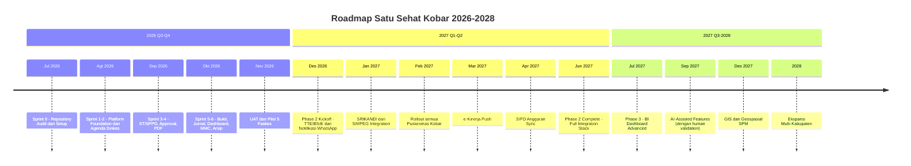

# Future Roadmap and Phase 2 Backlog — Satu Sehat Kobar

**Versi:** 1.5
**Tanggal:** Juni 2026
**Status:** Active
**Catatan:** Dokumen ini berisi fitur di luar MVP. Tidak ada item di dokumen ini yang boleh dikerjakan sebelum MVP pilot selesai dan disetujui Product Owner.

---

## 1. Visi Jangka Panjang (2026–2028)

**Visi:** Satu Sehat Kobar menjadi platform SPBE kesehatan terpadu Kabupaten Kotawaringin Barat — menghubungkan tata naskah dinas, perjalanan dinas, pelaporan SPM, pengelolaan arsip digital, dan integrasi sistem nasional dalam satu ekosistem berbasis Cloudflare AWCMS-Micro.

### 1.1 Timeline Visi

---

## 2. Phase 1 — MVP (Jul–Nov 2026) [DALAM PENGERJAAN]

### 2.1 Ruang Lingkup MVP

7 plugin yang dibangun dalam Sprint 0–6:

| Plugin | Fungsi |
|--------|--------|
| `agenda-dinkes` | Pengelolaan agenda kegiatan Dinkes |
| `duty-travel` | ST/SPPD, approval chain 6 langkah, bukti tugas, jurnal |
| `satusehat-dashboard` | Dashboard KPI SPM, agregasi data, KV cache 15 menit |
| `spm-health` | Indikator dan target SPM per program |
| `mmc-publication` | Draft publikasi internal MMC, review sebelum publish |
| `document-template` | Template PDF ST/SPPD, penomoran surat |
| `document-archive` | Arsip digital dokumen final, immutable storage |

### 2.2 Deliverable MVP

- 17 role dengan RBAC + ABAC penuh
- Alur approval 6 langkah dengan finance auto-skip untuk `is_budgeted = false`
- Audit log retention 2 tahun aktif / 3 tahun inaktif
- Backup D1 harian, R2 versioning, KV mingguan
- Pilot 5 faskes, target ≥ 80% user aktif

---

## 3. Phase 2 — Integrasi (Q4 2026 – Q2 2027)

### 3.1 TTE/BSrE — Tanda Tangan Elektronik (Q4 2026)

**Tujuan:** Menggantikan proses tanda tangan manual pada dokumen ST/SPPD dengan tanda tangan elektronik tersertifikasi BSrE Kominfo.

**Alur yang direncanakan:**
1. Generate PDF ST/SPPD (sudah ada di MVP)
2. Kirim dokumen ke BSrE API via Cloudflare Worker
3. Terima dokumen signed dari BSrE
4. Simpan di R2 sebagai dokumen final resmi
5. Audit event mencatat nomor sertifikat TTE

**Dependency:**
- Akun BSrE Kominfo yang aktif untuk Dinkes Kobar
- API key BSrE tersedia
- Review keamanan integrasi API eksternal
- Governance dari `18.Integration Governance`

**Risiko:** BSrE API stability, kuota tanda tangan, format dokumen yang diterima BSrE.

### 3.2 SRIKANDI — Arsip Nasional ANRI (Q1 2027)

**Tujuan:** Transfer arsip digital inaktif ke sistem SRIKANDI ANRI untuk memenuhi kewajiban kearsipan nasional.

**Alur yang direncanakan:**
1. Plugin `document-archive` menandai dokumen yang sudah melewati masa retensi aktif
2. Background job mengekspor metadata + file ke format yang diterima SRIKANDI API
3. Kirim ke SRIKANDI API, terima acknowledgment
4. Tandai dokumen sebagai `archived_to_srikandi` di database

**Dependency:**
- Akses SRIKANDI API dari Diskominfo Kobar
- Format metadata SRIKANDI yang didokumentasikan
- MOU atau dasar hukum transfer arsip digital

### 3.3 SIMPEG — Sync Data Pegawai (Q1 2027)

**Tujuan:** Menghilangkan input manual data pegawai dengan sinkronisasi otomatis dari SIMPEG daerah.

**Alur yang direncanakan:**
1. Nightly batch import setiap pukul 01:00 WIB
2. Tarik data pegawai aktif dari SIMPEG API
3. Validasi: nama, NIP, unit kerja, jabatan
4. Update tabel `personnel_profiles` di D1
5. Flag konflik untuk resolusi manual oleh Admin SIK

**Dependency:**
- Akses API SIMPEG Pemerintah Daerah Kobar
- Format data SIMPEG terdokumentasi
- Koordinasi dengan Badan Kepegawaian Daerah

### 3.4 SIPD — Sync Kode Anggaran (Q2 2027)

**Tujuan:** Validasi kode anggaran program/kegiatan secara otomatis saat input SPPD berbiaya.

**Alur yang direncanakan:**
1. Import tahunan kode program/kegiatan/anggaran dari SIPD
2. Simpan di tabel `budget_codes` di D1
3. Saat user input SPPD berbiaya, validasi kode anggaran real-time
4. Alert jika kode anggaran tidak ditemukan atau sudah habis

**Dependency:**
- Akses data SIPD (Sistem Informasi Pemerintahan Daerah)
- Koordinasi dengan BPKAD Kobar
- Format ekspor SIPD

### 3.5 Notifikasi Email dan WhatsApp (Q1 2027)

**Tujuan:** Menggantikan notifikasi in-app (Phase 1) dengan notifikasi push via WhatsApp Business API dan SMTP email.

**Fitur yang direncanakan:**
- Notifikasi approval pending: "ST Anda menunggu persetujuan [Atasan]"
- Notifikasi ST disetujui / ditolak / dikembalikan untuk revisi
- Notifikasi bukti belum diupload setelah 3 hari kegiatan
- Digest mingguan untuk pimpinan: ringkasan kegiatan unit

**Dependency:**
- Akun WhatsApp Business API (Meta atau provider lokal)
- Server SMTP atau layanan email transaksional
- Nomor WhatsApp terdaftar setiap pegawai (perlu dikumpulkan)

### 3.6 e-Kinerja — Push Data Kinerja (Q2 2027)

**Tujuan:** Mendorong data pelaksanaan tugas dari jurnal SSK ke sistem e-Kinerja BKN untuk mengurangi input ganda.

**Alur yang direncanakan:**
1. Setelah jurnal tugas di-verify, data siap untuk di-push
2. Background job mengirim data ke e-Kinerja API BKN
3. Catat response (sukses/gagal) di audit log
4. Tampilkan status sinkronisasi di dashboard pegawai

**Dependency:**
- Akses API e-Kinerja BKN
- Format data yang diterima e-Kinerja
- Koordinasi dengan BKPSDM Kobar

---

## 4. Phase 3 — Kecerdasan dan Skalabilitas (Q3 2027+)

### 4.1 BI Dashboard Advanced

**Fitur:**
- Chart tren capaian SPM per indikator dan per wilayah
- Prediksi capaian SPM berdasarkan tren historis
- Drill-down per kecamatan dan per faskes
- Komparasi antar periode (bulan, kuartal, tahun)
- Export laporan PDF/Excel untuk pelaporan ke Kemenkes

**Teknologi:** Cloudflare Analytics Engine atau integrasi dengan tool BI eksternal (Metabase, Looker Studio).

### 4.2 AI-Assisted Features

**Fitur yang direncanakan:**
- **AI redaksi MMC:** Bantu redaksi konten publikasi sesuai gaya bahasa Dinkes, otomatis flag potensi data sensitif (nama pasien, data pribadi, data keuangan internal)
- **AI draft laporan:** Generate draft laporan kegiatan berdasarkan agenda, peserta, dan lokasi
- **AI klasifikasi dokumen:** Bantu operator mengklasifikasikan dokumen arsip berdasarkan konten

**Governance AI (wajib):**
- Semua output AI adalah draft awal — harus divalidasi manusia sebelum disimpan atau dipublikasikan
- Tidak ada keputusan otomatis oleh AI (approval, verifikasi, publikasi)
- Log setiap prompt dan response AI untuk audit
- Tidak ada data pasien atau data keuangan yang dikirim ke model AI eksternal

### 4.3 Geospasial / GIS

**Fitur:**
- Peta distribusi faskes dan puskesmas di Kab. Kotawaringin Barat
- Heat map capaian SPM per wilayah/kecamatan
- Visualisasi jangkauan layanan kesehatan
- Identifikasi area dengan capaian SPM rendah untuk prioritas intervensi

### 4.4 Ekspansi Multi-Kabupaten

**Konsep:**
- Multi-tenancy per kabupaten — setiap kabupaten memiliki data D1 terpisah
- Shared platform di level Cloudflare Workers dengan routing per tenant
- Dashboard provinsi untuk agregasi data antar kabupaten
- Koordinasi dengan Dinas Kesehatan Provinsi Kalimantan Tengah

---

## 5. Backlog Phase 2 (Prioritized)

| ID | Fitur | Plugin | Effort | Dependency | Sprint Target |
|----|-------|--------|--------|------------|---------------|
| PH2-001 | Integrasi TTE/BSrE — kirim dan terima dokumen signed | `document-template` | L | Akun BSrE aktif | Q4 2026 |
| PH2-002 | Notifikasi WhatsApp approval pending | core / notification | M | WhatsApp Business API | Q1 2027 |
| PH2-003 | Notifikasi email approval pending | core / notification | S | SMTP server | Q1 2027 |
| PH2-004 | Nightly sync SIMPEG — import data pegawai | `duty-travel` / personnel | L | API SIMPEG | Q1 2027 |
| PH2-005 | Export arsip ke SRIKANDI API | `document-archive` | L | Akses SRIKANDI API | Q1 2027 |
| PH2-006 | Import kode anggaran SIPD tahunan | `duty-travel` | M | Akses SIPD | Q2 2027 |
| PH2-007 | Validasi kode anggaran real-time saat input SPPD | `duty-travel` | M | PH2-006 selesai | Q2 2027 |
| PH2-008 | Push data kinerja ke e-Kinerja BKN | `duty-travel` | L | API e-Kinerja | Q2 2027 |
| PH2-009 | Digest mingguan pimpinan via WhatsApp | notification | M | PH2-002 selesai | Q1 2027 |
| PH2-010 | Dashboard agregasi multi-faskes untuk Kadis | `satusehat-dashboard` | M | Data pilot stabil | Q1 2027 |
| PH2-011 | Export laporan SPM ke format Kemenkes | `spm-health` | M | Format resmi Kemenkes | Q2 2027 |
| PH2-012 | Approval via mobile web (responsive improvement) | frontend | M | Data pilot UX feedback | Q1 2027 |
| PH2-013 | Bulk upload bukti tugas (multiple file sekaligus) | `duty-travel` | S | Feedback pilot | Q1 2027 |
| PH2-014 | History revisi dokumen template | `document-template` | M | — | Q2 2027 |
| PH2-015 | Notifikasi in-app dengan push browser | core / notification | M | Service Worker setup | Q1 2027 |
| PH2-016 | Filter dan search arsip dengan full-text | `document-archive` | M | D1 FTS support | Q2 2027 |
| PH2-017 | Dashboard capaian SPM per kecamatan | `spm-health` | L | Data master wilayah lengkap | Q2 2027 |
| PH2-018 | Laporan rekap SPPD untuk keuangan (export Excel) | `duty-travel` | M | Feedback pilot keuangan | Q1 2027 |
| PH2-019 | Manajemen kuota anggaran per bidang | `duty-travel` | L | PH2-006 dan SIPD | Q2 2027 |
| PH2-020 | Notifikasi bukti belum diupload setelah N hari | notification | S | PH2-002 atau PH2-003 | Q1 2027 |

---

## 6. Backlog Phase 3 (Konseptual)

| ID | Fitur | Status | Estimasi |
|----|-------|--------|----------|
| PH3-001 | BI Dashboard dengan Analytics Engine | Konseptual | Q3 2027 |
| PH3-002 | AI redaksi konten MMC dengan human validation | Konseptual | Q3 2027 |
| PH3-003 | Peta GIS distribusi faskes dan SPM | Konseptual | Q4 2027 |
| PH3-004 | AI draft laporan kegiatan | Konseptual | Q4 2027 |
| PH3-005 | Multi-tenancy kabupaten lain | Konseptual | 2028 |
| PH3-006 | Dashboard provinsi agregasi antar kabupaten | Konseptual | 2028 |
| PH3-007 | Integrasi SATUSEHAT Kemenkes (data klinis) | Konseptual — butuh regulasi | 2028+ |
| PH3-008 | OCR otomatis bukti tugas | Konseptual | Q4 2027 |
| PH3-009 | Prediksi capaian SPM berbasis ML | Riset | 2028 |
| PH3-010 | Mobile native app (PWA atau React Native) | Konseptual | 2028 |

---

## 7. Kriteria Masuk Phase 2

Phase 2 hanya boleh dimulai jika seluruh kriteria berikut terpenuhi:

| Kriteria | Target |
|----------|--------|
| Pilot MVP sukses | ≥ 80% user aktif, 0 bug P1 terbuka |
| Anggaran Phase 2 disetujui | SK atau dokumen anggaran dari Dinkes Kobar |
| Tim SIK siap menerima integrasi | Minimal 1 developer familiar dengan Cloudflare Workers dan API eksternal |
| Akses API sistem eksternal tersedia | Minimal TTE/BSrE atau SIMPEG sudah ada akses uji |
| Governance integrasi selesai | `18.Integration Governance` diperbarui untuk setiap integrasi baru |
| Product Owner menyetujui | Persetujuan tertulis untuk memulai Phase 2 |

---

## 8. Prinsip Roadmap

1. **MVP diselesaikan lebih dulu** — Tidak ada fitur Phase 2 yang masuk sebelum pilot stabil
2. **Plugin-first tetap berlaku** — Semua fitur baru dibuat sebagai plugin terpisah, tidak memodifikasi core
3. **Integrasi bertahap** — Tidak semua integrasi Phase 2 dikerjakan sekaligus
4. **Setiap integrasi butuh governance** — `18.Integration Governance` harus diisi sebelum coding dimulai
5. **AI harus ada human validation** — Tidak ada keputusan otomatis oleh AI
6. **Keamanan dan privasi wajib** — Setiap fitur baru melewati security checklist (doc 10)

---

## 9. Dokumen Terkait

| Dokumen | Relevansi |
|---------|-----------|
| `12.CHANGE_CONTROL_AND_DECISION_LOG.docx.md` | Log keputusan yang mempengaruhi roadmap |
| `18.Integration Governance and External Systems.docx.md` | Framework governance untuk setiap integrasi Phase 2 |
| `10.Security and Privacy Checklist.docx.md` | Checklist keamanan untuk setiap fitur baru |
| `17.Data Governance and Retention Policy.docx.md` | Implikasi data dari integrasi eksternal |
| `02.IMPLEMENTATION_BACKLOG.docx.md` | Backlog MVP yang harus selesai sebelum Phase 2 |
